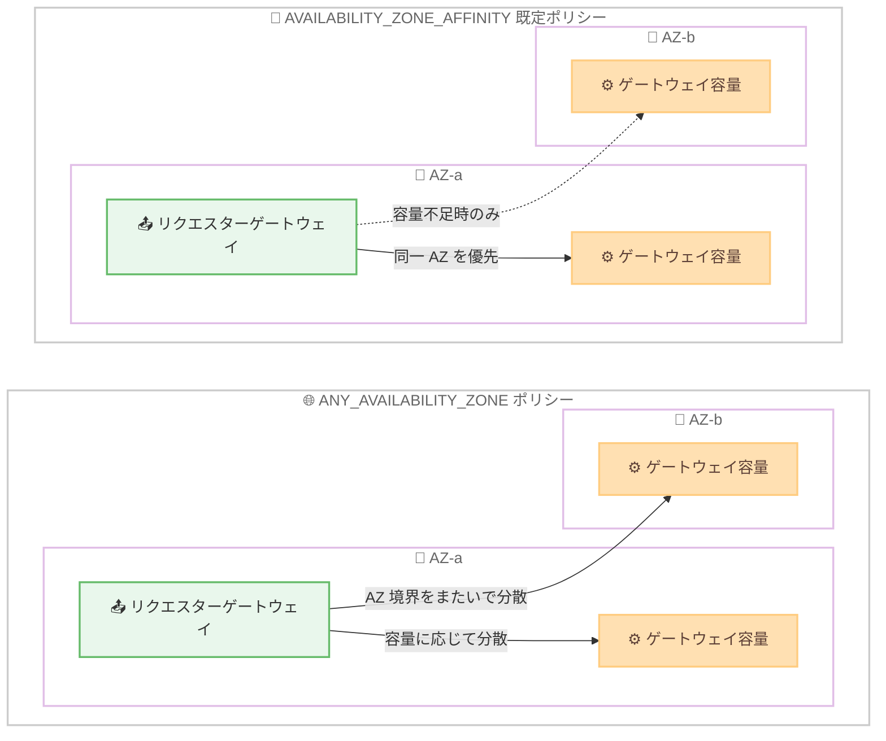

# AWS RTB Fabric - 設定可能なアベイラビリティーゾーンアフィニティ

**リリース日**: 2026 年 9 月 18 日
**サービス**: AWS RTB Fabric
**機能**: Configurable Availability Zone affinity (クライアントルーティングポリシー)

📊 [このアップデートのインフォグラフィックを見る](https://takech9203.github.io/aws-news-summary/20260918-aws-rtb-fabric-configurable-availability-zone-affinity.html)

## 概要

AWS RTB Fabric が、レスポンダーゲートウェイに対する設定可能なアベイラビリティーゾーン (AZ) アフィニティのサポートを発表しました。新しいクライアントルーティングポリシーにより、パートナーからのトラフィックを「リクエスターと同一の AZ 内に留める」か「ゲートウェイがまたがるすべての AZ に分散する」かを選択できるようになります。

AWS RTB Fabric は、リアルタイム広告入札 (RTB) ワークロード向けのマネージドネットワークサービスで、AdTech パートナー (Amazon Ads、GumGum、Kargo、MobileFuse、Sovrn、TripleLift、Viant、Yieldmo など) とプライベートな高性能ネットワークを介してシングルディジットミリ秒のレイテンシーで接続できます。今回のアップデートは、複数の AZ にまたがって入札システムを運用する DSP (Demand-Side Platform) や SSP (Supply-Side Platform) が、インフラストラクチャをより効率的に活用するための機能です。

**アップデート前の課題**

このアップデート以前は、RTB Fabric のルーティング動作が固定されており、以下の課題がありました。

- 各リクエストは常にリクエスターと同一 AZ 内のゲートウェイ容量にルーティングされ、他の AZ にある容量が未使用のまま残る可能性があった
- 複数 AZ にゲートウェイ容量を展開しても、リクエスターの AZ 分布に偏りがある場合、容量を有効活用できなかった
- レイテンシーと容量利用効率のトレードオフをワークロード特性に応じて選択できなかった

**アップデート後の改善**

今回のアップデートにより、以下が可能になりました。

- レスポンダーゲートウェイごとにクライアントルーティングポリシーを設定し、AZ アフィニティの動作を制御できるようになった
- `ANY_AVAILABILITY_ZONE` を選択することで、ゲートウェイがまたがるすべての AZ の容量にリクエスターがアクセスできるようになった
- 既定の `AVAILABILITY_ZONE_AFFINITY` では従来どおり同一 AZ 優先のルーティングを維持し、AZ 境界をまたぐ際の追加レイテンシーを回避できる
- 追加料金なしで利用できる

## アーキテクチャ図



上段は既定の `AVAILABILITY_ZONE_AFFINITY` で、リクエスターと同一 AZ の容量を優先します。下段の `ANY_AVAILABILITY_ZONE` では、ゲートウェイがまたがるすべての AZ の容量にトラフィックを分散します。

## サービスアップデートの詳細

### 主要機能

1. **クライアントルーティングポリシーの導入**
   - レスポンダーゲートウェイの新しいパラメータ `clientRoutingPolicy` として提供
   - ゲートウェイの作成時に設定でき、`ACTIVE` 状態のゲートウェイに対して後から変更することも可能
   - サポートされる値は `AVAILABILITY_ZONE_AFFINITY` と `ANY_AVAILABILITY_ZONE` の 2 つのみで、それ以外の値は `ValidationException` で失敗する

2. **AVAILABILITY_ZONE_AFFINITY (既定)**
   - リクエスターと同一 AZ 内にゲートウェイ容量がある場合、その容量にルーティングする
   - 同一 AZ に容量がない場合のみ、他の AZ の容量にルーティングする
   - 本機能導入前に作成されたゲートウェイの動作と同一であり、既存環境への影響はない

3. **ANY_AVAILABILITY_ZONE**
   - リクエスターの所属 AZ に関係なく、ゲートウェイのサブネットがまたがるすべての AZ の容量にトラフィックをルーティングする
   - 各 AZ が受け取るトラフィックの割合は、各 AZ で稼働しているゲートウェイ容量に基づいて RTB Fabric が動的に調整する
   - AZ 境界をまたぐリクエストには AZ 間のネットワークレイテンシーが追加されるが、どの AZ が処理しても RTB Fabric の料金は変わらない

## 技術仕様

### クライアントルーティングポリシーの比較

| 項目 | AVAILABILITY_ZONE_AFFINITY | ANY_AVAILABILITY_ZONE |
|------|---------------------------|----------------------|
| ルーティング動作 | 同一 AZ を優先、容量不足時のみ他 AZ | すべての AZ に容量比で分散 |
| レイテンシー | AZ 境界越えを回避し最小化 | AZ 境界越えの追加レイテンシーが発生し得る |
| 容量利用 | 他 AZ の容量が未使用になる可能性 | ゲートウェイ全体の容量を活用 |
| 既定値 | ○ (従来動作と同一) | - |
| 設定方法 | API / CLI / SDK | API / CLI / SDK |

### API 変更履歴

| 日付 | サービス | 変更内容 |
|------|----------|----------|
| 2026/09/10 | [RTBFabric](https://awsapichanges.com/archive/changes/dfd7fe-rtbfabric.html) | 3 updated api methods - `clientRoutingPolicy` パラメータの追加。同一 AZ 内へのルーティング維持または全 AZ への分散を制御 |

### 動作仕様上の注意点

- ポリシー変更は非同期操作であり、ゲートウェイのステータスは `PENDING_UPDATE` を経て `ACTIVE` に戻る。変更が完了するまでは以前のポリシーが有効
- `ANY_AVAILABILITY_ZONE` のトラフィック配分は、ユーザーが各 AZ に配置したターゲット数には追従しない。RTB Fabric が管理するゲートウェイ容量に基づく
- ターゲットが高負荷の AZ からトラフィックを自動的に退避させる仕組みはない
- Network Load Balancer の `partial_availability_zone_affinity` に相当する部分的なアフィニティはサポートされない
- クライアントルーティングポリシーはリクエスターからレスポンダーゲートウェイへの到達方法のみを制御し、ゲートウェイから背後のターゲットへのルーティングは変更しない

## 設定方法

### 前提条件

1. RTB Fabric のレスポンダーゲートウェイを運用していること
2. ゲートウェイのサブネットがまたがることのできる AZ 数はサービスクォータで制限されており、既定値は 1 AZ。複数 AZ にまたがるにはクォータ引き上げ申請が必要
3. `ANY_AVAILABILITY_ZONE` の効果を得るには、複数の AZ にサブネットを配置してゲートウェイを作成しておくこと (単一 AZ のゲートウェイに設定しても成功するが、動作は変わらない)

### 手順

#### ステップ 1: クライアントルーティングポリシーの変更

```bash
aws rtbfabric update-responder-gateway \
  --gateway-id "rtb-gw-kasoi29asfdhn" \
  --client-routing-policy ANY_AVAILABILITY_ZONE \
  --region us-east-1
```

`UpdateResponderGateway` API で既存のレスポンダーゲートウェイのクライアントルーティングポリシーを `ANY_AVAILABILITY_ZONE` に変更します。ゲートウェイは一時的に `PENDING_UPDATE` 状態になり、`ACTIVE` に戻った時点で新しいポリシーが有効になります。なお、コンソールではクライアントルーティングポリシーの表示・変更はできず、API / CLI / SDK のみで設定します。

#### ステップ 2: ゲートウェイステータスの確認

```bash
aws rtbfabric get-responder-gateway \
  --gateway-id "rtb-gw-kasoi29asfdhn" \
  --region us-east-1
```

`GetResponderGateway` API でゲートウェイの詳細を取得し、ステータスが `ACTIVE` に戻ったこと、およびクライアントルーティングポリシーが期待どおりに設定されていることを確認します。

#### ステップ 3: 既定動作への復帰 (必要な場合)

```bash
aws rtbfabric update-responder-gateway \
  --gateway-id "rtb-gw-kasoi29asfdhn" \
  --client-routing-policy AVAILABILITY_ZONE_AFFINITY \
  --region us-east-1
```

既定の AZ アフィニティ動作に戻す場合は、`AVAILABILITY_ZONE_AFFINITY` を指定して同じコマンドを実行します。

## メリット

### ビジネス面

- **インフラストラクチャ利用効率の向上**: 複数 AZ に展開したゲートウェイ容量を無駄なく活用でき、AdTech ワークロードのコスト効率が改善する
- **追加料金なし**: 本機能の利用に RTB Fabric の追加料金は発生せず、どの AZ がリクエストを処理しても料金は変わらない
- **柔軟な運用戦略**: レイテンシー重視か容量活用重視かを、ゲートウェイごとにビジネス要件に応じて選択できる

### 技術面

- **後方互換性**: 既定値 `AVAILABILITY_ZONE_AFFINITY` は従来の動作と同一のため、既存ゲートウェイへの影響がない
- **動的な容量配分**: `ANY_AVAILABILITY_ZONE` では RTB Fabric が各 AZ の稼働容量に基づいてトラフィックを自動的に分散・調整する
- **無停止での切り替え**: `ACTIVE` 状態のゲートウェイに対して非同期でポリシーを変更でき、変更完了までは以前のポリシーが維持される

## デメリット・制約事項

### 制限事項

- ゲートウェイがまたがる AZ 数のサービスクォータは既定で 1 のため、複数 AZ 構成にはクォータ引き上げが必要
- サポートされるポリシーは 2 種類のみで、一定割合を同一 AZ に留める部分的アフィニティは利用できない
- CloudWatch メトリクスに AZ ディメンションがなく、AZ 単位のトラフィック内訳や AZ 境界をまたいだトラフィック量をメトリクスで確認できない
- コンソールからはクライアントルーティングポリシーを表示・変更できない

### 考慮すべき点

- `ANY_AVAILABILITY_ZONE` では AZ 境界をまたぐリクエストに追加のネットワークレイテンシーが発生するため、レイテンシー要件が厳しいワークロードでは影響を評価する必要がある
- 各 AZ のターゲットは独立してスケーリングし、均等配分以上のトラフィックを処理できる容量を確保することが推奨される
- 平均 CPU 使用率など AZ 横断で集計したシグナルによるスケーリングは、特定 AZ の過負荷を隠す可能性があるため避けるべき
- EC2 スポットキャパシティの制約などで AZ 間の容量が不均等になっても、RTB Fabric のリクエスト分散は変わらない点に注意が必要

## ユースケース

### ユースケース 1: マルチ AZ 入札システムの容量有効活用

**シナリオ**: SSP が 3 つの AZ に入札レスポンダーを展開しているが、主要パートナーのリクエスターが特定の AZ に偏っており、他 AZ の容量が遊休状態になっている。

**実装例**:
```bash
aws rtbfabric update-responder-gateway \
  --gateway-id "rtb-gw-example123" \
  --client-routing-policy ANY_AVAILABILITY_ZONE \
  --region us-east-1
```

**効果**: すべての AZ のゲートウェイ容量が入札トラフィックの処理に使われるようになり、遊休容量が削減されてインフラストラクチャのコスト効率が向上する。

### ユースケース 2: 超低レイテンシー要件の入札処理

**シナリオ**: DSP がシングルディジットミリ秒の入札応答時間を厳守する必要があり、AZ 境界をまたぐネットワークレイテンシーの追加を許容できない。

**実装例**:
```bash
# 既定の AVAILABILITY_ZONE_AFFINITY を維持
# パートナーのリクエスターが所在する AZ に合わせて容量を配置
aws rtbfabric get-responder-gateway \
  --gateway-id "rtb-gw-example456" \
  --region us-east-1
```

**効果**: リクエストが同一 AZ 内で処理されるため AZ 間レイテンシーを回避でき、入札タイムアウトによる機会損失を最小化できる。

### ユースケース 3: スポットインスタンス活用時の耐障害性向上

**シナリオ**: 入札ワークロードのコスト削減のために EC2 スポットインスタンスを利用しており、特定 AZ でスポットキャパシティが不足した際にも入札処理を継続したい。

**実装例**:
```bash
aws rtbfabric update-responder-gateway \
  --gateway-id "rtb-gw-example789" \
  --client-routing-policy ANY_AVAILABILITY_ZONE \
  --region us-west-2
```

**効果**: 複数 AZ の容量にトラフィックが分散されるため、単一 AZ のキャパシティ変動の影響を受けにくくなる。ただし、RTB Fabric はターゲットの負荷に応じたトラフィック退避は行わないため、各 AZ で十分な容量を維持するスケーリング設計が前提となる。

## 料金

本機能の利用に追加料金は発生しません。また、どの AZ がリクエストを処理しても RTB Fabric の料金は変わりません。

RTB Fabric 自体は、前払いのコミットメントなしで利用でき、標準的なクラウドネットワーキングコストを最大 80% 削減できるとされています。詳細は [RTB Fabric 料金ページ](https://aws.amazon.com/rtb-fabric/pricing/) を参照してください。

## 利用可能リージョン

本機能は、RTB Fabric が利用可能なすべてのリージョンで利用できます。

- 米国東部 (バージニア北部)
- 米国西部 (オレゴン)
- アジアパシフィック (シンガポール)
- アジアパシフィック (東京)
- 欧州 (フランクフルト)
- 欧州 (アイルランド)

## 関連サービス・機能

- **Elastic Load Balancing (NLB)**: Network Load Balancer にも同様のクライアントルーティングポリシーの概念があるが、RTB Fabric は部分的 AZ アフィニティ (`partial_availability_zone_affinity` 相当) をサポートしない
- **Amazon EC2 Auto Scaling / Amazon EKS**: レスポンダーゲートウェイのマネージドエンドポイントとして利用され、各 AZ のターゲット容量のスケーリング設計が本機能の効果を左右する
- **Amazon CloudWatch**: RTB Fabric のゲートウェイ・リンクメトリクスの監視に使用するが、AZ ディメンションは提供されない

## 参考リンク

- 📊 [インフォグラフィック](https://takech9203.github.io/aws-news-summary/20260918-aws-rtb-fabric-configurable-availability-zone-affinity.html)
- [公式発表 (What's New)](https://aws.amazon.com/about-aws/whats-new/2026/09/aws-rtb-fabric-configurable-availability-zone-affinity/)
- [ドキュメント: Configuring Availability Zone affinity](https://docs.aws.amazon.com/rtb-fabric/latest/userguide/working-with-responder-gateways.html#configuring-availability-zone-affinity)
- [AWS RTB Fabric 製品ページ](https://aws.amazon.com/rtb-fabric/)
- [API 変更履歴 (awsapichanges.com)](https://awsapichanges.com/archive/changes/dfd7fe-rtbfabric.html)

## まとめ

AWS RTB Fabric のクライアントルーティングポリシーにより、レイテンシー最優先の同一 AZ ルーティングと、容量活用を最大化する全 AZ 分散ルーティングを、レスポンダーゲートウェイごとに追加料金なしで選択できるようになりました。複数 AZ で入札システムを運用する AdTech 事業者は、まず AZ クォータと各 AZ のターゲット容量設計を確認したうえで、`ANY_AVAILABILITY_ZONE` への切り替えによる容量効率とレイテンシーへの影響を評価することを推奨します。
