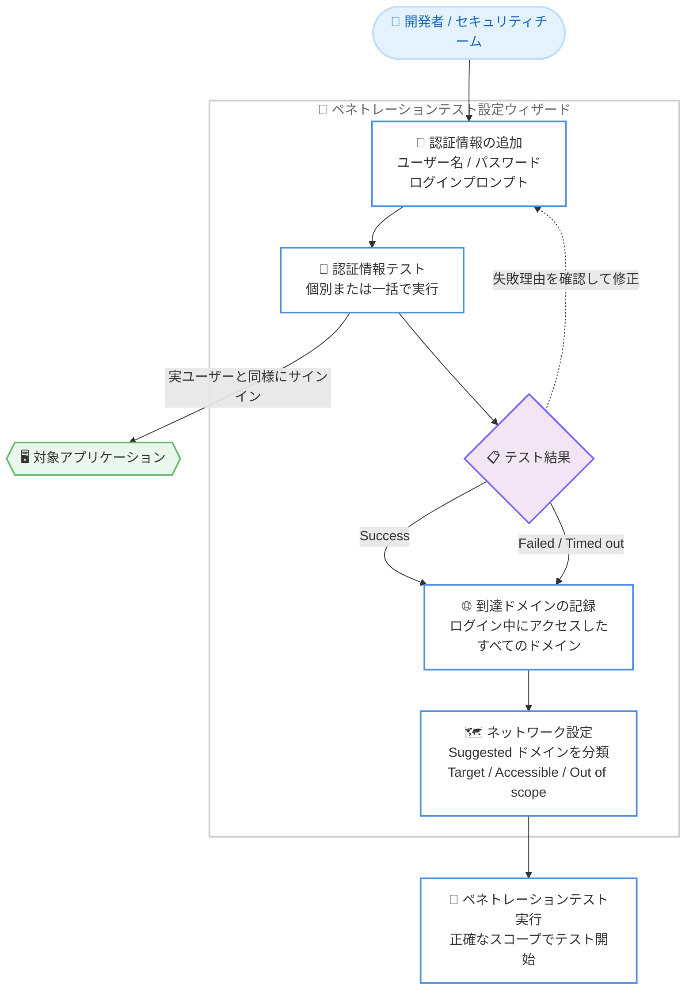

# AWS Continuum - 認証情報テストとアクセス可能ドメイン提案のサポート

**リリース日**: 2026 年 9 月 18 日
**サービス**: AWS Continuum (AWS Security Agent によるペネトレーションテスト)
**機能**: 認証情報テスト (Credential Testing)、アクセス可能ドメイン提案 (Accessible Domain Suggestions)

📊 [このアップデートのインフォグラフィックを見る](https://takech9203.github.io/aws-news-summary/20260918-aws-security-agent.html)

## 概要

AWS Continuum は、開発ライフサイクル全体を通じてアプリケーションを能動的に保護するフロンティアエージェントであり、実際の悪用可能性の検証を伴うオンデマンドのペネトレーションテストを提供します。今回のアップデートでは、ペネトレーションテストの実行前に「認証情報テスト (Credential Testing)」と「アクセス可能ドメインの提案 (Accessible Domain Suggestions)」が利用できるようになりました。

テスト設定時に認証情報を追加すると、エージェントが実際のユーザーと同じようにアプリケーションへサインインし、ログイン中に到達したすべてのドメインを記録します。記録されたドメインはネットワーク設定ステップで「Suggested」としてスコープ候補に表示されるため、テスト開始前に認証情報の有効性とエンドポイントのカバレッジを確認できます。開発者とセキュリティチームにとって、ネットワークスコープの設定精度を高め、設定ミスによる無駄なテストサイクルを削減できるアップデートです。

**アップデート前の課題**

このアップデート以前は、テストスコープの設定と認証の確認に手作業と待ち時間が必要でした。

- アプリケーションが到達するすべての URL を洗い出す作業は手動であり、抜け漏れが発生しやすかった
- 認証情報の誤り (ユーザー名、パスワード、ログイン手順の不備) は、テストサイクルが完了した後にはじめて判明していた
- 認証失敗や不完全なネットワークスコープにより、テストサイクル (タスク時間 = コスト) が無駄になるリスクがあった

**アップデート後の改善**

今回のアップデートにより、テスト開始前の事前検証が可能になりました。

- テスト設定中に認証情報を個別または一括でテストし、サインインの成否を数分で確認できるようになった
- エージェントが実ユーザーと同様にサインインし、ログイン中に到達したドメインを自動的に記録・提案するため、ネットワークスコープを正確に設定できるようになった
- 認証情報テストが成功、失敗、タイムアウトのいずれの場合でも、到達したアクセス可能ドメインが返されるため、部分的な結果からもスコープ設定を進められるようになった

## アーキテクチャ図



テスト設定ウィザード内で認証情報をテストし、ログイン中に到達したドメインをネットワーク設定ステップの提案として活用するワークフローを示しています。テスト結果が失敗やタイムアウトの場合でも、到達済みのドメインは提案に反映されます。

## サービスアップデートの詳細

### 主要機能

1. **認証情報テスト (Credential Testing)**
   - テスト設定ウィザードの「Credentials」ステップで、追加した認証情報を個別 (**Test**) または一括 (**Test all credentials**) でテスト可能
   - エージェントは実際のユーザーと同じようにアプリケーションへサインインし、ログインプロンプトに記述された手順で認証を実行
   - ステータスは **Starting** → **In progress** を経て、**Success** (サインイン成功)、**Failed** (サインイン失敗、選択して理由を確認可能)、**Timed out** (15 分以内に完了せず)、**Unverified** (未テストまたはテスト後に変更あり) のいずれかに遷移
   - 多くのサインインテストは 2〜3 分で完了し、「Credentials」ステップを離れてもテストは継続実行される
   - 各認証情報の行の **View logs** から、テスト中にエージェントが実行した操作のログを確認可能

2. **アクセス可能ドメインの提案 (Accessible Domain Suggestions)**
   - 認証情報テスト中にアプリケーションが到達したすべてのドメインを記録し、「Network configuration」ステップに **Suggested** として自動表示
   - 提案された各ドメインを **Target** (攻撃対象)、**Accessible** (アクセス可能だが攻撃対象外)、**Out of scope** (アクセス自体を禁止) に分類してスコープを確定
   - 認証情報テストが成功、失敗、タイムアウトのいずれの結果でも、到達済みのアクセス可能ドメインが返される
   - テストで発見されなかったドメインは **Add domain** で手動追加も可能

3. **5 ステップのテスト設定ウィザードとドラフト保存**
   - ウィザードは「Penetration test details」「VPC Resources (オプション)」「Credentials (オプション)」「Network configuration」「Additional configuration (オプション)」の 5 ステップで構成
   - 各ステップの **Save & Next** で進捗が保存され、途中で離脱しても後から再開可能
   - 未完了のテストは一覧に **Draft** バッジ付きで表示され、**Continue setup** で設定を再開できる (ウィザード完了までテストは開始不可)

## 技術仕様

### 認証情報テストの仕様

| 項目 | 詳細 |
|------|------|
| 実行タイミング | ペネトレーションテスト実行前の設定ウィザード内 (「Credentials」ステップ) |
| 実行単位 | 認証情報ごとの個別テスト、または全認証情報の一括テスト |
| サインイン方法 | ログインプロンプトの指示に従い、実ユーザーと同様に認証 (Website login や API request のサンプルから編集可能) |
| 結果ステータス | Success / Failed / Timed out / Unverified |
| タイムアウト | 認証情報テストは 15 分で停止。本番のペネトレーションテスト実行時は 4 倍の 1 時間が割り当てられるため、遅いだけのサインインは本番で成功することが多い |
| 所要時間 | 多くの場合 2〜3 分で完了 |
| ログ | View logs でテスト中のエージェントの操作を確認可能 |

### ネットワークスコープの分類

| 分類 | 説明 |
|------|------|
| Target | ペネトレーションテストが攻撃を許可される URL。検証済みドメインである必要がある |
| Accessible | テストがアクセスできるが攻撃してはならない URL (ホスト型ログインページ、CDN、依存サービスなど)。所有権の検証は不要 |
| Out of scope | テストが一切アクセスしてはならない URL。Accessible より常に優先される |

### 認証情報の提供方法

| 方法 | 説明 |
|------|------|
| Input credentials | ユーザー名とパスワードを直接入力 |
| Advanced setting | AWS Secrets Manager や AWS Lambda 関数を利用した安全な参照 (本番環境や機密性の高い認証情報に推奨) |

## 設定方法

### 前提条件

1. AWS Security Agent Web アプリケーションへのアクセス権があること
2. テスト対象として検証済みドメインが少なくとも 1 つ存在すること
3. AWS Security Agent 用の適切な権限を持つ IAM ロールが設定されていること
4. テスト対象アプリケーションの認証フローを把握していること (ログインプロンプトの記述に必要)

### 手順

#### ステップ 1: 認証情報を追加する

1. ペネトレーションテスト作成ウィザードの「Credentials」ステップで **Add credential** を選択
2. テスト内で一意の **Credential name** を入力
3. 入力方法を選択 (**Input credentials** で直接入力、または **Advanced setting** で Secrets Manager などを参照)
4. **Username** と **Password** を入力 (管理者ではなく一般ユーザー相当のアカウントを推奨)
5. **Access URL** で認証情報を使用する URL を選択 (Target URLs に登録済みの URL のみ選択可能)
6. **Agent Space login prompt** にサインイン手順を記述 (**Website login** や **API request** のサンプルを挿入して編集可能)
7. **Save** で保存、または **Save and test** で保存と同時にテストを実行

認証情報ごとにログインプロンプトが必須です。エージェントがログイン画面への到達、認証の完了、成功の確認を行うための指示となります。

#### ステップ 2: 認証情報をテストする

1. 認証情報の行で **Test** を選択 (すべてまとめてテストする場合は **Test all credentials**)
2. **Status** 列で結果を確認 (Success / Failed / Timed out / Unverified)
3. Failed の場合はステータスを選択して理由を確認し、ユーザー名・パスワード・ログインプロンプトを修正して再テスト
4. 必要に応じて **View logs** でエージェントの操作ログを確認

テスト未実施のまま「Credentials」ステップを離れると、テストを実行するかどうかの確認が表示されます。未テストの認証情報はドメインを発見しないため、その認証の先にしか到達できないドメインは提案に含まれず、手動で追加する必要があります。

#### ステップ 3: 提案されたドメインを分類してスコープを確定する

1. 「Network configuration」ステップで **Network scope** テーブルを確認 (認証情報テスト中に到達したドメインが **Suggested** として表示される)
2. 各ドメインを **Accessible** または **Out of scope** に分類 (Target URL は「Penetration test details」ステップで管理)
3. テストで発見されなかったドメインは **Add domain** で追加し、分類を選択
4. 画面下部の **Derived examples** で、分類に基づきトラフィックが到達しないエンドポイントを確認
5. スコープ確定後、ウィザードを完了して **Create and execute** でテストを開始

破壊的な操作や機密性の高い管理機能を含むパスは Out of scope に指定してください。指定したパスの配下のパスもすべて対象外となります。

## メリット

### ビジネス面

- **無駄なテストサイクルの削減**: 認証失敗をテスト実行前に検出できるため、設定ミスによるタスク時間 (= コスト) の浪費を防止できる
- **テスト立ち上げの高速化**: ドメインの洗い出しが自動化され、スコープ設定にかかる準備時間を短縮できる
- **テスト品質の向上**: 認証済み領域とその依存ドメインが正確にスコープへ反映されるため、カバレッジの高いテスト結果を得られる

### 技術面

- **実ユーザーと同等の検証**: エージェントが実際のログインフローを実行して確認するため、認証情報とログイン手順の両方を事前に検証できる
- **失敗時も情報を活用可能**: テストが失敗またはタイムアウトした場合でも到達済みドメインが返されるため、部分的な結果からスコープ設定を進められる
- **段階的な設定と再開**: Save & Next による進捗保存と Draft 機能により、テスト設定を中断・再開しながら正確に作り込める

## デメリット・制約事項

### 制限事項

- 認証情報テストは 15 分でタイムアウトする (本番テスト実行時は 1 時間まで許容されるため、タイムアウトしてもテスト開始は可能)
- 認証情報の **Access URL** には Target URLs に登録済みの URL しか選択できない
- 未テストの認証情報からはドメインが発見されないため、該当ドメインは手動追加が必要
- ペネトレーションテストの対象 (Target) にできるのは検証済みドメインのみ

### 考慮すべき点

- 認証済みパスは共有サービスやサードパーティドメインに到達する可能性があるため、テスト権限のあるアプリケーションの認証情報のみを提供する必要がある
- 本番システムにアクセスできる認証情報は提供せず、非本番環境に対してテストすることが推奨されている
- 認証情報を変更するとステータスが Unverified に戻るため、変更後は再テストが必要
- Accessible ドメインはログインとナビゲーションにのみ使用され、攻撃対象にはならない点を理解してスコープを設計する必要がある

## ユースケース

### ユースケース 1: 初回ペネトレーションテストのスコープ設計

**シナリオ**: セキュリティチームが Web アプリケーションに対して初めてペネトレーションテストを実施する。アプリケーションが依存する認証サービスや CDN などの外部ドメインを網羅的に把握できていない。

**実装例**:
```
1. ウィザードで Target URLs にアプリケーションのドメインを登録
2. Credentials ステップで一般ユーザー相当の認証情報を追加し、Save and test を実行
3. Network configuration ステップで Suggested ドメインを確認
4. 認証サービスや CDN を Accessible、管理機能を Out of scope に分類
5. Create and execute でテストを開始
```

**効果**: 手動でのドメイン洗い出しが不要になり、依存ドメインの抜け漏れによるテスト失敗やカバレッジ不足を防止できる。

### ユースケース 2: 複数ユーザーロールの認証を事前検証

**シナリオ**: DevSecOps エンジニアが、一般ユーザーとパワーユーザーなど複数のロールでロールベースアクセス制御をテストしたい。各ロールのログインフローが正しく動作するかを事前に確認する必要がある。

**実装例**:
```
1. Credentials ステップでロールごとに認証情報を追加
2. ロールごとにログインプロンプトを記述 (Website login サンプルを編集)
3. Test all credentials で一括テストを実行
4. Failed の認証情報は理由を確認し、View logs でエージェントの操作を検証して修正
5. すべて Success になったことを確認してテストを開始
```

**効果**: 複数ロールの認証をテスト開始前に一括検証でき、テスト実行後に一部ロールの認証失敗が判明するリスクを排除できる。

### ユースケース 3: 認証失敗による再テストコストの防止

**シナリオ**: 大規模アプリケーションのペネトレーションテストで、過去にログイン手順の記述不備により認証済み領域がテストされず、テストサイクルをやり直した経験がある。

**実装例**:
```
1. 認証情報の追加時に Save and test で即座にテストを実行
2. Timed out の場合はログを確認し、ログインプロンプトの手順を具体化して再テスト
3. Timed out が解消しない場合も、本番テストでは 4 倍の時間が割り当てられる点を考慮して開始を判断
4. Suggested ドメインの内容から認証済み領域への到達を確認してからテストを実行
```

**効果**: 認証の問題をテスト実行前の数分で検出でき、タスク時間の浪費と修正サイクルの長期化を防止できる。

## 料金

What's New では本アップデートに伴う追加料金は言及されていません。AWS Continuum のペネトレーションテストは、並列テストタスク全体で消費された累積タスク時間に基づいて課金されます。認証情報テストにより設定ミスによる無駄なテストサイクルを削減できるため、コスト効率の向上が期待できます。詳細は AWS Continuum の製品ページを参照してください。

## 利用可能リージョン

AWS Continuum のペネトレーションテストが利用可能なすべてのリージョンで利用できます。

## 関連サービス・機能

- **AWS Continuum**: アプリケーションを開発ライフサイクル全体で保護するフロンティアエージェント。ペネトレーションテスト機能は AWS Security Agent として提供される
- **AWS Secrets Manager / AWS Systems Manager Parameter Store**: 認証情報を安全に参照するための推奨オプション (Advanced setting で利用)
- **AWS Lambda**: カスタムな認証情報取得ロジックが必要な場合の参照先として利用可能
- **Amazon VPC**: 非公開アプリケーションをテストする場合に、VPC、サブネット、セキュリティグループを設定してテスト環境を構成
- **AWS IAM**: Agent Space ベースの権限モデルで、テスト実行に必要なリソースアクセスを制御

## 参考リンク

- 📊 [インフォグラフィック](https://takech9203.github.io/aws-news-summary/20260918-aws-security-agent.html)
- [公式発表 (What's New)](https://aws.amazon.com/about-aws/whats-new/2026/09/aws-security-agent/)
- [ドキュメント: Configure authentication credentials](https://docs.aws.amazon.com/securityagent/latest/userguide/perform-penetration-test.html#_configure_authentication_credentials_optional)
- [ドキュメント: Create a penetration test](https://docs.aws.amazon.com/securityagent/latest/userguide/perform-penetration-test.html)
- [AWS Continuum 製品ページ](https://aws.amazon.com/continuum/)

## まとめ

AWS Continuum の認証情報テストとアクセス可能ドメイン提案は、ペネトレーションテストの「設定精度」という運用上の課題を実行前の数分の検証で解決するアップデートです。認証失敗の早期検出とドメイン洗い出しの自動化により、無駄なテストサイクルを削減し、カバレッジの高いテストを最初から実行できます。AWS Continuum でペネトレーションテストを利用しているチームは、テスト作成時に Save and test による認証情報の事前検証と、Suggested ドメインを活用したスコープ設定をワークフローに組み込むことを推奨します。
