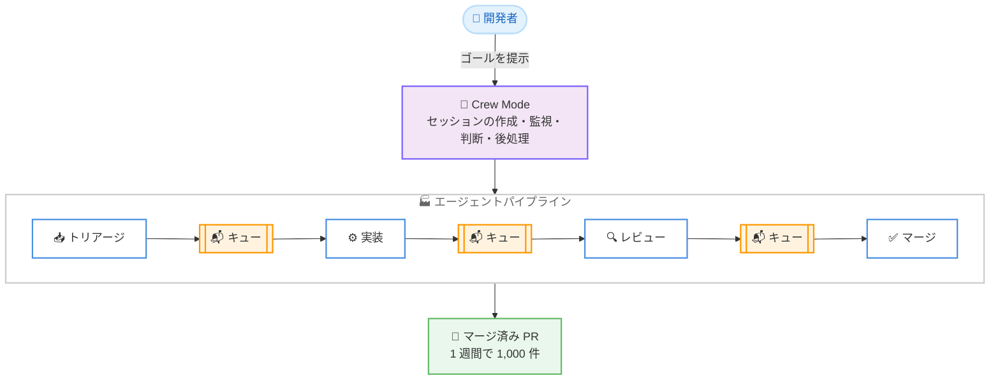

# Kiro - Kiro Crew によるソフトウェアファクトリー構築で 1 週間に 1,000 件の PR をマージ

**リリース日**: 2026 年 9 月 18 日
**サービス**: Kiro
**機能**: Kiro Crew によるマルチセッションエージェント運用 (Crew Mode)

📊 [このアップデートのインフォグラフィックを見る](https://takech9203.github.io/aws-news-summary/20260918-kiro-software-factory-1000-prs.html)

## 概要

Kiro チームは、3 名のフルタイムエンジニアが Kiro Crew を活用して 1 週間で 1,000 件のプルリクエスト (1 日あたり 120 件以上) をマージした事例と、その過程で確立した「ソフトウェアファクトリー」の構築手法を公開しました。すべての PR は CI とレビューを通過しており、約 500 名のコミュニティコントリビューターの協力も得ています。

ブログでは、コーディングエージェントの並列運用が段階的にスケールしていく過程を 5 つのステージとして整理しています。各ステージでボトルネックが顕在化し、それを解消する新しい働き方に移行することで、1 人のエンジニアが管理できる同時セッション数が 1 から 30〜50 以上へと拡大しました。最新ステージである Crew Mode は、個々のセッションの外側に存在するエージェントが、セッションの作成・監視・結果判断・後処理といった人間の手作業を代行する仕組みです。

Kiro Crew はオープンソースとして公開されており、コード、アーキテクチャドキュメント、機能仕様が GitHub リポジトリで参照できます。エージェントを運用するすべてのエンジニアが、自分の現在のステージを把握し、次のボトルネックに備えるための実践的な指針が示されています。

**アップデート前の課題**

コーディングエージェントを並列運用する際、以下の課題が段階的に発生していました。

- 1 セッション運用では、エージェントが各ステップで人間の入力を待つため、人間の注意力がボトルネックになっていた
- 複数タブでの手動運用では、同じプロジェクトの説明を繰り返し入力し、各セッションの状況を頭の中で追跡する必要があった
- ワークフローや cron を導入しても、ステップは逐次実行が中心で、人間がすべての更新を確認して次のアクションを判断する必要があった
- 50 セッション規模では、ゴール定義、起動、監視、結果判断、次のアクション決定という 5 つの作業だけでフルタイムの仕事量になっていた

**アップデート後の改善**

- エージェントパイプラインにより、トリアージ・実装・レビュー・マージの各ステージが独立したセッションとして並行稼働し、1 人あたり 20 セッション超の運用が可能になった
- Crew Mode により、セッションの作成・シード・監視・クローズをエージェント自身が実行し、人間はゴールの提示に集中できるようになった
- メモリ機能によりセッションがプロジェクトの文脈を保持した状態で開始できるようになった
- 単一のダッシュボードから複数マシン (ラップトップ、EC2 インスタンス、クラウド開発デスクトップなど) 上のクルーを一元管理できるようになった

## アーキテクチャ図



エージェントパイプラインでは各ステージが独立したセッションとして稼働し、メッセージキューのみで連携します。Crew Mode のエージェントがセッション境界を越えて結果に反応し、人間はゴールの提示に集中します。

## サービスアップデートの詳細

### エージェント運用の 5 つのステージ

1. **ステージ 1: 1 セッションの手動運用**
   - 1 人の開発者が CLI または IDE で 1 つのエージェントを操作する
   - エージェントが各ステップで人間を待つため、人間の注意力が単一スレッドのボトルネックになる

2. **ステージ 2: 複数セッションの手動運用**
   - タブを増やして並列化するが、各タブで同じプロジェクトの説明を繰り返す必要がある
   - セッション同士は互いを認識せず、人間だけが全体をつなぐ役割を担う

3. **ステージ 3: メモリ、ダッシュボード、cron、ワークフロー**
   - Kiro Crew の出発点となったステージ。メモリでセッションが文脈を保持した状態で開始し、ダッシュボードで複数セッションを追跡できる
   - cron と監視ループが人間の介在なしにセッションを起動し、ワークフローが 1 つのジョブのステップを複数セッションにまたがって連鎖させる
   - 1 人あたり約 10〜20 のアクティブセッションを管理できるが、作業間の調整は依然として人間が担う

4. **ステージ 4: エージェントパイプライン**
   - CI のパイプラインではなく、トリアージ・実装・レビュー・マージが独立したステージとして稼働するエージェントセッションの組み立てライン
   - 各ステージはメッセージキューのみで連携し、他のステージを待たずにキューに入った項目を即座に処理する
   - 1 人あたり 20 セッション超の運用を実現したが、パイプラインの形状は人間が設計した固定のものであり、結果によって計画が無効になった場合の再計画はできない

5. **ステージ 5: Crew Mode によるエージェント的セッション運用**
   - 個々のセッションの外側に存在するエージェントが、ゴール定義・起動・監視・結果判断・次のアクション決定という手作業を代行する
   - セッションは Crew Mode が作成・シード・監視・クローズする実行単位となり、人間はゴールの提示のみを担う
   - 1,000 件の PR マージは、パイプラインと初期バージョンの Crew Mode の組み合わせによって達成された

### 実行環境

- クルーは 1 つのゲートウェイとそれが所有するセッションで構成され、プロセスが動く環境であればどこでも実行できる
- 現在はラップトップ、Amazon EC2 インスタンス、クラウド開発デスクトップ上で稼働しており、AWS Fargate コンテナへの対応も予定されている
- 筆者は 6〜10 台のマシンを単一のダッシュボードから連携させ、30〜50 セッションを同時に稼働させている
- クルーが委譲するエージェントジョブは GitHub Actions や AWS CodeBuild 上でも実行される

### ガバナンスへの取り組み

複数のエージェントが人間に代わってコードをプッシュする際に必要となる 4 つの統制が挙げられています。

1. **エージェント間の調整**: 誰が何を依頼し、誰がどのタスクを所有し、何が試行・却下されたかを明示的かつ永続的に記録する。モデルのコンテキストのみに存在する情報はコンパクションで消失する
2. **メモリの境界**: 何を、どのエージェントが、どのプロジェクトについて記憶し、誰に見えるかを管理する。あるエンジニアの修正指示が別チームのコードベースのセッションに影響してはならない
3. **権限制御**: エージェントが、どのリポジトリで、どの環境に対して何を実行できるか、何に人間の承認が必要かを、プロンプトではなくホスト側で強制する
4. **すべてのアクションの証跡**: すべてのコマンド、ファイル変更、承認、拒否を、エージェントが編集できない場所に記録する

### コストへの取り組み

エージェントフリートが数百セッション規模に達すると、セッションの維持、ステータス確認、結果のルーティングといった調整レイヤーのコストが導入障壁になり得ます。対策として、定型的な監督への安価なモデルの利用、決定的なチェックのスクリプト化、最小コンテキストでの起動、セッションナレッジの再利用、タスク単位の正確なコスト計上が検討されています。

## 実践ガイド

ブログでは、Kiro Crew を導入しなくても今日から適用できるステップが示されています。

### ステップ 1: 同時セッション数を数える

現在の同時セッション数が自分のステージを示します。1 つならステージ 1、数タブならステージ 2 です。この数字が次に解決すべき問題を教えてくれます。

### ステップ 2: エージェントにメモリを与える

ステージ 2 から 3 への移行が最も効果の大きい投資です。最も安価な方法は、規約や繰り返し伝えている修正指示を記載したファイルをリポジトリに置き、すべてのセッションに読み込ませることです。

### ステップ 3: 定型作業をスケジュール実行に委譲する

新規 Issue のトリアージや不安定なチェックの再実行など、毎日手作業で行っているジョブを 1 つ選び、タイマーで起動するセッションに任せます。

### ステップ 4: オーケストレーターより先にパイプラインを作る

セッションが同じ種類の作業を繰り返している場合、ステージに名前を付けてキューでつなぎます。GitHub Issue のラベルをキューとして使い、ラベルごとに 1 種類のセッションを割り当てる方法で十分に始められます。

### ステップ 5: ガバナンスは初日から始める

監査証跡と権限制御は即座に実施できます。エージェントの行動をエージェントが編集できない場所に記録し、実行可能な操作をプロンプトではなくホストレベルで決定します。セッションが 2 つの時点では安価ですが、50 になってからの後付けはほぼ不可能です。

## メリット

### ビジネス面

- **開発スループットの大幅な向上**: 3 名のチームで 1 週間に 1,000 件の PR (1 日 120 件以上) をマージし、すべて CI とレビューを通過させた実績が示されている
- **段階的な導入が可能**: 各ステージが単独で価値を提供しながら次のステージへの準備になるため、小さな改善から始められる
- **オープンソースによる透明性**: コード、アーキテクチャドキュメント、機能仕様が公開されており、自社での検証や応用が可能

### 技術面

- **人間のボトルネックの解消**: セッションの起動・監視・判断といった手作業を Crew Mode が代行し、人間はゴールの提示に集中できる
- **疎結合なパイプライン設計**: 各ステージがメッセージキューのみで連携するため、ステージ間の待ち合わせが発生せず全ステージが常に稼働する
- **実行環境の柔軟性**: ラップトップ、EC2、クラウド開発デスクトップなど、プロセスが動く環境であればどこでもクルーを実行できる

## デメリット・制約事項

### 制限事項

- Crew Mode は開発中の機能であり、基本機能はリポジトリのフィーチャープレビューを有効化して利用する段階にある
- パイプライン (ステージ 4) は人間が設計した固定形状であり、結果が計画を無効化した場合の再計画には人間の介入が必要
- 50 セッション超の規模では、単一の統括エージェント自体がボトルネックとなり、コンテキストの喪失や専門性の不足が発生し得る

### 考慮すべき点

- 数百セッション規模ではエージェントの主作業に加えて調整レイヤーのコストが発生し、導入障壁になり得る
- クルー間コラボレーション (計画・実行・レビューの役割分担) は将来の構想段階であり、現時点では提供されていない
- ガバナンス (調整記録、メモリ境界、権限制御、監査証跡) を初期から整備しないと、スケール後の後付けは困難

## ユースケース

### ユースケース 1: OSS プロジェクトの Issue トリアージと PR 処理の自動化

**シナリオ**: 多数のコミュニティコントリビューションを受けるオープンソースプロジェクトで、Issue のトリアージから実装、レビュー、マージまでを少人数で処理したい。

**実装例**:
```
1. GitHub Issue のラベルをキューとして定義する
2. トリアージ、実装、レビュー、マージの各ステージに専用セッションを割り当てる
3. 各セッションが自分のラベルの付いた項目をキューから取得して処理する
```

**効果**: 各ステージが並行稼働し、少人数のチームでも 1 日 100 件超の PR を CI とレビューを通過させて処理できる。

### ユースケース 2: 日次の定型作業のスケジュール実行

**シナリオ**: 新規 Issue のトリアージや不安定なテストの再実行など、毎日手作業で行っている定型作業をエージェントに委譲したい。

**実装例**:
```
1. Kiro Crew の cron 機能で毎朝セッションを起動するスケジュールを設定する
2. リポジトリ内のメモリファイルに規約と判断基準を記載する
3. セッションが結果をダッシュボードに報告する
```

**効果**: 人間の介在なしに定型作業が完了し、スケジュール実行されたセッションの挙動から次の自動化対象を学べる。

### ユースケース 3: 就業時間外も稼働する開発クルーの構築

**シナリオ**: ラップトップでの検証を終え、開発者の睡眠中もエージェントに作業を継続させたい。

**実装例**:
```
1. ラップトップで Kiro Crew をインストールし、1 つのリポジトリと 1 つの定型作業で検証する
2. クルーを EC2 インスタンスなどのクラウド環境に移行する
3. 複数マシンのクルーを単一のダッシュボードに連携させる
```

**効果**: 6〜10 台のマシンで 30〜50 セッションを常時稼働させ、開発作業を 24 時間継続できる。

## 料金

Kiro Crew はオープンソースとして公開されており、リポジトリから無料で利用できます。ただし、エージェントセッションの実行には Kiro の利用プランに応じたクレジットが消費されます。大規模なフリート運用では、主作業に加えてセッションの維持や監督といった調整レイヤーのコストが発生する点に注意が必要です。

## 利用可能リージョン

グローバル (Kiro はグローバルに提供されるサービスです)

## 関連サービス・機能

- **Kiro IDE / CLI**: ステージ 1〜2 に相当する対話的なエージェント開発環境。Kiro Crew はその先の並列運用を担う
- **Amazon EC2 / AWS Fargate**: クルーの実行環境。現在は EC2 やクラウド開発デスクトップで稼働し、Fargate コンテナへの対応が予定されている
- **GitHub Actions / AWS CodeBuild**: クルーが委譲するエージェントジョブの実行基盤

## 参考リンク

- 📊 [インフォグラフィック](https://takech9203.github.io/aws-news-summary/20260918-kiro-software-factory-1000-prs.html)
- [公式ブログ: How we built a software factory with Kiro Crew to merge 1000 PRs in a week](https://kiro.dev/blog/software-factory-1000-prs/)
- [Kiro Crew GitHub リポジトリ](https://github.com/kirodotdev/KiroCrew)
- [Kiro Crew 製品ページ](https://kiro.dev/crew)
- [Kiro ドキュメント](https://kiro.dev/docs/)

## まとめ

Kiro チームは、コーディングエージェントの並列運用を 5 つのステージとして体系化し、メモリ、パイプライン、Crew Mode の組み合わせで 3 名のチームが 1 週間に 1,000 件の PR をマージできることを実証しました。エージェント活用を進めるチームは、まず自分たちの現在のステージを把握し、メモリの整備と定型作業のスケジュール化から着手するとともに、監査証跡と権限制御を初日から整備することが推奨されます。
