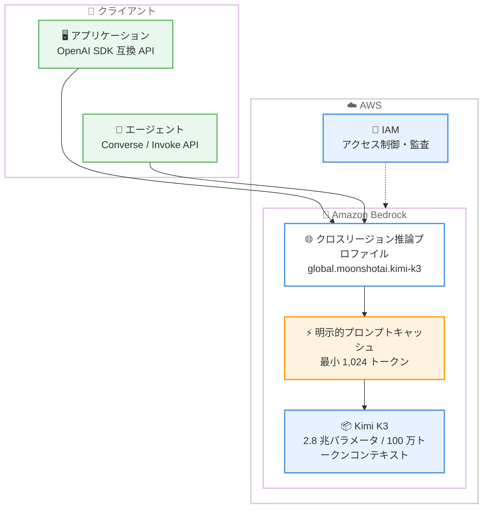

# Amazon Bedrock - Moonshot AI Kimi K3 の一般提供開始

**リリース日**: 2026 年 9 月 18 日
**サービス**: Amazon Bedrock
**機能**: Moonshot AI Kimi K3 モデルの一般提供 (GA)

📊 [このアップデートのインフォグラフィックを見る](https://takech9203.github.io/aws-news-summary/20260918-moonshot-ai-kimi-k3-on-amazon-bedrock.html)

## 概要

Moonshot AI の最新オープンウェイトモデル「Kimi K3」が Amazon Bedrock で一般提供 (GA) となりました。Kimi K3 は Moonshot AI が「同社史上最も高性能なモデルであり、2.8 兆パラメータに到達した初のオープンモデル」と位置付けるモデルで、ネイティブなビジョン機能と 100 万トークンのコンテキストウィンドウを兼ね備えています。大規模リポジトリをまたぐ長時間のコーディングセッション、スキャン画像やスクリーンショットを含む複数ドキュメントの分析、長時間実行されるエージェントワークフローなどに適しています。

特筆すべき点として、Kimi K3 は Amazon Bedrock 上のオープンウェイトモデルとして初めて明示的プロンプトキャッシュ (explicit prompt caching) をサポートします。複数のモデル呼び出しでコンテキストを再利用する際のレイテンシーと入力コストを削減できるため、長いシステムプロンプトや大量のドキュメントを繰り返し参照するエージェント型アプリケーションで効果を発揮します。

Kimi K3 は Amazon Bedrock の独自 (プロプライエタリ) モデルと同一のセキュリティ境界内で動作し、アクセス制御、暗号化、監査の仕組みも同一です。推論データが Moonshot AI に共有されたり、モデルの学習に利用されたりすることはありません。

**アップデート前の課題**

このアップデート以前には、以下のような課題がありました。

- Amazon Bedrock のオープンウェイトモデルでは明示的プロンプトキャッシュが利用できず、長いコンテキストを再利用するワークロードで入力コストとレイテンシーが増大していた
- 100 万トークン級のコンテキストウィンドウとビジョン機能を併せ持つオープンウェイトモデルの選択肢が限られていた
- 大規模コードベースの解析や長時間のエージェントワークフローでは、コンテキストの分割や外部検索の仕組みを追加で構築する必要があった

**アップデート後の改善**

今回のアップデートにより、以下が可能になりました。

- 2.8 兆パラメータのオープンウェイトモデル Kimi K3 を Amazon Bedrock のフルマネージド環境で利用可能になった
- オープンウェイトモデルとして初の明示的プロンプトキャッシュにより、コンテキスト再利用時のレイテンシーと入力コストを削減できるようになった
- 100 万トークンのコンテキストウィンドウとネイティブビジョン機能により、大規模リポジトリのコーディングや複数ドキュメント分析を単一モデルで実行できるようになった
- クロスリージョン推論により、Amazon Bedrock が利用可能なすべての AWS リージョンからアクセスできるようになった

## アーキテクチャ図



アプリケーションやエージェントは、クロスリージョン推論プロファイル経由で Kimi K3 を呼び出します。再利用するプレフィックスにキャッシュブレークポイントを設定することで、2 回目以降の呼び出しではキャッシュヒットによりレイテンシーと入力コストが削減されます。

## サービスアップデートの詳細

### 主要機能

1. **2.8 兆パラメータのオープンウェイトモデル**
   - Moonshot AI によると、2.8 兆パラメータに到達した初のオープンモデル
   - 前世代の Kimi K2 と比較して、スケーリング効率が約 2.5 倍向上したとされる
   - 長時間のコーディングセッションやナレッジワークフローに最適化

2. **ネイティブビジョンと 100 万トークンコンテキスト**
   - 画像入力にネイティブ対応し、スキャンされたページやスクリーンショットを含むドキュメント分析が可能
   - 100 万トークンのコンテキストウィンドウにより、大規模リポジトリ全体や複数の長文ドキュメントを一度に処理可能

3. **明示的プロンプトキャッシュ (オープンウェイトモデルとして初)**
   - 再利用するプレフィックス (最小 1,024 トークン) に `prompt_cache_breakpoint` を設定してキャッシュを制御
   - キャッシュ書き込みは通常より高コストだが、キャッシュ内容は最低 30 分間保持される
   - キャッシュヒット時は入力料金が割引され、入力トークン/分のクォータにもカウントされない

4. **複数の API 形式に対応**
   - OpenAI 互換の Responses API / Chat Completions API をサポート
   - Amazon Bedrock ネイティブの Invoke API / Converse API もサポート
   - OpenCode などのコーディングアシスタントや Hermes Agent との統合例も紹介されている

5. **Amazon Bedrock のセキュリティ境界内で動作**
   - プロプライエタリモデルと同一のアクセス制御、暗号化、監査の仕組みを適用
   - 推論データは AWS の境界内に留まり、Moonshot AI への共有やモデル学習への利用はない
   - 推論中のデータ保持ゼロ、オペレーターアクセスゼロのポリシーが適用される

## 技術仕様

### モデル仕様

| 項目 | 詳細 |
|------|------|
| モデル名 | Kimi K3 |
| プロバイダー | Moonshot AI |
| モデル ID (グローバル) | `global.moonshotai.kimi-k3` (約 10% 低価格) |
| モデル ID (米国内) | `us.moonshotai.kimi-k3` (データレジデンシー要件向け) |
| パラメータ数 | 2.8 兆 |
| コンテキストウィンドウ | 100 万トークン |
| モダリティ | テキスト、画像 (ネイティブビジョン) |
| プロンプトキャッシュ | 明示的キャッシュ対応 (最小 1,024 トークン、最低 30 分保持) |
| 対応 API | OpenAI 互換 Responses / Chat Completions、Invoke、Converse |

### 必要な IAM 権限

```json
{
  "Version": "2012-10-17",
  "Statement": [
    {
      "Effect": "Allow",
      "Action": [
        "bedrock:InvokeModel",
        "bedrock:InvokeModelWithResponseStream"
      ],
      "Resource": "*"
    }
  ]
}
```

## 設定方法

### 前提条件

1. AWS アカウントと Amazon Bedrock へのアクセス権限
2. Amazon Bedrock コンソールで Kimi K3 モデルへのアクセスを有効化
3. `bedrock:InvokeModel` および `bedrock:InvokeModelWithResponseStream` を許可する IAM ポリシー

### 手順

#### ステップ 1: モデルアクセスの有効化

Amazon Bedrock コンソールの [モデルアクセス] から Moonshot AI の Kimi K3 を有効化します。組織のポリシーに応じてグローバルプロファイルまたは US プロファイルを選択します。

#### ステップ 2: OpenAI 互換 API での呼び出し

```python
from aws_bedrock_token_generator import provide_token
from openai import OpenAI

region = "us-west-2"
client = OpenAI(
    api_key=provide_token(region=region),
    base_url=f"https://bedrock-runtime.{region}.amazonaws.com/openai/v1",
)
response = client.responses.create(
    input="Byte-Pair Encoding とは何ですか?",
    model="global.moonshotai.kimi-k3",
)
print(response.output_text)
```

Amazon Bedrock のトークンジェネレーターで一時認証情報を発行し、OpenAI SDK から OpenAI 互換エンドポイント経由で Kimi K3 を呼び出しています。

#### ステップ 3: 明示的プロンプトキャッシュの有効化

```python
response = client.responses.create(
    model="global.moonshotai.kimi-k3",
    input=long_context_messages,
    extra_body={"prompt_cache_options": {"mode": "explicit"}},
)
```

`prompt_cache_options` でキャッシュモードを明示的に有効化し、メッセージ内の再利用するプレフィックス (最小 1,024 トークン) にキャッシュブレークポイントを設定します。2 回目以降の呼び出しでキャッシュヒットが発生すると、入力料金が割引されます。

## メリット

### ビジネス面

- **入力コストの削減**: 明示的プロンプトキャッシュにより、長いコンテキストを再利用するワークロードで入力コストを削減できる
- **インフラ運用の不要化**: 2.8 兆パラメータの大規模モデルをフルマネージドで利用でき、GPU インフラの調達・運用が不要
- **柔軟な価格・レジデンシー選択**: グローバルプロファイル (約 10% 低価格) と US プロファイル (データレジデンシー対応) を要件に応じて選択可能

### 技術面

- **超長コンテキスト処理**: 100 万トークンのコンテキストウィンドウにより、大規模コードベースや複数ドキュメントを分割せずに処理可能
- **クォータ効率の向上**: キャッシュヒットした入力トークンは入力トークン/分のクォータにカウントされず、スループットを向上できる
- **既存エコシステムとの互換性**: OpenAI 互換 API により、既存の OpenAI SDK ベースのアプリケーションから最小限の変更で移行可能
- **エンタープライズグレードのセキュリティ**: 推論データの保持ゼロ、オペレーターアクセスゼロ、モデル学習への不使用が保証される

## デメリット・制約事項

### 制限事項

- 明示的プロンプトキャッシュのブレークポイントには最小 1,024 トークンが必要
- キャッシュ書き込みは通常の入力トークンより高コスト (キャッシュ保持は最低 30 分)
- 具体的な料金は発表内に記載がなく、Amazon Bedrock の料金ページでの確認が必要

### 考慮すべき点

- キャッシュの効果を得るには、再利用可能なプレフィックスを先頭に配置するプロンプト設計が必要
- クロスリージョン推論を利用するため、リクエストが地理的に異なるリージョンで処理される可能性があり、コンプライアンス要件の確認が推奨される
- スケーリング効率などの性能に関する数値は Moonshot AI による主張であり、自社ワークロードでの検証が推奨される

## ユースケース

### ユースケース 1: 大規模リポジトリでの長時間コーディングセッション

**シナリオ**: 数十万行規模のコードベース全体を理解した上で、リファクタリングや機能追加を行うコーディングエージェントを構築する。

**実装例**:
```text
1. リポジトリの主要ソースコードをプロンプトのプレフィックスとして構成
2. プレフィックスにキャッシュブレークポイントを設定して明示的キャッシュを有効化
3. OpenCode などのコーディングアシスタントから Converse API 経由で反復的に呼び出し
```

**効果**: 100 万トークンのコンテキストでリポジトリ全体を保持しつつ、キャッシュヒットにより反復呼び出しのコストとレイテンシーを削減できます。

### ユースケース 2: スキャン文書を含む複数ドキュメントの一括分析

**シナリオ**: 契約書や請求書など、スキャンされたページやスクリーンショットを含む大量のドキュメントを横断的に分析する。

**実装例**:
```text
1. スキャン画像と本文テキストを混在させたマルチモーダル入力を構成
2. ネイティブビジョン機能で画像内の文字や表を直接解釈
3. 100 万トークンのコンテキストで複数ドキュメントを一括投入し、横断比較を実行
```

**効果**: OCR 前処理やドキュメント分割のパイプラインを簡素化し、複数文書にまたがる矛盾検出や要約を単一の呼び出しで実現できます。

### ユースケース 3: 長時間実行されるエージェントワークフロー

**シナリオ**: 調査・計画・実行を繰り返す自律型エージェントが、長大なシステムプロンプトとツール定義を毎回参照する。

**実装例**:
```text
1. システムプロンプトとツール定義をキャッシュ対象のプレフィックスとして固定
2. エージェントループの各ステップで会話履歴のみを追記して呼び出し
3. キャッシュヒット分は入力クォータに計上されないため、高頻度呼び出しにも対応
```

**効果**: エージェントの各ステップでのレイテンシーと入力コストを削減し、長時間のワークフローを効率的に運用できます。

## 料金

Amazon Bedrock のトークンベースの従量課金が適用されます。発表内に具体的な単価の記載はなく、詳細は [Amazon Bedrock 料金ページ](https://aws.amazon.com/bedrock/pricing/) を参照してください。

料金に関する主なポイントは以下のとおりです。

- グローバル推論プロファイル (`global.moonshotai.kimi-k3`) は US プロファイルより約 10% 低価格
- 明示的プロンプトキャッシュのキャッシュ書き込みは通常の入力トークンより高コスト
- キャッシュヒット時は入力料金が割引され、入力トークン/分のクォータにもカウントされない

## 利用可能リージョン

クロスリージョン推論により、Amazon Bedrock が利用可能なすべての AWS リージョンで利用できます。US Geo プロファイルとグローバルプロファイルが提供されており、対応リージョンの詳細は [Amazon Bedrock のリージョン対応ドキュメント](https://docs.aws.amazon.com/bedrock/latest/userguide/models-regions.html) を参照してください。

## 関連サービス・機能

- **Amazon Bedrock クロスリージョン推論**: 推論プロファイルを通じて複数リージョンにトラフィックを分散し、可用性とスループットを向上
- **Amazon Bedrock プロンプトキャッシュ**: コンテキスト再利用時のレイテンシーと入力コストを削減する機能。Kimi K3 はオープンウェイトモデルとして初の明示的キャッシュ対応
- **Amazon Bedrock Converse API**: モデル間で共通のインターフェースを提供し、マルチモデル構成での切り替えを容易化
- **AWS IAM**: `bedrock:InvokeModel` などの権限によるモデルアクセスの制御と監査

## 参考リンク

- 📊 [インフォグラフィック](https://takech9203.github.io/aws-news-summary/20260918-moonshot-ai-kimi-k3-on-amazon-bedrock.html)
- [公式発表 (What's New)](https://aws.amazon.com/about-aws/whats-new/2026/09/moonshot-ai-kimi-k3-on-amazon-bedrock/)
- [AWS Blog: Introducing Kimi K3 on Amazon Bedrock](https://aws.amazon.com/blogs/machine-learning/introducing-kimi-k3-on-amazon-bedrock/)
- [Amazon Bedrock プロンプトキャッシュのドキュメント](https://docs.aws.amazon.com/bedrock/latest/userguide/prompt-caching.html)
- [Amazon Bedrock リージョン対応ドキュメント](https://docs.aws.amazon.com/bedrock/latest/userguide/models-regions.html)
- [Amazon Bedrock 料金ページ](https://aws.amazon.com/bedrock/pricing/)
- [Moonshot AI ブログ: Kimi K3](https://kimi.com/blog/kimi-k3)

## まとめ

Kimi K3 の Amazon Bedrock での一般提供により、2.8 兆パラメータ、100 万トークンコンテキスト、ネイティブビジョンを備えたオープンウェイトモデルをフルマネージドかつセキュアに利用できるようになりました。オープンウェイトモデルとして初の明示的プロンプトキャッシュ対応は、長いコンテキストを繰り返し利用するエージェント型ワークロードのコスト構造を大きく改善します。大規模コードベースの解析や長時間エージェントの構築を検討している場合は、まずグローバル推論プロファイルとプロンプトキャッシュを組み合わせた PoC から始めることを推奨します。
