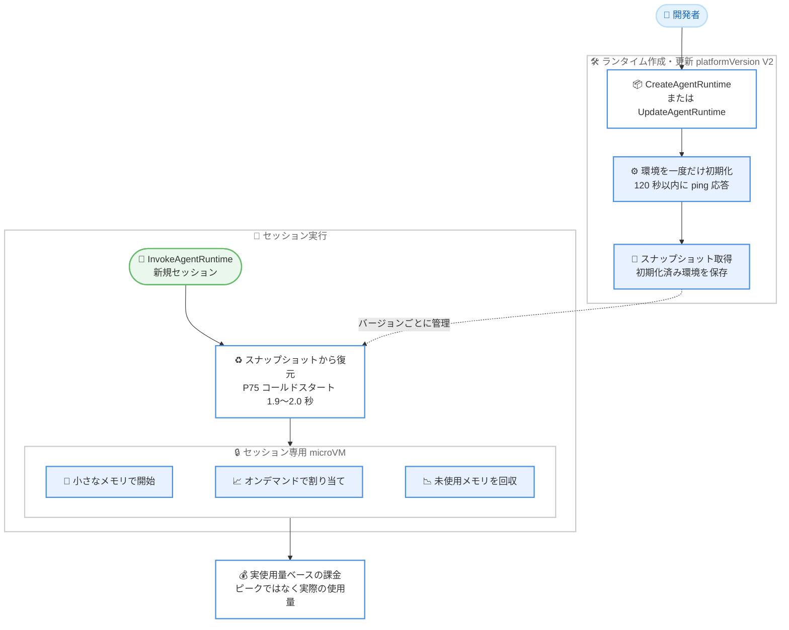

# Amazon Bedrock AgentCore - 新しい AgentCore Runtime (プラットフォームバージョン V2) の一般提供開始

**リリース日**: 2026 年 9 月 18 日
**サービス**: Amazon Bedrock AgentCore
**機能**: 新しい AgentCore Runtime (プラットフォームバージョン V2)

📊 [このアップデートのインフォグラフィックを見る](https://takech9203.github.io/aws-news-summary/20260918-new-agentcore-runtime-generally-available.html)

## 概要

Amazon Bedrock AgentCore の新しい AgentCore Runtime が一般提供を開始しました。AgentCore Runtime は、AI エージェントをホストするサーバーレスの microVM コンピュートであり、今回の新しいランタイム (プラットフォームバージョン V2) では「弾力的なメモリ管理」と「一貫したコールドスタート」という 2 つの大きな改善が導入されました。

V2 では、エージェント環境を一度準備してスナップショットを取得し、新しいインスタンスはそのスナップショットから復元されます。これにより、コンテナイメージのサイズや同時実行数に関係なく起動時間が安定し、テストでは 200 MB から 2 GB のコンテナイメージに対して P75 コールドスタートが 1.9〜2.0 秒 (V1 では 5.4〜30 秒) という結果が示されています。また、セッションは小さなメモリフットプリントで開始し、ワークロードの必要に応じてオンデマンドでメモリが割り当てられ、使用されなくなったメモリはセッション中に回収されます。課金はピーク値ではなく実際の使用量を反映します。

事前プロビジョニング不要、ゼロへのスケール、ハードウェアで強制されるセッション分離、従量課金というサーバーレスモデルはそのまま維持されており、本番環境で AI エージェントを運用する開発者にとって、コスト効率と起動性能の両方を改善するアップデートです。東京リージョンを含む 5 リージョンで利用でき、ランタイムの作成または更新時に `platformVersion` を `V2` に設定するだけで利用を開始できます。

**アップデート前の課題**

このアップデート以前の AgentCore Runtime (V1) には、以下の課題がありました。

- コールドスタート時間がコンテナイメージのサイズに依存し、大きなイメージでは起動が遅くなっていた (テストでは 5.4〜30 秒)
- 起動のたびに環境の初期化が実行されるため、同時実行数の増加時にコールドスタート時間が安定しなかった
- セッション中に使用されなくなったメモリはセッション終了まで保持され、ピーク時のメモリ使用量に基づくコストが発生していた

**アップデート後の改善**

今回のアップデートにより、以下が可能になりました。

- スナップショットからの復元により、イメージサイズや同時実行数に関係なく一貫したコールドスタート (200 MB〜2 GB のイメージで P75 1.9〜2.0 秒) を実現
- セッションは小さなメモリフットプリントで開始し、必要に応じてオンデマンドで割り当て、不要になったメモリはセッション中に回収
- 課金がピークではなく実際の使用量を反映するため、常時稼働型やバースト型のエージェントのコストを削減

## アーキテクチャ図



V2 ではランタイムの作成・更新時に環境を一度だけ初期化してスナップショットを取得し、新規セッションはスナップショットの復元によって起動します。セッション中のメモリはオンデマンドで割り当て・回収され、課金は実際の使用量を反映します。

## サービスアップデートの詳細

### 主要機能

1. **弾力的なメモリ管理 (Elastic Memory Management)**
   - セッションは小さなメモリフットプリントで開始し、ワークロードが必要とするタイミングでオンデマンドにメモリを割り当て
   - アクティブに使用されなくなったメモリは、セッション終了を待たずにセッション中に回収 (アイドル状態のメモリは 120 秒後に自動回収)
   - 課金はメモリ使用量のピークではなく実際の使用量を反映するため、常時稼働型やバースト型のエージェントでコストを削減

2. **一貫したコールドスタート (Consistent Cold Starts)**
   - ランタイムがエージェント環境を一度準備してスナップショットを取得し、新しいインスタンスは完全な起動処理を繰り返す代わりにスナップショットから復元
   - コンテナイメージのサイズや同時実行数に関係なく、起動時間が安定
   - テストでは 200 MB から 2 GB のコンテナイメージに対して P75 コールドスタートが 1.9〜2.0 秒 (V1 では 5.4〜30 秒)

3. **サーバーレスモデルの維持**
   - 事前プロビジョニング不要、ゼロへのスケール、従量課金という既存のサーバーレスモデルを維持
   - ハードウェアで強制されるセッション分離 (セッションごとの専用 microVM) も従来どおり提供
   - HTTP、MCP、A2A などのプロトコルサポート、ストリーミング、最大 8 時間のセッションといった AgentCore Runtime の機能をそのまま利用可能

4. **シンプルな有効化**
   - ランタイムの作成時または更新時に `platformVersion` フィールドを `V2` に設定するだけで利用開始
   - 省略した場合、新規作成時は V1、更新時は現在のプラットフォームバージョンを維持
   - スナップショットはランタイムとエンドポイントの変更に追従して自動管理され、ユーザーが直接作成・削除する必要はない

## 技術仕様

### V1 と V2 の比較

| 項目 | V1 | V2 |
|------|----|----|
| 起動方式 | 起動ごとに環境を初期化 | スナップショットから復元 |
| コールドスタート | 5.4〜30 秒 (イメージサイズに依存) | P75 1.9〜2.0 秒 (200 MB〜2 GB のイメージで一貫) |
| メモリ管理 | セッション終了までメモリを保持 | オンデマンド割り当て、アイドル 120 秒後に自動回収 |
| メモリ課金 | ピークベース | 実使用量ベース |
| ランタイム作成・更新の所要時間 | 数秒で READY | スナップショット準備のため数分 |
| 環境変数の合計サイズ上限 | 4 KB | 直接コードデプロイ 1.5 KB、コンテナ 2.5 KB (今後 V1 と同等に引き上げ予定) |
| CloudFormation / CDK | サポート | `platformVersion` の設定は現時点で未サポート |

### V2 利用時の動作上の注意

| 項目 | 詳細 |
|------|------|
| ヘルスチェック | コンテナは起動から 120 秒以内に `/ping` で正常応答する必要があり、超過すると作成がヘルスチェックエラーで失敗 |
| スナップショット取得タイミング | 最初の正常な `/ping` 応答時にスナップショットを取得。初期化完了後にのみ正常応答を返すよう実装する |
| ステータスのポーリング | create / update はランタイムが `CREATING` / `UPDATING` の間に返るため、`READY` または FAILED 系の終端ステータスまで `get_agent_runtime` をポーリング |
| スナップショットのライフサイクル | エンドポイントが参照するバージョンごとに自動管理。参照がなくなると削除対象となり、実行中セッションの終了後 (最大 8 時間) に削除 |
| コード構造 | 起動時に実行した処理はスナップショットに固定され全インスタンスで共有されるため、乱数・タイムスタンプ・有効期限付き認証情報などはリクエストハンドラー内で生成する |
| 暗号化ライブラリ | 独自の暗号化ライブラリを持ち込む場合は、復元後に再シードされる snapshot-safe ビルド (Amazon Linux 2023 では `openssl-snapsafe-libs`) を使用 |

### API 変更履歴

| 日付 | サービス | 変更内容 |
|------|----------|----------|
| 2026/09/15 | [bedrock-agentcore-control](https://awsapichanges.com/archive/changes/4cd222-bedrock-agentcore-control.html) | 3 updated api methods - CreateAgentRuntime、UpdateAgentRuntime、GetAgentRuntime に新しい `platformVersion` フィールドを追加 |

## 設定方法

### 前提条件

1. Amazon Bedrock AgentCore が利用可能なリージョン (V2 対応の 5 リージョンのいずれか) を使用していること
2. エージェントのコンテナイメージ (Amazon ECR) または直接コードデプロイのアーティファクトが準備されていること
3. AgentCore Runtime 用の IAM 実行ロールが設定されていること
4. エージェントが起動から 120 秒以内に `/ping` で正常応答するよう実装されていること

### 手順

#### ステップ 1: platformVersion V2 でランタイムを作成する

```bash
aws bedrock-agentcore-control create-agent-runtime \
  --agent-runtime-name "my-agent" \
  --role-arn "arn:aws:iam::111122223333:role/AgentExecutionRole" \
  --agent-runtime-artifact '{
    "containerConfiguration": {
      "containerUri": "111122223333.dkr.ecr.us-west-2.amazonaws.com/my-agent:latest"
    }
  }' \
  --network-configuration '{"networkMode": "PUBLIC"}' \
  --platform-version V2
```

`--platform-version V2` を指定して新しいランタイムを作成します。コンソールの場合は、ランタイム作成画面の「Platform version」で「V2」を選択します。省略した場合は V1 が使用されます。既存ランタイムを V2 に移行する場合は `update-agent-runtime` で同様に指定します。

#### ステップ 2: ランタイムが READY になるまでポーリングする

```bash
aws bedrock-agentcore-control get-agent-runtime \
  --agent-runtime-id my-agent-ABCDE12345 \
  --query 'status'
```

V2 ではスナップショットの準備に数分かかるため、ステータスが `READY` になるまでポーリングします。終端ステータスに達する前に update や delete を呼び出すと `ConflictException` が返されます。`platformVersion` の確認も `get-agent-runtime` で行います (create の応答には含まれません)。

#### ステップ 3: エージェントコードを V2 向けに最適化する

```python
import os, time
from bedrock_agentcore.runtime import BedrockAgentCoreApp

# 起動時: スナップショットに含めたい高コストで再利用可能な処理
MODEL = load_model_weights()
client = build_client()

app = BedrockAgentCoreApp()

@app.entrypoint
def invoke(payload):
    # リクエストごと: 毎回変わる値や期限切れする値はハンドラー内で生成
    creds = get_credentials()          # 期限切れ時にリフレッシュ
    request_id = os.urandom(16).hex()  # リクエストごとに一意
    now = time.time()                  # スナップショット時刻ではなく現在時刻
    ...

app.run()
```

依存関係のインポート、モデルウェイトのロード、クライアント構築などの高コストな処理は起動時 (モジュールスコープ) に実行してスナップショットに含めます。乱数、タイムスタンプ、認証情報などスナップショットで共有してはならない値は、必ずリクエストハンドラー内で生成します。

## メリット

### ビジネス面

- **コスト削減**: メモリ課金がピークではなく実使用量を反映し、未使用メモリはセッション中に回収されるため、常時稼働型やバースト型のエージェントの運用コストを削減できる
- **ユーザー体験の向上**: コールドスタートが P75 で 1.9〜2.0 秒に安定するため、エンドユーザーへの初回応答が高速化する
- **スケーラビリティの予測可能性**: 同時実行数が増えても起動時間が安定するため、トラフィックのバーストに対する SLA 設計が容易になる

### 技術面

- **イメージサイズからの解放**: 200 MB でも 2 GB でもコールドスタート時間がほぼ一定のため、大きな依存関係を持つエージェントでも起動性能を犠牲にしない
- **初期化処理の一回化**: 環境の準備とスナップショット取得は一度だけ実行され、全インスタンスが初期化済みの状態から起動する
- **移行の容易さ**: `platformVersion` の指定だけで有効化でき、サーバーレスモデルやセッション分離などの既存の特性は変わらない

## デメリット・制約事項

### 制限事項

- V2 の利用可能リージョンは us-east-1、us-east-2、us-west-2、eu-west-1、ap-northeast-1 の 5 リージョンに限定される
- ランタイムの作成・更新はスナップショット準備のため数分かかる (V1 は数秒)
- 環境変数の合計サイズは直接コードデプロイで 1.5 KB、コンテナで 2.5 KB に制限される (V1 は 4 KB。今後 V1 と同等に引き上げ予定)
- AWS CloudFormation および AWS CDK は現時点で `platformVersion` の設定をサポートしていない
- コンテナは起動から 120 秒以内にヘルスチェックに応答する必要がある

### 考慮すべき点

- スナップショット復元を前提としたコード構造への見直しが必要。起動時に生成した乱数、タイムスタンプ、認証情報は全インスタンスで同一値になるため、リクエストハンドラー内で生成する必要がある
- AgentCore Gateway から取得するツールカタログなど、再デプロイなしに変更され得る値を起動時にキャッシュすると、スナップショット取得時点の状態に固定される
- 復元後のインスタンスはホスト名 (`localhost`) と PID (`1`) が同一のため、インスタンス識別子として使用するとメトリクスやログが混在する
- V2 の時間単価は V1 より高い (vCPU 時間あたり 0.1276 USD、GB 時間あたり 0.0169 USD) ため、アイドル時間の少ない短時間セッション中心のワークロードではコストを比較検討する必要がある
- 独自コンテナで暗号化ライブラリを持ち込む場合は snapshot-safe ビルドが必要

## ユースケース

### ユースケース 1: 大きなコンテナイメージを使用するエージェントの起動高速化

**シナリオ**: 機械学習ライブラリや大量の依存関係を含む 2 GB 近いコンテナイメージでエージェントを運用しており、V1 ではコールドスタートに数十秒かかりユーザー体験を損なっている。

**実装例**:
```
1. update-agent-runtime で --platform-version V2 を指定して既存ランタイムを更新
2. モデルウェイトのロードや依存関係のインポートをモジュールスコープに配置
3. get-agent-runtime で READY を確認 (数分かかる)
4. InvokeAgentRuntime でコールドスタート時間を計測して効果を確認
```

**効果**: イメージサイズに依存しない P75 1.9〜2.0 秒のコールドスタートを実現し、初回応答の待ち時間を大幅に短縮できる。

### ユースケース 2: アイドル時間の長い対話型エージェントのコスト最適化

**シナリオ**: カスタマーサポートエージェントで、ユーザーの入力待ちなどアイドル時間が長いセッションが多く、V1 ではピークメモリ分の課金が継続してコストが膨らんでいる。

**実装例**:
```
1. ランタイムを V2 に更新
2. 処理のピーク時のみ大きなメモリを使用するようエージェントを実装
3. アイドル状態のメモリは 120 秒後に自動回収されることを前提にセッション設計
4. 請求レポートで実使用量ベースの課金額を確認
```

**効果**: 未使用メモリがセッション中に回収され、課金が実使用量を反映するため、アイドル時間の長いセッションのコストを削減できる。

### ユースケース 3: バーストトラフィックへの安定したスケーリング

**シナリオ**: キャンペーン開始時などに同時セッション数が急増するエージェントで、V1 では同時実行数の増加時にコールドスタートがばらつき、応答時間の SLA を満たせないことがあった。

**実装例**:
```
1. ランタイムを V2 で作成し、スナップショットを準備
2. 負荷テストで同時セッション数を段階的に増やし、起動時間の一貫性を確認
3. クライアント構築などをスナップショットに含め、復元後の透過的な再接続を前提に実装
4. インスタンス識別子はリクエストごとに生成し、メトリクスの混在を防止
```

**効果**: 同時実行数に関係なくスナップショット復元による一貫した起動時間を維持でき、バースト時も安定した応答性能を提供できる。

## 料金

AgentCore Runtime は 1 秒単位の従量課金 (1 秒最小、メモリは 128 MB 最小) です。V2 では時間単価は高くなる一方、アイドルメモリの自動回収 (120 秒後) により実使用量ベースの課金となるため、アイドル時間の長いワークロードでは総コストが下がる場合があります。

### 料金比較 (microVM コンピュート)

| リソース | V1 | V2 (従量) | V2 (コミット済みベースライン)* |
|--------|------|------|------|
| CPU | 0.0895 USD/vCPU 時間 | 0.1276 USD/vCPU 時間 | 0.0997 USD/vCPU 時間 |
| メモリ | 0.00945 USD/GB 時間 | 0.0169 USD/GB 時間 | 0.0132 USD/GB 時間 |

\* コミット済みベースラインは 2026 年 10 月までの提供開始が予定されている割引オプションです。

このほか、コンテナデプロイでは Amazon ECR、直接コードデプロイでは S3 Standard 相当のコードストレージ料金、標準のデータ転送料金が別途発生します。詳細は [AgentCore 料金ページ](https://aws.amazon.com/bedrock/agentcore/pricing/) を参照してください。

## 利用可能リージョン

新しい AgentCore Runtime (V2) は以下の 5 リージョンで利用可能です。

- 米国東部 (バージニア北部) us-east-1
- 米国東部 (オハイオ) us-east-2
- 米国西部 (オレゴン) us-west-2
- 欧州 (アイルランド) eu-west-1
- アジアパシフィック (東京) ap-northeast-1

## 関連サービス・機能

- **Amazon Bedrock AgentCore**: AI エージェントの構築・デプロイ・運用のためのサービス群。Runtime のほか Memory、Identity、Gateway などで構成される
- **AgentCore Runtime instances**: microVM の代替となる永続コンピュートオプション。GPU サポートや最大 14 日間のセッションが必要な場合に選択
- **AgentCore Identity**: Inbound Auth / Outbound Auth によるエージェントの認証・認可を提供。V2 でも従来どおり利用可能
- **Amazon ECR**: コンテナデプロイ時のコンテナイメージの格納先
- **AWS IAM**: ランタイムの実行ロールと SigV4 ベースの Inbound 認証に使用

## 参考リンク

- 📊 [インフォグラフィック](https://takech9203.github.io/aws-news-summary/20260918-new-agentcore-runtime-generally-available.html)
- [公式発表 (What's New)](https://aws.amazon.com/about-aws/whats-new/2026/09/new-agentcore-runtime-generally-available)
- [ドキュメント: AgentCore Runtime の仕組みとプラットフォームバージョン](https://docs.aws.amazon.com/bedrock-agentcore/latest/devguide/runtime-how-it-works.html#runtime-platform-versions)
- [ドキュメント: AgentCore Runtime V2 向けのエージェント最適化](https://docs.aws.amazon.com/bedrock-agentcore/latest/devguide/runtime-v2-optimize.html)
- [料金ページ](https://aws.amazon.com/bedrock/agentcore/pricing/)

## まとめ

新しい AgentCore Runtime (V2) は、スナップショットベースの起動と弾力的なメモリ管理により、コールドスタートの一貫性 (P75 1.9〜2.0 秒) と実使用量ベースの課金を実現する重要なアップデートです。有効化は `platformVersion` を `V2` に設定するだけですが、スナップショット復元を前提としたコード構造 (起動時処理とリクエストごとの処理の分離) への見直しが効果を最大化する鍵となります。東京リージョンでも利用可能なため、AgentCore Runtime で本番エージェントを運用しているチームは、V1 と V2 の料金特性を比較したうえで移行を検討することを推奨します。
