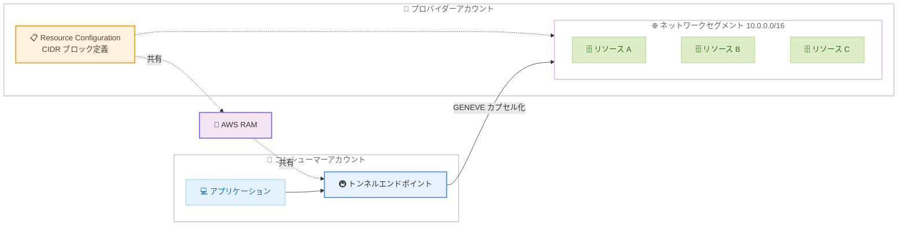

# AWS PrivateLink - Tunnel Endpoints によるネットワークセグメントへのアクセス

**リリース日**: 2026 年 9 月 18 日
**サービス**: AWS PrivateLink
**機能**: Tunnel Endpoints (トンネルエンドポイント)

📊 [このアップデートのインフォグラフィックを見る](https://takech9203.github.io/aws-news-summary/20260918-privatelink-tunnel-endpoint.html)

## 概要

AWS PrivateLink は、新しい種類の VPC エンドポイントである「トンネルエンドポイント」を発表しました。これにより、別の VPC やアカウントにあるネットワークセグメント全体 (CIDR ブロック) に対して、プライベートにアクセスできるようになります。従来のようにリソースを 1 つずつ共有するのではなく、CIDR 範囲を丸ごと共有できる点が特徴です。

リソースを共有する側 (プロバイダー) は、自身のネットワーク内の CIDR ブロックを表す Resource Configuration を定義し、AWS Resource Access Manager (RAM) を通じて共有します。共有を受けた側 (コンシューマー) は、トンネルエンドポイントを作成し、GENEVE カプセル化を使用してプロバイダーの VPC 内の CIDR 範囲にあるリソースへ到達できます。

SaaS ベンダーとの接続や、複数アカウントにまたがる社内ネットワークのプライベート接続など、多数のリソースへのアクセスを一括で提供したいユースケースに適したアップデートです。

**アップデート前の課題**

- 以前は、外部パーティ (ベンダーなど) とリソースを共有する場合、リソースごとに Resource Configuration を作成する必要があった
- 共有対象のリソースが多数ある場合、設定作業と管理の負担が大きかった
- ネットワークセグメント全体をプライベートに公開するには、VPC ピアリングや Transit Gateway など、より広範なネットワーク接続を構成する必要があった

**アップデート後の改善**

- 今回のアップデートにより、CIDR ブロックを表す Resource Configuration を 1 つ定義するだけで、その範囲内のリソース群へのアクセスを一括で共有できるようになった
- コンシューマーはトンネルエンドポイントを 1 つ作成するだけで、共有されたネットワークセグメント内のリソースにアクセスできるようになった
- GENEVE カプセル化により、VPC やアカウントの境界を越えたネットワークセグメント単位のプライベート接続が可能になった

## アーキテクチャ図



プロバイダーが CIDR ブロックを表す Resource Configuration を AWS RAM で共有し、コンシューマーはトンネルエンドポイント経由で GENEVE カプセル化を使用してセグメント内のリソースにアクセスします。

## サービスアップデートの詳細

### 主要機能

1. **トンネルエンドポイント (新しい VPC エンドポイントタイプ)**
   - インターフェイス型、リソース型、サービスネットワーク型に続く新しい VPC エンドポイントの種類
   - 個別リソースではなく、ネットワークセグメント (CIDR ブロック) 全体へのプライベートアクセスを提供
   - GENEVE カプセル化を使用して、共有された CIDR 範囲内のリソースへトラフィックを転送

2. **CIDR ブロックの Resource Configuration**
   - プロバイダーは自身のネットワーク内の CIDR ブロックを表す Resource Configuration を定義可能
   - リソースごとに Resource Configuration を作成する必要がなくなり、設定作業を大幅に削減
   - VPC Lattice の Resource Configuration API が CIDR タイプをサポートするよう更新

3. **AWS RAM によるクロスアカウント共有**
   - Resource Configuration は AWS Resource Access Manager (RAM) を通じて別のアカウントに共有
   - 既存の PrivateLink リソース共有と同じ共有モデルを踏襲しており、一貫した権限管理が可能

## 技術仕様

### 主要な技術要素

| 項目 | 詳細 |
|------|------|
| エンドポイントタイプ | Tunnel (トンネル) |
| アクセス対象 | 別の VPC / アカウント内のネットワークセグメント (CIDR ブロック) |
| カプセル化方式 | GENEVE |
| 共有の単位 | CIDR ブロックを表す Resource Configuration |
| 共有の仕組み | AWS Resource Access Manager (RAM) |
| 料金 | トンネルエンドポイントの時間課金 + 処理データ量あたりの GB 課金 |

### API変更履歴

| 日付 | サービス | 変更内容 |
|------|----------|----------|
| 2026/09/17 | [ec2](https://awsapichanges.com/archive/changes/7ffc56-ec2.html) | 4 updated api methods - "Tunnel" VPC エンドポイントのサポートを追加 |
| 2026/09/17 | [vpc-lattice](https://awsapichanges.com/archive/changes/7ffc56-vpc-lattice.html) | 5 updated api methods - CIDR Resource Configuration のサポートを追加 |

## 設定方法

### 前提条件

1. プロバイダー側: 共有対象のネットワークセグメント (CIDR ブロック) を含む VPC
2. コンシューマー側: トンネルエンドポイントを作成する VPC
3. AWS RAM でクロスアカウント共有を行うための権限

### 手順

#### ステップ1: Resource Configuration の作成 (プロバイダー側)

```bash
# CIDR ブロックを表す Resource Configuration を作成する例
aws vpc-lattice create-resource-configuration \
  --name my-network-segment \
  --type <CIDR タイプ> \
  --resource-gateway-identifier <リソースゲートウェイ ID>
```

プロバイダーのネットワーク内の CIDR ブロックを表す Resource Configuration を作成します。具体的なパラメータは [PrivateLink ドキュメント](https://docs.aws.amazon.com/vpc/latest/privatelink/what-is-privatelink.html)で確認してください。

#### ステップ2: AWS RAM で共有 (プロバイダー側)

```bash
# Resource Configuration をコンシューマーアカウントに共有
aws ram create-resource-share \
  --name share-network-segment \
  --resource-arns <Resource Configuration の ARN> \
  --principals <コンシューマーアカウント ID>
```

作成した Resource Configuration を AWS RAM でコンシューマーアカウントに共有します。

#### ステップ3: トンネルエンドポイントの作成 (コンシューマー側)

```bash
# トンネルエンドポイントを作成する例
aws ec2 create-vpc-endpoint \
  --vpc-endpoint-type Tunnel \
  --vpc-id <VPC ID> \
  --subnet-ids <サブネット ID>
```

コンシューマーの VPC にトンネルエンドポイントを作成し、共有された Resource Configuration に関連付けます。作成後、GENEVE カプセル化を使用して共有された CIDR 範囲内のリソースにアクセスできます。

## メリット

### ビジネス面

- **運用負荷の削減**: リソースごとの Resource Configuration 作成が不要になり、多数のリソースを共有する際の設定・管理コストを大幅に削減できる
- **SaaS 連携の迅速化**: ベンダーやパートナーとのプライベート接続をネットワークセグメント単位で素早く確立できる
- **最小権限の共有**: VPC ピアリングのようにネットワーク全体を接続するのではなく、指定した CIDR 範囲のみを共有できる

### 技術面

- **ネットワークセグメント単位のアクセス**: 個別リソースではなく CIDR ブロック単位でアクセスを提供でき、リソースの追加・変更時に共有設定の変更が不要
- **GENEVE カプセル化**: 標準的なカプセル化プロトコルにより、VPC やアカウントの境界を越えたトラフィック転送を実現
- **既存の PrivateLink モデルとの一貫性**: Resource Configuration と AWS RAM という既存の共有モデルを踏襲しており、学習コストが低い

## デメリット・制約事項

### 制限事項

- 利用可能なリージョンは 28 リージョンに限定される (発表時点)
- トンネルエンドポイントの時間課金と処理データ量に応じた GB 課金が発生する

### 考慮すべき点

- GENEVE カプセル化を使用するため、通信経路や MTU などのネットワーク設計への影響を事前に確認する必要がある
- CIDR 範囲単位でアクセスを共有するため、範囲内に共有すべきでないリソースが含まれないよう、共有する CIDR ブロックの設計に注意が必要
- 具体的なクォータや対応プロトコルなどの詳細は、公式ドキュメントで確認することを推奨

## ユースケース

### ユースケース1: SaaS ベンダーへの多数リソースの一括公開

**シナリオ**: 監視 SaaS ベンダーに対して、自社 VPC 内の多数のデータベースやアプリケーションへのプライベートアクセスを提供したい。

**実装例**:
```
1. 対象リソースが含まれる CIDR ブロック 10.0.0.0/16 の Resource Configuration を作成
2. AWS RAM でベンダーのアカウントに共有
3. ベンダーはトンネルエンドポイントを作成し、CIDR 範囲内のリソースにアクセス
```

**効果**: リソースごとの設定が不要になり、監視対象の追加時も共有設定の変更なしで対応できる。

### ユースケース2: マルチアカウント環境での社内ネットワーク共有

**シナリオ**: 共有サービスアカウントにある社内共通システム群 (認証、ログ収集、社内 API など) へ、各ワークロードアカウントからプライベートにアクセスしたい。

**実装例**:
```
1. 共有サービスアカウントで共通システムのセグメント 10.10.0.0/20 の Resource Configuration を作成
2. AWS RAM で組織内の各アカウントに共有
3. 各アカウントはトンネルエンドポイント経由で共通システムにアクセス
```

**効果**: Transit Gateway や VPC ピアリングでネットワーク全体を接続することなく、必要なセグメントのみを最小権限で共有できる。

### ユースケース3: 移行期間中のオンプレミス相当セグメントへの接続

**シナリオ**: 移行プロジェクトで、移行元システムが稼働する VPC のセグメントに対して、移行先アカウントのアプリケーションから一時的にアクセスしたい。

**実装例**:
```
1. 移行元 VPC のセグメント 172.16.0.0/16 の Resource Configuration を作成
2. AWS RAM で移行先アカウントに共有
3. 移行先アカウントでトンネルエンドポイントを作成し、移行対象システムに接続
```

**効果**: 恒久的なネットワーク接続を構成することなく、移行期間中のみの限定的なプライベート接続を素早く確立できる。

## 料金

トンネルエンドポイントには、以下の課金が発生します。

- トンネルエンドポイントごとの時間課金
- トンネルエンドポイントで処理されたデータ量 (GB) あたりの課金

詳細は [AWS PrivateLink 料金ページ](https://aws.amazon.com/privatelink/pricing/)を参照してください。

## 利用可能リージョン

以下の 28 リージョンで利用可能です。

- 米国東部 (バージニア北部、オハイオ)
- 米国西部 (北カリフォルニア、オレゴン)
- アフリカ (ケープタウン)
- アジアパシフィック (香港、ハイデラバード、ジャカルタ、マレーシア、メルボルン、ムンバイ、大阪、ソウル、シンガポール、シドニー、東京)
- カナダ (中部)
- カナダ西部 (カルガリー)
- 欧州 (フランクフルト、アイルランド、ロンドン、ミラノ、パリ、スペイン、ストックホルム、チューリッヒ)
- メキシコ (中部)
- 南米 (サンパウロ)

## 関連サービス・機能

- **Amazon VPC Lattice**: Resource Configuration の定義に使用され、今回 CIDR タイプのサポートが追加された
- **AWS Resource Access Manager (RAM)**: Resource Configuration をクロスアカウントで共有するための仕組みとして使用
- **AWS PrivateLink (既存のエンドポイントタイプ)**: インターフェイス型、リソース型、サービスネットワーク型の各エンドポイントを補完し、セグメント単位のアクセスを追加

## 参考リンク

- 📊 [インフォグラフィック](https://takech9203.github.io/aws-news-summary/20260918-privatelink-tunnel-endpoint.html)
- [公式発表 (What's New)](https://aws.amazon.com/about-aws/whats-new/2026/9/privatelink-tunnel-endpoint/)
- [AWS PrivateLink ドキュメント](https://docs.aws.amazon.com/vpc/latest/privatelink/what-is-privatelink.html)
- [AWS PrivateLink 料金ページ](https://aws.amazon.com/privatelink/pricing/)

## まとめ

トンネルエンドポイントの登場により、AWS PrivateLink はリソース単位の共有からネットワークセグメント単位の共有へと適用範囲を広げました。多数のリソースをベンダーや他アカウントに公開している場合は、Resource Configuration の作成・管理コストを大幅に削減できる可能性があるため、既存の共有構成の見直しを推奨します。導入にあたっては、共有する CIDR ブロックの設計と料金 (時間課金 + データ処理課金) を事前に確認してください。
