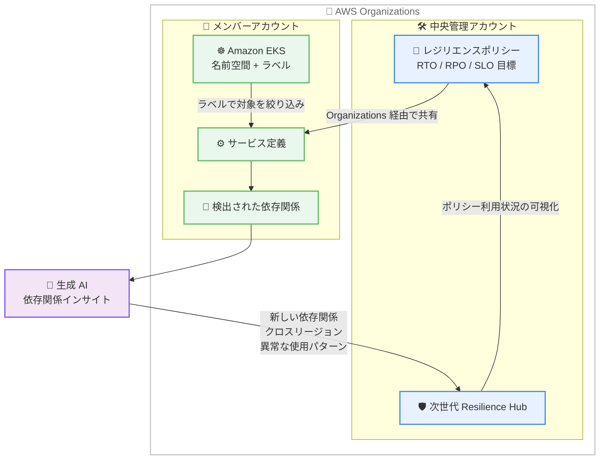

# AWS Resilience Hub - EKS ラベルサポート、依存関係インサイト、ポリシー共有の 3 つの新機能

**リリース日**: 2026 年 9 月 18 日
**サービス**: AWS Resilience Hub (次世代 Resilience Hub)
**機能**: EKS ラベルによるサービス入力ソース、依存関係インサイト、AWS Organizations によるレジリエンスポリシー共有

📊 [このアップデートのインフォグラフィックを見る](https://takech9203.github.io/aws-news-summary/20260918-resilience-hub-eks-dependency-policy.html)

## 概要

AWS Resilience Hub (次世代 Resilience Hub) に 3 つの新機能が追加されました。次世代 Resilience Hub は、プラットフォームエンジニアリングチームや SRE (サイトリライアビリティエンジニアリング) チームがワークロードのレジリエンス (回復力) を評価・改善するための中央管理サービスであり、依存関係の自動検出、生成 AI による障害モード分析、モジュール型のレジリエンスポリシー、レジリエンステスト、組織全体のレジリエンス状況レポートなどの機能を提供しています。

今回のアップデートでは、(1) EKS ラベルをサービス入力ソースとして使用する機能、(2) 生成 AI が検出済みの依存関係を分析する「依存関係インサイト」、(3) AWS Organizations を通じたレジリエンスポリシーの共有、という 3 つの機能が追加されました。Kubernetes を活用する組織や、マルチアカウント環境でレジリエンス基準を統一したい組織にとって、評価の精度向上と運用の効率化につながるアップデートです。

**アップデート前の課題**

- EKS ワークロードの分析対象を、チームが既に使用している Kubernetes のラベル規約に基づいて絞り込むことができず、名前空間単位でしか制御できなかった
- 依存関係の自動検出で収集された情報は、リスクの特定やパターンの把握を人手で分析する必要があり、時間がかかっていた
- レジリエンスポリシーはアカウントごとに個別に作成する必要があり、マルチアカウント環境で一貫したレジリエンス基準を維持することが困難だった

**アップデート後の改善**

- EKS の名前空間内のラベルをサービス入力ソースとして指定でき、チームの既存のラベル運用に沿ってリソースの検出・分析対象を制御できるようになった
- 生成 AI が検出済みの依存関係を分析し、新しい依存関係、クロスリージョンの依存関係、通常と異なる使用パターンなどを自動的にハイライトするようになった
- 中央のチームが作成したレジリエンスポリシーを AWS Organizations の複数アカウントに共有し、ポリシーの利用状況を組織全体で可視化できるようになった

## アーキテクチャ図



中央管理アカウントで作成したレジリエンスポリシーを Organizations 経由でメンバーアカウントに共有し、EKS ラベルで絞り込んだリソースの依存関係を生成 AI が分析する流れを示しています。

## サービスアップデートの詳細

### 主要機能

1. **EKS ラベルによるサービス入力ソース**
   - EKS の名前空間内のラベルをサービス入力ソースとして使用可能
   - チームが既に運用している Kubernetes のラベル付け規約をそのまま活用し、検出・分析対象のリソースを制御できる
   - チームの EKS ワークロードの整理方法とレジリエンス評価の対象を整合させることができる

2. **依存関係インサイト**
   - 依存関係の自動検出 (dependency discovery) を有効にしている場合に利用できる生成 AI 機能
   - 検出されたアプリケーションの依存関係を分析し、意味のあるパターンをハイライト
   - 新しい依存関係の出現、クロスリージョンの依存関係、通常と異なる使用状況などを自動的に検出
   - API レベルでは、インサイトのカテゴリとして CROSS_REGION、NEW_DEPENDENCY、THIRD_PARTY、UNEVEN_USAGE、AWS_SERVICE が定義されている

3. **AWS Organizations によるレジリエンスポリシー共有**
   - 中央のチームが作成したレジリエンスポリシー (RTO、RPO、可用性 SLO などの目標値を定義) を組織内の複数アカウントに共有可能
   - ポリシーの利用状況を組織全体で可視化し、採用状況の追跡と一貫したレジリエンス基準の維持が可能
   - ポリシーのアタッチ、デタッチ、共有取り消し、削除などのイベント履歴を追跡できる

## 技術仕様

### 依存関係インサイトのカテゴリ

| カテゴリ | 説明 |
|------|------|
| NEW_DEPENDENCY | 新しく出現した依存関係 |
| CROSS_REGION | リージョンをまたぐ依存関係 |
| THIRD_PARTY | サードパーティサービスへの依存 |
| UNEVEN_USAGE | 通常と異なる、偏った使用パターン |
| AWS_SERVICE | AWS サービスへの依存 |

### API変更履歴

| 日付 | サービス | 変更内容 |
|------|----------|----------|
| 2026/09/16 | [AWS Resilience Hub V2](https://awsapichanges.com/archive/changes/9da991-resiliencehub.html) | 3 new 6 updated api methods - 依存関係インサイトと組織レベルのポリシー共有のサポート |

**主な新規 API:**

- `StartDependencyInsights`: 指定したサービスの依存関係インサイト生成を開始
- `GetDependencyInsights`: 生成されたインサイト (概要とカテゴリ別の分析結果) を取得
- `ListPolicyEvents`: ポリシーのアタッチ / デタッチ / 共有取り消し / 削除などのイベント履歴を取得

**主な更新 API:**

- `CreatePolicy` / `UpdatePolicy`: `sharingEnabled` パラメータが追加され、ポリシーの組織内共有を制御可能に
- `GetPolicy` / `ListPolicies` / `ImportPolicy`: レスポンスに `organizationId` と `sharingEnabled` が追加
- `ListPolicies`: `accountId` パラメータでアカウント別のポリシー一覧取得が可能に

### API 使用例

```python
# 依存関係インサイトの生成を開始
response = client.start_dependency_insights(
    serviceArn='arn:aws:resiliencehub:...:service/...'
)

# インサイトを取得
insights = client.get_dependency_insights(
    serviceArn='arn:aws:resiliencehub:...:service/...'
)
# insights['insights'] に CROSS_REGION や NEW_DEPENDENCY などの
# カテゴリ別の分析結果が含まれる

# 組織内共有を有効にしたポリシーを作成
policy = client.create_policy(
    name='corporate-standard-policy',
    availabilitySlo={'target': 99.9},
    multiAz={
        'rtoInMinutes': 60,
        'rpoInMinutes': 15,
        'disasterRecoveryApproach': 'WARM_STANDBY'
    },
    sharingEnabled=True
)
```

## 設定方法

### 前提条件

1. 次世代 Resilience Hub をセットアップ済みであること
2. 依存関係インサイトを使用する場合は、依存関係の自動検出 (dependency discovery) を有効にしていること
3. ポリシー共有を使用する場合は、AWS Organizations が設定済みであること
4. EKS ラベルを使用する場合は、対象の EKS クラスターと名前空間にラベル運用が整備されていること

### 手順

#### ステップ1: EKS ラベルをサービス入力ソースに設定

Resilience Hub コンソール (https://console.aws.amazon.com/resiliencehub/v2/home) でサービスの入力ソースとして EKS の名前空間とラベルを指定します。既存の Kubernetes ラベル規約に基づいて、検出・分析対象のリソースを絞り込みます。

#### ステップ2: 依存関係インサイトの実行

```bash
# 依存関係インサイトの生成を開始
aws resiliencehub start-dependency-insights \
  --service-arn <サービスの ARN>

# 生成されたインサイトを取得
aws resiliencehub get-dependency-insights \
  --service-arn <サービスの ARN>
```

依存関係の自動検出で収集されたデータをもとに、生成 AI がインサイトを生成します。ステータスが COMPLETED になると、概要とカテゴリ別の分析結果を確認できます。

#### ステップ3: レジリエンスポリシーの組織内共有

```bash
# 共有を有効にしたポリシーを作成
aws resiliencehub create-policy \
  --name corporate-standard-policy \
  --availability-slo target=99.9 \
  --sharing-enabled
```

中央管理アカウントで `sharingEnabled` を有効にしてポリシーを作成すると、AWS Organizations のメンバーアカウントにポリシーが共有されます。各アカウントのサービスに共有されたポリシーをアタッチし、利用状況を組織全体で追跡します。

## メリット

### ビジネス面

- **組織全体のガバナンス強化**: 中央チームが定義したレジリエンス基準 (RTO / RPO / SLO) を全アカウントに展開し、一貫したレジリエンス体制を維持できる
- **リスク特定の迅速化**: 生成 AI による依存関係分析により、人手では見落としがちなリスクパターンを早期に発見できる
- **採用状況の可視化**: ポリシーの利用状況を組織全体で追跡でき、レジリエンス施策の浸透度を定量的に把握できる

### 技術面

- **既存の運用との整合性**: Kubernetes のラベル規約をそのまま活用でき、EKS ワークロードの整理方法と評価対象を一致させられる
- **分析の自動化**: クロスリージョン依存や新規依存関係の出現を自動検出し、手動での依存関係レビューの負荷を軽減できる
- **監査性の向上**: ListPolicyEvents や ListServiceEvents により、ポリシーの適用・変更履歴をイベントとして追跡できる

## デメリット・制約事項

### 制限事項

- 依存関係インサイトは、依存関係の自動検出を有効にしている場合のみ利用可能
- 依存関係インサイトは、データが不十分な場合 (INSUFFICIENT_DATA) や生成 AI の処理失敗 (LLM_GENERATION_FAILED) でエラーになる可能性がある
- ポリシー共有は AWS Organizations の利用が前提となる

### 考慮すべき点

- 生成 AI によるインサイトは分析の補助であり、最終的なリスク判断はチームによるレビューと組み合わせることが望ましい
- 共有ポリシーの削除や共有取り消しは、メンバーアカウントでポリシーを利用中のサービスに影響するため、イベント履歴 (POLICY_SHARING_REVOKED、POLICY_DELETED) を監視する運用が必要
- EKS ラベルによる絞り込みを行う場合、ラベル運用が不統一だと評価対象の漏れが発生する可能性がある

## ユースケース

### ユースケース1: EKS 上のマイクロサービスをチーム単位で評価

**シナリオ**: 1 つの EKS クラスター上で複数チームがマイクロサービスを運用しており、チームごとにレジリエンス評価を行いたい。

**実装例**:
```
1. 各チームのワークロードに team=payment などのラベルを付与
2. Resilience Hub のサービス入力ソースとして名前空間 + ラベルを指定
3. チーム単位で評価対象を絞り込んでアセスメントを実行
```

**効果**: 名前空間全体ではなくチームの担当範囲に限定した評価が可能になり、評価結果とチームの責任範囲が一致する。

### ユースケース2: 生成 AI による依存関係リスクの早期発見

**シナリオ**: マイクロサービス間の依存関係が頻繁に変化しており、意図しないクロスリージョン依存や新規依存の混入を早期に検出したい。

**実装例**:
```
1. 依存関係の自動検出を有効化
2. StartDependencyInsights を定期的に実行
3. CROSS_REGION / NEW_DEPENDENCY カテゴリのインサイトを確認し、
   意図しない依存関係をレビュー
```

**効果**: リージョン障害時に影響を受けるクロスリージョン依存や、レビューを経ていない新規依存を自動的に把握でき、障害リスクを事前に低減できる。

### ユースケース3: マルチアカウント環境でのレジリエンス基準の統一

**シナリオ**: 数十のアカウントを持つ組織で、全社共通の RTO / RPO 目標を各アカウントのワークロードに適用したい。

**実装例**:
```
1. 中央管理アカウントで sharingEnabled=True のポリシーを作成
2. AWS Organizations 経由でメンバーアカウントに共有
3. 各アカウントのサービスに共有ポリシーをアタッチ
4. 組織全体でポリシー利用状況をモニタリング
```

**効果**: アカウントごとのポリシー重複作成が不要になり、全社共通のレジリエンス基準を一元管理しながら採用状況を追跡できる。

## 料金

What's New の発表には今回の新機能に関する追加料金の記載はありません。最新の料金情報は [AWS Resilience Hub 料金ページ](https://aws.amazon.com/resilience-hub/pricing/) を確認してください。

## 利用可能リージョン

以下の 15 リージョンで利用可能です。

- 米国東部 (バージニア北部)
- 米国東部 (オハイオ)
- 米国西部 (オレゴン)
- カナダ (中部)
- 欧州 (アイルランド)
- 欧州 (ロンドン)
- 欧州 (フランクフルト)
- 欧州 (パリ)
- 欧州 (ストックホルム)
- アジアパシフィック (ムンバイ)
- アジアパシフィック (シンガポール)
- アジアパシフィック (シドニー)
- **アジアパシフィック (東京)**
- アジアパシフィック (ソウル)
- 南米 (サンパウロ)

## 関連サービス・機能

- **Amazon EKS**: 名前空間とラベルをサービス入力ソースとして使用し、Kubernetes ワークロードの評価対象を制御
- **AWS Organizations**: レジリエンスポリシーのマルチアカウント共有と組織全体での利用状況の可視化に使用
- **AWS Fault Injection Service**: Resilience Hub のレジリエンステストと組み合わせて、評価結果の実効性を検証

## 参考リンク

- 📊 [インフォグラフィック](https://takech9203.github.io/aws-news-summary/20260918-resilience-hub-eks-dependency-policy.html)
- [公式発表 (What's New)](https://aws.amazon.com/about-aws/whats-new/2026/09/resilience-hub-eks-dependency-policy/)
- [ドキュメント (Next generation Resilience Hub)](https://docs.aws.amazon.com/resilience-hub/latest/userguide/next-gen.html)
- [AWS Resilience Hub 製品ページ](https://aws.amazon.com/resilience-hub/)
- [API 変更履歴 (awsapichanges.com)](https://awsapichanges.com/archive/changes/9da991-resiliencehub.html)

## まとめ

次世代 Resilience Hub に、EKS ラベルによる評価対象の制御、生成 AI による依存関係インサイト、AWS Organizations でのポリシー共有という 3 つの機能が追加され、Kubernetes 環境やマルチアカウント環境でのレジリエンス管理が大きく強化されました。EKS を活用している組織や、複数アカウントでレジリエンス基準の統一に課題を持つ組織は、コンソールから新機能の利用を検討することを推奨します。
