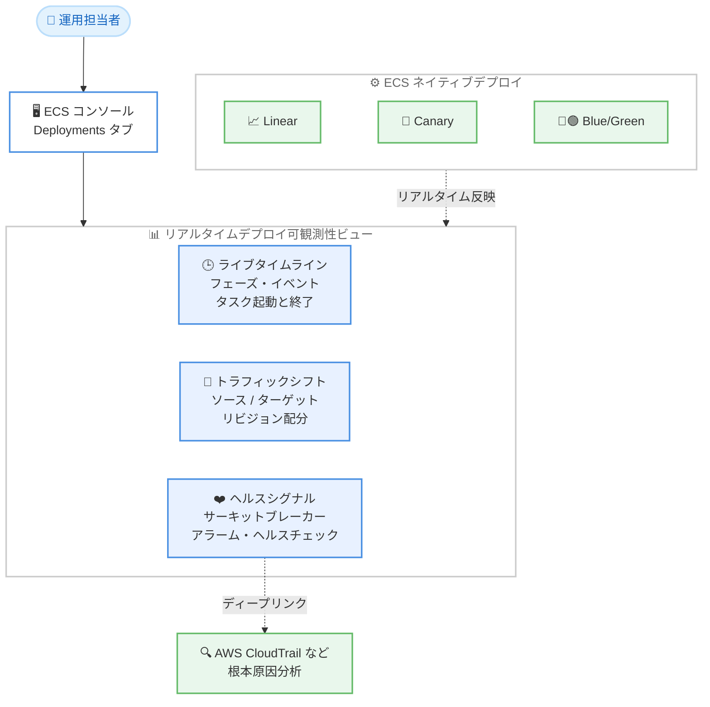

# Amazon ECS - AWS Management Console でのリアルタイムデプロイ可観測性

**リリース日**: 2026 年 9 月 21 日
**サービス**: Amazon Elastic Container Service (Amazon ECS)
**機能**: AWS Management Console におけるリアルタイムデプロイ可観測性

📊 [このアップデートのインフォグラフィックを見る](https://takech9203.github.io/aws-news-summary/20260921-amazon-ecs-console-deployment-observability.html)

## 概要

Amazon ECS は、ECS ネイティブの Linear、Canary、Blue/Green デプロイ戦略を対象に、AWS Management Console 上でサービスデプロイのリアルタイム可観測性を提供開始しました。ECS コンソールのサービス画面にある [Deployments] タブから、デプロイの進行状況、ヘルス状態、障害の診断情報を 1 か所で確認できます。

これまでデプロイの状況把握には、サービスイベント、CloudWatch アラーム、ロードバランサーのヘルスチェック、CloudTrail など複数のツールを行き来する必要がありました。今回のアップデートにより、デプロイのタイムライン、トラフィックシフトの状況、各種ヘルスシグナルが単一のビューに統合され、ツールを切り替えることなくデプロイの監視とトラブルシューティングが可能になります。

追加料金なしで利用でき、すべての AWS 商用リージョンおよび AWS GovCloud (US) リージョンで利用可能です。デプロイの信頼性向上と運用負荷の軽減を求める、コンテナワークロードを運用するすべてのチームにとって有用なアップデートです。

**アップデート前の課題**

- デプロイの進行状況を把握するには、サービスイベント、タスクの状態、CloudWatch アラームなど複数の画面やツールを個別に確認する必要があった
- Blue/Green や Canary デプロイにおいて、現在どのライフサイクルステージにあるか (Green タスクのスケールアップ中、ライフサイクルフック待機中、ベイクタイム中など) をコンソールから直感的に把握しにくかった
- デプロイ失敗時の原因調査に、失敗したタスクの特定や関連ログの収集など手動での切り分け作業が必要だった

**アップデート後の改善**

- デプロイの各フェーズ、サービスイベント、タスクの起動・終了の進行状況を語るライブデプロイタイムラインにより、常に最新のデプロイ状態を 1 画面で確認できるようになった
- ソースリビジョンとターゲットリビジョン間のトラフィック配分と、現在のライフサイクルステージがリアルタイムに可視化されるようになった
- サーキットブレーカーの状態 (タスク失敗数としきい値のライブ追跡)、デプロイアラームの状態、コンテナおよびロードバランサーのヘルスチェック、ライフサイクルフックの状態がタイムラインと並べて表示されるようになった
- 失敗したタスクが診断コンテキストとともにタイムライン上に表示され、AWS CloudTrail などへのディープリンクから根本原因分析に直接進めるようになった

## アーキテクチャ図



ECS ネイティブの Linear、Canary、Blue/Green デプロイの進行状況が、コンソールの [Deployments] タブ上でタイムライン・トラフィックシフト・ヘルスシグナルとして統合表示され、障害時は CloudTrail などへのディープリンクから調査に進める構成です。

## サービスアップデートの詳細

### 主要機能

1. **ライブデプロイタイムライン**
   - デプロイの各フェーズをリアルタイムに追跡し、進行を時系列で表示
   - サービスイベント、タスクの起動および終了の進行状況を統合表示
   - 常に現在のデプロイ状態を反映し、手動リフレッシュに依存しない状況把握が可能

2. **トラフィックシフトの可視化**
   - ソースリビジョンとターゲットリビジョン間のトラフィック配分を表示
   - 現在のライフサイクルステージを明示 (Green タスクのスケールアップ中、ライフサイクルフックの待機中、ベイクタイム中など)
   - Linear / Canary デプロイでの段階的なトラフィック移行の進捗を直感的に確認可能

3. **ヘルスシグナルの統合表示**
   - デプロイサーキットブレーカーの状態を、タスク失敗数としきい値のライブ追跡とともに表示
   - デプロイアラーム (CloudWatch アラーム) の状態を表示
   - コンテナヘルスチェックとロードバランサーヘルスチェックの結果を表示
   - ライフサイクルフックの実行状態を表示

4. **障害診断とディープリンク**
   - 失敗したタスクが診断コンテキストとともにタイムライン上に直接表示
   - AWS CloudTrail などの関連サービスへのディープリンクにより、根本原因分析へ即座に移行可能

## 技術仕様

### 対象デプロイ戦略

| 項目 | 詳細 |
|------|------|
| 対象デプロイ戦略 | ECS ネイティブの Linear、Canary、Blue/Green |
| 表示場所 | ECS コンソールの各サービスの [Deployments] タブ |
| 表示内容 | デプロイタイムライン、トラフィックシフト、ライフサイクルステージ、ヘルスシグナル、失敗タスクの診断情報 |
| 連携するヘルスシグナル | サーキットブレーカー、デプロイアラーム、コンテナヘルスチェック、ロードバランサーヘルスチェック、ライフサイクルフック |
| 外部連携 | AWS CloudTrail などへのディープリンク |
| 追加料金 | なし |

## 設定方法

### 前提条件

1. Amazon ECS サービスが作成済みであること
2. サービスのデプロイ戦略として ECS ネイティブの Linear、Canary、または Blue/Green を使用していること
3. ECS コンソールへのアクセス権限を持つ IAM ユーザーまたはロールでサインインしていること

### 手順

#### ステップ1: ECS コンソールでサービスを開く

[Amazon ECS コンソール](https://console.aws.amazon.com/ecs) にアクセスし、対象のクラスターから確認したいサービスを選択します。

#### ステップ2: Deployments タブを確認する

サービスの詳細画面で [Deployments] タブを選択します。進行中または過去のデプロイについて、ライブタイムライン、トラフィックシフトの配分、ヘルスシグナルが表示されます。

#### ステップ3: 障害発生時の調査

デプロイ中にタスクの失敗が発生した場合、タイムライン上に失敗したタスクと診断コンテキストが表示されます。表示されるディープリンクから AWS CloudTrail などの関連サービスに移動し、根本原因分析を行います。

## メリット

### ビジネス面

- **運用効率の向上**: 複数ツールの行き来が不要になり、デプロイ監視にかかる時間と工数を削減できる
- **リリース速度の向上**: デプロイ状況の即時把握により、問題の早期発見とロールバック判断が迅速化し、リリースサイクルの信頼性が向上する
- **追加コストなし**: 追加料金なしで利用でき、既存の ECS 利用者がすぐに恩恵を受けられる

### 技術面

- **統合された可観測性**: タイムライン、トラフィックシフト、ヘルスシグナルが単一ビューに集約され、デプロイの全体像を把握しやすい
- **高度なデプロイ戦略の運用性向上**: Linear、Canary、Blue/Green といった段階的デプロイのライフサイクルステージが明確に可視化され、安全なデプロイ運用を支援する
- **トラブルシューティングの迅速化**: 失敗タスクの診断コンテキストと CloudTrail などへのディープリンクにより、根本原因分析までの導線が短縮される

## デメリット・制約事項

### 制限事項

- 対象は ECS ネイティブの Linear、Canary、Blue/Green デプロイ戦略であり、これら以外のデプロイ方式は今回の発表の対象として明記されていない
- 本機能は AWS Management Console 上での可視化機能であり、API や CLI からの同等の統合ビュー提供については発表に記載がない

### 考慮すべき点

- サーキットブレーカーやデプロイアラームなどのヘルスシグナルを活用するには、それぞれの機能をサービス側で有効化・設定しておく必要がある
- コンソールを利用しない自動化中心の運用では、引き続き CloudWatch や EventBridge などによる監視の仕組みが必要となる

## ユースケース

### ユースケース1: Blue/Green デプロイの進行監視

**シナリオ**: 本番環境の Web アプリケーションを Blue/Green デプロイで更新し、Green 環境の起動からトラフィック切り替えまでを安全に見届けたい。

**実装例**:
```
1. ECS サービスのデプロイ戦略に Blue/Green を設定
2. デプロイ実行後、ECS コンソールの Deployments タブを開く
3. Green タスクのスケールアップ、ライフサイクルフックの待機、
   ベイクタイムの各ステージをタイムラインで確認
4. トラフィックシフトの配分がターゲットリビジョンへ移行する様子を監視
```

**効果**: 現在のライフサイクルステージが明示されるため、切り替えの進捗や待機理由を推測する必要がなくなり、安心してデプロイを見届けられる。

### ユースケース2: Canary デプロイでの早期異常検知

**シナリオ**: 新バージョンをまず少量のトラフィックで検証する Canary デプロイにおいて、異常があれば即座に検知して展開を止めたい。

**実装例**:
```
1. Canary デプロイ戦略とデプロイサーキットブレーカー、
   CloudWatch デプロイアラームを設定
2. Deployments タブでタスク失敗数としきい値のライブ追跡を監視
3. コンテナおよびロードバランサーのヘルスチェック結果を
   タイムラインと並べて確認
```

**効果**: サーキットブレーカーの発動状況やアラームの状態がリアルタイムに可視化され、異常時の展開停止・ロールバック判断を迅速に行える。

### ユースケース3: デプロイ失敗時の根本原因分析

**シナリオ**: デプロイ中にタスクが繰り返し起動に失敗しており、原因を素早く特定して修正したい。

**実装例**:
```
1. Deployments タブのタイムラインで失敗したタスクを特定
2. 表示された診断コンテキストで失敗理由の概要を確認
3. ディープリンクから AWS CloudTrail などに移動し、
   関連する API 呼び出しやイベントを調査
```

**効果**: 失敗タスクの特定から関連サービスでの調査までの導線が 1 つの画面から完結し、平均復旧時間 (MTTR) の短縮につながる。

## 料金

本機能は追加料金なしで利用できます。Amazon ECS 自体の料金は、起動タイプ (AWS Fargate、Amazon EC2 など) に応じた既存の料金体系に従います。

## 利用可能リージョン

すべての AWS 商用リージョンおよび AWS GovCloud (US) リージョンで利用可能です。

## 関連サービス・機能

- **Amazon ECS デプロイサーキットブレーカー**: デプロイ失敗を自動検知してロールバックする機能。本アップデートにより、失敗数としきい値の状態がコンソールでライブ追跡できる
- **Amazon CloudWatch アラーム**: デプロイアラームとして設定することで、メトリクス異常時のロールバック判断に利用でき、その状態が本ビューに統合表示される
- **Elastic Load Balancing**: ロードバランサーのヘルスチェック結果がタイムラインと並べて表示され、トラフィックシフトの安全性確認に役立つ
- **AWS CloudTrail**: 失敗タスクからのディープリンク先として、API 呼び出し履歴に基づく根本原因分析に利用できる

## 参考リンク

- 📊 [インフォグラフィック](https://takech9203.github.io/aws-news-summary/20260921-amazon-ecs-console-deployment-observability.html)
- [公式発表 (What's New)](https://aws.amazon.com/about-aws/whats-new/2026/09/amazon-ecs-console-deployment-observability/)
- [Amazon ECS 製品ページ](https://aws.amazon.com/ecs/)
- [ドキュメント: Amazon ECS デプロイタイプ](https://docs.aws.amazon.com/AmazonECS/latest/developerguide/deployment-types.html)
- [Amazon ECS コンソール](https://console.aws.amazon.com/ecs)

## まとめ

Amazon ECS のネイティブ Linear、Canary、Blue/Green デプロイに対して、コンソール上でリアルタイムの可観測性が提供され、デプロイの監視からトラブルシューティングまでが 1 画面で完結するようになりました。追加料金なしで全商用リージョンおよび GovCloud (US) リージョンで利用できるため、これらのデプロイ戦略を利用しているチームは、まず ECS コンソールの [Deployments] タブで新しいビューを確認することを推奨します。
