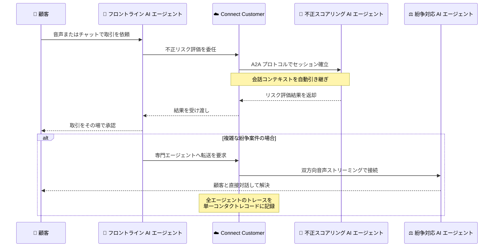

# Amazon Connect Customer - エージェント間コラボレーション

**リリース日**: 2026 年 9 月 22 日
**サービス**: Amazon Connect Customer
**機能**: Agent-to-Agent (A2A) コラボレーション

📊 [このアップデートのインフォグラフィックを見る](https://takech9203.github.io/aws-news-summary/20260922-Amazon-Connect-Customer-A2A.html)

## 概要

Amazon Connect Customer が、エージェント間 (agent-to-agent) コラボレーションのサポートを発表しました。ライブの顧客対応中に、フロントラインの AI エージェントが専門特化した AI エージェントを呼び出し、顧客リクエストをその場で解決できるようになります。コラボレーション先は、同一の Connect Customer インスタンス内の AI エージェント、Amazon Bedrock AgentCore 上でホストされるエージェント、およびサードパーティ製の外部 AI エージェントで、通信にはオープン標準の A2A プロトコルを使用し、テキストまたは双方向音声で連携できます。

たとえば銀行のコンタクトセンターでは、通話対応中のフロントライン AI エージェントが不正リスク評価を専門のスコアリング AI エージェントに委任し、その結果を使って取引をその場で承認できます。さらに複雑な紛争案件は、別の専門 AI エージェントに転送して顧客と直接対話させることも可能です。AWS は Linux Foundation の A2A Technical Steering Committee と協力し、顧客エンゲージメントに必要な音声ストリーミングとインタラクションレベルのセッション継続性を A2A プロトコルに拡張しました。

Connect Customer はエージェント間のコンテキスト引き継ぎを自動的に管理し、一貫した顧客体験を維持します。また、セッション内のすべてのエージェントを横断する統合されたオブザーバビリティ、ガードレール、エスカレーション制御を提供し、各エージェントの発話内容、呼び出したツール、各ステップの所要時間を単一のコンタクトレコードとして記録します。

**アップデート前の課題**

このアップデート以前には、以下のような課題がありました。

- 1 つの AI エージェントにすべての業務知識とツールを詰め込む必要があり、プロンプトが肥大化して応答品質の管理が困難だった
- Connect Customer の AI エージェントから外部ベンダーや自社開発の AI エージェントを呼び出す標準的な方法がなく、カスタム統合の開発が必要だった
- 複数のエージェントをまたぐ対応では会話コンテキストの引き継ぎを独自に実装する必要があり、顧客体験が分断されがちだった
- 複数エージェントにまたがる対応履歴を統合的に追跡・分析する仕組みがなかった

**アップデート後の改善**

今回のアップデートにより、以下が可能になりました。

- ライブの顧客対応中に、専門特化した AI エージェントへタスクを委任、または顧客との対話ごと転送できるようになった
- オープンな A2A プロトコル経由で、Connect Customer 外部のサードパーティ AI エージェントともテキストまたは双方向音声で連携できるようになった
- Connect Customer がコンテキスト引き継ぎ、セッション管理、フォールバックを自動処理し、カスタム統合の開発が不要になった
- 全エージェントの発話・ツール呼び出し・所要時間が単一のコンタクトレコードに記録され、分析と AI 品質管理に活用できるようになった

## アーキテクチャ図



銀行のユースケースを例にした A2A コラボレーションのフローです。フロントライン AI エージェントが顧客との会話を維持したままバックグラウンドで専門エージェントに処理を委任するパターンと、専門エージェントが顧客と直接対話するパターンの 2 種類を示しています。

## サービスアップデートの詳細

### 主要機能

1. **タスク委任 (Handle actions)**
   - フロントラインの Connect AI エージェントが顧客との会話を維持したまま、コラボレーターにバックグラウンドで作業を依頼
   - コラボレーターはテキストでリクエストを受け取り、注文の照会、クレームの登録、リスク計算などを実行して結果を返却
   - 顧客はコラボレーターと直接やり取りせず、シームレスな体験を維持

2. **顧客との直接対話 (Talk to the customer)**
   - コラボレーターが顧客と直接会話し、完了後にフロントラインの Connect AI エージェントへ制御を返却
   - 音声コンタクトでは 2 つの連携方式を選択可能
     - **テキストストリーミング**: Connect Customer が音声とテキストの変換を担当。コラボレーター側に音声インフラは不要
     - **音声ストリーミング**: 顧客の音声をコラボレーターのエンドポイントへ直接パススルーする双方向オーディオストリーミング。コラボレーターは独自の AI 音声を使用

3. **A2A プロトコルの拡張**
   - A2A は Google が開発し、現在は Linux Foundation が管理するオープン標準
   - AWS は A2A Technical Steering Committee と協力し、音声ストリーミング、コンタクトレベルのセッション継続性、組み込みオブザーバビリティを Connect A2A 拡張として追加

4. **マネージドなコラボレーション基盤**
   - **呼び出し**: AI エージェントの指示に基づき、Connect Customer が A2A セッションを自動確立
   - **コンテキスト**: 会話コンテキストをコラボレーターへ自動的に引き継ぎ
   - **オブザーバビリティ**: すべてのコラボレーションからトレースデータを収集。外部エージェントにはトレースデータの送信が必須で、送信されない場合はそのエンドポイントが新規コンタクトに対して無効化される
   - **フォールバック**: コラボレーターが応答しない、またはエラーを返した場合、設定済みのフォールバックパスに従ってコンタクトをルーティング

## 技術仕様

### コラボレーション方式の比較

| 項目 | テキスト | テキストストリーミング音声 | 双方向音声ストリーミング |
|------|---------|--------------------------|------------------------|
| 対象チャネル | チャット | 音声 | 音声 |
| 音声変換 | 不要 | Connect Customer が STT/TTS を担当 | コラボレーター側で処理 |
| コラボレーター側の音声インフラ | 不要 | 不要 | 必要 (WebSocket 接続を受け付けるエンドポイント) |
| 使用する音声 | - | Connect Agentic voices | コラボレーター独自の AI 音声 |

### 設定方式と主な制約

| 項目 | 詳細 |
|------|------|
| 設定方法 | Connect Customer API (QConnect) のみ。コンソール UI は未提供 |
| 必要な API | `CreateAIAgent`、`UpdateAIAgent`、`CreateAIAgentVersion` |
| 必要なティア | Connect Customer ティア (Customer Basic では利用不可) |
| 同時コラボレーション | 1 ターンにアクティブなコラボレーターは 1 つのみ (同一コンタクト内で複数のコラボレーターを順次使用することは可能) |
| 音声コンタクトの前提 | AMAZON.QInConnectIntent を設定した Lex V2 ボットが必要 |
| プロトコル要件 | コラボレーターは Connect A2A 拡張を含む A2A プロトコルのサポートが必要 |

### API 変更履歴

| 日付 | サービス | 変更内容 |
|------|----------|----------|
| 2026/09/18 | [Amazon Q Connect](https://awsapichanges.com/archive/changes/cfdf90-wisdom.html) | 10 updated api methods - AI エージェントのマルチエージェントオーケストレーションと、オーケストレーションエージェント向けの構造化 JSON 入出力メッセージングをサポート |
| 2026/09/18 | [Amazon Connect Service](https://awsapichanges.com/archive/changes/cfdf90-connect.html) | 1 new 2 updated api methods - `ListSecurityProfileAIAgents` API の追加。`CreateSecurityProfile` / `UpdateSecurityProfile` に `AllowedAIAgents` フィールドが追加され、A2A インタラクションに関連付けるサードパーティ AI エージェントをセキュリティプロファイルで管理可能に |

## 設定方法

### 前提条件

1. Connect Customer ティアの Amazon Connect インスタンス (Customer Basic は対象外)
2. コラボレーション先の AI エージェントが Connect A2A 拡張を含む A2A プロトコルをサポートしていること
3. 外部エージェントの場合、トレースデータを Connect Customer へ送信する実装があること
4. 音声コンタクトの場合、AMAZON.QInConnectIntent を設定した Lex V2 ボット

### 手順

本機能は API 専用であり、コンソールからは設定できません。以下は設定の流れの概要です。

#### ステップ 1: AI エージェントにコラボレーターを追加

```bash
# 既存の Connect AI エージェントの設定にコラボレーターを追加
aws qconnect update-ai-agent \
  --assistant-id <assistant-id> \
  --ai-agent-id <ai-agent-id> \
  --type ORCHESTRATION \
  --configuration '{ ... コラボレーター定義を含む設定 ... }'
```

`UpdateAIAgent` API でフロントライン AI エージェントの設定にコラボレーターを追加します。新規に作成する場合は `CreateAIAgent` を使用します。同一インスタンス内のエージェント、Amazon Bedrock AgentCore 上のエージェント、外部エージェントのいずれかをコラボレーターとして指定できます。設定の詳細は公式ドキュメントの「Set up collaboration with another Connect Customer AI agent」および「Set up collaboration with an external AI agent」を参照してください。

#### ステップ 2: AI エージェントのバージョンを発行

```bash
# デプロイ可能なバージョンを作成
aws qconnect create-ai-agent-version \
  --assistant-id <assistant-id> \
  --ai-agent-id <ai-agent-id>
```

`CreateAIAgentVersion` API でデプロイ可能なバージョンを発行します。発行したバージョンをコンタクトフローに関連付けることで、本番のコンタクトで A2A コラボレーションが有効になります。

#### ステップ 3: 音声設定とフォールバックの構成

音声コンタクトで利用する場合、テキストストリーミング (Connect Agentic voices による STT/TTS) または双方向音声ストリーミングのいずれかを選択します。双方向音声ストリーミングでは、コラボレーター側が WebSocket 接続を受け付ける音声エンドポイントをホストする必要があります。また、コラボレーターの応答失敗に備えたフォールバックパスを構成します。

#### ステップ 4: サードパーティ AI エージェントのアクセス管理

```bash
# セキュリティプロファイルで許可する AI エージェントを確認
aws connect list-security-profile-ai-agents \
  --instance-id <instance-id> \
  --security-profile-id <security-profile-id>
```

2026 年 9 月 18 日の API 更新で追加された `AllowedAIAgents` フィールドを使用し、セキュリティプロファイルに関連付けるサードパーティ AI エージェントを管理できます。

## メリット

### ビジネス面

- **一次解決率の向上**: 専門エージェントへの委任・転送により、人間のオペレーターへエスカレーションせずに複雑なリクエストをその場で解決可能
- **既存 AI 資産の活用**: 自社開発やベンダー提供の AI エージェントをオープン標準経由で再利用でき、コンタクトセンター向けの再開発が不要
- **一貫した顧客体験**: コンテキストが自動的に引き継がれるため、顧客が同じ情報を繰り返し説明する必要がない

### 技術面

- **オープン標準の採用**: Linux Foundation 管理の A2A プロトコルに準拠しており、特定ベンダーへのロックインを回避
- **マネージドな連携基盤**: セッション確立、コンテキスト受け渡し、音声変換、フォールバックを Connect Customer が管理し、統合コードの実装・運用負荷を削減
- **統合オブザーバビリティ**: 外部エージェントを含む全コラボレーションのトレースが単一コンタクトレコードに集約され、分析と AI 品質管理に活用可能

## デメリット・制約事項

### 制限事項

- API 専用機能であり、コンソール UI からは設定できない (QConnect API の `CreateAIAgent` / `UpdateAIAgent` / `CreateAIAgentVersion` を使用)
- Connect Customer ティアが必須で、Customer Basic では利用不可
- 1 ターンにアクティブなコラボレーションセッションは 1 つのみ
- 双方向音声ストリーミング中のコラボレーターは、コンタクト途中で元の AI エージェントへ音声を戻せない (会話を完了するかエスカレーションする必要がある。テキストモードでの制御返却は可能)
- コラボレーターへ共有するコンタクト属性を選択できず、固定のコンテキストセットが自動的に渡される

### 考慮すべき点

- 外部エージェントはトレースデータの送信が必須で、送信されない場合はエンドポイントが新規コンタクトに対して無効化されるため、外部エージェント側の実装要件を事前に確認する必要がある
- AI エージェントあたりの最大コラボレーター数、コラボレーションのネスト深度、セッションあたりの最大ハンドオフ回数にサービスクォータが設定されている (最新値は Connect Customer のサービスクォータページを参照)
- 音声コンタクトでは Lex V2 ボットの設定が前提となるため、既存のフロー構成への影響を確認する必要がある

## ユースケース

### ユースケース 1: 銀行の不正リスク評価と取引承認

**シナリオ**: 顧客が電話で高額送金を依頼。フロントライン AI エージェントが対応中に、不正の可能性を専門的に評価する必要がある。

**実装例**:
```
1. フロントライン AI エージェントのコラボレーターとして
   不正スコアリング AI エージェントを登録 (タスク委任モード)
2. 送金依頼を検知すると、会話を維持したままスコアリング
   エージェントへ取引情報とコンテキストを委任
3. リスク評価結果を受け取り、低リスクなら取引をその場で承認
4. 複雑な紛争案件は紛争対応エージェントへ転送し、顧客と直接対話
```

**効果**: 顧客を待たせることなくリスク評価と取引承認が完結し、一次解決率と顧客満足度が向上する。

### ユースケース 2: サードパーティ AI エージェントとの音声連携

**シナリオ**: 保険会社が、外部ベンダーの提供する保険金請求専門の音声 AI エージェントを、Connect Customer のフロントライン対応に組み込みたい。

**実装例**:
```
1. 外部エージェント側で Connect A2A 拡張を含む A2A プロトコル
   と WebSocket 音声エンドポイントを実装
2. 双方向音声ストリーミングモードでコラボレーターとして登録
3. 保険金請求の話題を検知すると、顧客の音声を外部エージェント
   へ直接ストリーミングし、独自の AI 音声で対応
4. 外部エージェントはトレースデータを Connect Customer へ送信
```

**効果**: ベンダーの専門 AI 資産を再開発なしで活用しつつ、通話記録と品質管理は Connect Customer 側に一元化できる。

### ユースケース 3: 音声インフラを持たない社内エージェントの音声対応

**シナリオ**: 社内で開発したテキストベースの注文管理 AI エージェントを、音声チャネルの顧客対応にも活用したい。

**実装例**:
```
1. 注文管理エージェントをテキストストリーミングモードの
   コラボレーターとして登録
2. Connect Customer が顧客の音声をテキストに変換して送信し、
   応答テキストを Connect Agentic voices で音声合成
3. エージェント側は音声インフラを実装せず、テキスト処理のみ
```

**効果**: 音声インフラへの追加投資なしで、既存のテキストベースエージェントを音声チャネルへ展開できる。

## 料金

エージェント間コラボレーションは、コラボレーションモード (テキスト、単方向音声、双方向音声) ごとに課金されます。具体的な料金は以下の公式料金ページを参照してください。

- [Amazon Connect 料金ページ](https://aws.amazon.com/connect/pricing/)
- [Connect Customer 料金の付録](https://aws.amazon.com/products/connect/customer/pricing/appendix/)

## 利用可能リージョン

利用可能なリージョンについては、公式のリージョン可用性ページを参照してください。

- [Amazon Connect のリージョン可用性](https://docs.aws.amazon.com/connect/latest/adminguide/regions.html)

## 関連サービス・機能

- **Amazon Bedrock AgentCore**: AgentCore 上でホストする AI エージェントをコラボレーターとして呼び出し可能
- **Amazon Q in Connect (QConnect API)**: A2A コラボレーションの設定に使用する API。マルチエージェントオーケストレーションと構造化 JSON 入出力もサポート
- **Amazon Lex V2**: 音声コンタクトでの A2A コラボレーションに必要なボット基盤 (AMAZON.QInConnectIntent)
- **A2A プロトコル (Linux Foundation)**: エージェント間連携のオープン標準。AWS は音声ストリーミングとセッション継続性の拡張に貢献

## 参考リンク

- 📊 [インフォグラフィック](https://takech9203.github.io/aws-news-summary/20260922-Amazon-Connect-Customer-A2A.html)
- [公式発表 (What's New)](https://aws.amazon.com/about-aws/whats-new/2026/09/Amazon-Connect-Customer-A2A)
- [ドキュメント: Agent-to-agent collaboration](https://docs.aws.amazon.com/connect/latest/adminguide/a2a-collaboration.html)
- [ドキュメント: Quotas and limitations for agent-to-agent collaboration](https://docs.aws.amazon.com/connect/latest/adminguide/a2a-quotas.html)
- [Amazon Connect Customer 製品ページ](https://aws.amazon.com/products/connect/customer/)
- [料金ページ](https://aws.amazon.com/connect/pricing/)

## まとめ

Amazon Connect Customer の A2A コラボレーションにより、オープン標準の A2A プロトコルを介して社内外の専門 AI エージェントをライブの顧客対応に組み込めるようになり、マルチエージェント型コンタクトセンターの構築が現実的になりました。既に AI エージェント資産を持つ組織や、ベンダー製 AI エージェントとの連携を検討している組織は、まず QConnect API でのタスク委任モードから検証を開始し、音声ストリーミング連携やサービスクォータの制約を評価することを推奨します。
