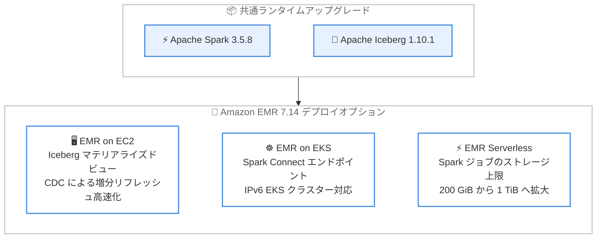

# Amazon EMR - EMR 7.14 リリース

**リリース日**: 2026 年 9 月 22 日
**サービス**: Amazon EMR
**機能**: Amazon EMR リリース 7.14 (EMR on EC2、EMR on EKS、EMR Serverless)

📊 [このアップデートのインフォグラフィックを見る](https://takech9203.github.io/aws-news-summary/20260922-amazon-emr-7-14-available.html)

## 概要

Amazon EMR 7.14 が利用可能になりました。本リリースは EMR on EC2、EMR on EKS、EMR Serverless の 3 つのデプロイオプションすべてにわたる新機能とアプリケーションのバージョンアップグレードを含みます。主要なアップグレードとして、Apache Spark 3.5.8 と Apache Iceberg 1.10.1 が含まれます。

機能面では、Apache Iceberg のマテリアライズドビューが変更データキャプチャ (CDC) を活用して変更のあったデータファイルのみを読み取るようになり、更新や削除を含むテーブルでのリフレッシュが高速化されました。EMR on EKS ではトークンベース認証によるインタラクティブ Spark セッション用の Spark Connect エンドポイントと、IPv6 の Amazon EKS クラスターがサポートされました。EMR Serverless では Spark ジョブのストレージ上限が 200 GiB から 1 TiB に拡大され、シャッフルデータ用の容量が大幅に増加しています。

大規模データ処理基盤を運用するデータエンジニアリングチームにとって、オープンテーブルフォーマット (Iceberg) の性能向上、インタラクティブ開発体験の改善、大規模ジョブの実行余力拡大という 3 つの観点でメリットがあるリリースです。

**アップデート前の課題**

- 更新・削除が頻繁に発生する Iceberg テーブル (Merge-on-Read) では、マテリアライズドビューのリフレッシュに時間がかかっていた
- EMR on EKS でインタラクティブな Spark セッションを利用する場合、Spark Connect エンドポイントによる接続手段がなかった
- EMR on EKS のワークロードは IPv6 の EKS クラスターで実行できなかった
- EMR Serverless の Spark ジョブはストレージ上限が 200 GiB であり、大規模なシャッフルデータを伴うジョブで制約となっていた

**アップデート後の改善**

- Iceberg マテリアライズドビューの増分リフレッシュが CDC により Merge-on-Read テーブルをサポートし、変更のあったデータファイルのみを読み取ることでリフレッシュが高速化された
- EMR on EKS で Spark Connect エンドポイントが利用可能になり、トークンベース認証でインタラクティブ Spark セッションに接続できるようになった
- EMR on EKS のワークロードを IPv6 の Amazon EKS クラスター上で実行できるようになった
- EMR Serverless の Spark ジョブのストレージ上限が 1 TiB に拡大され、より大規模なシャッフルデータを扱えるようになった

## アーキテクチャ図



EMR 7.14 では、共通ランタイムのアップグレード (Spark 3.5.8、Iceberg 1.10.1) に加えて、3 つのデプロイオプションそれぞれに固有の機能強化が提供されます。

## サービスアップデートの詳細

### 主要機能

1. **Iceberg マテリアライズドビューの増分リフレッシュ高速化**
   - 増分リフレッシュが変更データキャプチャ (CDC) を通じて Merge-on-Read テーブルをサポート
   - 更新や削除を使用するワークロードでの高速なリフレッシュが可能に
   - ファイル単位およびマニフェストレベルのカラム統計を使用し、変更の影響を受けたデータファイルのみを読み取り

2. **EMR on EKS: Spark Connect エンドポイントのサポート**
   - EMR on EKS クラスターで Spark Connect エンドポイントが利用可能に
   - トークンベース認証を使用したインタラクティブ Spark セッションを実現
   - ローカルの IDE やノートブックからリモートの Spark クラスターへ接続する開発スタイルをサポート

3. **EMR on EKS: IPv6 EKS クラスターのサポート**
   - EMR on EKS のワークロードを IPv6 の Amazon EKS クラスター上で実行可能に
   - IPv4 アドレス枯渇の課題を回避し、大規模なコンテナ環境でのスケーラビリティを向上

4. **EMR Serverless: Spark ジョブのストレージ上限拡大**
   - ワーカーあたりのストレージ上限が 200 GiB から 1 TiB に拡大
   - シャッフルデータ用の追加容量を提供し、大規模なジョインや集計を伴うジョブの実行が容易に

5. **その他の機能強化 (EMR 7.14.0 リリースノートより)**
   - **AWS Glue Table VersionId の Hive テーブルパラメータへの伝播**: AWS Glue を Hive メタストアとして使用する場合、使用中の Glue テーブル定義のバージョンを追跡可能に
   - **きめ細かなアクセス制御での Ion DataSource テーブル**: Fine-grained Table Access (FTA) モードが有効な EMR クラスターで Ion DataSource テーブルを作成可能に
   - **Hadoop / HDFS なしの Trino クラスター起動**: Trino のみを選択して起動した場合、YARN と HDFS を起動しないように変更
   - **信頼性の改善**: ローカルディスク暗号化検証の耐障害性向上、UTF-8 マルチバイト文字の設定サポート、Kerberos 認証の信頼性向上、HBase の各種信頼性改善 (リードレプリカの昇格が約 6 分から 10〜15 秒に短縮など)

## 技術仕様

### 主要アプリケーションバージョン (EMR 7.14.0)

| アプリケーション | EMR 7.14.0 | EMR 7.13.0 (前バージョン) |
|------|------|------|
| Apache Spark | 3.5.8-amzn-0 | 3.5.6-amzn-2 |
| Apache Iceberg | 1.10.1-amzn-1 | 1.10.0-amzn-1 |
| Apache Hadoop | 3.4.2-amzn-2 | 3.4.2-amzn-0 |
| Apache Flink | 1.20.0-amzn-8 | 1.20.0-amzn-7 |
| Apache HBase | 2.6.4-amzn-2 | 2.6.4-amzn-0 |
| Apache Hive | 3.1.3-amzn-24 | 3.1.3-amzn-22 |
| Trino | 479-amzn-2 | 479-amzn-1 |
| Presto | 0.287-amzn-8 | 0.287-amzn-7 |
| Delta Lake | 3.3.2-amzn-3 | 3.3.2-amzn-2 |
| Apache Hudi | 1.0.2-amzn-3 | 1.0.2-amzn-2 |
| Apache Phoenix | 5.3.0 | 5.3.0 |
| NVIDIA Spark RAPIDS | 26.04.1-amzn-0 | 25.08.0-amzn-0 |
| AWS SDK for Java v2 | 2.44.5 | 2.42.12 |

### サポートライフサイクル (EMR 7.14.0)

| フェーズ | 日付 |
|------|------|
| 初回リリース日 | 2026 年 9 月 8 日 |
| 標準サポート期限 | 2028 年 9 月 8 日 |
| サポート終了 | 2028 年 9 月 9 日 |
| End of Life | 2029 年 9 月 8 日 |

### デフォルト Java バージョン

EMR 7.14 は、Corretto 17 (JDK 17) をサポートするアプリケーションに対して、デフォルトで Amazon Corretto 17 (OpenJDK ベース) を使用します。例外として、Apache Livy は対象外、PrestoDB は Java 8、Trino は Java 25 を使用します。

## 設定方法

### 前提条件

1. AWS アカウントと適切な IAM 権限 (EMR クラスター作成権限)
2. EMR on EKS を使用する場合は、EMR on EKS 用に設定済みの Amazon EKS クラスター
3. EMR Serverless を使用する場合は、EMR Studio または AWS CLI からのアプリケーション作成権限

### 手順

#### ステップ 1: EMR on EC2 クラスターを EMR 7.14 で起動

```bash
aws emr create-cluster \
  --name "emr-7-14-cluster" \
  --release-label emr-7.14.0 \
  --applications Name=Spark Name=Hadoop \
  --instance-type m5.xlarge \
  --instance-count 3 \
  --use-default-roles
```

リリースラベル `emr-7.14.0` を指定して EMR クラスターを作成します。Spark 3.5.8 と Iceberg 1.10.1 が利用可能になります。

#### ステップ 2: EMR Serverless アプリケーションを EMR 7.14 で作成

```bash
aws emr-serverless create-application \
  --name "spark-7-14-app" \
  --release-label emr-7.14.0 \
  --type SPARK
```

EMR Serverless アプリケーションを作成します。EMR 7.14 では Spark ジョブのワーカーあたりのストレージを最大 1 TiB まで設定できます。ジョブ実行時に `spark.emr-serverless.executor.disk` などのプロパティで拡張ストレージを指定します。

#### ステップ 3: Iceberg マテリアライズドビューの利用

```sql
-- Iceberg テーブルに対するマテリアライズドビューの作成例
CREATE MATERIALIZED VIEW sales_summary AS
SELECT region, product_id, SUM(amount) AS total_amount
FROM sales
GROUP BY region, product_id;

-- マテリアライズドビューのリフレッシュ
REFRESH MATERIALIZED VIEW sales_summary;
```

EMR 7.14 では、更新・削除を含む Merge-on-Read テーブルに対するリフレッシュが CDC により増分処理され、変更の影響を受けたデータファイルのみが読み取られます。

## メリット

### ビジネス面

- **クエリコストの削減**: Iceberg マテリアライズドビューの増分リフレッシュにより、フルリフレッシュに比べて計算リソースの消費を抑制できる
- **大規模ワークロードへの対応力向上**: EMR Serverless のストレージ上限が 5 倍 (1 TiB) に拡大し、これまで EC2 ベースのクラスターが必要だった大規模ジョブもサーバーレスで実行しやすくなる
- **長期サポート**: EMR 7.14.0 は 2028 年 9 月まで標準サポートが提供され、計画的なバージョン管理が可能

### 技術面

- **リフレッシュの高速化**: ファイル単位・マニフェストレベルのカラム統計を活用した CDC ベースの増分リフレッシュにより、更新・削除の多いテーブルでも高速にマテリアライズドビューを最新化できる
- **モダンな開発体験**: EMR on EKS の Spark Connect エンドポイントにより、ローカル環境からトークンベース認証でリモート Spark クラスターに接続してインタラクティブに開発できる
- **ネットワークのスケーラビリティ**: IPv6 EKS クラスターのサポートにより、IPv4 アドレス空間の制約を受けない大規模コンテナ環境を構築できる

## デメリット・制約事項

### 制限事項

- クラスター内で使用できる Java ランタイムバージョンは 1 つのみで、同一クラスター内でノードやアプリケーションごとに異なるランタイムバージョンを実行することはできない
- Trino のみを選択して起動したクラスターでは YARN と HDFS が起動しないため、Hadoop や HDFS が必要な場合はクラスター起動時に明示的にアプリケーションとして追加する必要がある
- EMR 7.14.0 のリリースノートでは既知の問題は報告されていない (2026 年 9 月時点)

### 考慮すべき点

- 既存クラスターのバージョンアップグレードでは、Spark 3.5.8 や Iceberg 1.10.1 への互換性検証 (ジョブ、UDF、コネクタ) を事前に実施することを推奨
- EMR Serverless で拡張ストレージ (200 GiB 超) を使用する場合、ストレージ容量に応じた追加料金が発生するため、コストへの影響を確認する必要がある

## ユースケース

### ユースケース 1: 更新頻度の高い CDC パイプラインでの集計高速化

**シナリオ**: 業務データベースからの CDC データを Iceberg の Merge-on-Read テーブルに取り込み、BI ダッシュボード用の集計ビューを頻繁にリフレッシュする必要がある。

**実装例**:
```sql
-- Merge-on-Read テーブルへの CDC 反映
MERGE INTO orders t USING orders_cdc s
ON t.order_id = s.order_id
WHEN MATCHED THEN UPDATE SET *
WHEN NOT MATCHED THEN INSERT *;

-- 集計マテリアライズドビューの増分リフレッシュ
REFRESH MATERIALIZED VIEW daily_order_summary;
```

**効果**: 変更の影響を受けたデータファイルのみを読み取るため、リフレッシュ時間と計算コストを大幅に削減し、ダッシュボードの鮮度を高く保てる。

### ユースケース 2: EMR on EKS での対話型 Spark 開発

**シナリオ**: データサイエンティストがローカルの IDE やノートブックから、Kubernetes 上の Spark クラスターに接続して対話的にデータ探索を行いたい。

**実装例**:
```python
from pyspark.sql import SparkSession

# Spark Connect エンドポイントにトークンベース認証で接続
spark = SparkSession.builder \
    .remote("sc://<spark-connect-endpoint>:443/;token=<auth-token>") \
    .getOrCreate()

df = spark.read.table("analytics.events")
df.groupBy("event_type").count().show()
```

**効果**: クラスターへの直接アクセスを必要とせず、トークンベース認証でセキュアにインタラクティブな Spark セッションを利用できる。

### ユースケース 3: EMR Serverless での大規模シャッフルを伴うバッチ処理

**シナリオ**: 大規模なジョインやウィンドウ関数を多用する日次バッチが、シャッフルデータの肥大化によりストレージ不足で失敗することがある。

**実装例**:
```bash
aws emr-serverless start-job-run \
  --application-id <application-id> \
  --execution-role-arn <role-arn> \
  --job-driver '{
    "sparkSubmit": {
      "entryPoint": "s3://bucket/scripts/large-join-job.py",
      "sparkSubmitParameters": "--conf spark.emr-serverless.executor.disk=1000G"
    }
  }'
```

**効果**: ワーカーあたり最大 1 TiB のストレージを利用でき、大規模シャッフルを伴うジョブをインフラ管理なしで安定して実行できる。

## 料金

EMR 7.14 の利用自体に追加料金はありません。既存の Amazon EMR の料金体系が適用されます。

- **EMR on EC2**: EC2 インスタンス料金に加えて EMR 料金 (インスタンスタイプごとの秒単位課金)
- **EMR on EKS**: リクエストした vCPU とメモリリソースに基づく秒単位課金
- **EMR Serverless**: ジョブ実行に使用された vCPU、メモリ、ストレージに基づく秒単位課金。20 GB を超えるエフェメラルストレージには追加料金が発生

詳細は [Amazon EMR 料金ページ](https://aws.amazon.com/emr/pricing/) を参照してください。

## 利用可能リージョン

Amazon EMR 7.14 は、Amazon EMR が利用可能なすべての AWS リージョンで利用できます。

## 関連サービス・機能

- **AWS Glue Data Catalog**: Hive メタストアとして使用でき、EMR 7.14 では Glue Table VersionId が Hive テーブルパラメータに伝播されるようになった
- **Amazon EKS**: EMR on EKS の基盤であり、EMR 7.14 では IPv6 クラスターがサポートされた
- **Amazon S3**: データレイクのストレージレイヤーとして Iceberg テーブルのデータファイルとメタデータを格納
- **AWS Lake Formation**: Fine-grained Table Access (FTA) モードによるきめ細かなアクセス制御と連携し、EMR 7.14 では Ion DataSource テーブルの作成が可能になった

## 参考リンク

- 📊 [インフォグラフィック](https://takech9203.github.io/aws-news-summary/20260922-amazon-emr-7-14-available.html)
- [公式発表 (What's New)](https://aws.amazon.com/about-aws/whats-new/2026/09/amazon-emr-7-14-available/)
- [AWS Blog: Accelerating Spark queries with Iceberg materialized views](https://aws.amazon.com/blogs/big-data/accelerating-spark-queries-with-iceberg-materialized-views/)
- [Amazon EMR 7.14.0 リリースガイド](https://docs.aws.amazon.com/emr/latest/ReleaseGuide/emr-7140-release.html)
- [Amazon EMR 料金ページ](https://aws.amazon.com/emr/pricing/)

## まとめ

Amazon EMR 7.14 は、Spark 3.5.8 と Iceberg 1.10.1 へのアップグレードに加え、Iceberg マテリアライズドビューの CDC ベース増分リフレッシュ、EMR on EKS の Spark Connect エンドポイントと IPv6 サポート、EMR Serverless のストレージ上限 1 TiB への拡大など、3 つのデプロイオプションすべてに実用的な機能強化をもたらすリリースです。特に更新・削除の多い Iceberg テーブルを運用しているチームや、大規模シャッフルを伴うサーバーレス Spark ジョブを実行しているチームは、早期の検証とアップグレードを推奨します。
