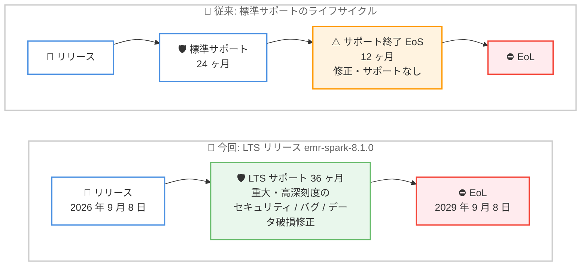

# Amazon EMR - Long Term Support (LTS) と Apache Spark 4.1 の導入

**リリース日**: 2026 年 9 月 22 日
**サービス**: Amazon EMR
**機能**: Long Term Support (LTS) リリース / AWS runtime for Apache Spark (emr-spark-8.1.0)

📊 [このアップデートのインフォグラフィックを見る](https://takech9203.github.io/aws-news-summary/20260922-amazon-emr-long-term-support-spark-4-1.html)

## 概要

Amazon EMR が Long Term Support (LTS) リリースを導入しました。最初の LTS リリースは Apache Spark 4.1 を含む **emr-spark-8.1.0** です。LTS 指定バージョンの AWS runtime for Apache Spark は **36 ヶ月間** サポートされ、重大 (Critical) および高 (High) 深刻度のセキュリティ、バグ、データ破損問題の修正が追加費用なしで提供されます。これにより、本番環境の Spark ワークロードを単一リリース上で長期間安定稼働させ、お客様自身のスケジュールでアップグレードを計画できるようになります。

emr-spark-8.1.0 には Apache Spark 4.1.1 に加え、Apache Iceberg v3 仕様の完全サポート (地理空間データ型、ナノ秒精度タイムスタンプ、スキーマ進化機能など) が含まれます。さらに、Spark SQL でのカタログ名による直接参照 (クロスアカウントカタログや Amazon S3 Tables カタログを含む)、Iceberg / Delta Lake / Apache Hudi のテーブルフォーマット自動検出、きめ細かなアクセス制御 (FGAC) の対象操作拡大にも対応しました。

本アップデートは、EMR on EC2、EMR on EKS、EMR Serverless の 3 つのデプロイオプションすべてで、Amazon EMR が利用可能なすべての AWS リージョンで利用できます。

**アップデート前の課題**

- Amazon EMR の標準サポートは 24 ヶ月間で、その後 12 ヶ月間のサポート終了 (EoS) 期間を経て EoL に移行するため、本番環境では約 2 年ごとにバージョンアップグレードの計画・検証が必要だった
- Spark やオープンテーブルフォーマットのバージョンアップに伴う互換性検証の負荷が大きく、セキュリティ修正を受け続けるために頻繁な移行作業を強いられていた
- Spark SQL で複数のカタログを利用する場合、カタログごとに Spark 設定への事前登録が必要で、テーブルフォーマット (Iceberg / Delta Lake / Hudi) ごとの設定管理も煩雑だった
- Iceberg v3 の新機能 (地理空間データ型や高精度タイムスタンプなど) を EMR の Spark ワークロードで利用できなかった

**アップデート後の改善**

- LTS リリースにより、同一リリース上で 36 ヶ月間、重大・高深刻度のセキュリティ、バグ、データ破損問題の修正を追加費用なしで受けられるようになった
- アップグレードのタイミングをお客様自身で計画でき、本番ワークロードの安定性と運用負荷のバランスを取りやすくなった
- Spark SQL クエリでカタログを名前で直接参照でき、Iceberg / Delta Lake / Hudi のテーブルフォーマットが自動検出されるため、カタログの事前登録が不要になった
- Iceberg v3 の地理空間データ型、ナノ秒精度タイムスタンプ、デフォルト値などの新機能を利用できるようになった

## アーキテクチャ図



従来の標準サポート (24 ヶ月 + EoS 12 ヶ月) と、今回導入された LTS (36 ヶ月サポート後に直接 EoL へ移行) のライフサイクルの違いを示しています。

## サービスアップデートの詳細

### 主要機能

1. **Long Term Support (LTS) リリース**
   - LTS 指定バージョンの AWS runtime for Apache Spark は 36 ヶ月間サポートされる
   - 重大 (Critical) および高 (High) 深刻度のセキュリティ、バグ、データ破損問題の修正を提供 (修正の提供は可用性に依存)
   - 追加費用なしで利用可能
   - サポート期間終了後は EoS 期間を経ずに直接 EoL へ移行する
   - 最初の LTS リリースは emr-spark-8.1.0 (初回リリース日: 2026 年 9 月 8 日、標準サポート終了: 2029 年 9 月 7 日、EoL: 2029 年 9 月 8 日)

2. **Apache Spark 4.1.1 と最新の依存関係**
   - Apache Spark 4.1.1 を搭載し、新機能、パフォーマンス改善、バグ修正を含む
   - Scala 2.13.17、Jackson 2.20.0、Parquet-MR 1.16.0 などの依存関係を更新
   - Delta Lake 4.2.0、Apache Hudi 1.1.1、Apache Iceberg 1.11.0 を同梱

3. **Apache Iceberg v3 仕様の完全サポート**
   - **地理空間データ型**: Iceberg v3 テーブルで `GEOMETRY` および `GEOGRAPHY` データ型をサポート
   - **地理空間 SQL 関数**: `st_area`、`st_distance`、`st_intersects`、`st_within` など 18 種類の関数をネイティブサポート (`spark.sql.geospatial.enabled` を `true` に設定して有効化、SRID 0 / 3857 / 4326 のみ対応)
   - **ナノ秒精度タイムスタンプ**: `TIMESTAMP(9)` および `TIMESTAMP_NTZ(9)` 列をサポート
   - **Variant シュレディング**: Variant 型データの効率的な格納をサポート
   - **`UNKNOWN` データ型**: 型が未確定の列を定義可能 (オプション列、デフォルト null、データファイルには格納されない)
   - **デフォルト値**: 書き込み時に列を省略した場合に適用される宣言済みデフォルト値をサポート (スキーマ進化)

4. **マルチフォーマット・マルチカタログの自動検出**
   - Spark SQL クエリで、Spark 設定への事前登録なしにカタログを名前で直接参照可能
   - クロスアカウントカタログや Amazon S3 Tables のフェデレーテッドカタログに対応
   - Iceberg、Delta Lake、Hudi のテーブルフォーマットを自動検出

5. **きめ細かなアクセス制御 (FGAC) の対象拡大**
   - Iceberg で `DESCRIBE TABLE`、`SHOW TBLPROPERTIES`、`SHOW CREATE TABLE`、`ALTER TABLE ... WRITE ORDERED BY`、`ALTER TABLE ... WRITE DISTRIBUTED BY` の操作を新たにサポート
   - Delta Lake で `VACUUM` 操作をサポート
   - より広範なジョブで列レベル・行レベルの権限制御が可能に

6. **Iceberg マテリアライズドビューの増分リフレッシュ改善**
   - Change Data Capture を通じて Merge-on-Read テーブルの増分リフレッシュをサポート
   - 変更の影響を受けたデータファイルのみを読み取ることで、更新・削除を含むワークロードの高速リフレッシュを実現

7. **EMR on EKS での Spark Connect サポート**
   - EMR on EKS クラスターでトークンベース認証による Spark Connect エンドポイントをサポート

## 技術仕様

### emr-spark-8.1.0 の主要コンポーネントバージョン

| コンポーネント | emr-spark-8.1.0 | emr-spark-8.0.0 (参考) |
|------|------|------|
| Apache Spark | 4.1.1-amzn-0 | 4.0.2-amzn-0 |
| Apache Iceberg | 1.11.0-amzn-0 | 1.10.1-amzn-0 |
| Delta Lake | 4.2.0-amzn-0 | 4.0.0-amzn-1-spark |
| Apache Hudi | 1.1.1-amzn-0 | 1.1.0-amzn-0 |
| Apache Livy | 0.9.0-incubating | 0.8.0-incubating |
| Scala | 2.13.17 | 2.13.16 |
| Python | 3.11, 3.13 | 3.11, 3.13 |
| AWS SDK for Java | 2.44.5 | 2.41.32 |
| Java (Spark デフォルト) | 17 (21 も選択可) | 17 |

### サポートライフサイクルの比較

| 項目 | 標準サポート | LTS (emr-spark-8.1 など) |
|------|------|------|
| サポート期間 | リリースから 24 ヶ月 | リリースから 36 ヶ月 |
| 提供される修正 | 重大なバグ、データ破損、セキュリティ問題の修正 | 重大・高深刻度のセキュリティ、バグ、データ破損問題の修正 |
| サポート終了後 | 12 ヶ月間の EoS 期間を経て EoL | EoS 期間なしで直接 EoL に移行 |
| 追加費用 | なし | なし |

### マルチカタログ自動検出の Spark 設定

```json
{
  "spark.sql.catalog.spark_catalog": "org.apache.spark.sql.connector.catalog.redirecting.RedirectingSessionCatalog",
  "spark.sql.catalogResolver": "com.amazonaws.glue.catalog.redirecting.GlueCatalogResolver"
}
```

上記の設定を追加すると、Spark SQL クエリでカタログを名前で直接参照でき、Iceberg / Delta Lake / Hudi のテーブルフォーマットが自動検出されます。

## 設定方法

### 前提条件

1. AWS アカウントと Amazon EMR を利用する IAM 権限
2. EMR on EC2、EMR on EKS、EMR Serverless のいずれかのデプロイオプション
3. 既存アプリケーションを移行する場合は、Apache Spark Upgrade Agent for Amazon EMR の利用を検討

### 手順

#### ステップ 1: emr-spark-8.1.0 で EMR Serverless アプリケーションを作成

```bash
aws emr-serverless create-application \
  --name my-lts-spark-app \
  --release-label emr-spark-8.1.0 \
  --type SPARK
```

EMR Serverless で LTS リリース emr-spark-8.1.0 を指定してアプリケーションを作成します。EMR on EC2 の場合はクラスター作成時に、EMR on EKS の場合は仮想クラスターへのジョブ送信時に、同様にリリースラベルを指定します。

#### ステップ 2: 地理空間関数の有効化 (必要な場合)

```bash
aws emr-serverless start-job-run \
  --application-id <application-id> \
  --execution-role-arn <role-arn> \
  --job-driver '{
    "sparkSubmit": {
      "entryPoint": "s3://my-bucket/scripts/geo-job.py",
      "sparkSubmitParameters": "--conf spark.sql.geospatial.enabled=true"
    }
  }'
```

`spark.sql.geospatial.enabled` を `true` に設定してジョブを実行すると、Iceberg v3 テーブルに対して `st_distance` や `st_intersects` などの地理空間 SQL 関数を利用できます。

#### ステップ 3: 既存アプリケーションの移行

既存の Spark アプリケーションを emr-spark-8.1.0 に移行する場合は、Apache Spark Upgrade Agent for Amazon EMR を使用できます。Upgrade Agent は EMR on EC2 および EMR Serverless 上の既存 Spark アプリケーションを、旧バージョンから最新の EMR バージョンへアップグレードする作業を支援します。

## メリット

### ビジネス面

- **運用コストの削減**: バージョンアップグレードの頻度を約 2 年ごとから最大 3 年ごとに延ばせるため、検証・移行にかかる工数を削減できる
- **計画的なアップグレード**: サポート期限に追われることなく、ビジネスの都合に合わせてアップグレードのタイミングを決定できる
- **追加費用なし**: LTS のセキュリティ・バグ修正は追加費用なしで提供される

### 技術面

- **本番環境の安定性**: 同一リリース上で長期間稼働できるため、依存関係の変更による予期しない挙動変化のリスクを低減できる
- **最新のオープンテーブルフォーマット対応**: Iceberg v3 の地理空間データ型やナノ秒精度タイムスタンプなど、最新機能を LTS の安定基盤上で利用できる
- **カタログ管理の簡素化**: カタログの事前登録が不要になり、クロスアカウントや S3 Tables を含むマルチカタログ構成の設定・運用が容易になる
- **セキュリティガバナンスの強化**: FGAC の対象操作が拡大し、より広範な Spark ジョブで列・行レベルのアクセス制御を適用できる

## デメリット・制約事項

### 制限事項

- LTS の修正提供は重大 (Critical) および高 (High) 深刻度のセキュリティ、バグ、データ破損問題に限定され、修正の提供は可用性に依存する
- LTS リリースはサポート期間終了後、EoS 期間を経ずに直接 EoL へ移行する (標準サポートのような 12 ヶ月の猶予期間はない)
- Iceberg のネイティブテーブル暗号化は Hive Metastore または Iceberg REST カタログ使用時のみ適用される。AWS Glue Data Catalog (Iceberg REST エンドポイント含む) や Hadoop カタログでは暗号化プロパティが受理されても強制されず、データは平文で書き込まれるため、SSE-KMS による S3 サーバーサイド暗号化の使用が必要
- Iceberg v3 テーブルでは、複数の引数を取る Transform はサポートされない
- 地理空間 SQL 関数は SRID 0、3857、4326 のみサポート

### 考慮すべき点

- LTS は AWS runtime for Apache Spark (emr-spark-8.x 系) の指定バージョンが対象であり、従来の EMR 7.x 系リリースは引き続き 24 ヶ月の標準サポートが適用される
- 既存の EMR 5.x / 6.x / 7.x からの移行では、Spark 4.x への非互換変更 (Scala 2.13 化など) の検証が必要。Apache Spark Upgrade Agent の活用を検討する
- LTS 上に長期間とどまる場合でも、新しいリリースで追加される新機能は利用できないため、機能要件とのバランスを考慮する

## ユースケース

### ユースケース 1: 本番データパイプラインの長期安定運用

**シナリオ**: 金融機関や大企業で、規制対応やリスク管理の観点から、本番の ETL パイプラインの基盤バージョンを頻繁に変更したくない。

**実装例**:
```bash
# LTS リリースで EMR クラスターを作成し、3 年間の安定運用を計画
aws emr create-cluster \
  --name "production-etl-lts" \
  --release-label emr-spark-8.1.0 \
  --applications Name=Spark \
  --instance-type m7g.xlarge \
  --instance-count 5 \
  --use-default-roles
```

**効果**: 36 ヶ月間セキュリティ修正を受けながら同一リリースで稼働でき、アップグレード検証の頻度とリスクを大幅に削減できる。

### ユースケース 2: 位置情報データの分析基盤

**シナリオ**: 物流・モビリティ企業が、車両の位置情報を Iceberg v3 テーブルに蓄積し、エリア分析や近接判定を Spark SQL で実行したい。

**実装例**:
```sql
-- 地理空間関数を使用した近接判定クエリ
SELECT vehicle_id, st_distance(location, st_geomfromwkt('POINT(139.76 35.68)', 4326)) AS dist
FROM iceberg_catalog.fleet_db.vehicle_positions
WHERE st_dwithin(location, st_geomfromwkt('POINT(139.76 35.68)', 4326), 5000);
```

**効果**: 外部の地理空間ライブラリを追加することなく、Iceberg v3 の `GEOMETRY` 型とネイティブの地理空間関数で位置情報分析を実行できる。

### ユースケース 3: マルチアカウント・マルチフォーマットのデータレイク統合分析

**シナリオ**: 組織内の複数 AWS アカウントに Iceberg、Delta Lake、Hudi の各テーブルが混在しており、単一の Spark SQL クエリで横断分析したい。

**実装例**:
```sql
-- カタログを名前で直接参照 (事前登録不要、フォーマット自動検出)
SELECT o.order_id, c.customer_name
FROM analytics_catalog.sales_db.orders o
JOIN partner_account_catalog.crm_db.customers c
  ON o.customer_id = c.customer_id;
```

**効果**: カタログごとの Spark 設定登録が不要になり、クロスアカウントカタログや S3 Tables カタログを含む横断クエリを簡潔に実行できる。FGAC により列・行レベルのアクセス制御も適用可能。

## 料金

LTS による長期サポート (重大・高深刻度のセキュリティ、バグ、データ破損問題の修正) は追加費用なしで提供されます。Amazon EMR 自体の料金体系 (EMR on EC2、EMR on EKS、EMR Serverless の各料金) に変更はありません。

## 利用可能リージョン

Amazon EMR が利用可能なすべての AWS リージョンで、EMR on EC2、EMR on EKS、EMR Serverless の 3 つのデプロイオプションすべてに対応しています。

## 関連サービス・機能

- **AWS Glue Data Catalog**: マルチカタログ自動検出のカタログリゾルバーとして連携。クロスアカウントカタログの参照にも使用
- **Amazon S3 Tables**: フェデレーテッドカタログとして Spark SQL から名前で直接参照可能
- **AWS Lake Formation**: きめ細かなアクセス制御 (FGAC) による列・行レベルの権限管理と連携
- **Apache Spark Upgrade Agent for Amazon EMR**: 既存の Spark アプリケーションを emr-spark-8.1.0 へ移行する際のアップグレード支援ツール

## 参考リンク

- 📊 [インフォグラフィック](https://takech9203.github.io/aws-news-summary/20260922-amazon-emr-long-term-support-spark-4-1.html)
- [公式発表 (What's New)](https://aws.amazon.com/about-aws/whats-new/2026/09/amazon-emr-long-term-support-spark-4-1/)
- [AWS Blog - Accelerating Spark queries with Iceberg materialized views](https://aws.amazon.com/blogs/big-data/accelerating-spark-queries-with-iceberg-materialized-views/) (関連機能: Iceberg マテリアライズドビュー)
- [ドキュメント - emr-spark-8.1.0 リリースノート](https://docs.aws.amazon.com/emr/latest/ReleaseGuide/emr-spark810-release.html)
- [ドキュメント - Amazon EMR サポートポリシー (LTS 含む)](https://docs.aws.amazon.com/emr/latest/ReleaseGuide/emr-standard-support.html)
- [ドキュメント - Apache Spark Upgrade Agent for Amazon EMR](https://docs.aws.amazon.com/emr/latest/ReleaseGuide/spark-upgrades.html)
- [料金ページ](https://aws.amazon.com/emr/pricing/)

## まとめ

Amazon EMR の LTS 導入により、本番 Spark ワークロードを 36 ヶ月間、追加費用なしでセキュリティ・バグ修正を受けながら単一リリース上で運用できるようになり、アップグレード計画の柔軟性が大きく向上しました。emr-spark-8.1.0 は Apache Spark 4.1、Iceberg v3 完全サポート、マルチカタログ自動検出、FGAC 拡張など機能面でも充実しており、長期安定運用と最新機能の両立を求めるチームは、Apache Spark Upgrade Agent を活用した移行検証から始めることを推奨します。
