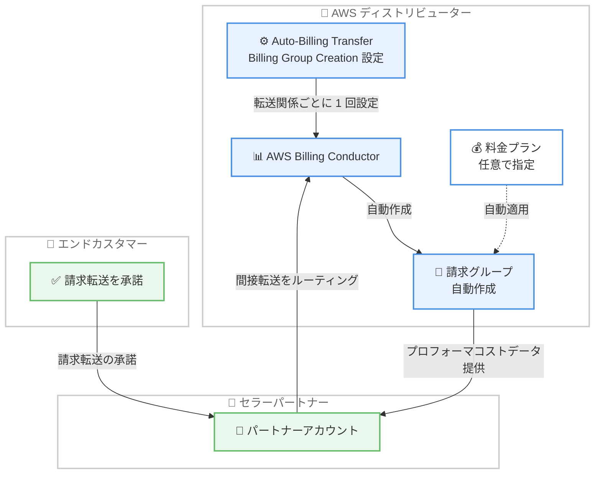

# AWS Billing Transfer - 2 階層転送における請求グループの自動作成サポート

**リリース日**: 2026 年 9 月 22 日
**サービス**: AWS Billing Transfer / AWS Billing Conductor
**機能**: Auto-Billing Transfer Billing Group Creation (請求転送に伴う請求グループの自動作成)

📊 [このアップデートのインフォグラフィックを見る](https://takech9203.github.io/aws-news-summary/20260922-aws-billing-transfer-supports-automatic-billing-group-creation.html)

## 概要

AWS Billing Transfer において、2 階層の請求転送 (two-level billing transfer) 構成で請求グループを自動作成する新しい AWS Billing Conductor 設定「Auto-Billing Transfer Billing Group Creation」が利用可能になりました。この機能により、これまで手動で行う必要があった請求グループの設定作業が不要になります。

本機能は、下流のセラーパートナーとそのエンドカスタマーの請求を管理する AWS ディストリビューター向けに設計されています。エンドカスタマーが請求転送を承諾すると請求グループが自動的に作成され、パートナーは追加の手動設定なしでプロフォーマ (pro forma) コストデータをすぐに利用できるようになります。

設定はインバウンド転送関係ごとに 1 回行うだけでよく、パートナーのアカウント経由でルーティングされる新しい間接転送すべてに対して請求グループの作成を要求できます。また、自動作成される請求グループに適用する Billing Conductor の料金プランを指定することも可能です。設定は新しい 2 つの API オペレーション、または AWS マネジメントコンソールの Billing Transfer 詳細ページから行えます。

**アップデート前の課題**

- 2 階層の請求転送構成では、エンドカスタマーが請求転送を承諾するたびに、ディストリビューターが手動で請求グループを作成・設定する必要があった
- 請求グループの作成が完了するまで、パートナーはプロフォーマコストデータを確認できなかった
- エンドカスタマーの数が増えるほど、請求グループの設定作業が運用負荷となっていた

**アップデート後の改善**

- エンドカスタマーが請求転送を承諾すると、請求グループが自動的に作成されるようになった
- インバウンド転送関係ごとに 1 回設定するだけで、以降の新しい間接転送すべてに自動適用される
- 自動作成される請求グループに対して、あらかじめ指定した Billing Conductor 料金プランを適用できるようになった
- プロフォーマコストデータが追加の手動設定なしで即座にパートナーへ提供されるようになった

## アーキテクチャ図



エンドカスタマーが請求転送を承諾すると、ディストリビューターがあらかじめ設定した内容に基づいて Billing Conductor の請求グループが自動作成され、パートナーへプロフォーマコストデータが即座に提供される流れを示しています。

## サービスアップデートの詳細

### 主要機能

1. **請求グループの自動作成**
   - エンドカスタマーが下流のセラーパートナーからの請求転送を承諾した時点で、請求グループが自動的に作成される
   - 手動での請求グループ設定作業が不要になる
   - プロフォーマコストデータが追加設定なしで即座にパートナーへ提供される

2. **転送関係ごとの 1 回限りの設定**
   - インバウンド転送関係ごとに 1 回設定するだけでよい
   - パートナーのアカウント経由でルーティングされる新しい間接転送すべてに対して、請求グループ作成を要求できる

3. **料金プランの指定**
   - 自動作成される請求グループに適用する Billing Conductor の料金プランを指定可能
   - パートナーごとの価格設定ポリシーを自動的に反映できる

4. **API とコンソールの両方に対応**
   - 新しい 2 つの API オペレーション (`GetBillingTransferPreference`、`UpdateBillingTransferPreference`) で設定可能
   - AWS マネジメントコンソールの Billing Transfer 詳細ページからも設定可能

## 技術仕様

### 新しい API オペレーション

| API | 説明 |
|------|------|
| `GetBillingTransferPreference` | 指定した転送関係 (ResponsibilityTransferArn) の自動請求グループ作成設定を取得 |
| `UpdateBillingTransferPreference` | 自動請求グループ作成の有効/無効と、適用する料金プラン ARN を設定 |

### API変更履歴

| 日付 | サービス | 変更内容 |
|------|----------|----------|
| 2026/09/21 | [AWSBillingConductor](https://awsapichanges.com/archive/changes/85e265-billingconductor.html) | 2 new api methods - Auto Billing Transfer Billing Group Creation Preference 機能のリリース |

### API リクエスト/レスポンス例

```python
# 自動請求グループ作成設定の更新
client.update_billing_transfer_preference(
    ClientToken='string',
    ResponsibilityTransferArn='string',
    AutoBillingTransferBillingGroupCreation={
        'Enabled': True,
        'PricingPlanArn': 'string'
    }
)

# 設定の取得
client.get_billing_transfer_preference(
    ResponsibilityTransferArn='string'
)
# レスポンス
# {
#     'ResponsibilityTransferArn': 'string',
#     'AutoBillingTransferBillingGroupCreation': {
#         'Enabled': True|False,
#         'PricingPlanArn': 'string'
#     },
#     'LastModifiedTime': 123
# }
```

## 設定方法

### 前提条件

1. AWS Billing Transfer で 2 階層の請求転送構成 (ディストリビューター、セラーパートナー、エンドカスタマー) を利用していること
2. AWS Billing Conductor を利用可能であること
3. 料金プランを指定する場合は、事前に Billing Conductor で料金プランを作成しておくこと

### 手順

#### ステップ1: 料金プランの確認 (任意)

```bash
aws billingconductor list-pricing-plans
```

自動作成される請求グループに適用したい Billing Conductor 料金プランの ARN を確認します。

#### ステップ2: 自動請求グループ作成設定の有効化

```bash
aws billingconductor update-billing-transfer-preference \
  --client-token "unique-token-123" \
  --responsibility-transfer-arn "arn:aws:billingconductor::123456789012:responsibilitytransfer/example" \
  --auto-billing-transfer-billing-group-creation Enabled=true,PricingPlanArn="arn:aws:billingconductor::123456789012:pricingplan/example"
```

対象のインバウンド転送関係に対して、請求グループの自動作成を有効化し、適用する料金プランを指定します。この設定は転送関係ごとに 1 回行うだけで、以降の新しい間接転送に自動適用されます。

#### ステップ3: 設定内容の確認

```bash
aws billingconductor get-billing-transfer-preference \
  --responsibility-transfer-arn "arn:aws:billingconductor::123456789012:responsibilitytransfer/example"
```

設定した自動請求グループ作成の有効状態と料金プラン ARN を確認します。コンソールを利用する場合は、Billing Transfer の詳細ページからも同様の設定・確認が可能です。

## メリット

### ビジネス面

- **運用負荷の削減**: エンドカスタマーごとの手動の請求グループ設定作業が不要になり、大規模なパートナーネットワークの管理コストを削減できる
- **オンボーディングの迅速化**: エンドカスタマーの承諾と同時に請求グループが作成されるため、パートナーへのコストデータ提供までのリードタイムが短縮される
- **価格ポリシーの一貫性**: あらかじめ指定した料金プランが自動適用されるため、パートナーごとの価格設定の適用漏れを防げる

### 技術面

- **API による自動化**: 新しい API オペレーションにより、転送関係の設定をプログラムから管理できる
- **設定の簡素化**: 転送関係ごとに 1 回の設定で、以降の間接転送すべてに自動適用される
- **即時のデータ可用性**: プロフォーマコストデータが追加設定なしで利用可能になる

## デメリット・制約事項

### 制限事項

- 2 階層の請求転送構成 (ディストリビューター経由の間接転送) を対象とした機能である
- 設定はインバウンド転送関係ごとに行う必要がある

### 考慮すべき点

- 自動作成された請求グループに適用される料金プランが意図したものであるか、事前に確認が必要
- 既存の運用フローで手動作成した請求グループとの命名規則や管理ポリシーの整合性を検討する必要がある

## ユースケース

### ユースケース1: 大規模ディストリビューターによるパートナー請求管理の自動化

**シナリオ**: AWS ディストリビューターが多数の下流セラーパートナーを抱えており、各パートナーのエンドカスタマーが日々請求転送を承諾している。従来はそのたびに請求グループを手動作成していた。

**実装例**:
```bash
# パートナーごとの転送関係に自動作成を有効化
aws billingconductor update-billing-transfer-preference \
  --client-token "partner-a-setup" \
  --responsibility-transfer-arn "arn:aws:billingconductor::123456789012:responsibilitytransfer/partner-a" \
  --auto-billing-transfer-billing-group-creation Enabled=true
```

**効果**: エンドカスタマーの承諾と同時に請求グループが作成され、手動作業なしでパートナーがプロフォーマコストデータを利用できる。

### ユースケース2: パートナーごとの料金プラン自動適用

**シナリオ**: ディストリビューターがパートナーごとに異なる割引率やマークアップを設定した料金プランを運用しており、新規エンドカスタマーにも一貫した価格設定を適用したい。

**実装例**:
```bash
aws billingconductor update-billing-transfer-preference \
  --client-token "partner-b-pricing" \
  --responsibility-transfer-arn "arn:aws:billingconductor::123456789012:responsibilitytransfer/partner-b" \
  --auto-billing-transfer-billing-group-creation Enabled=true,PricingPlanArn="arn:aws:billingconductor::123456789012:pricingplan/partner-b-plan"
```

**効果**: 自動作成される請求グループにパートナー専用の料金プランが自動適用され、価格設定の適用漏れや設定ミスを防止できる。

### ユースケース3: コンソールによる転送関係ごとの設定管理

**シナリオ**: 請求管理チームが API を使わず、コンソール上で転送関係ごとの自動作成設定を確認・変更したい。

**実装例**:
```
AWS マネジメントコンソール
→ Billing Transfer
→ 対象の転送関係の詳細ページ
→ Auto-Billing Transfer Billing Group Creation を有効化し、料金プランを選択
```

**効果**: API を利用しないチームでも、転送関係ごとの設定状況を一元的に管理できる。

## 料金

公式発表には本機能に関する追加料金の記載はありません。AWS Billing Conductor の利用料金が適用される点に注意してください。詳細は [AWS Billing Conductor 料金ページ](https://aws.amazon.com/aws-cost-management/aws-billing-conductor/pricing/) を参照してください。

## 利用可能リージョン

公式発表にリージョンの明記はありません。AWS Billing Conductor および AWS Billing Transfer はグローバルな請求管理機能として提供されます。

## 関連サービス・機能

- **AWS Billing Conductor**: プロフォーマ請求データを構成するサービス。本機能で自動作成される請求グループと料金プランの基盤となる
- **AWS Billing Transfer**: アカウント間で請求責任を転送する機能。本機能は 2 階層転送構成における設定を簡素化する
- **AWS Organizations**: 複数アカウントの管理基盤。ディストリビューター/パートナー/エンドカスタマーのアカウント構成に関連する

## 参考リンク

- 📊 [インフォグラフィック](https://takech9203.github.io/aws-news-summary/20260922-aws-billing-transfer-supports-automatic-billing-group-creation.html)
- [公式発表 (What's New)](https://aws.amazon.com/about-aws/whats-new/2026/09/aws-billing-transfer-supports-automatic-billing-group-creation/)
- [ドキュメント: 請求グループの作成 - AWS Billing Conductor](https://docs.aws.amazon.com/billingconductor/latest/userguide/create-billing-group.html)
- [API 変更詳細 (awsapichanges.com)](https://awsapichanges.com/archive/changes/85e265-billingconductor.html)
- [料金ページ: AWS Billing Conductor](https://aws.amazon.com/aws-cost-management/aws-billing-conductor/pricing/)

## まとめ

本アップデートにより、2 階層の請求転送構成における請求グループの手動設定が不要になり、AWS ディストリビューターの運用負荷が大幅に軽減されます。多数のセラーパートナーとエンドカスタマーを管理するディストリビューターは、対象の転送関係に対して Auto-Billing Transfer Billing Group Creation の有効化と料金プランの指定を検討することを推奨します。
