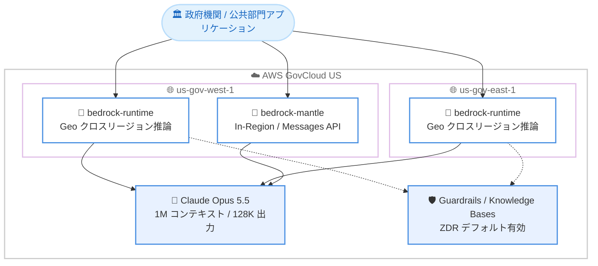

# Amazon Bedrock - Claude Opus 5.5 が AWS GovCloud (US) で利用可能に

**リリース日**: 2026 年 9 月 22 日
**サービス**: Amazon Bedrock (AWS GovCloud (US))
**機能**: Claude Opus 5.5 (Anthropic) の AWS GovCloud (US) における提供開始

📊 [このアップデートのインフォグラフィックを見る](https://takech9203.github.io/aws-news-summary/20260922-claude-opus-5-5-aws-govcloud.html)

## 概要

Anthropic の最上位 Opus モデルであり Claude 5.5 ファミリーの最初のモデルである Claude Opus 5.5 が、AWS GovCloud (US) で利用可能になりました。同日に発表された商用リージョンでの提供開始と同時に GovCloud でも利用できるため、米国政府機関やその関連組織は、最新モデルの採用で商用環境に遅れを取ることなく、コンプライアンス要件の厳しい環境で最先端の AI を活用できます。

Claude Opus 5.5 は、長時間のコーディングタスクやナレッジワークを自律的に処理し、「何を実行したか、何を発見したか、何が必要か」を明確に報告するコラボレーション能力が強化されたモデルです。Claude Opus 5 と比較して少ないトークン数でタスクを完了し、トークンあたりの価格も引き下げられ、キャッシュ読み取りもより安価になっています。また、リクエストごとに必要な思考量をモデル自身が判断する適応的思考 (adaptive thinking) を備えています。

公共部門にとって重要なのは、Amazon Bedrock 経由での提供により、デフォルトのゼロデータ保持 (ZDR)、AWS インフラストラクチャ内でのデータ保持とリージョナルなデータレジデンシー、そして Guardrails や Knowledge Bases といった AWS マネージド機能を、GovCloud (US) の分離された環境で利用できる点です。

**アップデート前の課題**

- 以前は AWS GovCloud (US) で利用できる Claude モデルは Opus 5 世代までであり、最新世代のモデルを利用するには商用リージョンを使う必要があった
- 以前は機密性の高い政府系ワークロードで長時間実行のエージェントタスクを扱う場合、トークン消費量とコストが課題だった
- 以前は最新モデルの商用リージョン提供と GovCloud 提供の間にギャップが生じることがあり、公共部門での採用計画が立てにくかった

**アップデート後の改善**

- 今回のアップデートにより、GovCloud (US) の分離された環境内で Anthropic の最上位 Opus モデルを利用できるようになった
- 今回のアップデートにより、Opus 5 より少ないトークン数・低いトークン単価・安価なキャッシュ読み取りにより、政府系ワークロードにおけるタスクあたりのコストが改善された
- 今回のアップデートにより、商用リージョンと同日に最新モデルが GovCloud で利用可能となり、公共部門でも最新の AI 機能をタイムリーに採用できるようになった

## アーキテクチャ図



AWS GovCloud (US) の 2 リージョンから Claude Opus 5.5 にアクセスできます。bedrock-runtime エンドポイントは us-gov-west-1 と us-gov-east-1 の両方で Geo クロスリージョン推論に対応し、bedrock-mantle エンドポイントは us-gov-west-1 の In-Region で利用できます。データは AWS インフラストラクチャ内に留まり、ZDR がデフォルトで適用されます。

## サービスアップデートの詳細

### 主要機能

1. **GovCloud (US) での最上位 Opus モデル提供**
   - Claude 5.5 ファミリーの最初のモデルを、GovCloud (US) の分離された環境で利用可能
   - 商用リージョンでの提供開始と同日に GovCloud でも利用可能となり、公共部門の採用ギャップを解消
   - コーディング、ナレッジワーク、長時間実行タスクに強く、実行内容・発見事項・必要な情報を明確に報告

2. **トークン効率とコスト効率の向上**
   - Opus 5 より少ないトークン数でタスクを完了
   - トークンあたりの価格が Opus 5 より低く設定
   - キャッシュ読み取りがさらに安価になり、効率向上と組み合わせてタスクあたりのコストを削減

3. **適応的思考 (adaptive thinking)**
   - リクエストごとに必要な思考量をモデルが自動的に判断
   - 思考は常時有効で無効化は不可
   - effort パラメータで low / medium / high / xhigh / max の 5 段階を設定可能 (デフォルトは medium)

4. **コンプライアンスを支える Bedrock のマネージド機能**
   - ゼロデータ保持 (ZDR) がデフォルトで有効
   - データは AWS インフラストラクチャ内に留まり、リージョナルなデータレジデンシーを維持
   - Guardrails や Knowledge Bases などの AWS マネージド機能を統合されたサービスとして利用可能

## 技術仕様

### モデル仕様

| 項目 | 詳細 |
|------|------|
| モデル ID | `anthropic.claude-opus-5-5` |
| コンテキストウィンドウ | 1M トークン |
| 最大出力トークン | 128K トークン |
| 入力モダリティ | テキスト、画像 |
| 出力モダリティ | テキスト |
| 推論 (思考) | 適応的思考が常時有効 (無効化不可)、effort は low / medium / high / xhigh / max (デフォルト: medium) |
| 知識カットオフ | 2026 年 6 月 |
| モデルライフサイクル | Active (EOL は 2027 年 9 月 22 日以降、レガシー期間 6 か月) |

### GovCloud (US) でのエンドポイントと推論オプション

| リージョン | bedrock-runtime | bedrock-mantle |
|------------|-----------------|----------------|
| us-gov-west-1 (GovCloud West) | ✅ Geo クロスリージョン推論 | ✅ In-Region (Messages API) |
| us-gov-east-1 (GovCloud East) | ✅ Geo クロスリージョン推論 | ❌ |

- bedrock-runtime では In-Region 推論およびグローバルクロスリージョン推論には対応せず、Geo クロスリージョン推論での利用となります
- bedrock-mantle は In-Region の Messages API 専用エンドポイントで、Converse / Invoke API や Guardrails などの Bedrock マネージド機能は利用できません
- 新規アプリケーションでは bedrock-runtime エンドポイントの利用が推奨されています

### Bedrock 機能サポート (bedrock-runtime エンドポイント)

| 機能 | サポート |
|------|----------|
| レスポンスストリーミング | ✅ |
| プロンプトキャッシュ (暗黙的 / 明示的) | ✅ (最小 512 トークン、最大 4 チェックポイント、TTL 5 分 / 1 時間) |
| Guardrails | ✅ |
| Knowledge Bases | ✅ |
| Agents / Flows / プロンプト管理 / モデル評価 | ✅ |
| Computer use | ✅ (ツールタイプ `computer_20251124`、ベータヘッダー `computer-use-2025-11-24`) |
| Intelligent prompt routing / Count tokens / Structured outputs | ❌ |
| サービスティア | Standard のみ (Priority / Flex / Reserved / Batch は非対応) |

### API変更履歴

本アップデートに直接関連する API 変更は、発表時点の AWS API Changes には確認できませんでした (モデル追加のため、既存の Amazon Bedrock API で利用可能です)。

## 設定方法

### 前提条件

1. AWS GovCloud (US) アカウントを保有していること
2. Amazon Bedrock で Anthropic モデルへのアクセスが有効化されていること (AWS Marketplace 経由のサードパーティモデル)
3. 認証情報 (Bedrock API キーまたは IAM 認証情報) が設定されていること

### 手順

#### ステップ1: モデルアクセスの確認

GovCloud (US) リージョンの Amazon Bedrock コンソールで、Anthropic モデルへのアクセスが有効になっていることを確認します。無効な場合はモデルアクセスをリクエストします。

#### ステップ2: SDK のインストール

```bash
# Converse / Invoke API を使用する場合
pip install boto3

# Messages API を使用する場合
pip install -U anthropic aws-bedrock-token-generator
```

利用する API に応じて、AWS SDK for Python (boto3)、または Anthropic SDK とトークンジェネレーターをインストールしています。

#### ステップ3: GovCloud リージョンで推論リクエストを実行

```python
import boto3

# GovCloud West リージョンの bedrock-runtime クライアントを作成
client = boto3.client('bedrock-runtime', region_name='us-gov-west-1')

response = client.converse(
    modelId='anthropic.claude-opus-5-5',  # 実際の推論プロファイル ID はリージョン対応表を確認
    messages=[
        {
            'role': 'user',
            'content': [{'text': '調達仕様書のドラフトをレビューしてください。'}]
        }
    ]
)
print(response)
```

GovCloud リージョンの bedrock-runtime エンドポイントに対して Converse API で推論を実行しています。GovCloud では Geo クロスリージョン推論での利用となるため、使用する推論プロファイル ID は [モデルのリージョン対応表](https://docs.aws.amazon.com/bedrock/latest/userguide/models-region-compatibility.html) で確認してください。

#### ステップ4: Guardrails の適用 (推奨)

```python
response = client.converse(
    modelId='anthropic.claude-opus-5-5',
    messages=[{'role': 'user', 'content': [{'text': '...'}]}],
    guardrailConfig={
        'guardrailIdentifier': '<Guardrail ID>',
        'guardrailVersion': '<バージョン>'
    }
)
```

公共部門のワークロードでは、Amazon Bedrock Guardrails を組み合わせて、機微情報のフィルタリングやトピック制限などの安全対策を適用することを推奨します。

## メリット

### ビジネス面

- **公共部門での最新 AI のタイムリーな採用**: 商用リージョンと同日に GovCloud で提供されるため、政府機関が最新モデルの採用で後れを取らない
- **タスクあたりのコスト削減**: Opus 5 より少ないトークン数・低い単価・安価なキャッシュ読み取りにより、予算制約の厳しい公共部門でもコスト効率よく AI を活用できる
- **調達・請求の一元化**: AWS Marketplace 経由の課金として AWS の請求に統合され、既存の GovCloud 契約・コスト管理プロセスをそのまま活用できる

### 技術面

- **コンプライアンス環境での ZDR とデータレジデンシー**: ゼロデータ保持がデフォルトで有効であり、データは AWS インフラストラクチャ内に留まるため、機密性の高いワークロードに適する
- **長時間タスクへの対応**: 長時間のコーディングやナレッジワークを自律的に処理し、進捗と結果を明確に報告するため、エージェントワークロードに適する
- **AWS マネージド機能との統合**: Guardrails、Knowledge Bases、Agents、プロンプトキャッシュなど Bedrock の機能を GovCloud 環境でそのまま利用できる

## デメリット・制約事項

### 制限事項

- GovCloud (US) の bedrock-runtime では In-Region 推論に対応しておらず、Geo クロスリージョン推論での利用となる (リクエストは GovCloud の Geo 内で処理される)
- グローバルクロスリージョン推論プロファイルは GovCloud では利用できない
- bedrock-mantle エンドポイントは us-gov-west-1 のみで、Messages API 専用 (Guardrails や Knowledge Bases などのマネージド機能は利用不可)
- サービスティアは Standard のみで、Priority / Flex / Reserved / Batch には対応していない

### 考慮すべき点

- 思考 (推論) は常時有効で無効化できないため、レイテンシーやトークン消費の特性を事前に検証することが望ましい
- Geo クロスリージョン推論ではリクエストが Geo 内の複数リージョンにルーティングされるため、組織のコンプライアンス要件 (処理場所の制約など) と整合するか確認が必要
- 発表には具体的なコンプライアンス認証 (FedRAMP など) への言及はないため、認証要件がある場合は AWS のコンプライアンスプログラムのドキュメントで対象サービス・リージョンを確認すること
- 商用リージョン版と同様、具体的な単価は Amazon Bedrock 料金ページでの確認が必要

## ユースケース

### ユースケース1: 政府機関向けシステムのコーディングエージェント

**シナリオ**: 政府機関の情報システム部門が、レガシーコードのモダナイゼーションやテスト整備を、GovCloud 環境内で完結するコーディングエージェントに実行させたい。

**実装例**:
```python
client = boto3.client('bedrock-runtime', region_name='us-gov-west-1')
response = client.converse(
    modelId='anthropic.claude-opus-5-5',
    messages=[{
        'role': 'user',
        'content': [{'text': 'このモジュールの脆弱性につながり得る実装パターンを調査し、修正方針を報告してください。'}]
    }]
)
```

**効果**: 1M トークンのコンテキストと 128K トークンの出力により大規模コードベースを扱え、ソースコードを GovCloud 外に出すことなく長時間タスクを自律実行できる。

### ユースケース2: 機密文書を扱うナレッジワーク支援

**シナリオ**: 公共部門の組織が、規制文書・調達文書・ポリシー文書の分析や起草支援に AI を活用したいが、データを分離された環境に維持する必要がある。

**実装例**:
```text
1. Knowledge Bases に規制文書・ポリシー文書を取り込み RAG を構成
2. Claude Opus 5.5 を推論モデルとして指定
3. Guardrails で機微情報のフィルタリングとトピック制限を適用
4. ZDR デフォルト有効の環境で文書分析・起草支援を実行
```

**効果**: ZDR とデータレジデンシーにより機密文書を AWS インフラストラクチャ内に維持したまま、検索拡張生成 (RAG) による正確なナレッジワーク支援を実現できる。

### ユースケース3: 既存 GovCloud ワークロードのモデル移行

**シナリオ**: すでに GovCloud で Claude Opus 5 を利用している組織が、コスト効率と性能の改善のために最新モデルへ移行したい。

**実装例**:
```python
# モデル ID を Opus 5.5 に切り替え、まず effort はデフォルトの medium で評価
response = client.converse(
    modelId='anthropic.claude-opus-5-5',
    messages=[{'role': 'user', 'content': [{'text': '...'}]}]
)
```

**効果**: 少ないトークン数・低い単価・安価なキャッシュ読み取りの組み合わせにより、同等以上の成果をより低いタスクあたりコストで達成できる。既存の Bedrock API をそのまま利用できるため移行負担が小さい。

## 料金

Claude Opus 5.5 は AWS Marketplace を通じて提供・課金されるサードパーティモデルです。料金は AWS の請求書と AWS Cost Explorer に、Amazon Bedrock ではなくモデルプロバイダー (Anthropic) の項目として表示されます。

発表によると、Claude Opus 5.5 は Opus 5 と比較して以下の特徴があります。

- タスク完了に必要なトークン数が少ない
- トークンあたりの価格が低い
- キャッシュ読み取りがより安価

具体的な単価は [Amazon Bedrock 料金ページ](https://aws.amazon.com/bedrock/pricing/) を参照してください。

## 利用可能リージョン

**AWS GovCloud (US)**

| リージョン | bedrock-runtime | bedrock-mantle |
|------------|-----------------|----------------|
| us-gov-west-1 (GovCloud West) | ✅ Geo クロスリージョン推論 | ✅ In-Region |
| us-gov-east-1 (GovCloud East) | ✅ Geo クロスリージョン推論 | ❌ |

商用リージョン (米国、欧州、アジアパシフィックなど) での提供状況は、同日発表の [Claude Opus 5.5 の AWS 提供開始レポート](./2026-09-22-claude-opus-5-5-aws.md) および [モデルのリージョン対応表](https://docs.aws.amazon.com/bedrock/latest/userguide/models-region-compatibility.html) を参照してください。

## 関連サービス・機能

- **Amazon Bedrock Guardrails**: Claude Opus 5.5 の入出力に対してコンテンツフィルタリングや機微情報検出などの安全対策を適用できる
- **Amazon Bedrock Knowledge Bases**: 規制文書やポリシー文書を検索拡張生成 (RAG) で活用するアプリケーションを構築できる
- **Amazon Bedrock Agents / Flows**: Claude Opus 5.5 を推論エンジンとしたエージェントやワークフローを GovCloud 環境で構築できる
- **AWS GovCloud (US)**: 米国政府機関および関連組織向けに設計された分離されたリージョンで、厳格なコンプライアンス要件を持つワークロードをホストできる

## 参考リンク

- 📊 [インフォグラフィック](https://takech9203.github.io/aws-news-summary/20260922-claude-opus-5-5-aws-govcloud.html)
- [公式発表 (What's New)](https://aws.amazon.com/about-aws/whats-new/2026/09/claude-opus-5-5-aws-govcloud/)
- [Claude Opus 5.5 モデルカード (Amazon Bedrock)](https://docs.aws.amazon.com/bedrock/latest/userguide/model-card-anthropic-claude-opus-5-5.html)
- [モデルのリージョン対応表](https://docs.aws.amazon.com/bedrock/latest/userguide/models-region-compatibility.html)
- [Amazon Bedrock 料金ページ](https://aws.amazon.com/bedrock/pricing/)
- [関連レポート: Claude Opus 5.5 の AWS 提供開始](./2026-09-22-claude-opus-5-5-aws.md)

## まとめ

Claude Opus 5.5 が商用リージョンと同日に AWS GovCloud (US) で提供開始され、米国政府機関やその関連組織は、デフォルトの ZDR・データレジデンシー・Guardrails などのマネージド機能を備えた分離環境で、Anthropic の最上位 Opus モデルを利用できるようになりました。Opus 5 比でトークン効率と単価の両面が改善されているため、GovCloud で既存の Claude ワークロードを運用している組織は、コスト効果を検証のうえ移行を検討する価値があります。
