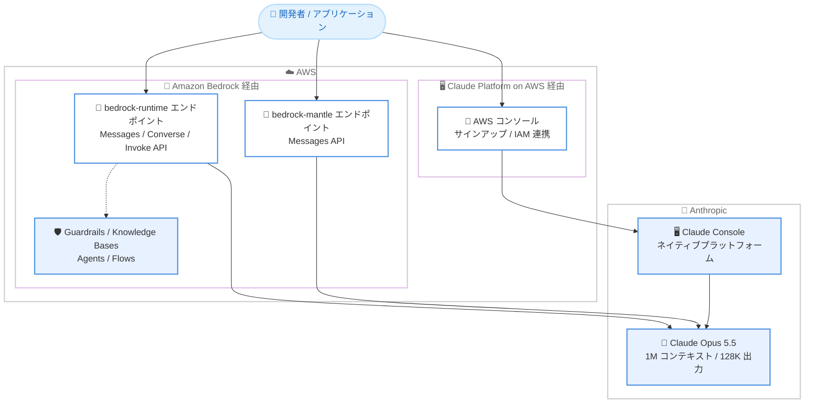

# Amazon Bedrock / Claude Platform on AWS - Claude Opus 5.5 の提供開始

**リリース日**: 2026 年 9 月 22 日
**サービス**: Amazon Bedrock、Claude Platform on AWS
**機能**: Claude Opus 5.5 (Anthropic) の AWS における提供開始

📊 [このアップデートのインフォグラフィックを見る](https://takech9203.github.io/aws-news-summary/20260922-claude-opus-5-5-aws.html)

## 概要

Anthropic の最新モデル Claude Opus 5.5 が AWS で利用可能になりました。Claude Opus 5.5 は Anthropic の Opus ファミリーで最も高性能なモデルであり、Claude 5.5 ファミリーの最初のモデルです。長時間のコーディングタスクやナレッジワークを自律的に処理し、「何を実行したか、何を発見したか、何が必要か」を明確に報告するコラボレーション能力が強化されています。

効率面では、Claude Opus 5 と比較して少ないトークン数でタスクを完了でき、トークンあたりの価格も引き下げられています。さらにキャッシュ読み取りが安価になったことで、エージェントワークロードなど繰り返しコンテキストを参照する用途でのコスト効率が向上しています。また、リクエストごとに必要な思考量をモデル自身が判断する適応的思考 (adaptive thinking) を常時有効で備えています。

今回のアップデートの特徴は、AWS 上で 2 つのアクセス経路が提供される点です。従来の Amazon Bedrock に加えて、Anthropic のネイティブなプラットフォーム体験を AWS コンソールから利用できる「Claude Platform on AWS」が選択肢として案内されています。

**アップデート前の課題**

- 以前は Claude の最新モデルを AWS で利用する場合、Opus 5 世代までしか選択できなかった
- 以前は長時間実行されるエージェントタスクでトークン消費量が大きく、コスト管理が課題だった
- 以前は Anthropic のネイティブなプラットフォーム機能 (Claude Console など) を利用するには、AWS とは別に Anthropic と直接契約し、請求や認証を個別に管理する必要があった

**アップデート後の改善**

- 今回のアップデートにより、Anthropic の最上位 Opus モデルである Claude Opus 5.5 を AWS 上で利用できるようになった
- 今回のアップデートにより、Opus 5 より少ないトークン数・低いトークン単価・安価なキャッシュ読み取りにより、タスクあたりのコストが改善された
- 今回のアップデートにより、Claude Platform on AWS を通じて、AWS の請求・認証に統合された形で Anthropic ネイティブのプラットフォーム体験を利用できるようになった

## アーキテクチャ図



Claude Opus 5.5 へのアクセス経路は 2 つあります。Amazon Bedrock 経由ではデフォルトでゼロデータ保持 (ZDR) が適用され、データは AWS インフラストラクチャ内に留まり、Guardrails や Knowledge Bases などの AWS マネージド機能と組み合わせられます。Claude Platform on AWS 経由では、AWS の請求・認証と統合された形で Anthropic ネイティブのプラットフォーム体験を利用できます (この経路ではコンテンツは AWS 外の Anthropic 側で処理されます)。

## サービスアップデートの詳細

### 主要機能

1. **Anthropic 最上位の Opus モデル**
   - Claude 5.5 ファミリーの最初のモデルで、コーディング、ナレッジワーク、長時間実行タスクに強い
   - 実行内容・発見事項・必要な情報を明確に報告する、コラボレーションしやすい振る舞い
   - コンテキストウィンドウは 1M トークン、最大出力は 128K トークン
   - 知識カットオフは 2026 年 6 月

2. **トークン効率とコスト効率の向上**
   - Opus 5 より少ないトークン数でタスクを完了
   - トークンあたりの価格が Opus 5 より低く設定
   - キャッシュ読み取りがさらに安価になり、効率向上と組み合わせてタスクあたりのコストを削減

3. **適応的思考 (adaptive thinking)**
   - リクエストごとに必要な思考量をモデルが自動的に判断
   - 思考は常時有効で無効化は不可
   - effort パラメータで low / medium / high / xhigh / max の 5 段階を設定可能 (デフォルトは medium)

4. **2 つのアクセス経路**
   - **Amazon Bedrock**: デフォルトでゼロデータ保持 (ZDR)、リージョナルなデータレジデンシー、Guardrails・Knowledge Bases・Agents などの AWS マネージド機能との統合
   - **Claude Platform on AWS**: AWS コンソールからサインアップし、Anthropic と直接契約した場合と同じ API・機能・コンソール体験を、AWS の請求・認証に統合された形で利用

## 技術仕様

### モデル仕様 (Amazon Bedrock)

| 項目 | 詳細 |
|------|------|
| モデル ID | `anthropic.claude-opus-5-5` |
| グローバル推論プロファイル | `global.anthropic.claude-opus-5-5` |
| Geo 推論プロファイル | `us.` / `eu.` / `au.` / `jp.anthropic.claude-opus-5-5` |
| コンテキストウィンドウ | 1M トークン |
| 最大出力トークン | 128K トークン |
| 入力モダリティ | テキスト、画像 |
| 出力モダリティ | テキスト |
| 推論 (思考) | 適応的思考が常時有効 (無効化不可)、effort は low / medium / high / xhigh / max (デフォルト: medium) |
| 知識カットオフ | 2026 年 6 月 |
| モデルライフサイクル | Active (EOL は 2027 年 9 月 22 日以降、レガシー期間 6 か月) |

### エンドポイントと API サポート

| エンドポイント | Messages API | Converse API | Invoke API |
|----------------|--------------|--------------|------------|
| bedrock-runtime | ✅ | ✅ | ✅ |
| bedrock-mantle | ✅ | ❌ | ❌ |

新規アプリケーションでは bedrock-runtime エンドポイントの利用が推奨されています。

### Bedrock 機能サポート (bedrock-runtime エンドポイント)

| 機能 | サポート |
|------|----------|
| レスポンスストリーミング | ✅ |
| プロンプトキャッシュ (暗黙的 / 明示的) | ✅ (最小 512 トークン、最大 4 チェックポイント、TTL 5 分 / 1 時間) |
| Guardrails | ✅ |
| Knowledge Bases | ✅ |
| Agents / Flows / プロンプト管理 / モデル評価 | ✅ |
| Computer use | ✅ (ツールタイプ `computer_20251124`、ベータヘッダー `computer-use-2025-11-24`) |
| コンパクション | ✅ (ベータ値 `compact-2026-09-04`) |
| Intelligent prompt routing / Count tokens / Structured outputs | ❌ |
| サービスティア | Standard のみ (Priority / Flex / Reserved / Batch は非対応) |

### API変更履歴

本アップデートに直接関連する API 変更は、発表時点の AWS API Changes には確認できませんでした (モデル追加のため、既存の Bedrock API で利用可能です)。

## 設定方法

### 前提条件

1. AWS アカウントを保有していること
2. Amazon Bedrock で Anthropic モデルへのアクセスが有効化されていること (AWS Marketplace 経由のサードパーティモデル)
3. 認証情報 (Bedrock API キーまたは IAM 認証情報) が設定されていること

### 手順

#### ステップ1: Bedrock API キーの作成

Amazon Bedrock コンソールの API キー画面から長期 API キーを生成し、環境変数に設定します。

```bash
export AWS_BEARER_TOKEN_BEDROCK="<Bedrock API キー>"
```

このコマンドは、Bedrock へのリクエスト認証に使用する API キーを環境変数として設定しています。

#### ステップ2: SDK のインストール

```bash
# Messages API を使用する場合
pip install -U anthropic aws-bedrock-token-generator

# Converse / Invoke API を使用する場合
pip install boto3
```

利用する API に応じて、Anthropic SDK とトークンジェネレーター、または AWS SDK for Python (boto3) をインストールしています。

#### ステップ3: 推論リクエストの実行 (Converse API の例)

```python
import boto3

client = boto3.client('bedrock-runtime', region_name='us-east-1')
response = client.converse(
    modelId='global.anthropic.claude-opus-5-5',
    messages=[
        {
            'role': 'user',
            'content': [{'text': 'Amazon Bedrock の特徴を説明してください。'}]
        }
    ]
)
print(response)
```

グローバル推論プロファイル `global.anthropic.claude-opus-5-5` を指定して Converse API で推論を実行しています。データレジデンシー要件がある場合は、`us.` / `eu.` / `au.` / `jp.` プレフィックスの Geo 推論プロファイルを使用します。

#### ステップ4: Claude Platform on AWS のセットアップ (ネイティブ体験を利用する場合)

1. AWS コンソールで「Claude Platform on AWS」サービスページを開き、[Sign up] を選択する (AWS Marketplace のサブスクリプションは自動処理される)
2. サインアップ完了後、組織オーナーのメールアドレスを登録し、Anthropic 組織のセットアップを完了する
3. 自動作成されたワークスペース ID (`wrkspc_` 形式) を確認する
4. `aws-external-anthropic:AssumeConsole` 権限を持つ IAM ロールで [Sign in] を選択し、Claude Console にフェデレーションサインインする

AWS IAM で認証を統合しつつ、Anthropic ネイティブの Claude Console と API を利用できるようになります。

## メリット

### ビジネス面

- **タスクあたりのコスト削減**: Opus 5 より少ないトークン数・低い単価・安価なキャッシュ読み取りの組み合わせにより、同じ成果をより低コストで達成できる
- **調達・請求の一元化**: Bedrock 経由でも Claude Platform on AWS 経由でも、請求は AWS に統合され、既存の AWS 契約・コスト管理プロセスをそのまま活用できる
- **コンプライアンス対応**: Bedrock 経由ではデフォルトの ZDR とリージョナルなデータレジデンシー (US / EU / AU / JP) により、規制業界でも採用しやすい

### 技術面

- **長時間タスクへの対応**: 長時間のコーディングやナレッジワークを自律的に処理し、進捗と結果を明確に報告するため、エージェントワークロードに適する
- **適応的思考による自動最適化**: リクエストごとに思考量をモデルが判断するため、タスク難易度に応じた手動チューニングの負担が減る
- **AWS マネージド機能との統合**: Guardrails、Knowledge Bases、Agents、Flows、プロンプトキャッシュなど Bedrock の機能をそのまま利用できる

## デメリット・制約事項

### 制限事項

- Bedrock の In-Region 推論には対応しておらず、Geo クロスリージョン推論またはグローバルクロスリージョン推論での利用となる (bedrock-runtime の場合)
- サービスティアは Standard のみで、Priority / Flex / Reserved / Batch には対応していない
- bedrock-runtime では Count tokens、Structured outputs、Intelligent prompt routing に対応していない
- bedrock-mantle エンドポイントは Messages API のみ対応で、Guardrails や Knowledge Bases などの Bedrock マネージド機能は利用できない

### 考慮すべき点

- Claude Platform on AWS を利用する場合、プロンプトや生成結果は AWS 外の Anthropic 側で処理されるため、データ処理ポリシーの確認が必要 (Bedrock 経由の ZDR・データレジデンシーとは特性が異なる)
- Claude Platform on AWS のサインアップで作成される Anthropic 組織は、既存の Anthropic 組織 (Claude Enterprise 含む) とは別であり、API キーやワークスペースは引き継がれない
- 既存の Bedrock プライベートオファーがある場合は、割引を初回リクエストから適用するため、サインアップ前に Anthropic または AWS のアカウント担当への連絡が推奨されている
- 思考 (推論) は常時有効で無効化できないため、レイテンシーやトークン消費の特性を事前に検証することが望ましい

## ユースケース

### ユースケース1: 長時間実行されるコーディングエージェント

**シナリオ**: 大規模リポジトリのリファクタリングやマイグレーションを、エージェントに数時間単位で自律実行させたい。

**実装例**:
```python
import boto3

client = boto3.client('bedrock-runtime', region_name='us-east-1')
response = client.converse(
    modelId='global.anthropic.claude-opus-5-5',
    messages=[{
        'role': 'user',
        'content': [{'text': 'このリポジトリのテスト失敗原因を調査し、修正方針を報告してください。'}]
    }]
)
```

**効果**: 1M トークンのコンテキストと 128K トークンの出力により大規模コードベースを扱え、実行内容・発見事項を明確に報告するため、人間によるレビューと協働がしやすい。

### ユースケース2: データレジデンシー要件のあるエンタープライズ AI アプリケーション

**シナリオ**: 日本国内でのデータ処理が求められる業務アプリケーションに最新の Claude モデルを組み込みたい。

**実装例**:
```python
# JP Geo 推論プロファイルを使用し、データを日本リージョン内に維持
response = client.converse(
    modelId='jp.anthropic.claude-opus-5-5',
    messages=[{'role': 'user', 'content': [{'text': '...'}]}]
)
```

**効果**: `jp.anthropic.claude-opus-5-5` により東京・大阪リージョン内でデータレジデンシーを維持しつつ、デフォルトの ZDR と Guardrails を組み合わせてコンプライアンス要件を満たせる。

### ユースケース3: Anthropic ネイティブ機能を AWS 統合で利用

**シナリオ**: Anthropic の Claude Console や最新のプラットフォーム機能を使いたいが、請求と認証は既存の AWS アカウントに統合したい。

**実装例**:
```text
1. AWS コンソール → Claude Platform on AWS → Sign up
2. Anthropic 組織のセットアップ (メール認証)
3. IAM ロール (aws-external-anthropic:AssumeConsole) で Claude Console にサインイン
4. ワークスペース ID を確認し、API キーを発行して開発を開始
```

**効果**: Anthropic と直接契約した場合と同じ API・機能・コンソール体験を、AWS の請求・IAM 認証に統合された形で利用でき、調達とガバナンスを簡素化できる。

## 料金

Claude Opus 5.5 は AWS Marketplace を通じて提供・課金されるサードパーティモデルです。料金は AWS の請求書と AWS Cost Explorer に、Amazon Bedrock ではなくモデルプロバイダー (Anthropic) の項目として表示されます。

発表によると、Claude Opus 5.5 は Opus 5 と比較して以下の特徴があります。

- タスク完了に必要なトークン数が少ない
- トークンあたりの価格が低い
- キャッシュ読み取りがより安価

具体的な単価は [Amazon Bedrock 料金ページ](https://aws.amazon.com/bedrock/pricing/) を参照してください。

## 利用可能リージョン

In-Region 推論には対応しておらず、クロスリージョン推論プロファイルで利用します (bedrock-runtime エンドポイントの場合)。

**Geo クロスリージョン推論 (データレジデンシー維持)**

| Geo | 推論プロファイル | 対象リージョン例 |
|-----|------------------|------------------|
| US | `us.anthropic.claude-opus-5-5` | バージニア北部、オハイオ、オレゴンなど (米国・カナダ) |
| EU | `eu.anthropic.claude-opus-5-5` | フランクフルト、アイルランド、ロンドンなど (EU) |
| AU | `au.anthropic.claude-opus-5-5` | シドニー、メルボルン (オーストラリア) |
| JP | `jp.anthropic.claude-opus-5-5` | **東京、大阪 (日本)** |

**グローバルクロスリージョン推論**

`global.anthropic.claude-opus-5-5` は、東京・大阪を含む世界中の幅広いリージョン (米国、欧州、アジアパシフィック、中東、南米など) から利用できます。AWS GovCloud (US) では Geo 推論プロファイルで利用可能です。

bedrock-mantle エンドポイントは、バージニア北部 (us-east-1)、メルボルン (ap-southeast-4)、GovCloud West (us-gov-west-1) の In-Region で利用できます。

## 関連サービス・機能

- **Amazon Bedrock Guardrails**: Claude Opus 5.5 の入出力に対してコンテンツフィルタリングや PII 検出などの安全対策を適用できる
- **Amazon Bedrock Knowledge Bases**: 社内ドキュメントを検索拡張生成 (RAG) で活用するアプリケーションを構築できる
- **Amazon Bedrock Agents / Flows**: Claude Opus 5.5 を推論エンジンとしたエージェントやワークフローを構築できる
- **クロスリージョン推論プロファイル**: Geo / グローバル推論プロファイルにより、データレジデンシーとキャパシティのバランスを制御できる

## 参考リンク

- 📊 [インフォグラフィック](https://takech9203.github.io/aws-news-summary/20260922-claude-opus-5-5-aws.html)
- [公式発表 (What's New)](https://aws.amazon.com/about-aws/whats-new/2026/09/claude-opus-5-5-aws/)
- [Claude Opus 5.5 モデルカード (Amazon Bedrock)](https://docs.aws.amazon.com/bedrock/latest/userguide/model-card-anthropic-claude-opus-5-5.html)
- [Claude Platform on AWS セットアップガイド](https://docs.aws.amazon.com/claude-platform/latest/userguide/setup.html)
- [モデルのリージョン対応表](https://docs.aws.amazon.com/bedrock/latest/userguide/models-region-compatibility.html)
- [Amazon Bedrock 料金ページ](https://aws.amazon.com/bedrock/pricing/)

## まとめ

Claude Opus 5.5 の AWS 提供開始により、Anthropic の最上位 Opus モデルを、Bedrock のマネージド機能 (ZDR、データレジデンシー、Guardrails、Knowledge Bases) または Claude Platform on AWS のネイティブ体験という 2 つの経路で利用できるようになりました。Opus 5 比でトークン効率と単価の両面が改善されているため、既存の Claude ワークロードはコスト効果を検証のうえ移行を検討する価値があります。日本のユーザーは `jp.` Geo 推論プロファイルにより、データを日本国内に維持したまま最新モデルを活用できます。
