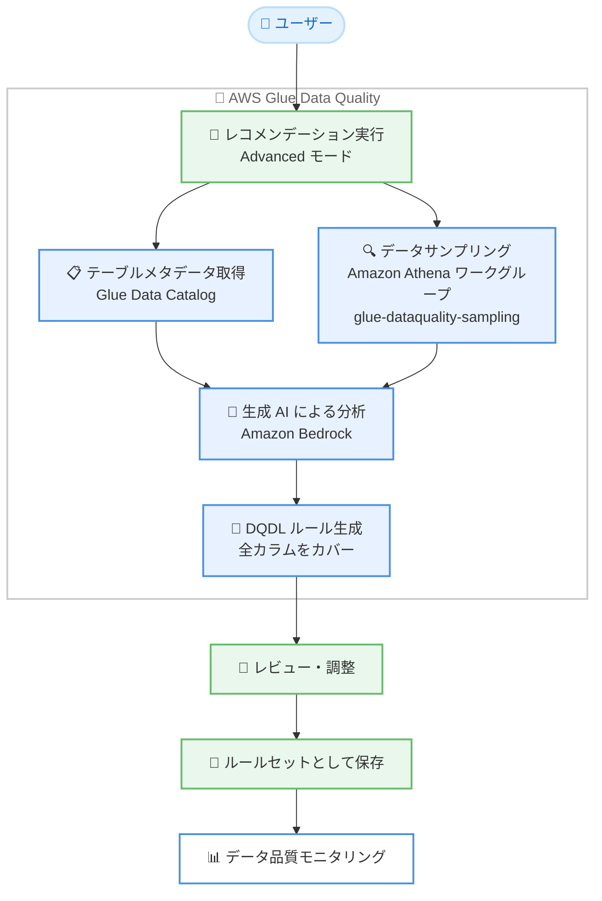

# AWS Glue - Data Quality コンテキスト対応ルールレコメンデーション

**リリース日**: 2026 年 9 月 22 日
**サービス**: AWS Glue (AWS Glue Data Quality)
**機能**: Advanced モードによるコンテキスト対応データ品質ルールレコメンデーション

📊 [このアップデートのインフォグラフィックを見る](https://takech9203.github.io/aws-news-summary/20260922-glue-data-quality-rule-recommendations.html)

## 概要

AWS Glue Data Quality が、AWS Glue Data Catalog のテーブルに対してデータ品質ルールを数秒で生成できるようになりました。新しく追加されたルールレコメンデーションの **Advanced モード**では、生成 AI (Amazon Bedrock) を使用してデータの背後にある意図を検出し、そのデータが実際にどのように使われているかを反映したビジネスに関連性の高いルールを提案します。全カラムを網羅した、すぐに使えるルールセットが手動セットアップなしで得られます。

公式ドキュメントによると、Advanced モードは Amazon Athena を使用してテーブルデータのランダムサンプルを取得し、テーブルメタデータとあわせて Amazon Bedrock に渡すことで DQDL (Data Quality Definition Language) ルールを生成します。従来の Basic モード (デフォルト) がテーブル統計情報の分析に基づくのに対し、Advanced モードは統計情報では表現できない値の内容やカラム間の関係性に基づいたルールを提案できます。

このアップデートは、新規オンボーディングしたデータセットへのルールの迅速な適用や、大規模データレイク全体へのベースラインチェックの展開を行いたいデータエンジニア、データスチュワード、データガバナンス担当者に特に有用です。ユーザーは推奨されたルールをレビュー・調整し、ルールセットとして保存することで、すぐにデータ品質のモニタリングを開始できます。

**アップデート前の課題**

- 以前のルールレコメンデーション (Basic モード) はテーブル統計情報のみに基づいており、データの意味やビジネス上の利用方法を反映したルールを提案できなかった
- 統計情報では表現できない値の内容やカラム間の関係性に基づくルールは、手動で DQDL を記述する必要があった
- 大規模データレイク全体にベースラインの品質チェックを展開する場合、テーブルごとにルールを検討・作成する作業に時間がかかっていた

**アップデート後の改善**

- 生成 AI がデータの意図を検出し、ビジネスに関連性の高いルールを数秒で提案できるようになった
- 全カラムをカバーするルールセットが手動セットアップなしで生成され、レビューと調整だけでモニタリングを開始できるようになった
- 新規データセットのオンボーディング時のルール整備や、データレイク全体のベースラインチェックの立ち上げが大幅に高速化された

## アーキテクチャ図



Advanced モードのレコメンデーション実行では、Glue Data Catalog のテーブルメタデータと Amazon Athena で取得したサンプルデータを Amazon Bedrock に渡して DQDL ルールを生成し、ユーザーはレビュー後にルールセットとして保存してモニタリングを開始します。

## サービスアップデートの詳細

### 主要機能

1. **Advanced モードによるコンテキスト対応ルール生成**
   - 生成 AI (Amazon Bedrock) がテーブルメタデータとサンプル行からデータの意図を検出し、DQDL ルールを提案
   - テーブル統計情報では表現できない、値の内容やカラム間の関係性に基づくルールを生成可能
   - 数秒でルールが生成され、全カラムをカバーするルールセットが手動セットアップなしで得られる

2. **Amazon Athena によるデータサンプリング**
   - Advanced モードではテーブルデータへのアクセスに Amazon Athena を使用
   - `glue-dataquality-sampling` という Athena ワークグループが存在しない場合、AWS Glue がアカウント内に自動作成
   - サンプリングにはランダムサンプルが使用され、Athena の利用料金が発生

3. **Basic モードの自動 Bedrock 強化**
   - `BASIC` モードは引き続きデフォルトで、テーブル統計情報の分析に基づいてルールを推奨
   - サポート対象リージョンでは、Basic モードの実行時にも統計ベースのルールセットを Amazon Bedrock で自動強化する試行が行われる (追加設定や Bedrock 権限の付与は不要)
   - 強化に失敗した場合や利用できない場合は、元の統計ベースのルールセットが返される

4. **レビューから運用開始までのシンプルなワークフロー**
   - 推奨ルールをコンソール上でレビューし、必要に応じて調整
   - ルールセットとして保存後、すぐにデータ品質評価とモニタリングを開始可能
   - レコメンデーション実行の履歴は 90 日間保持される

## 技術仕様

### レコメンデーションモードの比較

| 項目 | Basic モード | Advanced モード |
|------|-------------|----------------|
| デフォルト | ○ (デフォルト) | × (明示的に指定) |
| 分析対象 | テーブル統計情報 | テーブルメタデータ + サンプル行 |
| 使用技術 | 統計分析 (+ 対象リージョンでは Bedrock 自動強化) | Amazon Bedrock + Amazon Athena |
| ルールの特性 | 統計に基づく境界値ルール | データの意図・関係性を反映したルール |
| 利用可能リージョン | すべての Glue Data Quality リージョン | 17 リージョン (下記参照) |
| 追加料金 | なし | Athena 利用料金が発生 |

### API変更履歴

| 日付 | サービス | 変更内容 |
|------|----------|----------|
| 2026/09/18 | [glue](https://awsapichanges.com/archive/changes/cfdf90-glue.html) | 3 updated api methods - Advanced ルールレコメンデーション対応。Amazon Athena でテーブルデータのサンプルを分析し、Amazon Bedrock で DQDL ルールを推奨 |

### Advanced モードの制約

Advanced モードの実行では、以下のパラメータはサポートされません。

- `PreProcessingQuery`
- `NumberOfWorkers`
- `Timeout`
- `AdditionalRunOptions`

## 設定方法

### 前提条件

1. AWS Glue Data Catalog に評価対象のテーブルが登録されていること
2. AWS Glue、Amazon S3、CloudWatch などのリソースにアクセスできる IAM ロールが用意されていること (`glue:StartDataQualityRuleRecommendationRun` 権限を含む)
3. Advanced モードを利用する場合、対象リージョンが Advanced モードのサポート対象であること

### 手順

#### ステップ1: Advanced モードでレコメンデーション実行を開始

```bash
aws glue start-data-quality-rule-recommendation-run \
  --data-source '{"DataQualityGlueTable":{"DatabaseName":"mydatabase","TableName":"mytable"}}' \
  --role "arn:aws:iam::111122223333:role/GlueDataQualityRole" \
  --recommendation-mode ADVANCED
```

`--recommendation-mode ADVANCED` を指定して、Glue Data Catalog のテーブル `mydatabase.mytable` に対するルールレコメンデーション実行を開始します。Advanced モードでは Athena によるサンプリングと Bedrock による分析が行われます。コンソールの場合は、対象テーブルの [Data quality] タブから [Recommend rules] を選択し、モードと IAM ロールを指定します。

#### ステップ2: 実行結果の確認

```bash
aws glue get-data-quality-rule-recommendation-run \
  --run-id <run-id>
```

レコメンデーション実行のステータスと、生成された DQDL ルールセットを確認します。コンソールでは [Run history] ページで過去 90 日間の実行履歴を確認できます。

#### ステップ3: ルールのレビューとルールセットの保存

生成されたルールをコンソールの DQDL エディタでレビューし、ビジネス要件に合わせて調整します。Advanced モードは生成モデルを使用するため、同じテーブルでも実行ごとに異なるルールが返される可能性があります。公式ドキュメントでは、実行のたびにルールをレビューすることが推奨されています。調整が完了したら、ルールセットとして保存し、データ品質評価を実行またはスケジュールします。

## メリット

### ビジネス面

- **データ信頼性向上までの時間短縮**: 生データから信頼できるデータへの移行を数秒のルール生成で加速し、データ活用の立ち上げを高速化できる
- **データガバナンスのスケール**: 大規模データレイク全体に対して、テーブルごとの手作業なしにベースラインの品質チェックを展開できる
- **非エンジニアでも利用可能**: データスチュワードやビジネスアナリストが DQDL を書かずに、意味のあるルールセットを整備できる

### 技術面

- **コンテキストを反映したルール**: 統計情報だけでは導出できない、データの利用意図や値の関係性に基づくルールを自動生成できる
- **全カラムのカバレッジ**: 手動セットアップなしで全カラムを網羅するルールセットが得られ、抜け漏れを防止できる
- **既存ワークフローとの統合**: 生成されたルールは標準の DQDL ルールセットとして保存されるため、既存の評価実行、EventBridge 通知、CloudWatch メトリクスとそのまま連携できる

## デメリット・制約事項

### 制限事項

- Advanced モードは 17 リージョンでのみ利用可能 (Basic モードはすべての Glue Data Quality リージョンで利用可能)
- Advanced モードでは `PreProcessingQuery`、`NumberOfWorkers`、`Timeout`、`AdditionalRunOptions` パラメータがサポートされない
- ルールセットあたり最大 2,000 ルール、ルールセットサイズは 65 KB までという Glue Data Quality 共通の制限が適用される

### 考慮すべき点

- Advanced モードは生成モデルを使用するため、同じテーブルでも実行ごとに異なるルールが返される可能性がある。実行のたびにルールのレビューが推奨される
- Advanced モードは Athena を使用してテーブルデータにアクセスするため、Athena の利用料金が発生する。`glue-dataquality-sampling` ワークグループが自動作成される点にも留意が必要
- テーブルメタデータとサンプル行が分析に使用されるため、データ保護要件がある場合は公式ドキュメントの「Data protection for advanced data quality rule recommendations」を確認することが推奨される
- 生成されたルールはあくまで推奨であり、本番適用前にビジネス要件との整合性をレビュー・調整する必要がある

## ユースケース

### ユースケース1: 新規オンボーディングデータセットの品質ルール整備

**シナリオ**: 新しいデータソースをデータレイクに取り込んだ直後で、データの内容に精通したメンバーが少なく、品質ルールをゼロから作成する時間もない。

**実装例**:
```bash
aws glue start-data-quality-rule-recommendation-run \
  --data-source '{"DataQualityGlueTable":{"DatabaseName":"new_source_db","TableName":"orders"}}' \
  --role "arn:aws:iam::111122223333:role/GlueDataQualityRole" \
  --recommendation-mode ADVANCED \
  --created-ruleset-name "orders-baseline-ruleset"
```

**効果**: データの意図を反映した全カラムカバーのルールセットが数秒で得られ、オンボーディング直後から品質モニタリングを開始できる。

### ユースケース2: 大規模データレイク全体へのベースラインチェック展開

**シナリオ**: 数百テーブル規模のデータレイクを運用しており、ガバナンス要件としてすべての主要テーブルに最低限の品質チェックを適用したいが、手作業でのルール作成は現実的でない。

**実装例**:
```bash
# テーブル一覧を取得し、各テーブルに対してレコメンデーション実行を起動するスクリプト例
for table in $(aws glue get-tables --database-name datalake_db \
  --query 'TableList[].Name' --output text); do
  aws glue start-data-quality-rule-recommendation-run \
    --data-source "{\"DataQualityGlueTable\":{\"DatabaseName\":\"datalake_db\",\"TableName\":\"${table}\"}}" \
    --role "arn:aws:iam::111122223333:role/GlueDataQualityRole" \
    --recommendation-mode ADVANCED
done
```

**効果**: データレイク全体に対するベースライン品質チェックの整備を自動化し、ガバナンス対応の工数を大幅に削減できる。

### ユースケース3: 統計ベースルールでは検出できない品質問題への対応

**シナリオ**: Basic モードで生成した統計ベースのルールを運用しているが、カラムの値の意味やカラム間の関係性に起因する品質問題を検出できていない。

**実装例**:
```bash
# 既存テーブルに対して Advanced モードで再レコメンデーションを実行
aws glue start-data-quality-rule-recommendation-run \
  --data-source '{"DataQualityGlueTable":{"DatabaseName":"analytics_db","TableName":"customer_events"}}' \
  --role "arn:aws:iam::111122223333:role/GlueDataQualityRole" \
  --recommendation-mode ADVANCED
```

**効果**: サンプルデータの内容に基づいた、より文脈に即したルールが提案され、既存ルールセットを強化して検出精度を向上できる。

## 料金

AWS Glue Data Quality は従量課金制で、レコメンデーション実行や評価実行に使用されるリソースに基づいて課金されます。今回のアップデートに伴う追加のライセンス料金はありませんが、以下の点に注意が必要です。

- Advanced モードのレコメンデーション実行では、テーブルデータへのアクセスに Amazon Athena が使用され、Athena の利用料金が発生します
- 詳細は [AWS Glue の料金ページ](https://aws.amazon.com/glue/pricing/) および [Amazon Athena の料金ページ](https://aws.amazon.com/athena/pricing/) を参照してください

## 利用可能リージョン

以下の 17 リージョンで利用可能です。

- **アジアパシフィック**: メルボルン、大阪、シドニー、東京
- **カナダ**: 中部
- **ヨーロッパ**: フランクフルト、アイルランド、ロンドン、ミラノ、パリ、スペイン、ストックホルム、チューリッヒ
- **米国東部**: バージニア北部、オハイオ
- **米国西部**: 北カリフォルニア、オレゴン

## 関連サービス・機能

- **AWS Glue Data Catalog**: レコメンデーション対象のテーブルメタデータを管理するメタデータリポジトリ。Advanced モードはカタログ内のテーブルに対して動作する
- **Amazon Bedrock**: Advanced モードのルール生成を支える生成 AI サービス。テーブルメタデータとサンプル行から DQDL ルールを推奨する
- **Amazon Athena**: Advanced モードでのデータサンプリングに使用される。`glue-dataquality-sampling` ワークグループが自動作成される
- **Amazon EventBridge / Amazon CloudWatch**: 生成したルールセットの評価結果に基づくアラート通知やメトリクス監視に利用できる

## 参考リンク

- 📊 [インフォグラフィック](https://takech9203.github.io/aws-news-summary/20260922-glue-data-quality-rule-recommendations.html)
- [公式発表 (What's New)](https://aws.amazon.com/about-aws/whats-new/2026/09/glue-data-quality-rule-recommendations/)
- [ドキュメント: AWS Glue Data Quality](https://docs.aws.amazon.com/glue/latest/dg/glue-data-quality.html)
- [ドキュメント: レコメンデーションモード](https://docs.aws.amazon.com/glue/latest/dg/data-quality-getting-started.html#data-quality-recommendation-modes)
- [料金ページ](https://aws.amazon.com/glue/pricing/)

## まとめ

AWS Glue Data Quality の Advanced モードにより、生成 AI を活用したコンテキスト対応のデータ品質ルールを数秒で生成できるようになりました。新規データセットのオンボーディングや大規模データレイクへのベースラインチェック展開において、ルール整備の工数を大幅に削減できます。まずは対象リージョンの重要テーブルで Advanced モードのレコメンデーションを実行し、Basic モードとの提案内容の違いを比較したうえで、レビューを組み込んだ運用フローを整備することを推奨します。
