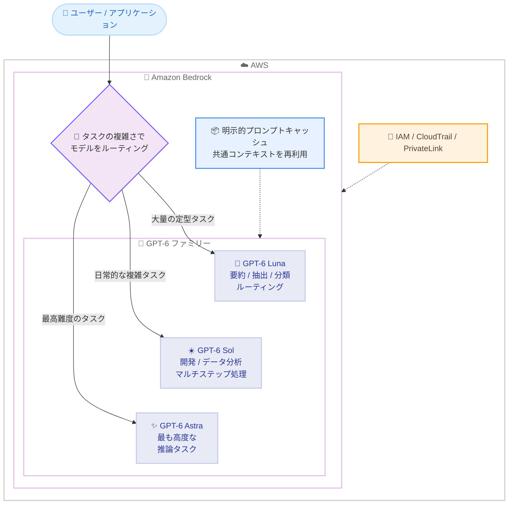

# Amazon Bedrock - OpenAI GPT-6 Sol / GPT-6 Luna の一般提供開始

**リリース日**: 2026 年 9 月 22 日
**サービス**: Amazon Bedrock
**機能**: OpenAI GPT-6 Sol および GPT-6 Luna モデルの一般提供 (GA)

📊 [このアップデートのインフォグラフィックを見る](https://takech9203.github.io/aws-news-summary/20260922-openai-gpt-6-sol-luna-on-amazon-bedrock.html)

## 概要

OpenAI の GPT-6 Sol と GPT-6 Luna が Amazon Bedrock で一般提供 (GA) となりました。2026 年 9 月 8 日に GA となった最上位モデル GPT-6 Astra に続く発表で、これにより Bedrock 上の GPT-6 ファミリーは Astra / Sol / Luna の 3 モデル構成に拡大しました。

GPT-6 Sol は、反復的な複雑タスクとソフトウェア開発のための「デイリーモデル」と位置付けられています。機能実装、デバッグ、コードレビュー、リファクタリング、データ分析、ツールをまたいだマルチステップワークフローに対応し、OpenAI の社内 factuality 評価では前世代の GPT-5.6 Sol と比較して事実誤認が約半分に減少しています。GPT-6 Luna は GPT-6 ファミリーで最も効率的なモデルで、要約、抽出、分類、ルーティングといった大量処理タスク向けに最適化されており、リクエストごとに推論の深さ (reasoning effort) を調整して品質・速度・コストのバランスを制御できます。両モデルとも最大 100 万トークンのコンテキストをサポートします。

Amazon Bedrock コンソールまたは Bedrock API から利用でき、IAM によるアクセス制御、CloudTrail による監査、PrivateLink 経由の VPC エンドポイントなど、AWS の本番環境グレードのセキュリティとガバナンスの下で OpenAI の最新世代モデルを運用できます。

**アップデート前の課題**

- Bedrock 上の GPT-6 世代は最上位の Astra のみで、日常的な開発タスクや大量処理タスクにはコスト・性能面で過剰な選択肢しかなかった
- GPT-5.6 世代の Sol / Luna では、GPT-6 世代で改善された事実性 (factuality) やコーディング・コンピュータ操作能力を利用できなかった
- 用途に応じた GPT-6 ファミリー内でのモデル使い分け (ルーティング) が Bedrock 上では構成できなかった

**アップデート後の改善**

- 日常的な開発・分析タスクに適した GPT-6 Sol と、大量処理向けの GPT-6 Luna を Bedrock 上で選択できるようになった
- GPT-6 Sol は GPT-5.6 Sol と比較して事実誤認が約半分となり、調査から検証までをタスクの文脈を保持したまま遂行できるようになった
- GPT-6 Luna の調整可能な reasoning effort により、リクエスト単位で品質・応答速度・コストのトレードオフを制御できるようになった
- Luna で分類・トリアージ、Sol で複雑な調査、Astra で深い推論という段階的なモデルルーティング構成が可能になった
- 両モデルとも GPT-5.6 の前世代モデルより大幅に低い API 料金で提供される

## アーキテクチャ図



GPT-6 ファミリー 3 モデルの使い分けイメージです。タスクの複雑さに応じて Luna / Sol / Astra をルーティングし、すべての呼び出しは IAM によるアクセス制御と CloudTrail による監査の対象となります。

## サービスアップデートの詳細

### 主要機能

1. **GPT-6 Sol: 反復的な複雑タスクとソフトウェア開発のためのデイリーモデル**
   - 機能実装、デバッグ、コードレビュー、リファクタリング、データ分析、ツールをまたいだマルチステップワークフローに対応
   - GPT-5.6 Sol と比較してコーディングとコンピュータ操作の能力が向上し、調査から検証までを判断の文脈を保持したまま遂行可能
   - OpenAI の社内 factuality 評価で、GPT-5.6 Sol の約半分の事実誤認に低減
   - 何を変更し、何を検証し、何が確認できなかったかを明確にレポートする出力の透明性が向上

2. **GPT-6 Luna: 大量処理タスクのための最も効率的なモデル**
   - 要約、ドキュメントからの抽出、分類、ルーティング、焦点を絞った Q&A といった大量処理ワークロードに最適化
   - リクエストごとに reasoning effort を調整し、品質・応答速度・コストのバランスを制御可能
   - 前世代と比較して事実性の信頼度と出力コミュニケーションの明確さが向上

3. **最大 100 万トークンのコンテキスト**
   - Sol / Luna の両モデルが最大 100 万トークンのコンテキストをサポート
   - 大規模なコードベースやドキュメントコレクションを対象とした処理が可能

4. **明示的プロンプトキャッシュ**
   - リポジトリの指示、ポリシー文書、抽出スキーマなど再利用するプロンプトコンテンツをキャッシュ対象として指定可能
   - 後続リクエストでは新規入力のみを処理するため、コストとレイテンシーを削減

5. **AWS のセキュリティ・ガバナンスとの統合**
   - IAM によるアクセス制御、CloudTrail によるモデル呼び出しの監査、PrivateLink 経由の VPC エンドポイントに対応
   - ハードウェアで分離された推論環境とゼロオペレーターアクセス
   - 推論データはモデルのトレーニングに使用されず、OpenAI とのデータ共有も不要
   - 不正利用検知でフラグされたトラフィックは最大 30 日間保持され、リクエストによりゼロデータ保持 (ZDR) も選択可能

## 技術仕様

### モデル比較

| 項目 | GPT-6 Luna | GPT-6 Sol | GPT-6 Astra (参考) |
|------|------------|-----------|--------------------|
| 位置付け | 最も効率的なモデル | デイリーモデル | 最上位モデル |
| 主な用途 | 要約 / 抽出 / 分類 / ルーティング | ソフトウェア開発 / データ分析 / マルチステップワークフロー | 深い推論 / 判断を要する高度な業務 |
| コンテキスト | 最大 100 万トークン | 最大 100 万トークン | 1,050,000 トークン |
| reasoning effort 調整 | ✓ (リクエスト単位) | 発表では言及なし | 発表では言及なし |
| 前世代比 | 事実性と出力の明確さが向上 | 事実誤認が約半分 (社内 factuality 評価) | - |

モデル ID、推論プロファイル、エンドポイントごとの API 対応状況 (Converse / Responses / Chat Completions) は、[OpenAI モデルカードのドキュメント](https://docs.aws.amazon.com/bedrock/latest/userguide/model-cards-openai.html)および[モデルのリージョン対応状況](https://docs.aws.amazon.com/bedrock/latest/userguide/models-region-compatibility.html)で確認してください。

## 設定方法

### 前提条件

1. AWS アカウントと Amazon Bedrock へのアクセス権限
2. Bedrock コンソールでのモデルアクセスの有効化
3. Bedrock API キーまたは IAM 認証情報

### 手順

#### ステップ 1: モデルアクセスの有効化

Amazon Bedrock コンソールの [モデルアクセス] で GPT-6 Sol および GPT-6 Luna へのアクセスを有効化します。

#### ステップ 2: 利用可能なモデルの確認

```bash
aws bedrock list-foundation-models \
  --region us-east-1 \
  --by-provider openai \
  --query "modelSummaries[].modelId"
```

リージョンで利用可能な OpenAI モデルの一覧を取得し、GPT-6 Sol / Luna のモデル ID を確認します。クロスリージョン推論プロファイルを使用する場合は `aws bedrock list-inference-profiles` で推論プロファイル ID を確認します。

#### ステップ 3: 推論リクエストの実行

```bash
aws bedrock-runtime converse \
  --region us-east-1 \
  --model-id <GPT-6 Sol または Luna の推論プロファイル ID> \
  --messages '[{"role": "user", "content": [{"text": "このログからエラーの原因を調査してください。"}]}]'
```

Converse API でモデルを呼び出します。ステップ 2 で確認したモデル ID または推論プロファイル ID を指定します。

## メリット

### ビジネス面

- **コスト効率の向上**: 両モデルとも GPT-5.6 の前世代より大幅に低い API 料金で提供され、日常業務への AI 適用コストを削減できる
- **用途に応じたモデル選択**: 最上位の Astra を常用する必要がなく、タスクの複雑さに応じて Sol / Luna を使い分けることで費用対効果を最適化できる
- **統制された利用**: OpenAI の最新世代モデルを、AWS の既存のセキュリティ / ガバナンス / 監査基盤の中で利用できる

### 技術面

- **事実性の向上**: GPT-6 Sol は社内 factuality 評価で GPT-5.6 Sol の約半分の事実誤認となり、出力の信頼性が向上
- **reasoning effort の調整**: GPT-6 Luna はリクエスト単位で推論の深さを制御でき、大量処理パイプラインの品質とコストをチューニング可能
- **プロンプトキャッシュ**: 共通の指示やスキーマを明示的にキャッシュし、繰り返しワークロードのコストとレイテンシーを削減
- **大規模コンテキスト**: 最大 100 万トークンのコンテキストにより、大規模なコードベースやドキュメント群を一括処理可能

## デメリット・制約事項

### 制限事項

- 発表時点では標準ベンチマークのスコアは公開されておらず、性能指標は OpenAI の社内 factuality 評価のみが引用されている
- 具体的な料金、モデル ID、対応リージョンは発表内に明記されておらず、Bedrock ドキュメントでの確認が必要
- 不正利用検知でフラグされたトラフィックは最大 30 日間保持される (ZDR はリクエストにより選択可能)

### 考慮すべき点

- GPT-6 Astra と同様に、利用可能なエンドポイント (bedrock-runtime / bedrock-mantle) や API (Converse / Responses / Chat Completions) がモデルや機能によって異なる可能性があるため、モデルカードでの事前確認を推奨
- Luna の reasoning effort 設定は品質とコストのトレードオフに直結するため、ワークロードごとの評価と設定値の検証が必要
- 既存の GPT-5.6 Sol / Luna ベースのワークロードを移行する場合は、出力形式や挙動の変化を検証するプロセスが必要

## ユースケース

### ユースケース 1: GPT-6 Sol によるコーディングアシスタント

**シナリオ**: 開発チームが機能実装、デバッグ、コードレビュー、リファクタリングといった日常の開発タスクを AI で支援したい。

**実装例**:
```text
1. Bedrock で GPT-6 Sol へのモデルアクセスを有効化
2. リポジトリの共通指示を明示的プロンプトキャッシュに登録
3. Converse API 経由で調査から修正、検証までのマルチステップワークフローを実行
```

**効果**: 前世代より事実誤認が約半分に減少したモデルが、何を変更・検証したかを明確にレポートしながらタスクを完遂するため、レビュー負荷を抑えつつ開発を加速できる。

### ユースケース 2: GPT-6 Luna による大量ドキュメント処理パイプライン

**シナリオ**: 大量のドキュメントから一貫したスキーマで情報を抽出し、分類・要約するパイプラインを低コストで運用したい。

**実装例**:
```text
1. 抽出スキーマとポリシー文書を明示的プロンプトキャッシュに登録
2. GPT-6 Luna の reasoning effort を低めに設定して高スループット処理を実行
3. 判定が難しいドキュメントのみ reasoning effort を上げて再処理
```

**効果**: キャッシュにより繰り返しコンテキストの処理コストを削減しつつ、reasoning effort の調整で品質とコストのバランスをドキュメント単位で最適化できる。

### ユースケース 3: GPT-6 ファミリーによる段階的モデルルーティング

**シナリオ**: 問い合わせ対応システムで、単純な分類から複雑な調査まで難易度の異なるタスクをコスト効率よく処理したい。

**実装例**:
```text
1. GPT-6 Luna で問い合わせを分類・トリアージ
2. 複雑な調査を要する案件は GPT-6 Sol にルーティング
3. 最も高度な推論を要する案件のみ GPT-6 Astra で処理
```

**効果**: すべてのリクエストを最上位モデルで処理する場合と比較して、品質を維持しながら全体のコストを大幅に削減できる。

## 料金

トークン単位の従量課金です。AWS Blog によると、両モデルとも GPT-5.6 の前世代モデルより「大幅に低い API 料金」で提供されます。発表時点で具体的な単価は明記されていないため、最新の料金は [Amazon Bedrock 料金ページ](https://aws.amazon.com/bedrock/pricing/)を参照してください。

明示的プロンプトキャッシュを活用することで、繰り返し利用するコンテキストの処理コストを削減できます。

## 利用可能リージョン

発表内に具体的なリージョン一覧は明記されていません。対応リージョン、エンドポイント、API、推論プロファイルは[モデルのリージョン対応状況のドキュメント](https://docs.aws.amazon.com/bedrock/latest/userguide/models-region-compatibility.html)で確認してください。なお、発表内のコンソールリンクは us-east-1 (バージニア北部) を参照しています。

## 関連サービス・機能

- **OpenAI GPT-6 Astra on Amazon Bedrock**: 2026 年 9 月 8 日に GA となった最上位モデル。最も高度な推論タスク向けで、Sol / Luna と組み合わせたルーティング構成が可能
- **Amazon Bedrock クロスリージョン推論**: 推論プロファイルによりリージョン間でキャパシティを活用した推論が可能
- **AWS PrivateLink**: VPC エンドポイント経由でインターネットを経由せずにモデルを呼び出し可能
- **AWS CloudTrail**: モデル呼び出しの監査ログを記録し、ガバナンス要件に対応
- **AWS IAM**: モデルアクセスの権限をきめ細かく制御可能

## 参考リンク

- 📊 [インフォグラフィック](https://takech9203.github.io/aws-news-summary/20260922-openai-gpt-6-sol-luna-on-amazon-bedrock.html)
- [公式発表 (What's New)](https://aws.amazon.com/about-aws/whats-new/2026/09/openai-gpt-6-sol-luna-on-amazon-bedrock/)
- [AWS Blog: Bring more intelligence to everyday work with GPT-6 Sol and GPT-6 Luna on Amazon Bedrock](https://aws.amazon.com/blogs/machine-learning/bring-more-intelligence-to-everyday-work-with-gpt-6-sol-and-gpt-6-luna-on-amazon-bedrock/)
- [ドキュメント: OpenAI モデル一覧](https://docs.aws.amazon.com/bedrock/latest/userguide/model-cards-openai.html)
- [ドキュメント: モデルのリージョン対応状況](https://docs.aws.amazon.com/bedrock/latest/userguide/models-region-compatibility.html)
- [料金ページ](https://aws.amazon.com/bedrock/pricing/)

## まとめ

GPT-6 Sol と GPT-6 Luna の GA により、Amazon Bedrock 上の GPT-6 ファミリーが Astra / Sol / Luna の 3 モデル構成となり、タスクの複雑さとコスト要件に応じたモデル選択が可能になりました。事実性が向上した Sol は日常の開発・分析タスクに、reasoning effort を調整できる Luna は大量処理パイプラインに適しています。まずはモデルカードで対応 API とリージョンを確認し、Luna によるトリアージから Sol / Astra へ段階的にルーティングする構成と明示的プロンプトキャッシュの活用を検討することを推奨します。
