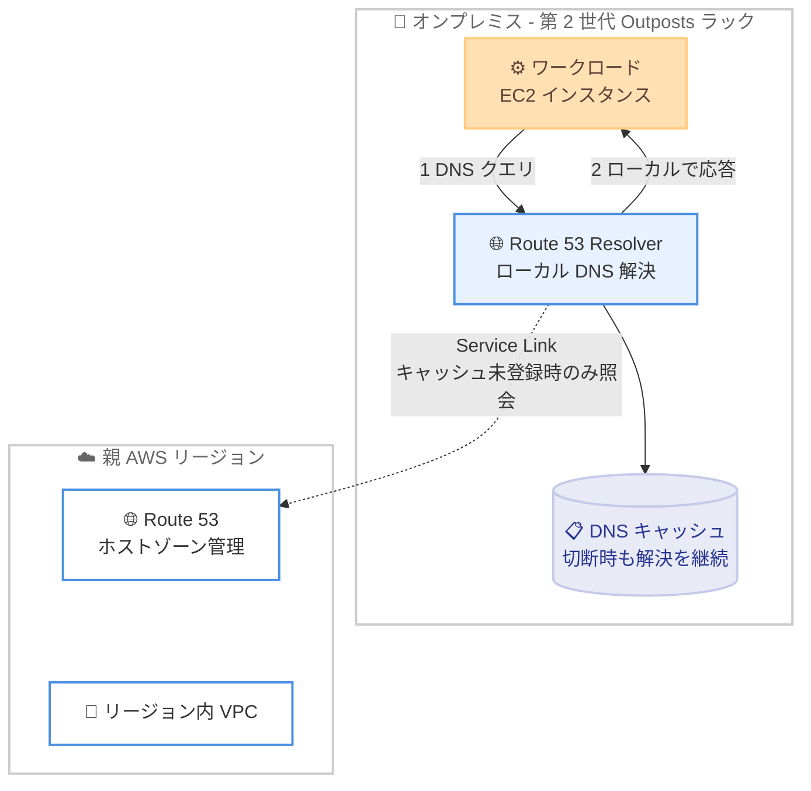

# Amazon Route 53 Resolver - 第 2 世代 AWS Outposts ラックでの一般提供開始

**リリース日**: 2026 年 9 月 22 日
**サービス**: Amazon Route 53 Resolver / AWS Outposts
**機能**: 第 2 世代 AWS Outposts ラック上でのローカル DNS 解決 (Route 53 Resolver on Outposts)

📊 [このアップデートのインフォグラフィックを見る](https://takech9203.github.io/aws-news-summary/20260922-route-53-resolver-gen2-outposts.html)

## 概要

Amazon Route 53 Resolver が第 2 世代 AWS Outposts ラックで一般提供 (GA) されました。これにより、Outposts 上のワークロードから発行される DNS クエリを、親リージョンへ転送することなく Outposts 上でローカルに解決できる、マネージドな再帰 DNS リゾルバーが利用可能になります。

DNS クエリがローカルで解決されるため、Service Link (Outposts と親リージョンを結ぶ接続) を経由する往復が不要になり、DNS 解決のレイテンシーが低減します。さらに、Service Link が切断された場合でも、キャッシュされた DNS レコードを保持することで DNS 解決を継続できるため、ネットワーク接続障害時のワークロードの耐障害性が向上します。

本機能はすべての第 2 世代 Outposts に組み込まれた AWS 管理のインフラストラクチャ上で動作するため、お客様のコンピュートキャパシティを消費しません。低レイテンシーや耐障害性が求められるオンプレミス環境で Outposts を運用するお客様にとって、重要なアップデートです。

**アップデート前の課題**

第 2 世代 Outposts では、これまで DNS 解決に以下の課題がありました。

- DNS クエリが Service Link を経由して親リージョンの Route 53 Resolver に転送されるため、クエリごとに WAN 往復のレイテンシーが発生していた
- Service Link が切断されると、リージョン側のリゾルバーに到達できず、DNS 解決が影響を受ける可能性があった
- ローカルで DNS 解決を行うには、お客様自身で Outposts 上に DNS サーバーを構築・運用する必要があった

**アップデート後の改善**

今回のアップデートにより、以下が可能になりました。

- DNS クエリが Outposts 上でローカルに解決され、Service Link を経由しないため、DNS 解決のレイテンシーが低減された
- Service Link 切断中もキャッシュされた DNS レコードにより DNS 解決を継続でき、接続断への耐障害性が向上した
- AWS 管理のインフラストラクチャ上で動作するフルマネージドサービスのため、お客様のコンピュートキャパシティの消費や DNS サーバーの運用が不要になった

## アーキテクチャ図



Outposts 上のワークロードからの DNS クエリは、ラック内のローカルリゾルバーで解決・応答されます。DNS レコードとホストゾーンの管理はリージョン側の Route 53 で一元的に行われ、Service Link 切断時はローカルキャッシュにより DNS 解決が継続します。

## サービスアップデートの詳細

### 主要機能

1. **ローカル再帰 DNS 解決**
   - Outposts 上のワークロードからの DNS クエリを Outposts 上でローカルに解決
   - Service Link を経由した親リージョンへの往復が不要になり、DNS 解決のレイテンシーが低減
   - Outposts 上のアプリケーション、リージョン内のピア VPC、パブリックなホスト名のレコードをローカルにキャッシュ

2. **Service Link 切断時の DNS 解決の継続**
   - キャッシュされた DNS レコードを保持し、Service Link 切断中も DNS 解決を継続
   - Outposts 上でホストされるリソースへの DNS クエリは切断中も解決可能 (切断中に IP アドレスが変更された場合は古い応答となる可能性あり)
   - パブリック DNS リソースもキャッシュに存在すれば解決可能

3. **AWS 管理インフラストラクチャ上でのフルマネージド動作**
   - すべての第 2 世代 Outposts に組み込まれた AWS 管理のインフラストラクチャ上で動作
   - お客様のコンピュートキャパシティを消費しない
   - マルチラック構成の第 2 世代 Outposts ではデフォルトで有効化 (オプトアウトは AWS Support 経由)

## 技術仕様

### アーキテクチャの特徴

| 項目 | 詳細 |
|------|------|
| DNS レコード / ホストゾーン管理 | 親リージョンの Route 53 で一元管理 (ローカルには保存されない) |
| リゾルバー機能 | Outposts ラック上に拡張され、クエリをローカルで処理 |
| 実行基盤 | 第 2 世代 Outposts に組み込まれた AWS 管理インフラストラクチャ |
| コンピュートキャパシティ | お客様のキャパシティ消費なし |
| デフォルト設定 | マルチラック構成の第 2 世代 Outposts で有効 (無効化は AWS Support へ依頼) |

### 第 1 世代 / 第 2 世代 Outposts での機能比較

| Route 53 の機能 | 第 1 世代 Outposts | 第 2 世代 Outposts |
|------|------|------|
| VPC Resolver (ローカルキャッシュ) | サポート | サポート |
| ヘルスチェック | 非サポート (リージョンから計算・報告) | 非サポート (リージョンから計算・報告) |
| Resolver エンドポイント | サポート (IPv4 のみ) | 非サポート |
| Resolver DNS Firewall | 非サポート | 非サポート |
| Traffic Flow | 非サポート | 非サポート |

### Service Link 切断時の動作

| 項目 | 切断時の動作 |
|------|------|
| コントロールプレーンの変更 | 利用不可 |
| ヘルスチェック / DNS フェイルオーバー | 利用不可 |
| Outposts 上のリソースへのクエリ | 解決可能 (切断中の IP 変更により古い応答となる場合あり) |
| リージョン内 VPC のリソースへのクエリ | 解決可能 (ただしリソース自体へは接続復旧まで到達不可) |
| パブリック DNS リソースへのクエリ | キャッシュに存在すれば解決可能 |

## 設定方法

### 前提条件

1. 第 2 世代 AWS Outposts ラックが設置済みであること
2. Outposts が第 2 世代 Outposts をサポートするリージョンに接続されていること
3. Route 53 on Outposts と互換性のないバージョンの Outposts ラックの場合、AWS アカウントチームからアップグレードの案内が届く

### 手順

#### ステップ 1: 有効化状況の確認

マルチラック構成の第 2 世代 Outposts では、本機能はデフォルトで有効化されています。追加の設定作業は不要で、Outposts 上のワークロードからの DNS クエリは自動的にローカルで解決されます。

#### ステップ 2: DNS 解決の動作確認

```bash
# Outposts 上の EC2 インスタンスから DNS クエリの解決を確認
dig amazon.com

# VPC 内リソースの名前解決を確認
dig <リージョン内 VPC のリソースの DNS 名>
```

Outposts 上のインスタンスから DNS クエリを発行し、名前解決が正常に行われることを確認します。クエリはローカルのリゾルバーで処理されます。

#### ステップ 3: オプトアウト (必要な場合のみ)

独自の DNS 解決を利用したい場合は、AWS Support に連絡してオプトアウトを依頼します。コンソールや API からの無効化操作は提供されていません。

## メリット

### ビジネス面

- **耐障害性の向上**: Service Link 切断時も DNS 解決が継続するため、オンプレミスワークロードの可用性が向上し、接続障害時の業務影響を低減できる
- **運用コストの削減**: フルマネージドで動作するため、ローカル DNS サーバーの構築・運用・パッチ適用などの負担が不要になる
- **リソース効率**: AWS 管理インフラストラクチャ上で動作するため、購入した Outposts のコンピュートキャパシティを DNS 用に割く必要がない

### 技術面

- **低レイテンシー**: DNS クエリが Service Link を経由せずローカルで解決されるため、名前解決の応答時間が短縮される
- **一元管理の維持**: DNS レコードとホストゾーンはリージョン側の Route 53 で管理され、既存の運用フローを変更せずにローカル解決の恩恵を受けられる
- **Service Link 帯域の節約**: DNS クエリのトラフィックが Service Link を流れなくなるため、帯域をアプリケーショントラフィックに有効活用できる

## デメリット・制約事項

### 制限事項

- 第 2 世代 Outposts では Resolver エンドポイント (インバウンド / アウトバウンド) がサポートされない (第 1 世代では IPv4 のみサポート)
- Resolver DNS Firewall および Traffic Flow はサポートされない
- ヘルスチェックはリージョンから計算・報告されるため、切断時はフェイルオーバーできずフェイルオープンとなる
- 2026 年 12 月 22 日以降は Outposts ラックあたり 0.65 USD/時間の料金が発生する

### 考慮すべき点

- 切断中に IP アドレスが変更されたリソースについては、古い (stale) レコードが返される可能性がある
- 切断中はリージョン内 VPC リソースの名前解決は可能だが、リソース自体へのアクセスは接続復旧まで行えない
- マルチラック構成ではデフォルトで有効化されるため、独自 DNS を利用する場合は AWS Support 経由でのオプトアウトが必要
- 料金はラック単位の時間課金のため、ラック数が多い環境ではコスト影響を事前に試算する必要がある

## ユースケース

### ユースケース 1: 製造業の工場システムにおける低レイテンシー DNS 解決

**シナリオ**: 工場内の Outposts 上で製造実行システム (MES) を稼働させており、マイクロサービス間の通信で頻繁に名前解決が発生する。リージョンへの往復による DNS レイテンシーが処理性能のボトルネックになっている。

**実装例**:
```
1. 第 2 世代 Outposts ではローカル DNS 解決がデフォルトで有効
2. Outposts 上のサービス間通信の DNS クエリはすべてローカルで解決
3. dig コマンド等で応答時間を計測し、改善効果を確認
```

**効果**: 名前解決の往復レイテンシーが排除され、サービス間通信の応答性能が向上する。

### ユースケース 2: ネットワーク切断に備えた回復性の高い店舗システム

**シナリオ**: 小売店舗やリモート拠点の Outposts 上で POS・在庫管理システムを稼働させており、WAN 回線 (Service Link) の一時的な切断時でも店舗業務を継続する必要がある。

**実装例**:
```
1. 通常運用時にローカルリゾルバーが DNS レコードをキャッシュ
2. Service Link 切断時もキャッシュにより名前解決を継続
3. ローカル完結型のアプリケーション構成と組み合わせて業務継続性を確保
```

**効果**: 切断中もローカルワークロードの名前解決が継続し、店舗業務の停止リスクを低減できる。

### ユースケース 3: ローカル DNS サーバーの廃止による運用簡素化

**シナリオ**: これまで Outposts 上の EC2 インスタンスに独自の DNS キャッシュサーバーを構築して低レイテンシー解決を実現していたが、パッチ適用や監視などの運用負荷が課題となっている。

**実装例**:
```
1. マネージドなローカルリゾルバーへ DNS 解決を移行
2. 独自 DNS キャッシュサーバー用の EC2 インスタンスを廃止
3. 解放されたコンピュートキャパシティをアプリケーションに再割り当て
```

**効果**: DNS サーバーの運用負荷がなくなり、Outposts のコンピュートキャパシティをビジネスワークロードに集中できる。

## 料金

すべてのお客様 (プレビュー参加者を含む) は、2026 年 12 月 21 日までの 91 日間の無料トライアルを利用できます。2026 年 12 月 22 日以降は、Outposts ラックあたり 0.65 USD/時間の料金が適用されます。

### 料金例

| 使用量 | 月額料金 (概算) |
|--------|------------------|
| 1 ラック x 730 時間 | 474.50 USD |
| 3 ラック x 730 時間 | 1,423.50 USD |
| 無料トライアル期間中 (2026 年 12 月 21 日まで) | 0 USD |

詳細は [Amazon Route 53 料金ページ](https://aws.amazon.com/route53/pricing/) を参照してください。

## 利用可能リージョン

第 2 世代 AWS Outposts がサポートされているすべての AWS リージョンで利用可能です。

## 関連サービス・機能

- **AWS Outposts**: AWS のインフラストラクチャとサービスをオンプレミスに拡張するフルマネージドサービス。本機能は第 2 世代ラックに組み込まれた AWS 管理インフラストラクチャ上で動作する
- **Amazon Route 53**: DNS レコードとホストゾーンの管理は引き続きリージョン側の Route 53 で一元的に行われる
- **Amazon VPC**: Outposts 上のサブネットは VPC の拡張であり、VPC Resolver がリージョン内 VPC リソースの名前解決もローカルで処理する

## 参考リンク

- 📊 [インフォグラフィック](https://takech9203.github.io/aws-news-summary/20260922-route-53-resolver-gen2-outposts.html)
- [公式発表 (What's New)](https://aws.amazon.com/about-aws/whats-new/2026/09/route-53-resolver-gen2-outposts/)
- [ドキュメント: What is Amazon Route 53 on Outposts?](https://docs.aws.amazon.com/Route53/latest/DeveloperGuide/outpost-resolver.html)
- [料金ページ](https://aws.amazon.com/route53/pricing/)

## まとめ

第 2 世代 AWS Outposts ラック上で Route 53 Resolver が GA となり、追加のコンピュートキャパシティ不要でローカル DNS 解決と切断時の解決継続が実現しました。第 2 世代 Outposts を利用中または導入予定のお客様は、2026 年 12 月 21 日までの無料トライアル期間中に動作とレイテンシー改善効果を確認し、12 月 22 日以降のラック単位課金 (0.65 USD/時間) を踏まえたコスト評価を行うことを推奨します。
