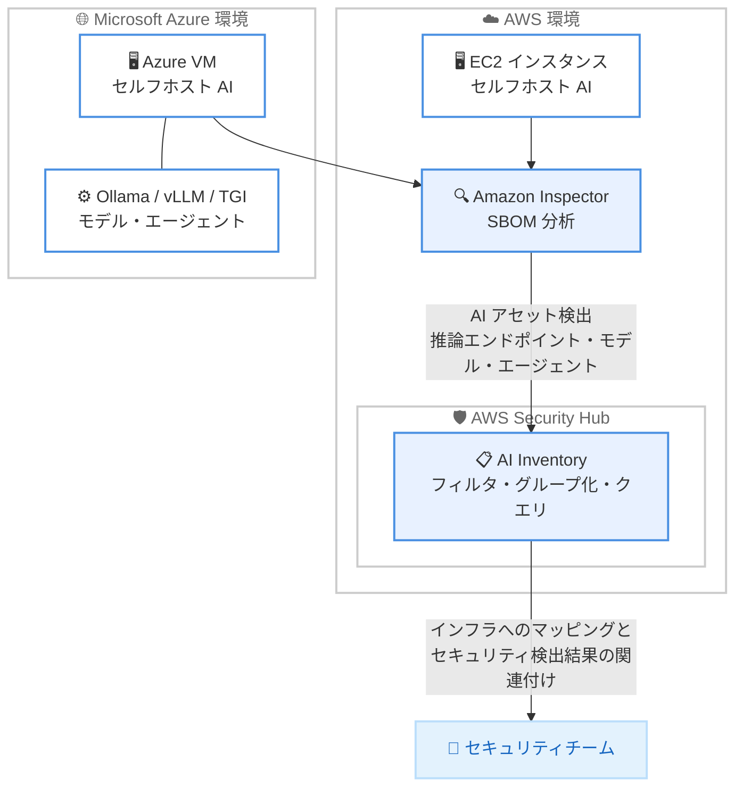

# AWS Security Hub - AI Inventory の Microsoft Azure セルフホストインスタンス対応

**リリース日**: 2026 年 9 月 22 日
**サービス**: AWS Security Hub
**機能**: AI Inventory - Azure セルフホストインスタンスサポート

📊 [このアップデートのインフォグラフィックを見る](https://takech9203.github.io/aws-news-summary/20260922-security-hub-ai-inventory-azure-support.html)

## 概要

AWS Security Hub の AI Inventory 機能が、Microsoft Azure 上のセルフホストインスタンスで稼働する AI アセットの検出とカタログ化に対応しました。これまで AWS 環境内に限定されていたセルフホスト AI アセットの検出範囲が AWS の外へ拡張され、マルチクラウド環境における AI セキュリティポスチャの一元管理が可能になります。

本機能は Amazon Inspector の SBOM (ソフトウェア部品表) 分析を活用し、Azure 仮想マシン上にインストールされた推論エンドポイント、モデル、AI エージェントを識別できるように強化されています。Ollama、vLLM、Hugging Face TGI などのフレームワークが検出対象に含まれます。検出された各 AI アセットは基盤となるインフラストラクチャにマッピングされ、セキュリティ検出結果と関連付けられます。

中央のセキュリティチームは、AWS と Azure の両環境にまたがる AI インベントリをフィルタリング、グループ化、クエリでき、組織全体の AI アセットとそのセキュリティポスチャを継続的に更新された状態で把握できます。シャドー AI (未承認の AI ワークロード) の可視化に取り組むセキュリティ担当者にとって重要なアップデートです。

**アップデート前の課題**

- Security Hub AI Inventory のセルフホスト AI 検出は AWS 環境 (Amazon EC2 インスタンス、Amazon ECR イメージ) に限定されていた
- Azure 上で稼働する AI ワークロードは別のツールや手動プロセスで棚卸しする必要があり、組織全体の AI アセットの可視性に空白が生じていた
- マルチクラウド環境では AI セキュリティポスチャを単一のビューで評価できず、未承認の AI 利用を見逃すリスクがあった

**アップデート後の改善**

- Azure 仮想マシン上の推論エンドポイント、モデル、AI エージェントを Security Hub が自動で検出、カタログ化できるようになった
- AWS と Azure にまたがる AI インベントリを単一のコンソールでフィルタリング、グループ化、クエリできるようになった
- 検出された AI アセットが基盤インフラにマッピングされ、セキュリティ検出結果と関連付けられるため、リスクの優先順位付けが容易になった
- Security Hub Essentials に追加料金なしで含まれるため、コスト増なしでマルチクラウド AI 可視性を獲得できる

## アーキテクチャ図



Amazon Inspector の SBOM 分析が AWS の EC2 インスタンスに加えて Azure VM 上の AI アセットも検出し、Security Hub AI Inventory がマルチクラウドの AI アセットを一元的に可視化する構成を示しています。

## サービスアップデートの詳細

### 主要機能

1. **Azure セルフホストインスタンスの AI アセット検出**
   - Azure 仮想マシン上にインストールされた推論エンドポイント、モデル、AI エージェントを検出、カタログ化
   - Amazon Inspector の SBOM 分析を強化し、Azure VM 上の AI 関連ソフトウェアコンポーネントを識別
   - Ollama、vLLM、Hugging Face TGI などの主要な AI フレームワークに対応

2. **インフラマッピングとセキュリティ検出結果の関連付け**
   - 検出された各 AI アセットは、稼働している基盤インフラストラクチャにマッピングされる
   - セキュリティ検出結果 (findings) と関連付けられるため、リスクの高い AI ワークロードを優先的にレビュー可能

3. **マルチクラウド AI インベントリの統合ビュー**
   - AWS と Azure にまたがる AI インベントリを単一のビューでフィルタリング、グループ化、クエリ
   - 組織全体で継続的に更新される AI アセットとセキュリティポスチャの可視性を提供
   - 未承認の AI ワークロード (シャドー AI) の特定に活用可能

## 技術仕様

### AI Inventory の検出タイプ

Security Hub AI Inventory は AI リソースを 2 つの検出タイプに分類します (公式ドキュメントによる)。

| 検出タイプ | 説明 | 検出ソース |
|------|------|------|
| Managed | AWS がマネージドサービスとして提供する AI リソース (Amazon Bedrock、Amazon Bedrock AgentCore、Amazon SageMaker の一部) | AWS Config 設定項目 |
| Self-hosted | 自前のコンピュート上で稼働するオープンソースモデル、エージェント、推論サーバーなど | Amazon Inspector SBOM、Amazon GuardDuty DNS アクティビティ |

### セルフホスト AI リソースタイプ

公式ドキュメントに記載されているセルフホスト AI リソースタイプは以下のとおりです。

| リソースタイプ | 内容 |
|------|------|
| `SelfHosted::AI::Model` | Hugging Face、Ollama のモデル (デフォルトのモデルキャッシュディレクトリおよび Inspector スキャン用に設定したカスタムパスで検出) |
| `SelfHosted::AI::InferenceEndpoint` | vLLM、Ollama、TorchServe、Triton、TGI、SGLang、llama.cpp、LocalAI、BentoML、Xinference、Ray Serve、GPT4All などのモデルサービングソフトウェア |
| `SelfHosted::AI::Agent` | AI エージェント |
| `SelfHosted::AI::ExternalEndpoint` | インスタンスが呼び出す外部 AI サービスドメイン (GuardDuty DNS アクティビティから検出) |

### API アクセス

AI インベントリのデータは `GetResourcesV2` および `GetResourcesStatisticsV2` API で取得できます。`ResourceSubCategory` でのフィルタリング時は `ResourceCategory` フィルタ (`AI/ML`) の併用が必須です。

```json
{
    "Filters": {
        "CompositeFilters": [
            {
                "Operator": "AND",
                "StringFilters": [
                    {
                        "FieldName": "ResourceCategory",
                        "Filter": { "Comparison": "EQUALS", "Value": "AI/ML" }
                    },
                    {
                        "FieldName": "ResourceSubCategory",
                        "Filter": { "Comparison": "EQUALS", "Value": "Model" }
                    }
                ]
            }
        ]
    }
}
```

## 設定方法

### 前提条件

1. AWS Security Hub (Security Hub Essentials) が有効化されていること
2. Amazon Inspector が有効化され、SBOM を生成できること (EC2 の場合は拡張スキャンモードのエージェントベーススキャン、エージェントレススキャン、またはハイブリッドスキャンが必要)
3. 外部 AI エンドポイントの検出には Amazon GuardDuty の有効化が必要
4. Azure 上のインスタンスを検出対象とするには、Azure 環境を Inspector のスキャン対象として接続する設定が必要 (詳細は公式ドキュメントを参照)

### 手順

#### ステップ 1: Security Hub と Amazon Inspector の有効化を確認

```bash
aws securityhub describe-hub --region us-east-1
aws inspector2 batch-get-account-status --region us-east-1
```

Security Hub と Amazon Inspector が有効化されているかを確認します。セルフホスト AI の検出には Inspector の SBOM 分析が必須です。

#### ステップ 2: AI Inventory ページで Azure アセットを確認

Security Hub コンソールの AI Inventory ページを開き、検出タイプやリソースタイプでグループ化して、Azure セルフホストインスタンス上の AI アセットを確認します。クイックフィルタでサブカテゴリ (モデル、エージェントなど) や検出タイプによる絞り込みが可能です。

#### ステップ 3: API で AI インベントリをクエリ

```bash
aws securityhub get-resources-statistics-v2 \
  --group-by-rules '[{"GroupByField": "ResourceInfo.AIDetails.CanonicalId", "Filters": {"CompositeFilters": [{"Operator": "AND", "StringFilters": [{"FieldName": "ResourceCategory", "Filter": {"Comparison": "EQUALS", "Value": "AI/ML"}}]}]}}]'
```

canonical ID でグループ化して、同一モデルが組織内のどのホスト (AWS と Azure の両方) にデプロイされているかを集計します。

## メリット

### ビジネス面

- **マルチクラウド AI ガバナンスの実現**: AWS と Azure にまたがる AI アセットを単一ビューで把握でき、AI 利用ポリシーの適用と監査が容易になる
- **シャドー AI リスクの低減**: 未承認の AI ワークロードを Azure 環境も含めて可視化し、コンプライアンス違反や情報漏えいリスクを早期に発見できる
- **追加コストなし**: Security Hub Essentials に含まれるため、マルチクラウド AI 可視性を追加料金なしで獲得できる

### 技術面

- **SBOM ベースの自動検出**: Amazon Inspector の SBOM 分析により、エージェントの個別導入や手動棚卸しなしで AI フレームワークを識別できる
- **インフラマッピングと検出結果の相関**: AI アセットが基盤インフラとセキュリティ検出結果に関連付けられ、リスクベースの優先順位付けが可能
- **柔軟なクエリ**: フィルタリング、グループ化、canonical ID による集計で、特定モデルの全デプロイメントを環境横断で追跡できる

## デメリット・制約事項

### 制限事項

- セルフホスト AI 検出の対象は Azure では仮想マシン上のインスタンスであり、対応フレームワーク (Ollama、vLLM、Hugging Face TGI など) に依存する
- 公式ドキュメント (GA 時点) では、セルフホスト AI リソース自体には findings が付与されず、findings 数の表示はマネージド AI リソースのみとされている
- モデルの検出はデフォルトのモデルキャッシュディレクトリと、Inspector スキャン用に設定したカスタムパスに限定される

### 考慮すべき点

- Azure 上のインスタンスを検出するには、Inspector の SBOM 分析が Azure VM に対して機能するよう接続設定が必要となるため、事前に公式ドキュメントで設定手順を確認すること
- 検出は信頼度ベースの仕組みであり、信頼度しきい値を満たしたリソースのみがインベントリに表示される (誤検出の最小化とのトレードオフ)
- GuardDuty DNS アクティビティによる外部 AI エンドポイント検出は EC2 のみが対象であるなど、検出ソースごとに対象範囲が異なる

## ユースケース

### ユースケース 1: マルチクラウド環境でのシャドー AI 検出

**シナリオ**: 開発チームが AWS と Azure の両方でコンピュートリソースを利用しており、セキュリティチームは未承認の LLM 実行環境 (Ollama など) が立ち上がっていないかを監視したい。

**実装例**:
```
1. Security Hub Essentials と Amazon Inspector を有効化
2. AI Inventory ページで検出タイプ Self-hosted のクイックフィルタを適用
3. ホストリソースタイプでグループ化し、Azure VM 上の AI アセットを確認
4. 未承認アセットを検出したら、担当チームへエスカレーション
```

**効果**: AWS と Azure の両環境で未承認 AI ワークロードを自動検出でき、ツールを分けずに一元的なガバナンスを実現できる。

### ユースケース 2: 特定モデルの全デプロイメント追跡

**シナリオ**: 脆弱性やライセンス問題が報告された特定の Hugging Face モデルについて、組織内のどのホストにデプロイされているかを環境横断で特定したい。

**実装例**:
```
GetResourcesStatisticsV2 API で
ResourceInfo.AIDetails.CanonicalId によるグループ化を実行し、
model/pkg:huggingface/... 形式の canonical ID で
AWS / Azure 全ホストのデプロイメントを集計
```

**効果**: 同一モデルの全デプロイメントを canonical ID で即座に特定でき、影響範囲の調査と対応の時間を大幅に短縮できる。

### ユースケース 3: AI アセットとセキュリティ検出結果の相関によるリスク優先順位付け

**シナリオ**: セキュリティチームは、AI ワークロードが稼働するインスタンスのうち、重大な脆弱性を持つものから優先的に対処したい。

**実装例**:
```
1. AI Inventory で AI アセットを検出したホストを特定
2. 各アセットに関連付けられたセキュリティ検出結果を確認
3. 重大度の高い findings を持つ AI ホストから修復を実施
```

**効果**: AI アセットの存在とセキュリティリスクを掛け合わせた優先順位付けにより、限られたリソースで効果的にリスクを低減できる。

## 料金

本機能は Security Hub Essentials に含まれており、追加料金なしで利用できます。

なお、セルフホスト AI 検出の前提となる Amazon Inspector や Amazon GuardDuty には各サービスの料金が適用されるため、未導入の場合は別途コストを考慮してください。

## 利用可能リージョン

AWS Security Hub が提供されているすべての AWS 商用リージョンで利用可能です。

## 関連サービス・機能

- **Amazon Inspector**: SBOM 分析によりセルフホスト AI アセット検出の主要シグナルを提供する。EC2 では拡張スキャンモードまたはエージェントレススキャンが必要
- **Amazon GuardDuty**: DNS アクティビティに基づき、インスタンスが呼び出す外部 AI サービスエンドポイント (OpenAI、Anthropic など) を検出する
- **AWS Config**: マネージド AI リソース (Amazon Bedrock、Amazon SageMaker など) の検出ソースとなる設定項目を提供する
- **AWS Security Hub Resources ページ**: セルフホスト AI カウントバッジやクイックフィルタで AI を実行するホストを特定できる

## 参考リンク

- 📊 [インフォグラフィック](https://takech9203.github.io/aws-news-summary/20260922-security-hub-ai-inventory-azure-support.html)
- [公式発表 (What's New)](https://aws.amazon.com/about-aws/whats-new/2026/09/security-hub-ai-inventory-azure-support/)
- [ドキュメント - AI Inventory in Security Hub](https://docs.aws.amazon.com/securityhub/latest/userguide/securityhub-v2-ai-inventory.html)
- [AWS Security Hub 製品ページ](https://aws.amazon.com/security-hub/)
- [料金ページ](https://aws.amazon.com/security-hub/pricing/)

## まとめ

Security Hub AI Inventory の Azure セルフホストインスタンス対応により、AI アセットの可視性が AWS の枠を越えてマルチクラウドへ拡張されました。追加料金なしで利用できるため、AWS と Azure を併用している組織は、まず Security Hub Essentials と Amazon Inspector の有効化状況を確認し、AI Inventory ページで組織全体の AI アセットの棚卸しを開始することを推奨します。
