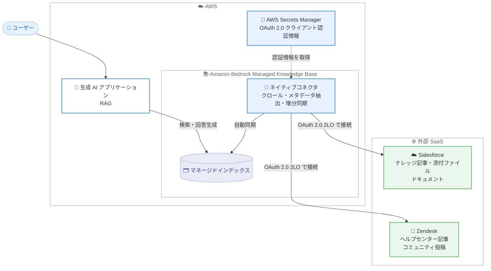

# Amazon Bedrock - Managed Knowledge Base の Salesforce / Zendesk ネイティブデータソースコネクタ対応

**リリース日**: 2026 年 9 月 23 日
**サービス**: Amazon Bedrock
**機能**: Managed Knowledge Base の Salesforce および Zendesk ネイティブデータソースコネクタ

📊 [このアップデートのインフォグラフィックを見る](https://takech9203.github.io/aws-news-summary/20260923-amazon-bedrock-managed-knowledge-base-salesforce-zendesk-native-data-source-connectors.html)

## 概要

Amazon Bedrock Managed Knowledge Base (フルマネージドの RAG サービス) が、Salesforce および Zendesk をネイティブデータソースコネクタとしてサポートしました。Salesforce のナレッジ記事や、Zendesk のヘルプセンター記事・コミュニティ投稿を、ナレッジベースに直接同期できるようになります。

これまで Salesforce や Zendesk のコンテンツを RAG アプリケーションで活用するには、カスタムの取り込みパイプラインを構築・運用する必要がありました。今回のアップデートにより、対象インスタンスの認証情報を提供するだけで、コンテンツのクロール、メタデータ抽出、増分同期をマネージドサービス側が自動的に処理します。Zendesk ヘルプセンター記事に基づく顧客向けサポートボットや、Salesforce ナレッジ記事を参照する社内営業支援アシスタントなどを構築するユーザーが対象です。

**アップデート前の課題**

このアップデート以前は、Salesforce や Zendesk のコンテンツをナレッジベースに取り込む際に以下の課題がありました。

- Salesforce / Zendesk からコンテンツを抽出するカスタム取り込みパイプラインを独自に開発・運用する必要があった
- コンテンツの更新をナレッジベースへ反映する同期処理 (差分検出やメタデータ抽出) を自前で実装する必要があった
- パイプラインの保守やエラー対応など、本来の生成 AI アプリケーション開発以外の運用負荷が発生していた

**アップデート後の改善**

今回のアップデートにより、以下が可能になりました。

- Salesforce ナレッジ記事 (添付ファイル、アーカイブ済み記事を含む) とドキュメントを直接同期できるようになった
- Zendesk のヘルプセンター記事 (添付ファイルを含む) とコミュニティ投稿を直接同期できるようになった
- クロール、メタデータ抽出、増分同期をマネージドサービスが自動処理するため、カスタムパイプラインが不要になった
- データカテゴリ、フォルダ、セクション、ラベルなどのフィルタで同期対象を柔軟にスコープできるようになった

## アーキテクチャ図



ネイティブコネクタが AWS Secrets Manager に保存された OAuth 2.0 認証情報を使用して Salesforce / Zendesk に接続し、コンテンツをクロールしてマネージドインデックスへ自動同期する構成です。生成 AI アプリケーションは同期されたコンテンツを RAG で活用します。

## サービスアップデートの詳細

### 主要機能

1. **Salesforce ネイティブコネクタ**
   - Salesforce ナレッジ記事のクロールに対応 (記事の添付ファイルを含む)。ドキュメントのクロールにも対応
   - アーカイブ済みナレッジ記事のクロールに対応
   - ナレッジ記事にはデータカテゴリフィルタ、ドキュメントにはフォルダフィルタを適用してクロール範囲をスコープ可能
   - 最大ファイルサイズによるフィルタリングに対応

2. **Zendesk ネイティブコネクタ**
   - ヘルプセンター記事のクロールに対応 (記事の添付ファイルを含む)。コミュニティ投稿のクロールにも対応
   - 記事フィルタ (カテゴリまたはセクション ID)、コミュニティ投稿フィルタ (トピック ID)、ラベルフィルタでクロール範囲をスコープ可能
   - マルチブランドの Zendesk インスタンスでは、同期したいブランドのサブドメインを指定して接続

3. **マネージドな取り込み・同期処理**
   - コンテンツのクロール、メタデータ抽出、増分同期をサービス側が自動処理
   - カスタム取り込みパイプラインの構築・運用が不要
   - AWS Management Console または API からデータソースを作成可能

### 認証方式

両コネクタとも OAuth 2.0 Client Credentials (2LO) 認証を使用します。対話的なサインインやユーザーごとの同意ステップは不要です。

- **Salesforce**: Salesforce 側で External Client App を登録し、専用の Run-As 統合ユーザーを割り当てます (Salesforce では Client Credentials Flow と呼ばれる方式)。コネクタはアプリとして認証し、Run-As ユーザーとして動作するため、クロール可能な範囲は Run-As ユーザーの権限に従います
- **Zendesk**: Zendesk 側で OAuth クライアントを登録し、コネクタがクライアント ID とクライアントシークレットをアクセストークンに交換します。コネクタは `read` スコープをリクエストし、クライアントがアクセスできるコンテンツをクロールします

## 技術仕様

### コネクタ仕様の比較

| 項目 | Salesforce | Zendesk |
|------|------------|---------|
| 同期対象 | ナレッジ記事 (添付ファイル含む)、ドキュメント | ヘルプセンター記事 (添付ファイル含む)、コミュニティ投稿 |
| アーカイブ済みコンテンツ | ナレッジ記事のアーカイブ済み記事に対応 | 記載なし |
| 認証方式 | OAuth 2.0 Client Credentials (2LO) | OAuth 2.0 Client Credentials (2LO) |
| スコープフィルタ | データカテゴリフィルタ、フォルダフィルタ、最大ファイルサイズ | カテゴリ / セクション ID、トピック ID、ラベル |
| ドキュメントレベル ACL | 非対応 | 非対応 |
| 必要なプラン / 設定 | My Domain の有効化が必須 | Zendesk Suite (Professional または Enterprise) |
| 認証情報の保存先 | AWS Secrets Manager | AWS Secrets Manager |

## 設定方法

### 前提条件

**Salesforce の場合**

1. Salesforce 組織への管理者アクセス権限 (External Client App の作成・管理権限を含む) があること
2. My Domain が有効化されていること (Client Credentials Flow に必須。インスタンス URL は `https://{your-domain}.my.salesforce.com` 形式)
3. Run-As ユーザーとして割り当てる専用の統合ユーザーが存在すること
4. コネクタが認証に使用する External Client App が作成・設定済みであること

**Zendesk の場合**

1. 管理者アクセス権限を持つ Zendesk Suite (Professional または Enterprise) アカウントがあること
2. Zendesk ホスト URL (例: `https://{yoursubdomain}.zendesk.com`) を把握していること
3. コネクタが認証に使用する OAuth クライアントが作成・設定済みであること

**AWS アカウント側 (共通)**

1. 認証情報を AWS Secrets Manager のシークレットに保存し、シークレットの ARN を控えていること
2. ナレッジベースの IAM ロール / アクセス許可ポリシーに、データソースへ接続するために必要な権限が含まれていること

### 手順

#### ステップ 1: 認証のセットアップ

Salesforce では External Client App を、Zendesk では OAuth クライアントを登録・設定し、クライアント ID とクライアントシークレットを取得します。詳細な手順は各コネクタの OAuth 2.0 セットアップドキュメントを参照してください。

#### ステップ 2: 認証情報を AWS Secrets Manager に保存

```bash
aws secretsmanager create-secret \
    --name "bedrock-kb-connector-credentials" \
    --secret-string '{"クライアント ID とシークレットをドキュメント指定の形式で記載"}'
```

取得した OAuth クライアント認証情報を AWS Secrets Manager のシークレットとして保存し、出力されるシークレット ARN を控えます。シークレットの具体的なキー形式は各コネクタのドキュメントに従ってください。

#### ステップ 3: データソースの接続

AWS Management Console または API を使用して、Managed Knowledge Base に Salesforce / Zendesk データソースを作成します。インスタンス URL (Salesforce の My Domain URL、Zendesk のホスト URL)、Secrets Manager のシークレット ARN、必要に応じてフィルタ設定を指定します。作成後にデータソースを同期すると、コネクタがコンテンツをクロールしてナレッジベースに取り込みます。

## メリット

### ビジネス面

- **開発期間の短縮**: カスタム取り込みパイプラインの開発が不要になり、サポートボットや営業支援アシスタントなどの生成 AI アプリケーションを迅速に構築できる
- **運用コストの削減**: パイプラインの保守・監視・エラー対応にかかる運用負荷をマネージドサービスにオフロードできる
- **ナレッジ活用の促進**: Salesforce / Zendesk に蓄積された既存のナレッジ資産を、追加のデータ移行なしで生成 AI アプリケーションから活用できる

### 技術面

- **自動的な増分同期**: コンテンツの変更をサービス側が検出して同期するため、鮮度の高いナレッジベースを維持できる
- **セキュアな認証管理**: OAuth 2.0 Client Credentials 認証と AWS Secrets Manager の組み合わせにより、認証情報を安全に管理できる
- **柔軟なスコープ制御**: データカテゴリ、フォルダ、セクション、トピック、ラベルなどのフィルタにより、同期対象を必要なコンテンツに限定できる

## デメリット・制約事項

### 制限事項

- **ドキュメントレベルの ACL は非対応**: Salesforce / Zendesk いずれのデータソースも、ドキュメントレベルのアクセスコントロールリストをサポートしない。ナレッジベースをクエリできる認証済みユーザーは、クロールされたすべてのコンテンツを参照できる
- Salesforce では My Domain の有効化が必須 (Client Credentials Flow の要件)
- Zendesk は Zendesk Suite の Professional または Enterprise プランが必要

### 考慮すべき点

- Salesforce コネクタのクロール範囲は Run-As ユーザーの権限に従うため、統合ユーザーの権限設計が重要になる
- 機密情報を含む記事がある場合は、ACL 非対応であることを踏まえ、フィルタで同期対象を適切にスコープする必要がある
- 発表文には対応リージョンと料金の記載がないため、利用前に公式ドキュメントおよび料金ページで最新情報を確認することを推奨する

## ユースケース

### ユースケース 1: Zendesk ヘルプセンターを活用した顧客向けサポートボット

**シナリオ**: Zendesk ヘルプセンターに FAQ やトラブルシューティング記事を蓄積している企業が、顧客からの問い合わせに 24 時間対応できるサポートボットを構築したい。

**実装例**:
```text
1. Zendesk で OAuth クライアントを登録し、認証情報を Secrets Manager に保存
2. Managed Knowledge Base に Zendesk データソースを作成
   - 対象: ヘルプセンター記事 + コミュニティ投稿
   - フィルタ: 公開向けカテゴリ ID のみを指定
3. RetrieveAndGenerate を利用したサポートボットを構築
```

**効果**: ヘルプセンターの記事更新が自動的にナレッジベースへ反映され、常に最新情報に基づく回答を顧客に提供できる。

### ユースケース 2: Salesforce ナレッジ記事を参照する社内営業支援アシスタント

**シナリオ**: 営業部門が Salesforce Knowledge に製品情報や提案ノウハウを蓄積しており、営業担当者が商談準備の際に素早く情報へアクセスできるアシスタントを求めている。

**実装例**:
```text
1. Salesforce で External Client App を登録し、Run-As 統合ユーザーを割り当て
2. Managed Knowledge Base に Salesforce データソースを作成
   - 対象: ナレッジ記事 (添付ファイル含む)
   - フィルタ: 営業向けデータカテゴリを指定
3. 社内チャットツールと連携した営業支援アシスタントを構築
```

**効果**: 営業担当者が自然言語で質問するだけで、Salesforce に蓄積されたナレッジへ即座にアクセスでき、商談準備の時間を短縮できる。

### ユースケース 3: 複数ソースを統合したカスタマーサクセス基盤

**シナリオ**: Salesforce のナレッジ記事と Zendesk のヘルプセンター記事の両方を運用している企業が、両方のコンテンツを横断的に検索できる統合ナレッジ基盤を構築したい。

**実装例**:
```text
1. 同一の Managed Knowledge Base に Salesforce と Zendesk の
   両方のデータソースを作成
2. それぞれのフィルタで同期対象をスコープ
3. カスタマーサクセスチーム向けの横断検索アシスタントを構築
```

**効果**: 複数の SaaS に分散していたナレッジをカスタムパイプラインなしで一元化し、問い合わせ対応の品質と速度を向上できる。

## 料金

発表文には料金に関する記載はありません。Amazon Bedrock Knowledge Bases の料金体系に準じると考えられるため、最新の料金は [Amazon Bedrock 料金ページ](https://aws.amazon.com/bedrock/pricing/) で確認してください。

## 利用可能リージョン

発表文には対応リージョンの記載はありません。Managed Knowledge Base および各コネクタの対応リージョンは、[Amazon Bedrock ユーザーガイド](https://docs.aws.amazon.com/bedrock/latest/userguide/) で最新情報を確認してください。

## 関連サービス・機能

- **Amazon Bedrock Knowledge Bases**: 本アップデートの対象であるフルマネージド RAG 機能。データソースからのコンテンツ取り込み、ベクトル化、検索、回答生成を提供
- **AWS Secrets Manager**: Salesforce / Zendesk の OAuth 2.0 クライアント認証情報の保存先として使用
- **AWS Identity and Access Management (IAM)**: ナレッジベースがデータソースへ接続するための権限をロール / ポリシーで管理

## 参考リンク

- 📊 [インフォグラフィック](https://takech9203.github.io/aws-news-summary/20260923-amazon-bedrock-managed-knowledge-base-salesforce-zendesk-native-data-source-connectors.html)
- [公式発表 (What's New)](https://aws.amazon.com/about-aws/whats-new/2026/09/amazon-bedrock-managed-knowledge-base-salesforce-zendesk-native-data-source-connectors/)
- [ドキュメント: Salesforce データソースコネクタ](https://docs.aws.amazon.com/bedrock/latest/userguide/kb-managed-ds-salesforce.html)
- [ドキュメント: Zendesk データソースコネクタ](https://docs.aws.amazon.com/bedrock/latest/userguide/kb-managed-ds-zendesk.html)
- [製品ページ: Amazon Bedrock Knowledge Bases](https://aws.amazon.com/bedrock/knowledge-bases/)
- [料金ページ: Amazon Bedrock](https://aws.amazon.com/bedrock/pricing/)

## まとめ

Amazon Bedrock Managed Knowledge Base が Salesforce と Zendesk のネイティブコネクタに対応したことで、これらの SaaS に蓄積されたナレッジをカスタムパイプラインなしで RAG アプリケーションに活用できるようになりました。カスタマーサポートボットや社内ナレッジアシスタントの構築を検討している場合は、まず各コネクタの OAuth 2.0 セットアップドキュメントを確認し、ドキュメントレベル ACL が非対応である点を踏まえた同期スコープの設計から始めることを推奨します。
