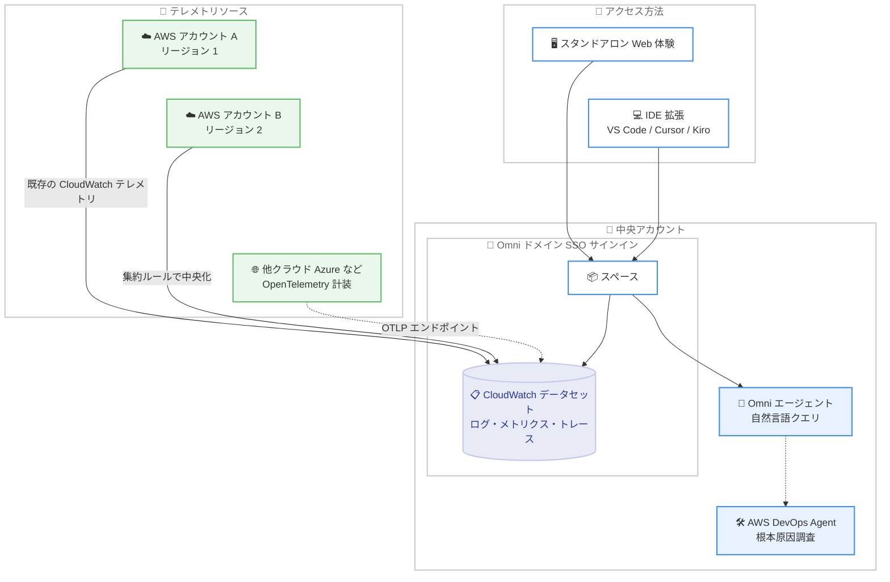

# Amazon CloudWatch - CloudWatch Omni (AI ファーストオブザーバビリティ)

**リリース日**: 2026 年 9 月 23 日
**サービス**: Amazon CloudWatch
**機能**: Amazon CloudWatch Omni

📊 [このアップデートのインフォグラフィックを見る](https://takech9203.github.io/aws-news-summary/20260923-amazon-cloudwatch-omni-ai.html)

## 概要

Amazon CloudWatch Omni が一般提供 (GA) を開始した。CloudWatch Omni は Amazon CloudWatch を進化させた AI ファーストのオブザーバビリティ体験であり、チームとアプリケーションを中心に構成される。アプリケーションと AI エージェントを単一の場所で観測・トラブルシューティングでき、OpenTelemetry の相互運用性と CloudWatch のスケール・信頼性を融合している。

CloudWatch Omni は、シングルサインオン (SSO) に対応したスタンドアロンの Web 体験と、ローカルの IDE 拡張 (VS Code、Cursor、Kiro) の両方で利用できる。AWS マネジメントコンソールの外からアクセスできる点が従来の CloudWatch との大きな違いである。中央アカウントに「スペース」を作成することで、複数の AWS アカウント・リージョン、さらに Azure などの他クラウドで実行されるワークロードのテレメトリも横断的に可視化できる。サービスの自動検出、依存関係のマッピング、ゴールデンメトリクスの表示に対応しており、手動設定なしで運用を開始できる。

対象ユーザーは、マルチアカウント・マルチクラウド環境を運用する SRE・運用チームに加え、生成 AI エージェントを開発・運用するアプリケーション開発者である。エージェント開発者向けには、評価駆動開発ワークフローを備えた専用のエージェントオブザーバビリティ体験が提供される。

**アップデート前の課題**

- 以前は CloudWatch の利用に AWS マネジメントコンソールへのサインインが必要で、開発者やオンコール担当者が IDE や独自の URL から直接オブザーバビリティデータにアクセスすることができなかった
- 以前はアプリケーションのテレメトリと AI エージェントの品質評価が別々のツールに分かれており、レイテンシーやエラーと応答品質を同じトレース上で確認できなかった
- 以前はサービスマップや主要メトリクスの把握に手動でのダッシュボード構築やクエリ作成が必要で、SQL や独自クエリ言語の習熟が求められた
- 以前は Azure など他クラウドのワークロードを含めた横断的な可視化に、サードパーティ製ツールの併用が必要になるケースがあった

**アップデート後の改善**

- 今回のアップデートにより、SSO 対応の専用 URL (`https://<ドメイン名>.cloudwatch-omni.global.app.aws`) と IDE 拡張から、コンソール外でオブザーバビリティ体験を利用できるようになった
- 今回のアップデートにより、テレメトリからサービス・依存関係を自動検出し、RED メトリクス (リクエストレート、エラー、レイテンシー) などのゴールデンメトリクスが設定なしで表示されるようになった
- 今回のアップデートにより、自然言語チャットで質問すると Omni が SQL や PromQL のクエリを自動生成し、AWS DevOps Agent による根本原因調査も開始できるようになった
- 今回のアップデートにより、LangGraph、CrewAI、OpenAI Agents SDK、Vercel AI SDK、Strands などのフレームワークで構築した AI エージェントを、プロンプト・モデル呼び出し・ツール呼び出しの単位で評価できるようになった

## アーキテクチャ図



複数の AWS アカウント・リージョンおよび他クラウドのテレメトリが中央アカウントのスペース配下の CloudWatch データセットに集約され、SSO 対応の Web 体験と IDE 拡張の両方からアクセスできる構成を示している。

## サービスアップデートの詳細

### 主要機能

1. **スペースによるマルチアカウント・マルチクラウドの一元可視化**
   - 中央アカウントにスペースを作成し、複数の AWS アカウント・リージョンのテレメトリを横断的に表示できる
   - Azure など他クラウドで実行されるワークロードも、OpenTelemetry で計装して OTLP エンドポイントに送信することで観測対象にできる
   - スペースは 1 つのアカウント・リージョンにマッピングされ、アクセス境界として機能する。複数アカウント・リージョンの集約は CloudWatch の集約ルール (centralization rules) を利用する

2. **サービスの自動検出とゴールデンメトリクス**
   - 手動設定なしで、テレメトリからサービスとその依存関係を自動検出し、アプリケーションマップとして可視化する
   - 各サービスの RED メトリクス (リクエストレート、エラー、レイテンシー) を自動的にレポートする
   - 既に CloudWatch に送信しているテレメトリは、再設定なしでそのまま Omni に表示される

3. **AI による自然言語操作と根本原因調査**
   - 組み込み AI アシスタントである Omni エージェントに自然言語で質問すると、SQL や PromQL のクエリを自動生成し、テレメトリから回答する
   - チャットで関連テレメトリの検索、動的ビューの構築、根本原因分析の支援が可能 (AWS DevOps Agent により提供)
   - ガイド付きのポイント & クリック操作や、Agent Toolkit for AWS を通じた外部ツールからの利用にも対応する
   - アラートは Slack 連携または Amazon SNS 経由で任意の宛先に通知できる

4. **AI エージェント向けオブザーバビリティと評価駆動開発**
   - LangGraph、CrewAI、OpenAI Agents SDK、Vercel AI SDK、Strands などのフレームワークに対応した専用のエージェント観測体験を提供する
   - プロンプト、モデル呼び出し、ツール呼び出しごとに応答品質を評価し、レイテンシー・エラー・トークン使用量と同じトレース上にスコアを表示する
   - 本番環境での継続的な評価と、データセットに対するオンデマンド評価の両方に対応する。ジャッジモデルで採点するカスタム評価基準の持ち込みも可能
   - リリース前に修正を検証する実験 (エクスペリメント) の実行をサポートする

5. **SSO 対応の Web 体験と IDE 拡張**
   - ドメインをセットアップすると、組織専用のサインイン URL が発行され、既存の ID プロバイダーで管理する ID を使ってサインインできる
   - VS Code、Cursor、Kiro 向けの無料の CloudWatch Omni 拡張により、ローカルでエージェントの計装・デバッグ・評価が可能。ローカル利用には AWS アカウントは不要

## 技術仕様

### CloudWatch Omni の構成要素

| 項目 | 詳細 |
|------|------|
| ドメイン | 組織のエントリーポイント。サインイン URL (`https://<ドメイン名>.cloudwatch-omni.global.app.aws`) と ID プロバイダー連携を提供 |
| スペース | 作業単位。ホストするアカウント・リージョンのテレメトリへのアクセスとアクセス制御の境界。1 ドメインに複数スペースを作成可能 |
| CloudWatch データセット | ログ・トレースをクエリ可能にし、シグナル横断で相関付ける。Omni 有効化時にスペースごとに 1 つ作成される |
| クエリ言語 | SQL、PromQL (自然言語からの自動生成に対応) |
| 対応 IDE | VS Code、Cursor、Kiro (拡張機能は無料、ローカル利用は AWS アカウント不要) |
| 対応エージェントフレームワーク | LangGraph、CrewAI、OpenAI Agents SDK、Vercel AI SDK、Strands など |
| 通知先 | Slack、Amazon SNS 経由の任意の宛先 |

### 既存 CloudWatch との関係

| 項目 | 詳細 |
|------|------|
| 位置付け | CloudWatch 上に構築されたインターフェイスとワークフロー。置き換えではない |
| データストア | 既存の CloudWatch データストアを読み取る。既存のコンソール・メトリクス・アラーム・ダッシュボード・API はそのまま動作 |
| 計装 | CloudWatch エージェント、OTLP パイプライン、AWS SDK による既存の計装は変更不要 |
| テレメトリの集約 | Omni 自体はアカウント・リージョン横断の集約を行わず、CloudWatch の集約ルールで中央化したテレメトリを表示する |

### API 変更履歴

| 日付 | サービス | 変更内容 |
|------|----------|----------|
| 2026/09/22 | [CloudWatch Omni](https://awsapichanges.com/archive/changes/22c55b-cloudwatch-omni.html) | 61 new api methods - CloudWatch Omni の GA に伴う新規 API 群の追加 |
| 2026/09/22 | [CloudWatch Observability Admin Service](https://awsapichanges.com/archive/changes/22c55b-observabilityadmin.html) | 5 new 4 updated api methods - マルチアカウントリソース検出のためのコンテキストグラフ集約と、ログを CloudWatch データセットで利用可能にするデータセット統合のサポート |

## 設定方法

### 前提条件

1. CloudWatch Omni が利用可能なリージョン (米国東部 (バージニア北部)、米国西部 (オレゴン)、欧州 (アイルランド)) のいずれかを利用できること
2. ドメインのセットアップに使用する ID プロバイダー (SSO) を用意していること
3. 複数アカウント・リージョンを観測する場合、CloudWatch の集約ルールを設定できる権限があること

### 手順

#### ステップ 1: Omni ドメインとスペースの作成

```bash
# CloudWatch コンソールから Omni スペースを作成し、ドメイン名を設定する
# 設定後、以下の形式のサインイン URL が発行される
# https://<ドメイン名>.cloudwatch-omni.global.app.aws
```

CloudWatch コンソールから Omni のスペースを作成し、ドメイン名を選択する。ドメイン名が組織のサインイン URL となるため、記録しておく。ID プロバイダーはスペースごとではなくドメインに対して接続する。

#### ステップ 2: SSO のセットアップとサインイン

発行されたドメイン URL に対して ID プロバイダーを接続し、既存の ID でスタンドアロンの Web 体験にサインインする。AWS マネジメントコンソールへのサインインは不要である。

#### ステップ 3: テレメトリの送信

既に CloudWatch に送信しているテレメトリは再設定なしで Omni に表示される。OpenTelemetry で計装した他クラウドのワークロードは、OTLP エンドポイントにテレメトリを送信する。複数アカウント・リージョンを横断する場合は、CloudWatch の集約ルールで中央アカウントにテレメトリを集約する。

#### ステップ 4: IDE 拡張のインストール (エージェント開発者向け)

```bash
# VS Code の場合、Marketplace から拡張機能をインストールする
# 拡張機能 ID: AmazonWebServices.amazon-cloudwatch-omni
code --install-extension AmazonWebServices.amazon-cloudwatch-omni
```

VS Code、Cursor、Kiro に無料の CloudWatch Omni 拡張をインストールすると、ローカルでエージェントの計装・デバッグ・評価ができる。ローカル利用には AWS アカウントは不要である。

## メリット

### ビジネス面

- **運用効率の向上**: サービスの自動検出とゴールデンメトリクスの自動表示により、ダッシュボード構築やクエリ作成の初期工数を削減できる
- **ツール統合によるコスト最適化**: アプリケーション監視、マルチクラウド可視化、AI エージェント評価を単一の体験に統合でき、サードパーティ製ツールの併用を減らせる可能性がある
- **オンボーディングの容易さ**: SSO 対応の専用 URL により、AWS コンソールへのアクセス権を持たないメンバー (開発者、QA、サポートなど) もオブザーバビリティデータにアクセスできる

### 技術面

- **OpenTelemetry ネイティブ**: OpenTelemetry を基盤としており、既存の計装を変更せずに利用できる。ベンダーロックインを抑えつつ CloudWatch のスケールを活用できる
- **AI エージェントの品質観測**: エラーレートでは捉えられない「形式は正しいが内容が誤っている応答」を評価器で検出し、運用メトリクスと同じトレース上で確認できる
- **AI 支援による調査の高速化**: 自然言語からの SQL / PromQL 自動生成と AWS DevOps Agent による根本原因調査により、インシデント対応時間を短縮できる
- **既存資産との互換性**: 既存の CloudWatch のメトリクス・アラーム・ダッシュボード・API はそのまま動作し、段階的な移行が可能

## デメリット・制約事項

### 制限事項

- 一般提供リージョンは米国東部 (バージニア北部)、米国西部 (オレゴン)、欧州 (アイルランド) の 3 リージョンのみで、東京リージョンは現時点で未対応
- スペースは 1 つのアカウント・リージョンにマッピングされるため、複数アカウント・リージョンの横断観測には CloudWatch の集約ルールによる中央化設定が別途必要
- 無料トライアルのクレジット (30 日間 1,000 USD) は OpenTelemetry インジェストのみが対象で、1 AWS Organization あたり 10 アカウントまでという制限がある

### 考慮すべき点

- インジェスト・ストレージ・分析の従量課金が発生するため、テレメトリ量の多い環境では事前にコスト試算を行うことを推奨する。料金例では月間 5 TB 規模で約 2,393 USD となる
- エージェント評価は Amazon Bedrock AgentCore Evaluations の料金で課金されるため、評価のサンプリング率の設計がコストに影響する
- ドメインのサインイン URL は AWS コンソール外のエンドポイントとなるため、組織のセキュリティポリシー (アクセス制御、監査) との整合を確認する必要がある

## ユースケース

### ユースケース 1: マルチアカウント・マルチクラウド環境の一元監視

**シナリオ**: 複数の AWS アカウントとリージョンに加え、一部のワークロードを Azure で運用している企業が、監視ツールが分散しており障害調査に時間がかかっている。

**実装例**:
```
1. 中央アカウントに Omni ドメインとスペースを作成
2. CloudWatch の集約ルールで各アカウント・リージョンのテレメトリを中央化
3. Azure 上のワークロードを OpenTelemetry で計装し、OTLP エンドポイントに送信
4. アプリケーションマップで全体の依存関係と RED メトリクスを確認
```

**効果**: クラウドやアカウントの境界を越えた単一のオブザーバビリティ体験が実現し、障害の影響範囲特定と根本原因調査が高速化する。

### ユースケース 2: 生成 AI エージェントの評価駆動開発

**シナリオ**: LangGraph で構築したカスタマーサポートエージェントが、エラーは発生していないものの誤った回答を返すことがあり、品質の定量評価と改善サイクルを確立したい。

**実装例**:
```
1. VS Code に CloudWatch Omni 拡張をインストール (AWS アカウント不要)
2. エージェントを計装し、プロンプト・モデル呼び出し・ツール呼び出しをトレース
3. 評価器で応答品質をスコアリングし、データセットに対するオンデマンド評価を実施
4. 修正後にエクスペリメントを実行し、リリース前に品質改善を検証
5. 本番リリース後は継続評価でスコアをレイテンシー・トークン使用量と併せて監視
```

**効果**: エラーレートでは検出できない品質劣化を早期に発見し、リリース前の実験による検証で本番品質のリグレッションを防止できる。

### ユースケース 3: 自然言語によるインシデント調査

**シナリオ**: オンコール担当者が SQL や PromQL に不慣れで、深夜のアラート対応時にクエリ作成に時間がかかっている。

**実装例**:
```
1. アラートを Slack に通知するよう設定
2. アラート発報時に Omni エージェントへ自然言語で質問
   例:「直近 30 分でエラーレートが上昇したサービスとその依存先を表示して」
3. AWS DevOps Agent で調査を開始し、根本原因の候補を特定
4. 調査内容をスレッド機能でチームと共有し、記録として残す
```

**効果**: クエリ言語の習熟度に依存せずに調査を進められ、平均復旧時間 (MTTR) の短縮とチーム内のナレッジ共有が実現する。

## 料金

CloudWatch Omni の料金は「インジェスト」「ストレージ」「分析」の 3 つのディメンションで構成される (以下は米国東部 (バージニア北部) の料金)。

- **インジェスト**: アプリケーションログ・カスタムログおよび OpenTelemetry メトリクスは 0.50 USD/GB。スパン・トレースは 0.35 USD/GB から (30 TB 超で 0.15 USD/GB)。クロスアカウント・リージョンの最初の集約コピーは無料、追加コピーは 0.05 USD/GB
- **ストレージ**: 標準 0.030 USD/GB - 月。Intelligent Tiering 有効時、30 日間アクセスのないデータは 0.018 USD、90 日間で 0.006 USD に自動移行
- **分析**: ログ・トレースのクエリは 0.005 USD/スキャン GB (月間インジェスト量の 5 倍までのスキャンは無料)。PromQL メトリクスクエリは 100 万サンプルあたり 0.01 USD。エージェント評価は Amazon Bedrock AgentCore Evaluations の料金で課金

Omni を有効化すると、30 日間有効な 1,000 USD の無料トライアルクレジットが自動適用される (OpenTelemetry インジェストのみ対象、1 AWS Organization あたり 10 アカウントまで)。

### 料金例

| 使用量 | 月額料金 (概算) |
|--------|------------------|
| ECS / Lambda 上のアプリケーション (ログ 3 TB、メトリクス 1 TB、スパン 1 TB) | 約 2,393 USD |
| マルチアカウント・マルチリージョン (12 アカウント、3 リージョン、約 30 TB、DR コピー含む) | 約 12,976 USD |
| 本番 AI エージェント (スパン 1 TB、ログ 0.6 TB、評価サンプリング 2%) | 約 657 USD + 評価料金 |

詳細は [CloudWatch Omni 料金ページ](https://aws.amazon.com/cloudwatch/omni/pricing/) を参照。

## 利用可能リージョン

以下の 3 リージョンで一般提供されている。

- 米国東部 (バージニア北部)
- 米国西部 (オレゴン)
- 欧州 (アイルランド)

IDE 拡張によるローカルでのエージェント開発は AWS アカウント不要で利用できる。

## 関連サービス・機能

- **Amazon CloudWatch**: Omni は CloudWatch 上に構築されたインターフェイスであり、既存のメトリクス・ログ・アラーム・ダッシュボードをそのまま活用する
- **AWS DevOps Agent**: アラート発報時の根本原因調査を担う AI エージェント。Omni から調査を開始できる
- **Amazon Bedrock AgentCore Evaluations**: エージェント評価の実行基盤であり、評価料金はこのサービスの料金体系に従う
- **Amazon SNS**: Slack 以外の任意の宛先へのアラート通知に使用する
- **OpenTelemetry**: Omni の基盤となるテレメトリ標準。OTLP エンドポイント経由で他クラウドのワークロードも観測できる
- **Kiro**: AWS が提供する AI 搭載 IDE。CloudWatch Omni 拡張に対応し、ローカルでのエージェント開発・評価に利用できる

## 参考リンク

- 📊 [インフォグラフィック](https://takech9203.github.io/aws-news-summary/20260923-amazon-cloudwatch-omni-ai.html)
- [公式発表 (What's New)](https://aws.amazon.com/about-aws/whats-new/2026/09/amazon-cloudwatch-omni-ai/)
- [AWS Blog: Introducing Amazon CloudWatch Omni: collaborative AI-powered observability for your applications](https://aws.amazon.com/blogs/aws/introducing-amazon-cloudwatch-omni-collaborative-ai-powered-observability-for-your-applications/)
- [AWS Blog: Introducing Amazon CloudWatch Omni: AI-powered observability for generative AI and agentic workloads](https://aws.amazon.com/blogs/aws/introducing-amazon-cloudwatch-omni-ai-powered-observability-for-generative-ai-and-agentic-workloads/)
- [製品ページ](https://aws.amazon.com/cloudwatch/omni/)
- [ドキュメント](https://docs.aws.amazon.com/AmazonCloudWatch/latest/monitoring/cloudwatch-omni.html)
- [料金ページ](https://aws.amazon.com/cloudwatch/omni/pricing/)

## まとめ

Amazon CloudWatch Omni は、アプリケーションと AI エージェントのオブザーバビリティを AI ファーストの単一体験に統合する、CloudWatch の大きな進化である。既存の CloudWatch テレメトリを変更なしで活用でき、OpenTelemetry によりマルチクラウドにも対応するため、まずは無料トライアルクレジットを利用してスペースを作成し、自動検出されるアプリケーションマップと自然言語クエリを評価することを推奨する。AI エージェントを開発しているチームは、AWS アカウント不要の IDE 拡張から評価駆動開発ワークフローを試すことができる。
