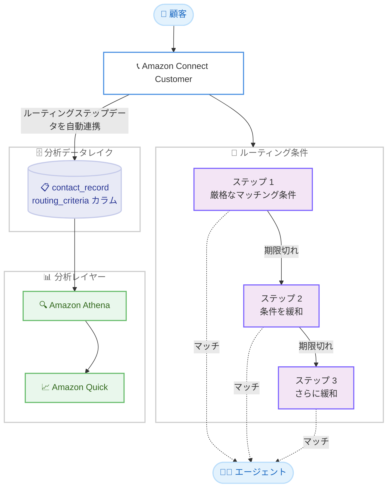

# Amazon Connect Customer - 分析データレイクでのルーティングステップデータ提供

**リリース日**: 2026 年 9 月 23 日
**サービス**: Amazon Connect Customer
**機能**: 分析データレイクにおけるルーティングステップデータの提供

📊 [このアップデートのインフォグラフィックを見る](https://takech9203.github.io/aws-news-summary/20260923-amazon-connect-routing-step-data.html)

## 概要

Amazon Connect Customer の分析データレイクで、ルーティングステップデータが利用可能になりました。コンタクトセンターの管理者やアナリストは、Amazon Athena や Amazon Quick を使用して、各ルーティングステップでキューに投入されたコンタクト数や接続されたコンタクト数などの傾向を、複雑なデータパイプラインを構築することなく分析できます。

具体的には、コンタクトがルーティングステップをどのように通過したかの追跡、エージェントマッチング条件が緩和されたポイントの特定、ルーティングステップの設定が待ち時間やエージェント稼働率に与える影響の測定が可能になります。ルーティング条件 (プロフィシエンシーベースルーティングなど) を活用しているコンタクトセンターにとって、ルーティング設計の効果を定量的に評価し、継続的に改善するための重要な機能強化です。

**アップデート前の課題**

このアップデート以前は、ルーティングステップに関する分析に以下の課題がありました。

- ルーティングステップごとの詳細データを分析するには、コンタクトレコードのイベントストリームを独自に処理するデータパイプラインの構築が必要だった
- エージェントマッチング条件がどのステップで緩和されたのかを、大量のコンタクトに対して横断的に把握することが困難だった
- ルーティング条件の設定変更が待ち時間やエージェント稼働率に与える影響を、SQL ベースで定量的に測定する標準的な手段がなかった

**アップデート後の改善**

今回のアップデートにより、以下が可能になりました。

- 分析データレイクの `contact_record` テーブルに含まれる `routing_criteria` カラムを通じて、各コンタクトのルーティング条件とルーティングステップのデータを直接クエリできるようになった
- Amazon Athena の標準 SQL だけで、ステップごとのステータス、有効期限、条件式 (エクスプレッション) を展開して分析できるようになった
- Amazon Quick でルーティングステップの傾向をダッシュボード化し、ルーティング設定の改善サイクルを回せるようになった

## アーキテクチャ図



コンタクトのルーティングステップデータが分析データレイクの `contact_record` テーブルに自動的に連携され、Amazon Athena によるクエリと Amazon Quick によるダッシュボード化が可能になるデータフローを示しています。

## サービスアップデートの詳細

### 主要機能

1. **ルーティングステップデータのデータレイクへの追加**
   - `contact_record` テーブルの `routing_criteria` カラム (array 型) として提供
   - 各ルーティング条件には、アクティベーションタイムスタンプ、インデックス、ルーティングステップのリストが含まれる
   - 各ステップには、ステータス、有効期限 (expiry)、JSON 文字列として保存された条件式 (expression) が含まれる

2. **Amazon Athena による SQL 分析**
   - `CROSS JOIN UNNEST` を使用してルーティング条件やステップを行単位に展開し、ビューとして定義可能
   - 各ルーティングステップでキューに投入されたコンタクト数や接続されたコンタクト数の傾向を分析可能
   - ステップの条件式からスキル要件 (属性名、値、プロフィシエンシーレベル、比較演算子) を抽出するサンプルクエリが公式ドキュメントで提供されている

3. **ルーティング設計の効果測定**
   - コンタクトがどのステップで接続されたかを追跡し、エージェントマッチング条件が緩和されたポイントを特定
   - ルーティングステップの設定 (条件の厳格さや有効期限) が待ち時間やエージェント稼働率に与える影響を測定
   - `contact_statistic_record` テーブル (キュー時間、応答時間など) と `contact_id` で結合した多角的な分析が可能

## 技術仕様

### routing_criteria カラムの構造

| 項目 | 詳細 |
|------|------|
| テーブル名 | `contact_record` |
| カラム名 | `routing_criteria` |
| 型 | array(struct) |
| ルーティング条件の要素 | `activation_timestamp` (アクティベーション時刻)、`index` (条件のインデックス)、`steps` (ルーティングステップのリスト) |
| ステップの要素 | `status` (ステータス)、`expiry` (有効期限: `expiry_duration_in_seconds`、`expiry_timestamp`)、`expression` (JSON 文字列の条件式) |
| 主な結合キー | `instance_id`、`contact_id` |
| パーティションキー | `initiation_timestamp` (日次) |

### サンプルクエリ

以下は、公式ドキュメントに記載されている、ルーティング条件ごとのルーティングステップを 1 行ずつ展開するビューを作成する Amazon Athena クエリの例です。

```sql
CREATE OR REPLACE VIEW routing_steps AS
SELECT
    instance_id,
    aws_account_id,
    contact_id,
    instance_arn,
    rc_item.index AS routing_criteria_index,
    rc_item.activation_timestamp,
    step_ordinal,
    step_item.status,
    step_item.expiry.expiry_duration_in_seconds,
    step_item.expiry.expiry_timestamp,
    step_item.expression
FROM "{{contact-record-resource-link-table-name}}"
CROSS JOIN UNNEST(routing_criteria) AS t(rc_item)
CROSS JOIN UNNEST(rc_item.steps) WITH ORDINALITY AS s(step_item, step_ordinal)
WHERE routing_criteria IS NOT NULL;
```

このクエリは、`routing_criteria` 配列とその中の `steps` 配列を `CROSS JOIN UNNEST` で展開し、コンタクトごと・ルーティング条件ごと・ステップごとに 1 行のビューを作成します。ステップの序数 (`step_ordinal`) により、何番目のステップで接続されたかを分析できます。

## 設定方法

### 前提条件

1. Amazon Connect Customer インスタンスが作成されていること
2. 分析データレイクが設定済みであること (AWS Glue Data Catalog へのデータ共有と Lake Formation のリソースリンク設定)
3. Amazon Athena でデータレイクのテーブルをクエリできる権限があること

### 手順

#### ステップ 1: 分析データレイクの設定確認

```bash
aws connect list-analytics-data-associations \
  --instance-id <インスタンス ID> \
  --region <リージョン>
```

Amazon Connect Customer インスタンスに関連付けられている分析データレイクのデータ共有設定を一覧表示し、`contact_record` テーブルを含むデータセットが共有されているかを確認します。

#### ステップ 2: Amazon Athena でルーティングステップのビューを作成

```sql
CREATE OR REPLACE VIEW routing_steps AS
SELECT
    instance_id,
    contact_id,
    rc_item.index AS routing_criteria_index,
    rc_item.activation_timestamp,
    step_ordinal,
    step_item.status,
    step_item.expiry.expiry_duration_in_seconds
FROM "contact_record"
CROSS JOIN UNNEST(routing_criteria) AS t(rc_item)
CROSS JOIN UNNEST(rc_item.steps) WITH ORDINALITY AS s(step_item, step_ordinal)
WHERE routing_criteria IS NOT NULL;
```

`contact_record` テーブルの `routing_criteria` カラムを展開し、ルーティングステップ単位で分析できるビューを作成します。テーブル名は環境のリソースリンクテーブル名に置き換えてください。

#### ステップ 3: Amazon Quick でダッシュボードを作成

作成したビューを Amazon Quick のデータセットとして登録し、ステップごとの接続数の推移、条件緩和が発生した割合、待ち時間との相関などを可視化するダッシュボードを作成します。定期的なリフレッシュを設定することで、ルーティング設計の改善サイクルを継続的に回すことができます。

## メリット

### ビジネス面

- **データドリブンなルーティング改善**: ルーティング条件の設定変更が待ち時間やエージェント稼働率に与える影響を定量的に測定し、根拠に基づいた改善判断が可能
- **顧客体験の向上**: 最適なスキルを持つエージェントへの接続率を可視化し、条件緩和による接続品質の低下を早期に検知できる
- **運用コストの削減**: 独自のデータパイプライン構築・運用が不要になり、分析基盤の維持コストを削減できる

### 技術面

- **複雑なデータパイプラインが不要**: データレイクに自動的にルーティングステップデータが連携されるため、イベントストリームの独自処理が不要
- **標準 SQL による分析**: Amazon Athena の `CROSS JOIN UNNEST` を使った標準的な SQL でネストされたデータを展開可能
- **既存テーブルとの結合分析**: `contact_id` や `instance_id` をキーに、`contact_statistic_record` などの既存テーブルと結合した多角的な分析が可能

## デメリット・制約事項

### 制限事項

- 分析データレイクが利用可能なリージョンでのみ利用できる
- ステップの条件式は JSON 文字列 (`expression`) として保存されるため、属性条件の詳細を抽出するには正規表現などによるパース処理が必要
- ルーティング条件を設定していないコンタクトでは `routing_criteria` は NULL となる

### 考慮すべき点

- Amazon Athena のクエリスキャン量に応じた料金が発生するため、パーティションキー (`initiation_timestamp`) を活用したクエリ設計が推奨される
- `contact_record` は 100 を超えるカラムを持つ大規模テーブルのため、必要なカラムのみを選択するビュー設計が望ましい
- データレイクのレコードには処理遅延やバックフィルがあり、`data_lake_last_processed_timestamp` はデータ鮮度の判定には利用できない

## ユースケース

### ユースケース 1: エージェントマッチング条件の緩和ポイントの特定

**シナリオ**: プロフィシエンシーベースルーティングを利用しているコンタクトセンターで、どのステップでマッチング条件が緩和されてエージェントに接続されているかを把握し、スキル配置の最適化に活用したい。

**実装例**:
```sql
SELECT
    routing_criteria_index,
    step_ordinal,
    status,
    COUNT(*) AS contact_count
FROM routing_steps
GROUP BY routing_criteria_index, step_ordinal, status
ORDER BY routing_criteria_index, step_ordinal;
```

**効果**: 多くのコンタクトが後半のステップ (条件緩和後) で接続されている場合、該当スキルを持つエージェントの増員や条件設定の見直しといった具体的なアクションにつなげられます。

### ユースケース 2: ルーティング設定が待ち時間に与える影響の測定

**シナリオ**: ルーティングステップの有効期限 (expiry) の設定値を変更した際に、キュー待ち時間にどのような影響があったかを測定したい。

**実装例**:
```sql
SELECT
    rs.expiry_duration_in_seconds,
    AVG(csr.queue_time_ms) / 1000.0 AS avg_queue_time_seconds,
    COUNT(DISTINCT rs.contact_id) AS contact_count
FROM routing_steps rs
JOIN contact_statistic_record csr
    ON rs.contact_id = csr.contact_id
    AND rs.instance_id = csr.instance_id
GROUP BY rs.expiry_duration_in_seconds
ORDER BY rs.expiry_duration_in_seconds;
```

**効果**: 有効期限の設定値と平均待ち時間の相関を定量的に把握し、顧客体験とエージェント稼働率のバランスが取れた設定値を導き出せます。

### ユースケース 3: ルーティングステップ通過状況のダッシュボード化

**シナリオ**: 運用チームが日次でルーティングステップごとのキュー投入数・接続数の傾向を確認し、異常な傾向を早期に検知したい。

**実装例**:
```
1. Amazon Athena で routing_steps ビューと contact_record を結合したデータセットを定義
2. Amazon Quick でデータセットとして登録し、日次リフレッシュを設定
3. ステップ別接続数の推移、条件緩和率、チャネル別の傾向をダッシュボードに配置
```

**効果**: データパイプラインを構築することなく、ルーティングの健全性を継続的にモニタリングでき、設定変更後の影響も即座に確認できます。

## 料金

公式発表では、今回のルーティングステップデータの提供自体に関する追加料金の記載はありません。分析にあたっては、Amazon Athena のクエリスキャン量に応じた料金と、Amazon Quick の利用料金が各サービスの料金体系に基づいて発生します。

## 利用可能リージョン

Amazon Connect Customer の分析データレイクが提供されているすべての AWS リージョンで利用可能です。対象リージョンの詳細は [リージョン別提供状況](https://docs.aws.amazon.com/connect/latest/adminguide/regions.html#analytics_datalake_region) を参照してください。

## 関連サービス・機能

- **Amazon Athena**: データレイク上のルーティングステップデータを標準 SQL でクエリする分析エンジン
- **Amazon Quick**: 分析結果をダッシュボードとして可視化する BI サービス
- **AWS Glue Data Catalog / AWS Lake Formation**: 分析データレイクのデータ共有とアクセス制御を担う基盤
- **Amazon Connect Customer ルーティング条件**: プロフィシエンシーベースルーティングなど、今回のデータの生成元となるルーティング機能

## 参考リンク

- 📊 [インフォグラフィック](https://takech9203.github.io/aws-news-summary/20260923-amazon-connect-routing-step-data.html)
- [公式発表 (What's New)](https://aws.amazon.com/about-aws/whats-new/2026/09/amazon-connect-routing-step-data/)
- [ドキュメント: Contact data in the Connect Customer data lake](https://docs.aws.amazon.com/connect/latest/adminguide/data-lake-contact-data.html)
- [API リファレンス: RoutingCriteria](https://docs.aws.amazon.com/connect/latest/APIReference/API_RoutingCriteria.html)
- [リージョン別提供状況](https://docs.aws.amazon.com/connect/latest/adminguide/regions.html#analytics_datalake_region)

## まとめ

Amazon Connect Customer の分析データレイクにルーティングステップデータが追加され、複雑なデータパイプラインなしで、ルーティング設計の効果を SQL ベースで定量的に分析できるようになりました。プロフィシエンシーベースルーティングなどのルーティング条件を活用しているコンタクトセンターは、公式ドキュメントのサンプルクエリを起点にビューを作成し、条件緩和ポイントの特定や待ち時間への影響測定から着手することを推奨します。
