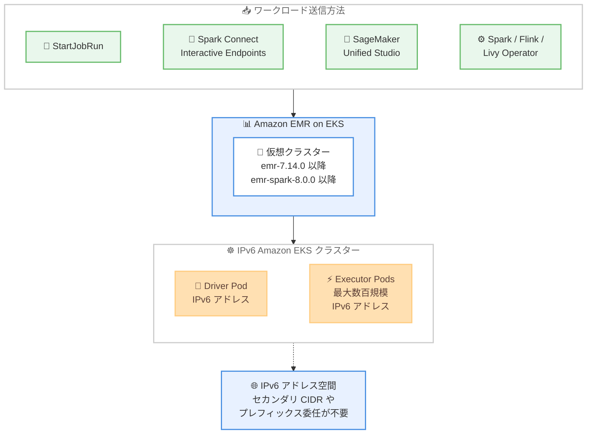

# Amazon EMR on EKS - IPv6 Amazon EKS クラスターのサポート

**リリース日**: 2026 年 9 月 23 日
**サービス**: Amazon EMR on EKS
**機能**: IPv6 Amazon EKS クラスター上でのワークロード実行サポート

📊 [このアップデートのインフォグラフィックを見る](https://takech9203.github.io/aws-news-summary/20260923-amazon-emr-eks-ipv6-support.html)

## 概要

Amazon EMR on EKS が、IPv6 ベースの Amazon EKS クラスター上でのワークロード実行をサポートしました。これにより、大規模に運用するチームは Apache Spark や Apache Flink のワークロードを IPv6 EKS クラスター上で実行し、IPv6 の圧倒的に広大なアドレス空間を活用できるようになります。

従来、大規模な Kubernetes 環境では IPv4 アドレスの枯渇が課題となり、セカンダリ CIDR レンジやプレフィックス委任 (prefix delegation) といった IPv4 アドレス節約のための回避策が必要でした。今回のアップデートにより、これらの回避策が不要になり、たとえば 500 executor の Spark ジョブのような大量の Pod を起動するジョブでも、アドレス上限を意識した計画なしに同時実行できます。

ワークロードの送信は、StartJobRun、Spark Connect Interactive Endpoints、Amazon SageMaker Unified Studio 経由に対応しており、Flink Operator、Livy Operator、Spark Operator もサポートされます。追加料金なしで利用でき、EMR リリース emr-7.14.0 および emr-spark-8.0.0 以降で、Amazon EMR on EKS と IPv6 Amazon EKS クラスターの両方が利用可能なすべての AWS リージョンで提供されます。

**アップデート前の課題**

- IPv6 EKS クラスター上で EMR on EKS のワークロードを実行できず、IPv4 クラスターを使用する必要があった
- 大規模ジョブの実行時に VPC の IPv4 アドレスが枯渇しやすく、セカンダリ CIDR レンジの追加やプレフィックス委任などの回避策が必要だった
- 数百 executor 規模のジョブを同時実行する場合、IP アドレスの上限を考慮したキャパシティ計画が必要だった

**アップデート後の改善**

- IPv6 EKS クラスター上で Apache Spark および Apache Flink のワークロードを実行できるようになった
- IPv6 の広大なアドレス空間により、IPv4 アドレス節約のための回避策が不要になった
- 500 executor の Spark ジョブのような高並列ジョブも、アドレス上限を意識せずに同時実行できるようになった

## アーキテクチャ図



各種送信方法から投入された Spark / Flink ワークロードが、IPv6 Amazon EKS クラスター上で IPv6 アドレスを持つ Pod として起動される構成を示しています。

## サービスアップデートの詳細

### 主要機能

1. **IPv6 EKS クラスター上でのワークロード実行**
   - Apache Spark および Apache Flink のワークロードを IPv6 Amazon EKS クラスター上で実行可能
   - Driver / Executor の各 Pod に IPv6 アドレスが割り当てられ、IPv4 アドレス枯渇の心配がない
   - セカンダリ CIDR レンジやプレフィックス委任といった IPv4 節約の回避策が不要

2. **追加設定不要の送信方法**
   - StartJobRun、Spark Connect Interactive Endpoints、Amazon SageMaker Unified Studio は、IPv4 クラスターと同じ手順でそのまま利用可能
   - 追加の構成変更なしで IPv6 クラスターにジョブを送信できる

3. **Operator ベースの送信方法のサポート**
   - Spark Operator、Flink Operator、Livy Operator もサポート
   - Operator ベースの送信方法では、IPv6 互換のための追加設定が必要 (詳細は「設定方法」を参照)

## 技術仕様

### 送信方法とリリース別サポート状況

| 送信方法 | emr-7.14.0 以降の 7.x | emr-spark-8.0.0 | emr-spark-8.1.0 以降 |
|------|------|------|------|
| StartJobRun | ✅ サポート | ✅ サポート | ✅ サポート |
| Spark Connect Interactive Endpoints | ✅ サポート | ✅ サポート | ✅ サポート |
| Amazon SageMaker Unified Studio | ✅ サポート | ✅ サポート | ✅ サポート |
| Spark Operator | ✅ サポート (追加設定が必要) | ❌ 非サポート | ✅ サポート (追加設定が必要) |
| Flink Operator | ✅ サポート (追加設定が必要) | 対象外 | 対象外 |
| Livy Operator | ✅ サポート (追加設定が必要) | ✅ サポート (追加設定が必要) | ✅ サポート (追加設定が必要) |

- emr-spark-8.x リリースは Spark 専用リリースのため、Flink は含まれません
- Jupyter Enterprise Gateway (JEG) エンドポイントは IPv6 クラスターでは非サポート

### Operator 利用時の主な追加設定

| 対象 | 設定内容 |
|------|------|
| Spark Operator | `spark.kubernetes.driver.service.ipFamilies=IPv6` を `sparkConf` に追加。emr-7.x では Operator デプロイメントに `KUBERNETES_DISABLE_HOSTNAME_VERIFICATION=true` の設定も必要 |
| Flink Operator | Operator Pod と FlinkDeployment のジョブ Pod の両方に `KUBERNETES_DISABLE_HOSTNAME_VERIFICATION=true` を設定 |
| Livy Operator | Helm インストール時に dualstack NLB のアノテーションを追加し、ジョブ送信時に `spark.kubernetes.driver.service.ipFamilies=IPv6` を指定 |

`KUBERNETES_DISABLE_HOSTNAME_VERIFICATION` の設定は、emr-7.x が依存する fabric8 Kubernetes クライアント (OkHttp 3.x) が IPv6 アドレスでの TLS ホスト名検証に失敗する既知の問題への回避策です。

## 設定方法

### 前提条件

1. IPv6 対応の Amazon EKS クラスターを作成済みであること (作成方法は Amazon EKS ユーザーガイドの IPv6 ドキュメントを参照)
2. Amazon EMR on EKS の仮想クラスターをセットアップ済みであること
3. EMR リリース emr-7.14.0 以降、または emr-spark-8.0.0 以降を使用すること

### 手順

#### ステップ 1: StartJobRun でジョブを送信する (追加設定不要)

```bash
aws emr-containers start-job-run \
  --virtual-cluster-id <virtual-cluster-id> \
  --name spark-job-ipv6 \
  --execution-role-arn <execution-role-arn> \
  --release-label emr-7.14.0-latest \
  --job-driver '{
    "sparkSubmitJobDriver": {
      "entryPoint": "s3://my-bucket/scripts/job.py",
      "sparkSubmitParameters": "--conf spark.executor.instances=500"
    }
  }'
```

IPv4 クラスターと同じ手順で IPv6 EKS クラスター上の仮想クラスターにジョブを送信しています。StartJobRun、Spark Connect Interactive Endpoints、SageMaker Unified Studio では IPv6 のための追加設定は不要です。

#### ステップ 2: Spark Operator を利用する場合の設定

```yaml
spec:
  sparkConf:
    "spark.kubernetes.driver.service.ipFamilies": "IPv6"
```

SparkApplication のスペックに上記の設定を追加しています。この設定により、Kubernetes クライアントが Spark ドライバーサービスを IPv6 の IP ファミリーで作成します。設定しない場合、ドライバーサービスはデフォルトの IPv4 で作成され、IPv6 専用クラスターでは動作しません。

emr-7.x リリースの場合は、さらに以下のコマンドで Operator デプロイメントに環境変数を設定します。

```bash
kubectl set env deployment/<spark-operator-deployment-name> \
  KUBERNETES_DISABLE_HOSTNAME_VERIFICATION=true \
  -n <spark-operator-namespace>
```

OkHttp 3.x の IPv6 ホスト名検証の既知の問題を回避するため、Spark Operator のデプロイメントに環境変数を設定しています。

#### ステップ 3: Flink Operator を利用する場合の設定

```bash
helm install <my-flink-operator> <chart> \
  --set operatorPod.env[0].name=KUBERNETES_DISABLE_HOSTNAME_VERIFICATION \
  --set-string operatorPod.env[0].value=true
```

Helm インストール時に Flink Operator Pod へ環境変数を設定しています。さらに、FlinkDeployment のジョブ Pod にもポッドテンプレート経由で同じ環境変数を設定します。

```yaml
spec:
  podTemplate:
    spec:
      containers:
        - name: flink-main-container
          env:
            - name: KUBERNETES_DISABLE_HOSTNAME_VERIFICATION
              value: "true"
```

#### ステップ 4: Livy Operator を利用する場合の設定

```bash
helm install <my-livy> <chart> \
  --set "service.annotations.service\.beta\.kubernetes\.io/aws-load-balancer-ip-address-type=dualstack"
```

AWS Load Balancer Controller が dualstack の Network Load Balancer をプロビジョニングするよう、Helm インストール時にアノテーションを追加しています。ジョブ送信時には以下のように IPv6 の設定を含めます。

```json
{
  "conf": {
    "spark.kubernetes.driver.service.ipFamilies": "IPv6"
  }
}
```

## メリット

### ビジネス面

- **スケーラビリティの確保**: IPv4 アドレス枯渇によるジョブ実行の制約がなくなり、ビジネスの成長に合わせて分析基盤を拡張できる
- **運用コストの削減**: セカンダリ CIDR レンジの管理やプレフィックス委任の設定といった IPv4 節約のための運用作業が不要になる
- **追加料金なし**: 本機能は追加コストなしで利用できる

### 技術面

- **広大なアドレス空間**: IPv6 により Pod あたりのアドレス割り当てを気にせず、500 executor 規模のジョブも同時実行できる
- **既存ワークフローとの互換性**: StartJobRun、Spark Connect、SageMaker Unified Studio では追加設定なしで IPv4 と同じ手順を利用できる
- **幅広い送信方法のサポート**: Operator ベース (Spark / Flink / Livy) の送信方法もサポートし、既存の Kubernetes ネイティブな運用スタイルを維持できる

## デメリット・制約事項

### 制限事項

- emr-7.14.0 より前のリリースは IPv6 に必要な修正を含まないため利用できない (旧リリースでは `Expected hostname or IPv6 IP enclosed in []` エラーが発生)
- Jupyter Enterprise Gateway (JEG) エンドポイントは IPv6 クラスターでは非サポート
- Spark Operator は emr-spark-8.0.0 では非サポート (emr-spark-8.1.0 以降でサポート)

### 考慮すべき点

- Operator ベースの送信方法では、IPv6 互換のための追加設定 (環境変数や Spark 設定) が必要
- emr-7.x で Operator を利用する場合の `KUBERNETES_DISABLE_HOSTNAME_VERIFICATION=true` は TLS ホスト名検証を無効化する回避策であるため、セキュリティ要件に照らして許容可能か確認が必要
- IPv6 EKS クラスター自体の構築要件 (VPC の IPv6 CIDR、VPC CNI の設定など) を事前に満たす必要がある

## ユースケース

### ユースケース 1: 大規模 Spark バッチ処理の同時実行

**シナリオ**: 日次の ETL 処理で数百 executor 規模の Spark ジョブを複数同時に実行しており、IPv4 アドレスの枯渇によりジョブの同時実行数が制限されている。

**実装例**:
```bash
aws emr-containers start-job-run \
  --virtual-cluster-id <virtual-cluster-id> \
  --release-label emr-7.14.0-latest \
  --job-driver '{
    "sparkSubmitJobDriver": {
      "entryPoint": "s3://my-bucket/etl/daily_job.py",
      "sparkSubmitParameters": "--conf spark.executor.instances=500"
    }
  }'
```

**効果**: IPv6 の広大なアドレス空間により、アドレス上限を意識せずに高並列ジョブを同時実行でき、バッチ処理全体の完了時間を短縮できる。

### ユースケース 2: IPv4 節約の回避策を廃止したネットワーク構成のシンプル化

**シナリオ**: Pod 用にセカンダリ CIDR レンジやプレフィックス委任を導入して IPv4 アドレスを節約しているが、ネットワーク構成が複雑化し運用負荷が高い。

**実装例**:
```bash
# IPv6 EKS クラスターを作成し、EMR on EKS の仮想クラスターを登録
aws emr-containers create-virtual-cluster \
  --name ipv6-analytics-cluster \
  --container-provider '{
    "id": "<ipv6-eks-cluster-name>",
    "type": "EKS",
    "info": {"eksInfo": {"namespace": "emr"}}
  }'
```

**効果**: セカンダリ CIDR やプレフィックス委任の管理が不要になり、VPC のネットワーク設計と運用がシンプルになる。

### ユースケース 3: Flink Operator によるストリーミング処理の IPv6 移行

**シナリオ**: Kubernetes ネイティブな運用スタイルで Flink Operator を利用したストリーミング処理を運用しており、組織の IPv6 移行方針に合わせて分析基盤も IPv6 化したい。

**実装例**:
```bash
helm install my-flink-operator <chart> \
  --set operatorPod.env[0].name=KUBERNETES_DISABLE_HOSTNAME_VERIFICATION \
  --set-string operatorPod.env[0].value=true
```

**効果**: 既存の Operator ベースの運用を維持したまま、ストリーミング処理基盤を IPv6 EKS クラスターへ移行できる。

## 料金

本機能は追加料金なしで利用できます。Amazon EMR on EKS の通常の料金 (vCPU およびメモリリソースに基づく課金) と、Amazon EKS クラスターの料金が適用されます。

## 利用可能リージョン

Amazon EMR on EKS と IPv6 Amazon EKS クラスターの両方が利用可能なすべての AWS リージョンで利用できます。

## 関連サービス・機能

- **Amazon EKS**: IPv6 クラスターの基盤。VPC CNI による Pod への IPv6 アドレス割り当てを提供する
- **Amazon SageMaker Unified Studio**: IPv6 クラスター上の EMR on EKS へ追加設定なしでワークロードを送信できる統合開発環境
- **AWS Load Balancer Controller**: Livy Operator 利用時に dualstack Network Load Balancer をプロビジョニングする
- **Amazon EMR on EKS Spark Connect Interactive Endpoints**: IPv6 クラスターでも追加設定なしで利用できるインタラクティブ実行環境

## 参考リンク

- 📊 [インフォグラフィック](https://takech9203.github.io/aws-news-summary/20260923-amazon-emr-eks-ipv6-support.html)
- [公式発表 (What's New)](https://aws.amazon.com/about-aws/whats-new/2026/09/amazon-emr-eks-ipv6-support)
- [ドキュメント: Running EMR on EKS on IPv6 clusters](https://docs.aws.amazon.com/emr/latest/EMR-on-EKS-DevelopmentGuide/emr-eks-ipv6.html)
- [ドキュメント: IPv6 addresses for clusters, Pods, and services (Amazon EKS)](https://docs.aws.amazon.com/eks/latest/userguide/cni-ipv6.html)
- [Amazon EMR on EKS 製品ページ](https://aws.amazon.com/emr/features/eks/)
- [料金ページ](https://aws.amazon.com/emr/pricing/)

## まとめ

Amazon EMR on EKS が IPv6 Amazon EKS クラスターをサポートし、IPv4 アドレス枯渇を回避するための複雑なネットワーク構成が不要になりました。大規模な Spark / Flink ワークロードを運用するチームは、emr-7.14.0 または emr-spark-8.0.0 以降へのアップグレードと IPv6 EKS クラスターの採用を検討することを推奨します。Operator ベースの送信方法を利用する場合は、ホスト名検証の回避策など追加設定の要否を事前に確認してください。
