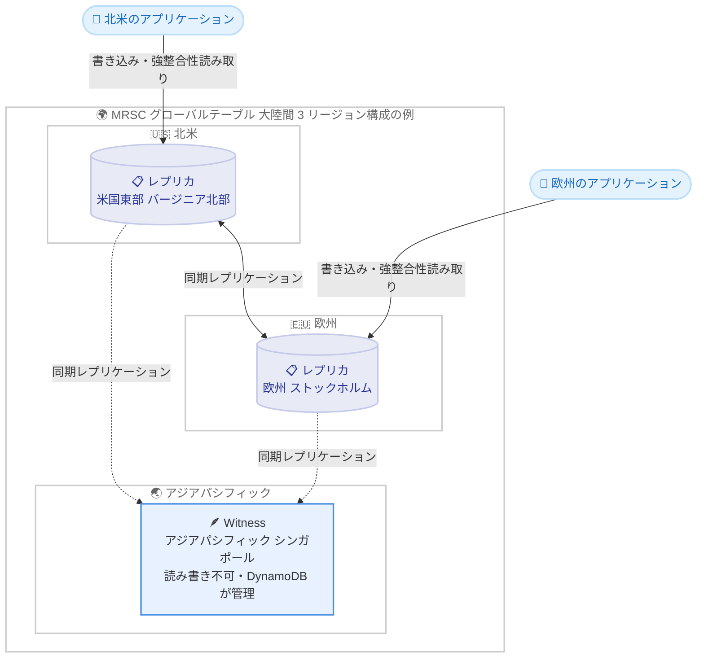

# Amazon DynamoDB - マルチリージョン強整合性 (MRSC) グローバルテーブルのリージョン追加と大陸間構成のサポート

**リリース日**: 2026 年 9 月 23 日
**サービス**: Amazon DynamoDB
**機能**: グローバルテーブルのマルチリージョン強整合性 (MRSC) の対応リージョン追加および大陸間構成のサポート

📊 [このアップデートのインフォグラフィックを見る](https://takech9203.github.io/aws-news-summary/20260923-dynamodb-mrsc-additional-regions.html)

## 概要

Amazon DynamoDB のグローバルテーブルにおけるマルチリージョン強整合性 (MRSC: Multi-Region Strong Consistency) が、新たに 5 つの AWS リージョンで利用可能になりました。追加されたのはカナダ (中部)、欧州 (ストックホルム)、欧州 (スペイン)、アジアパシフィック (ムンバイ)、アジアパシフィック (シンガポール) で、対応リージョンは合計 15 になります。

さらに今回のアップデートで、15 の対応リージョンから任意の 3 リージョンを選択して MRSC グローバルテーブルを構成できるようになりました。構成は「3 レプリカ」または「2 レプリカ + 1 witness リージョン」のいずれかを選択でき、北米、欧州、アジアパシフィックをまたぐ大陸間構成もサポートされます。

MRSC は、復旧時点目標 (RPO: Recovery Point Objective) がゼロの高可用性マルチリージョンアプリケーションを構築するための機能です。ユーザープロファイル管理、在庫追跡、注文状態管理、エンタイトルメント管理など、厳密な整合性要件を持つグローバルアプリケーションに適しています。

**アップデート前の課題**

- MRSC の対応リージョンは 10 リージョンに限られており、カナダ、北欧、南欧、インド、東南アジアにレプリカを配置できなかった
- リージョンの組み合わせが限定されており、北米、欧州、アジアパシフィックをまたぐ大陸間の MRSC 構成を作成できなかった
- グローバルに分散したユーザーの近くに強整合性のレプリカを配置することが難しく、読み取りレイテンシーの最適化に制約があった

**アップデート後の改善**

- 対応リージョンが 15 に拡大し、カナダ (中部)、欧州 (ストックホルム)、欧州 (スペイン)、アジアパシフィック (ムンバイ)、アジアパシフィック (シンガポール) にもレプリカや witness を配置できるようになった
- 15 リージョンから任意の 3 リージョンを組み合わせて MRSC グローバルテーブルを作成できるようになった
- 北米、欧州、アジアパシフィックをまたぐ大陸間構成が可能になり、世界中のユーザーの近くから強整合性読み取りを提供できるようになった

## アーキテクチャ図



今回サポートされた大陸間構成の例として、北米と欧州にレプリカ、アジアパシフィックに witness を配置した「2 レプリカ + 1 witness」構成を示しています。書き込みは成功応答を返す前に少なくとも 1 つの他リージョンへ同期的にレプリケートされ、どのレプリカでも常に最新データの強整合性読み取りが可能です。

## サービスアップデートの詳細

### 主要機能

1. **対応リージョンの拡大 (10 → 15 リージョン)**
   - 新規追加: カナダ (中部)、欧州 (ストックホルム)、欧州 (スペイン)、アジアパシフィック (ムンバイ)、アジアパシフィック (シンガポール)
   - 既存対応: 米国東部 (バージニア北部)、米国東部 (オハイオ)、米国西部 (オレゴン)、欧州 (アイルランド)、欧州 (ロンドン)、欧州 (パリ)、欧州 (フランクフルト)、アジアパシフィック (東京)、アジアパシフィック (ソウル)、アジアパシフィック (大阪)

2. **任意の 3 リージョン構成と大陸間構成のサポート**
   - 15 の対応リージョンから任意の 3 リージョンを選択して MRSC グローバルテーブルを作成可能
   - 北米、欧州、アジアパシフィックをまたぐ構成も選択できる
   - レプリカをユーザーの近くに配置することで、リージョン障害時にも可用性を維持しながら、近傍の DynamoDB エンドポイントから強整合性読み取りを実行できる

3. **2 種類のトポロジー選択 (3 レプリカ / 2 レプリカ + 1 witness)**
   - witness はレプリカの代替となる MRSC 専用コンポーネントで、レプリケートされたデータを保持して可用性アーキテクチャを支える
   - witness に対する読み取り・書き込みはできず、DynamoDB が所有・管理するためユーザーアカウントには表示されない
   - witness の有無と配置リージョンは `DescribeTable` API の出力で確認できる

## 技術仕様

### MRSC グローバルテーブルの仕様

| 項目 | 詳細 |
|------|------|
| 対応リージョン数 | 15 リージョン |
| 構成 | 3 リージョン構成のみ (3 レプリカ、または 2 レプリカ + 1 witness) |
| 整合性 | すべてのレプリカで強整合性読み取りが常に最新データを返す |
| RPO | ゼロ (書き込みは少なくとも 1 つの他リージョンへ同期レプリケーション後に成功応答) |
| 書き込み競合 | 他リージョンで変更中の項目への書き込みは `ReplicatedWriteConflictException` で失敗 (リトライ可能) |
| 作成条件 | 空のテーブルからのみ MRSC グローバルテーブルへ変換可能 |
| 構成変更 | 作成後の整合性モード変更、レプリカ追加は不可 |

### MREC と MRSC の比較

| 項目 | MREC (結果整合性) | MRSC (強整合性) |
|------|------|------|
| レプリケーション | 非同期 (通常 1 秒以内) | 同期 |
| RPO | レプリケーション遅延分 (通常数秒) | ゼロ |
| 書き込み・強整合性読み取りレイテンシー | 低い | リージョン間の往復レイテンシーに依存して高くなる |
| リージョン数 | 2 以上 (制限なし) | 3 リージョン固定 |
| TTL / LSI / トランザクション | サポート | 非サポート |
| DynamoDB Streams | デフォルトで有効 | 任意で有効化可能 (全レプリカでレコードと順序が同一) |

## 設定方法

### 前提条件

1. MRSC 対応の 15 リージョンの中から 3 リージョンを選定していること
2. 変換元の DynamoDB テーブルが空であること (データが存在するテーブルの MRSC への変換は非サポート)
3. 変換処理中にテーブルへの書き込みが発生しないようにすること

### 手順

#### ステップ 1: 空のテーブルを作成する

```bash
aws dynamodb create-table \
  --table-name UserProfiles \
  --attribute-definitions AttributeName=UserId,AttributeType=S \
  --key-schema AttributeName=UserId,KeyType=HASH \
  --billing-mode PAY_PER_REQUEST \
  --region us-east-1
```

MRSC グローバルテーブルの起点となる空のテーブルを米国東部 (バージニア北部) に作成しています。

#### ステップ 2: レプリカと witness を追加して MRSC グローバルテーブルへ変換する

```bash
aws dynamodb update-table \
  --table-name UserProfiles \
  --replica-updates '[
    {"Create": {"RegionName": "eu-north-1"}}
  ]' \
  --global-table-witness-updates '[
    {"Create": {"RegionName": "ap-southeast-1"}}
  ]' \
  --multi-region-consistency STRONG \
  --region us-east-1
```

欧州 (ストックホルム) にレプリカ、アジアパシフィック (シンガポール) に witness を追加し、整合性モードに `STRONG` を指定して「2 レプリカ + 1 witness」の大陸間 MRSC 構成を作成しています。3 レプリカ構成にする場合は、witness の代わりに 2 つ目のレプリカを `--replica-updates` に指定します。

#### ステップ 3: 構成を確認する

```bash
aws dynamodb describe-table \
  --table-name UserProfiles \
  --region us-east-1 \
  --query "Table.{Replicas:Replicas,Witnesses:GlobalTableWitnesses,Consistency:MultiRegionConsistency}"
```

`DescribeTable` API でレプリカ、witness の配置リージョン、および整合性モードを確認しています。

## メリット

### ビジネス面

- **RPO ゼロの事業継続性**: リージョン障害が発生してもデータ損失なくアプリケーションを継続でき、金融や在庫管理など厳密な整合性が求められる業務の要件を満たせる
- **グローバル展開の柔軟性向上**: カナダ、北欧、南欧、インド、東南アジアを含む 15 リージョンから配置先を選択でき、データ配置に関する地域要件や事業展開地域に合わせた設計が可能になる
- **ユーザー体験の向上**: 世界各地のユーザーの近くにレプリカを配置し、近傍エンドポイントから常に最新データを低レイテンシーで提供できる

### 技術面

- **任意の 3 リージョン構成**: 15 リージョンの中から自由に組み合わせを選択でき、大陸間構成もサポートされるため、アーキテクチャ設計の自由度が大幅に向上する
- **witness によるコスト効率の高い可用性**: 3 つ目のリージョンにフルレプリカの代わりに witness を配置することで、可用性アーキテクチャを維持しつつ構成をシンプルにできる
- **強整合性の保証**: どのレプリカでも強整合性読み取りが常に最新データを返し、条件付き書き込みも常に最新の項目に対して評価される

## デメリット・制約事項

### 制限事項

- MRSC グローバルテーブルは 3 リージョン構成 (3 レプリカ、または 2 レプリカ + 1 witness) に限定される
- 既存の MRSC グローバルテーブルへのレプリカ追加や、レプリカ・witness の個別削除はできない
- データが存在するテーブルを MRSC グローバルテーブルへ変換することはできない (空のテーブルのみ)
- TTL (Time to Live)、ローカルセカンダリインデックス (LSI)、トランザクション操作 (`TransactWriteItems` / `TransactGetItems`) は非サポート
- 作成後に整合性モード (MREC / MRSC) を変更することはできない

### 考慮すべき点

- 書き込みと強整合性読み取りは同期的なリージョン間通信を必要とするため、選択したリージョン間の往復レイテンシーが増えるほどリクエストレイテンシーも増加する。特に大陸間構成では、通常時とフェイルオーバー時の両方で要件を満たすか、対象リージョンでの事前テストが推奨される
- 他リージョンで変更中の項目への書き込みは `ReplicatedWriteConflictException` で失敗するため、アプリケーション側でリトライ処理を実装する必要がある
- 低い書き込みレイテンシーを優先するワークロードや RPO が数秒許容できるワークロードでは、MREC の方が適する場合がある

## ユースケース

### ユースケース 1: グローバルなユーザープロファイル・エンタイトルメント管理

**シナリオ**: 北米と欧州にユーザーを持つ SaaS で、サブスクリプションの権利情報 (エンタイトルメント) をどのリージョンから読んでも常に最新の状態で参照したい。

**実装例**:
```
レプリカ: 米国東部 (バージニア北部)、欧州 (ストックホルム)
witness: アジアパシフィック (シンガポール)
読み取り: 各地域のアプリケーションが最寄りのレプリカへ ConsistentRead=true で GetItem
```

**効果**: 課金や機能制御に直結する権利情報を、地域をまたいで常に強整合性で参照でき、権限の二重付与や解約後の利用といった不整合を防止できる。

### ユースケース 2: 大陸間での在庫追跡・注文状態管理

**シナリオ**: 欧州とアジアで展開する EC サイトで、限定商品の在庫数や注文ステータスをリージョン間で厳密に一致させたい。

**実装例**:
```
レプリカ: 欧州 (スペイン)、アジアパシフィック (ムンバイ)、アジアパシフィック (シンガポール)
書き込み: 条件付き書き込みで在庫数を減算 (常に最新の項目に対して条件を評価)
競合時: ReplicatedWriteConflictException をリトライ
```

**効果**: 複数リージョンからの同時注文でも在庫の売り越しを防ぎ、RPO ゼロでリージョン障害時にも注文データを失わない。

### ユースケース 3: カナダを含む北米構成での RPO ゼロの災害対策

**シナリオ**: 米国とカナダで展開する金融系アプリケーションで、リージョン障害時にもデータ損失ゼロでフェイルオーバーしたい。

**実装例**:
```
レプリカ: 米国東部 (バージニア北部)、カナダ (中部)
witness: 米国西部 (オレゴン)
平常時: 各国のアプリケーションが最寄りのレプリカへ読み書き
障害時: トラフィックを健全なリージョンのレプリカへ切り替え
```

**効果**: 今回追加されたカナダ (中部) を活用し、地理的に近いリージョン同士でレイテンシーを抑えつつ、RPO ゼロの災害対策を実現できる。

## 料金

MRSC 固有の追加料金体系は今回の発表には含まれていません。グローバルテーブルでは、レプリカへの書き込みがレプリケート書き込みリクエスト (ユニット) として課金されるほか、リージョン間のデータ転送、各レプリカのストレージと読み取りに対して料金が発生します。詳細は DynamoDB の料金ページを参照してください。

## 利用可能リージョン

MRSC グローバルテーブルは以下の 15 リージョンで利用できます。

- **北米**: 米国東部 (バージニア北部)、米国東部 (オハイオ)、米国西部 (オレゴン)、カナダ (中部) *新規*
- **欧州**: 欧州 (アイルランド)、欧州 (ロンドン)、欧州 (パリ)、欧州 (フランクフルト)、欧州 (ストックホルム) *新規*、欧州 (スペイン) *新規*
- **アジアパシフィック**: アジアパシフィック (東京)、アジアパシフィック (ソウル)、アジアパシフィック (大阪)、アジアパシフィック (ムンバイ) *新規*、アジアパシフィック (シンガポール) *新規*

## 関連サービス・機能

- **DynamoDB グローバルテーブル (MREC)**: デフォルトの結果整合性モード。低レイテンシーを優先し、RPO が数秒許容できる場合の選択肢
- **AWS Fault Injection Service (FIS)**: MRSC グローバルテーブルに対してリージョン分離などの障害注入実験を実行し、フェイルオーバー動作を検証できる
- **Amazon Route 53 Application Recovery Controller**: マルチリージョン構成でのトラフィック切り替えを支援し、MRSC と組み合わせた高可用性アーキテクチャを構築できる
- **DynamoDB Streams**: MRSC レプリカでも有効化でき、全レプリカで同一内容・同一順序の変更レコードを取得できる

## 参考リンク

- 📊 [インフォグラフィック](https://takech9203.github.io/aws-news-summary/20260923-dynamodb-mrsc-additional-regions.html)
- [公式発表 (What's New)](https://aws.amazon.com/about-aws/whats-new/2026/09/dynamodb-mrsc-additional-regions/)
- [ドキュメント: How DynamoDB global tables work (Consistency modes)](https://docs.aws.amazon.com/amazondynamodb/latest/developerguide/V2globaltables_HowItWorks.html#V2globaltables_HowItWorks.consistency-modes.mrsc)
- [ドキュメント: Tutorials: Creating global tables (MRSC)](https://docs.aws.amazon.com/amazondynamodb/latest/developerguide/V2globaltables.tutorial.html#create-gt-mrsc)
- [料金ページ](https://aws.amazon.com/dynamodb/pricing/)

## まとめ

DynamoDB グローバルテーブルの MRSC が 15 リージョンに拡大し、任意の 3 リージョンによる大陸間構成が可能になったことで、RPO ゼロの強整合性アーキテクチャをグローバル規模で設計できるようになりました。厳密な整合性が求められるマルチリージョンアプリケーションを運用している場合は、ユーザー分布に合わせたリージョンの組み合わせを検討し、対象リージョン間のレイテンシーが要件を満たすかを事前にテストすることを推奨します。
