# Kiro - Reasoning Controls and Cloud Sessions

**リリース日**: 2026 年 9 月 23 日
**サービス**: Kiro (Kiro CLI 2.23)
**機能**: /model からの推論コントロール設定と、リポジトリ接続前の V3 クラウドセッション開始

📊 [このアップデートのインフォグラフィックを見る](https://takech9203.github.io/aws-news-summary/20260923-kiro-changelog-2026-09-23.html)

## 概要

Kiro CLI 2.23 系のリリース (2.23.0 および最新パッチ 2.23.1) では、推論コントロール (thinking と effort) の設定が `/model` コマンドに統合され、モデルの切り替えと推論設定を 1 か所で行えるようになりました。パネルには選択したモデルがサポートするオプションのみが表示され、選択内容は将来のセッションにも保存されます。

さらに V3 では、リポジトリを接続する前にクラウドセッションを開始できるようになりました。準備ができた時点で `/repo` コマンドを実行してリポジトリを接続できます。ソースプロバイダーが未接続の場合は接続画面が開き、リポジトリはオプションとして扱われます。

このほか、ライブ進捗表示の明確化、ストリーミングの平滑化、フルスクリーンスクロールの効率化などの改善と、モデル・セッション・ツール・非対話実行に関する信頼性の修正が含まれています。

**アップデート前の課題**

- 以前はモデルの選択と推論設定 (thinking / effort) が別々のコマンドに分かれており、1 か所でまとめて設定できなかった
- 以前はモデルごとにサポートされる推論オプションが分かりにくく、非対応の設定を試行する余地があった
- 以前は V3 のクラウドセッションを開始する前にリポジトリの接続が前提となっており、リポジトリを決める前に作業を始められなかった

**アップデート後の改善**

- `/model` を開くだけで、モデルの切り替えと thinking / effort の設定を 1 つのパネルで完結できるようになった
- パネルには選択中のモデルがサポートするオプションのみが表示され、選択内容は将来のセッションにも引き継がれるようになった
- V3 クラウドセッションをリポジトリ接続前に開始し、必要になった時点で `/repo` からリポジトリを接続できるようになった

## アーキテクチャ図

```mermaid
flowchart TD
    subgraph Reasoning["🧠 /model での推論コントロール"]
        U1(["👤 ユーザー"]) --> M["🎛️ /model パネル"]
        M --> MS["🤖 モデル切り替え"]
        M --> TH["💭 Thinking 設定"]
        M --> EF["⚙️ Effort 設定"]
        MS ~~~ TH ~~~ EF
        TH --> SV["💾 設定を保存<br/>将来のセッションにも適用"]
        EF --> SV
    end

    subgraph Cloud["☁️ V3 クラウドセッション"]
        U2(["👤 ユーザー"]) --> CS["🚀 クラウドセッション開始<br/>リポジトリ接続は不要"]
        CS --> RP{"📦 /repo 実行?"}
        RP -->|接続する| CN["🔗 リポジトリを接続"]
        RP -.->|後で接続| CS
    end

    classDef user fill:#E3F2FD,stroke:#BBDEFB,stroke-width:2px,color:#1565C0
    classDef process fill:#FFFFFF,stroke:#4A90E2,stroke-width:2px,color:#333333
    classDef internal fill:#E8F1FF,stroke:#4A90E2,stroke-width:2px,color:#333333
    classDef decision fill:#F3E5F5,stroke:#7B61FF,stroke-width:2px,color:#333333
    classDef layer fill:none,stroke:#CCCCCC,stroke-width:2px,color:#666666

    class U1,U2 user
    class M,MS,TH,EF,CS,CN process
    class SV internal
    class RP decision
    class Reasoning,Cloud layer
```



`/model` パネルによる推論コントロールの一元化と、リポジトリ接続を後回しにできる V3 クラウドセッションの流れを示しています。

## サービスアップデートの詳細

### 主要機能

1. **`/model` での推論コントロール**
   - `/model` を開くと、モデルの切り替えと選択中モデルの thinking / effort の設定を 1 か所で行える
   - パネルには選択したモデルがサポートするオプションのみが表示される
   - 設定した内容は保存され、将来のセッションにも適用される
   - `/model` が推論設定のプライマリインターフェースとなる

2. **`/effort` コマンドの位置づけの変更**
   - V2 では、引数なしの `/effort` はレガシーコマンドとなり、非推奨の警告を表示したうえで `/model` の Effort 設定を開く
   - V2 でも `/effort <level>` 形式は引き続きサポートされる
   - V3 では `/effort` は従来どおり専用のピッカーを開く

3. **リポジトリ接続前のクラウドセッション開始 (V3)**
   - リポジトリを接続する前にクラウドセッションを開始できる
   - リポジトリを接続する準備ができたら `/repo` を実行する
   - ソースプロバイダーが未接続の場合は接続画面が開き、リポジトリはオプションとして表示される

4. **改善と信頼性の修正**
   - ライブ進捗表示の明確化、ストリーミングの平滑化、フルスクリーンスクロールの効率化
   - モデル、セッション、ツール、非対話実行に関する信頼性の修正

## 技術仕様

### 推論コントロール関連コマンドの動作

| コマンド | V2 での動作 | V3 での動作 |
|------|------|------|
| `/model` | モデル切り替えと thinking / effort 設定を一元管理 | モデル切り替えと thinking / effort 設定を一元管理 |
| `/effort` (引数なし) | 非推奨警告を表示し `/model` の Effort 設定を開く | 従来どおり専用ピッカーを開く |
| `/effort <level>` | 引き続きサポート | - |
| `/repo` | - | クラウドセッションにリポジトリを接続 |

### バージョン情報

| 項目 | 詳細 |
|------|------|
| 対象製品 | Kiro CLI |
| リリースバージョン | 2.23.0 (2026 年 9 月 21 日) |
| 最新パッチ | 2.23.1 (2026 年 9 月 23 日) |

## 設定方法

### 前提条件

1. Kiro CLI 2.23 系がインストールされていること
2. クラウドセッション機能を利用する場合は V3 セッションを使用していること

### 手順

#### ステップ 1: `/model` で推論コントロールを設定する

```
/model
```

`/model` パネルを開き、モデルの切り替えと、選択したモデルの thinking / effort を設定します。選択内容は保存され、将来のセッションにも適用されます。

#### ステップ 2: クラウドセッションを開始する (V3)

リポジトリを接続していない状態でも、そのまま V3 クラウドセッションを開始できます。リポジトリの選択を待たずに作業を始められます。

#### ステップ 3: 必要になったらリポジトリを接続する

```
/repo
```

セッション中にリポジトリを接続する準備ができたら `/repo` を実行します。ソースプロバイダーが未接続の場合は接続画面が開き、リポジトリはオプションとして表示されます。

## メリット

### ビジネス面

- **作業開始までの時間短縮**: リポジトリの選定や接続を待たずにクラウドセッションで作業を開始でき、アイデア検証や調査をすぐに始められる
- **学習コストの低減**: モデルと推論設定が `/model` に一元化され、複数コマンドを覚える必要がなくなる
- **安定した運用**: モデル、セッション、ツール、非対話実行の信頼性修正により、長時間の作業や自動化されたワークフローが安定する

### 技術面

- **設定ミスの防止**: パネルに選択中モデルがサポートするオプションのみが表示されるため、非対応の設定を選択する余地がない
- **設定の永続化**: thinking / effort の選択が保存され、セッションをまたいで同じ設定で作業できる
- **柔軟なセッション設計**: リポジトリ接続がオプションになったことで、リポジトリに依存しないタスクにもクラウドセッションを活用できる

## デメリット・制約事項

### 制限事項

- リポジトリ接続前のクラウドセッション開始は V3 のみの機能
- V2 では引数なしの `/effort` が非推奨となり、将来的な廃止に備えたワークフローの見直しが必要
- 表示される thinking / effort のオプションはモデルごとに異なり、すべてのモデルで全オプションが利用できるわけではない

### 考慮すべき点

- `/model` が推論設定のプライマリインターフェースとなるため、既存のドキュメントや社内手順で `/effort` を案内している場合は更新を検討する
- V2 と V3 で `/effort` の挙動が異なるため、チーム内で利用バージョンを確認しておく

## ユースケース

### ユースケース 1: タスクの複雑さに応じた推論設定の切り替え

**シナリオ**: 大規模なリファクタリングでは深い推論を使い、簡単な修正では応答速度を優先したい。

**実装例**:
```
/model
# パネルでモデルを選択し、thinking と effort をタスクに合わせて設定
```

**効果**: 1 つのパネルでモデルと推論設定をまとめて調整でき、設定は保存されるため次回以降のセッションでも同じ構成で作業できる。

### ユースケース 2: リポジトリ選定前のクラウドセッション活用

**シナリオ**: 新しい機能のプロトタイピングをクラウドセッションで始めたいが、どのリポジトリで作業するかまだ決まっていない。

**実装例**:
```
# V3 クラウドセッションをそのまま開始して調査・設計を進める
# リポジトリが決まったら以下を実行
/repo
```

**効果**: リポジトリの決定を待たずに作業を開始でき、必要になったタイミングでリポジトリを接続できる。

### ユースケース 3: V2 からの推論設定ワークフロー移行

**シナリオ**: V2 で `/effort` を使っていたチームが、新しい `/model` 中心のワークフローに移行したい。

**実装例**:
```
# 旧: /effort を実行 (非推奨警告が表示され /model の Effort 設定が開く)
# 新: /model から thinking / effort を直接設定
/model
```

**効果**: 非推奨警告により自然に新しいワークフローへ誘導され、`/effort <level>` も引き続き利用できるため段階的に移行できる。

## 利用可能リージョン

Kiro はグローバルに提供されるサービスです。

## 関連サービス・機能

- **Kiro CLI**: 本アップデートの対象となるコマンドラインインターフェース。`/model`、`/effort`、`/repo` などのコマンドを提供
- **Kiro クラウドセッション (V3)**: クラウド上で実行されるセッション。今回のアップデートでリポジトリ接続前の開始が可能になった
- **Kiro モデル管理**: `/model` から利用可能なモデルの切り替えと推論設定を一元管理

## 参考リンク

- 📊 [インフォグラフィック](https://takech9203.github.io/aws-news-summary/20260923-kiro-changelog-2026-09-23.html)
- [Kiro Changelog - Reasoning Controls and Cloud Sessions](https://kiro.dev/changelog/cli/2-23/)
- [Kiro Changelog](https://kiro.dev/changelog/)
- [ドキュメント: Effort 設定](https://kiro.dev/docs/models/effort/)
- [ドキュメント: クラウドセッション](https://kiro.dev/docs/cloud-sessions/)

## まとめ

Kiro CLI 2.23 系では、推論コントロールが `/model` に統合され、モデル選択と thinking / effort の設定を 1 か所で完結できるようになりました。また、V3 クラウドセッションはリポジトリ接続前に開始できるようになり、より柔軟に作業を始められます。V2 で `/effort` を利用しているチームは、`/model` 中心の新しいワークフローへの移行を検討することを推奨します。
