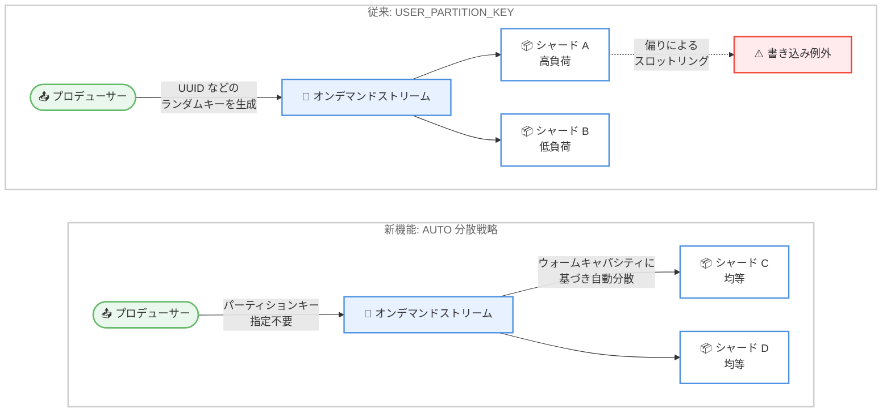

# Amazon Kinesis Data Streams - Service-Managed Partition Keys によるデータ取り込みの簡素化

**リリース日**: 2026 年 9 月 23 日
**サービス**: Amazon Kinesis Data Streams
**機能**: Service-Managed Partition Keys (サービス管理パーティションキー)

📊 [このアップデートのインフォグラフィックを見る](https://takech9203.github.io/aws-news-summary/20260923-service-managed-partition-keys.html)

## 概要

Amazon Kinesis Data Streams が、On-Demand Standard および On-Demand Advantage ストリーム向けに Service-Managed Partition Keys (サービス管理パーティションキー) のサポートを発表しました。この機能を有効化すると、プロデューサーがパーティションキーを指定しなくても、サービスがレコードをシャード全体に自動的に均等分散します。

レコードの順序保証が不要なワークロード (ログ集約、メトリクス収集、IoT テレメトリなど) では、これまでパーティションキーの設計・生成がデータ取り込みの負担となっていました。今回のアップデートにより、ホットパーティションキーを排除し、ストリーミングワークロードの本番稼働までの時間を短縮できます。オプトイン方式のため、既存の動作 (ユーザー指定のパーティションキーによる分散) はデフォルトで維持されます。

**アップデート前の課題**

以前は、レコードをシャード全体に分散させるための工夫がユーザー側に必要でした。

- 順序保証が不要なワークロードでも、UUID などのランダムなパーティションキーをアプリケーション側で生成する必要があった
- ランダムなパーティションキーを使用しても、シャード間でスループットが不均一になる場合があり、ストリーム全体では十分な容量があるにもかかわらず特定のシャードでスロットリングが発生することがあった
- ホットパーティションキー (特定のキーへのトラフィック集中) の検出と回避のための分散ロジックをユーザーが維持する必要があった

**アップデート後の改善**

今回のアップデートにより、以下が可能になりました。

- オプトインすることで、パーティションキーを指定せずにオンデマンドストリームへレコードを発行できるようになった
- サービスが利用可能なウォームキャパシティに基づいてレコードを自動分散し、ギガバイト/秒規模までのスケールが可能になった
- ユーザー側でのランダムキー生成や分散ロジックの維持が不要になり、ホットパーティションキーが排除された

## アーキテクチャ図



従来のランダムパーティションキーによる分散では偏りが発生し得ましたが、AUTO 分散戦略ではサービスがウォームキャパシティに基づいてレコードをシャード全体に均等分散します。

## サービスアップデートの詳細

### 主要機能

1. **レコード分散戦略 (RecordDistributionStrategy) の導入**
   - ストリームレベルの設定として、`AUTO` と `USER_PARTITION_KEY` の 2 つの分散戦略を選択可能
   - `AUTO`: サービス管理のアルゴリズムでレコードをシャード全体に均等分散。プロデューサーが指定したパーティションキーや `ExplicitHashKey` は無視される
   - `USER_PARTITION_KEY`: プロデューサーがパーティションキーを指定し、同じキーのレコードは同じシャードに送信される (デフォルト、従来の動作)

2. **ダウンタイムなしの戦略切り替え**
   - `UpdateStreamRecordDistributionStrategy` API により、戦略をいつでも切り替え可能
   - 変更は即座に反映され、ダウンタイム、データ損失、プロデューサー/コンシューマーアプリケーションへの中断は発生しない
   - 変更後に到着した新しいレコードから新しい戦略が適用され、ストリーム内の既存レコードは元のシャード割り当てを維持する

3. **ウォームキャパシティに基づく自動分散**
   - サービスが利用可能なウォームキャパシティに基づいてレコードを分散
   - ユーザー側の分散ロジックなしでギガバイト/秒規模までスケール可能
   - ホットパーティションキーによる特定シャードへの偏りを排除

## 技術仕様

### 分散戦略の比較

| 項目 | AUTO | USER_PARTITION_KEY |
|------|------|--------------------|
| パーティションキーの指定 | 不要 (指定しても無視される) | 必須 |
| レコードの順序保証 | なし | 同一パーティションキー内で保証 |
| 分散方法 | サービス管理アルゴリズムによる均等分散 | パーティションキーのハッシュによるシャード配置 |
| 対応キャパシティモード | オンデマンドのみ (Standard / Advantage) | オンデマンド / プロビジョンド |
| デフォルト | - | デフォルト戦略 |

### API 変更履歴

| 日付 | サービス | 変更内容 |
|------|----------|----------|
| 2026/09/23 | [Amazon Kinesis](https://awsapichanges.com/archive/changes/93a35b-kinesis.html) | 1 new 2 updated api methods - `UpdateStreamRecordDistributionStrategy` の新規追加、`CreateStream` と `DescribeStreamSummary` への `RecordDistributionStrategy` パラメータの追加 |

### UpdateStreamRecordDistributionStrategy API

```json
{
   "StreamARN": "arn:aws:kinesis:us-east-1:123456789012:stream/exampleStreamName",
   "RecordDistributionStrategy": "AUTO"
}
```

- `RecordDistributionStrategy`: `AUTO` または `USER_PARTITION_KEY` (必須)
- `StreamARN`: 対象ストリームの ARN (必須)
- プロビジョンドモードのストリームに `AUTO` を設定しようとすると `InvalidArgumentException` が発生する

## 設定方法

### 前提条件

1. On-Demand Standard または On-Demand Advantage モードのデータストリームを使用していること (プロビジョンドモードは非対応)
2. 最新バージョンの AWS SDK または Kinesis Producer Library (KPL) にアップグレードしていること
3. 対象ワークロードがレコードの順序保証を必要としないこと

### 手順

#### ステップ 1: 新規ストリーム作成時に AUTO 戦略を指定

```bash
aws kinesis create-stream \
  --stream-name my-auto-stream \
  --stream-mode-details StreamMode=ON_DEMAND \
  --record-distribution-strategy AUTO
```

オンデマンドモードのストリームを作成し、レコード分散戦略として `AUTO` を指定しています。作成時点からパーティションキーの指定なしでレコードを発行できます。

#### ステップ 2: 既存ストリームの分散戦略を変更

```bash
aws kinesis update-stream-record-distribution-strategy \
  --stream-arn arn:aws:kinesis:ap-northeast-1:123456789012:stream/my-stream \
  --record-distribution-strategy AUTO
```

既存のオンデマンドストリームの分散戦略を `AUTO` に変更しています。変更は即座に反映され、ダウンタイムやデータ損失は発生しません。

#### ステップ 3: 設定の確認

```bash
aws kinesis describe-stream-summary \
  --stream-arn arn:aws:kinesis:ap-northeast-1:123456789012:stream/my-stream \
  --query "StreamDescriptionSummary.RecordDistributionStrategy"
```

`DescribeStreamSummary` API のレスポンスに追加された `RecordDistributionStrategy` フィールドで、現在の分散戦略を確認しています。

## メリット

### ビジネス面

- **本番稼働までの時間短縮**: パーティションキー戦略の設計・検証が不要になり、ストリーミングワークロードの構築を高速化できる
- **運用負荷の軽減**: ホットパーティションの監視やキー分散ロジックの維持が不要になり、運用コストを削減できる
- **追加コストなし**: 追加料金なしで利用でき、スロットリングによる再試行の削減も期待できる

### 技術面

- **ホットパーティションキーの排除**: サービス管理アルゴリズムによる均等分散で、特定シャードへのトラフィック集中を防止できる
- **高スループットへのスケール**: ウォームキャパシティに基づく分散により、ギガバイト/秒規模のスループットまでスケール可能
- **無停止での切り替え**: `AUTO` と `USER_PARTITION_KEY` をいつでも切り替え可能で、アプリケーションへの中断が発生しない

## デメリット・制約事項

### 制限事項

- レコードの順序保証がなくなるため、パーティションキー単位の順序が必要なワークロード (ステートフルな処理など) には適さない
- オンデマンドキャパシティモード (Standard / Advantage) のみ対応で、プロビジョンドモードのストリームでは `AUTO` を設定できない
- `AUTO` 戦略では、プロデューサーが指定したパーティションキーや `ExplicitHashKey` は無視される

### 考慮すべき点

- 利用には最新の AWS SDK または KPL バージョンへのアップグレードが必要
- 戦略変更後もストリーム内の既存レコードは元のシャード割り当てを維持するため、切り替え直後はコンシューマー側で新旧の分散が混在する
- コンシューマーアプリケーションがパーティションキーに依存した処理 (キー単位の集約など) を行っていないか、事前に確認が必要

## ユースケース

### ユースケース 1: ログ集約パイプライン

**シナリオ**: 多数のアプリケーションサーバーからログを収集し、Kinesis Data Streams 経由で分析基盤に送信する。ログの順序はタイムスタンプで管理しており、シャード内の順序保証は不要。

**実装例**:
```bash
aws kinesis update-stream-record-distribution-strategy \
  --stream-arn arn:aws:kinesis:ap-northeast-1:123456789012:stream/log-aggregation \
  --record-distribution-strategy AUTO
```

**効果**: UUID 生成ロジックが不要になり、トラフィック急増時もシャード全体に均等分散されてスロットリングを回避できる。

### ユースケース 2: IoT テレメトリの大規模取り込み

**シナリオ**: 数十万台のデバイスからテレメトリデータを取り込む。デバイス数が多く送信頻度が変動するため、パーティションキーの偏りによる書き込み例外が課題となっている。

**実装例**:
```bash
aws kinesis create-stream \
  --stream-name iot-telemetry \
  --stream-mode-details StreamMode=ON_DEMAND \
  --record-distribution-strategy AUTO
```

**効果**: サービスがウォームキャパシティに基づいて自動分散するため、ホットパーティションが排除され、ギガバイト/秒規模まで安定してスケールできる。

### ユースケース 3: メトリクス収集基盤

**シナリオ**: マイクロサービス群からアプリケーションメトリクスを収集し、ダッシュボードや異常検知システムに配信する。メトリクスは集計時に順序を問わない。

**実装例**:
```python
import boto3

kinesis = boto3.client("kinesis")

# AUTO 戦略のストリームでは PartitionKey は無視されるため、
# 分散を意識したキー設計が不要になる
kinesis.put_records(
    StreamARN="arn:aws:kinesis:ap-northeast-1:123456789012:stream/metrics",
    Records=[
        {"Data": b'{"service":"api","latency_ms":42}', "PartitionKey": "ignored"},
        {"Data": b'{"service":"web","latency_ms":18}', "PartitionKey": "ignored"},
    ],
)
```

**効果**: プロデューサー側の実装がシンプルになり、キー設計の見直しなしでメトリクス量の増加に対応できる。

## 料金

Service-Managed Partition Keys の利用に追加料金は発生しません。オンデマンドモードの通常料金 (データ取り込み、データ取得、拡張保持など) が適用されます。詳細は [Amazon Kinesis Data Streams 料金ページ](https://aws.amazon.com/kinesis/data-streams/pricing/) を参照してください。

## 利用可能リージョン

すべての AWS 商用リージョンで利用可能です (東京リージョン、大阪リージョンを含む)。

## 関連サービス・機能

- **On-Demand Advantage モード**: アカウントレベルの設定で、ウォームスループットの事前設定やスケールダウンのトリガーが可能。本機能はウォームキャパシティに基づく分散を行うため、Advantage モードとの組み合わせで大規模イベントへの対応が容易になる
- **Kinesis Producer Library (KPL)**: プロデューサーアプリケーションの構築を支援するライブラリ。本機能の利用には最新バージョンへのアップグレードが必要
- **Amazon Data Firehose**: 順序保証が不要な配信ユースケースの代表例。Kinesis Data Streams をソースとする構成でも本機能の均等分散が有効

## 参考リンク

- 📊 [インフォグラフィック](https://takech9203.github.io/aws-news-summary/20260923-service-managed-partition-keys.html)
- [公式発表 (What's New)](https://aws.amazon.com/about-aws/whats-new/2026/09/kinesis/service-managed-partition-keys)
- [ドキュメント: ストリームモードの選択](https://docs.aws.amazon.com/streams/latest/dev/how-do-i-size-a-stream.html)
- [API リファレンス: UpdateStreamRecordDistributionStrategy](https://docs.aws.amazon.com/kinesis/latest/APIReference/API_UpdateStreamRecordDistributionStrategy.html)
- [料金ページ](https://aws.amazon.com/kinesis/data-streams/pricing/)

## まとめ

Service-Managed Partition Keys により、順序保証が不要なストリーミングワークロードでのパーティションキー設計が不要になり、ホットパーティションによるスロットリングを排除できます。ログ集約、メトリクス収集、IoT テレメトリなどのワークロードでオンデマンドストリームを利用している場合は、最新の AWS SDK または KPL にアップグレードし、`AUTO` 分散戦略へのオプトインを検討することを推奨します。
