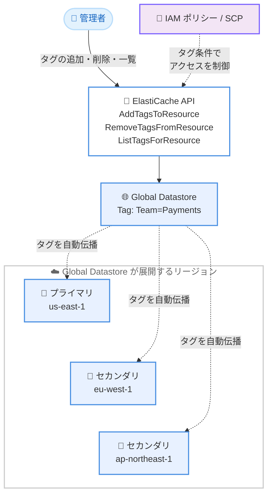

# Amazon ElastiCache - Global Datastore のタグ付けとタグベースアクセス制御のサポート

**リリース日**: 2026 年 9 月 24 日
**サービス**: Amazon ElastiCache
**機能**: Global Datastore のリソースタグ付けとタグベースアクセス制御 (TBAC)

📊 [このアップデートのインフォグラフィックを見る](https://takech9203.github.io/aws-news-summary/20260924-amazon-elasticache-global-datastore-tagging.html)

## 概要

Amazon ElastiCache が Global Datastore に対するリソースタグ付けとタグベースアクセス制御 (TBAC: Tag-Based Access Control) をサポートしました。`AddTagsToResource`、`RemoveTagsFromResource`、`ListTagsForResource` の各 API を Global Datastore に対して実行できるようになり、付与したタグを IAM ポリシーや SCP (Service Control Policies) の条件として参照できます。

これまで ElastiCache はほぼすべてのリソースタイプでタグ付けをサポートしていましたが、Global Datastore だけが例外でした。今回のアップデートにより、ElastiCache の全リソースで一貫した権限管理とコスト配分のモデルを構築できるようになります。Global Datastore に対するタグの変更は、その Global Datastore が展開するすべてのリージョンへ自動的に伝播するため、リージョンごとの個別対応は不要です。

複数リージョンにまたがるキャッシュ構成を運用し、タグベースのガバナンス (アクセス制御、コスト配分、リソース管理) を標準化している組織にとって、管理の抜け穴が解消される重要なアップデートです。

**アップデート前の課題**

- ElastiCache のリソースのうち Global Datastore のみタグ付けに対応しておらず、フリート全体で一貫した権限・コスト配分モデルを構築できなかった
- Global Datastore に対して IAM ポリシーや SCP でタグ条件によるアクセス制御を適用できず、リソースを個別に列挙する必要があった
- マルチリージョン構成のガバナンスをタグで統一している組織では、Global Datastore だけ別方式の管理が必要だった

**アップデート後の改善**

- `AddTagsToResource`、`RemoveTagsFromResource`、`ListTagsForResource` を Global Datastore に対して実行できるようになった
- Global Datastore のタグを IAM ポリシーや SCP の条件キーとして参照し、タグ属性に基づいて権限を付与できるようになった
- タグの変更が Global Datastore の展開するすべてのリージョンへ自動伝播し、リージョンごとの設定変更が不要になった
- `CreateGlobalReplicationGroup` API に `Tags` パラメータが追加され、作成時にタグを付与できるようになった

## アーキテクチャ図



Global Datastore に付与したタグは、その Global Datastore が展開するすべてのリージョンへ自動的に伝播します。IAM ポリシーや SCP のタグ条件により、タグ属性に基づくアクセス制御を一元的に適用できます。

## サービスアップデートの詳細

### 主要機能

1. **Global Datastore へのタグ付け**
   - `AddTagsToResource`、`RemoveTagsFromResource`、`ListTagsForResource` の 3 つの API を Global Datastore の ARN に対して実行可能
   - `CreateGlobalReplicationGroup` API に `Tags` パラメータが追加され、Global Datastore の作成時にタグを付与可能
   - 他の ElastiCache リソース (レプリケーショングループ、スナップショットなど) と同じタグ付けモデルで管理可能

2. **タグベースアクセス制御 (TBAC)**
   - Global Datastore のタグを IAM ポリシーや SCP の条件として参照可能
   - リソースを個別に列挙する代わりに、タグ属性 (例: チーム名、環境名) に基づいて権限を付与可能
   - 組織全体のガバナンスポリシーに Global Datastore を統合可能

3. **タグのリージョン間自動伝播**
   - Global Datastore に対するタグの変更は、その Global Datastore が展開するすべてのリージョンへ自動的に伝播
   - アクセス制御ポリシーとコスト配分ポリシーの一貫性を、リージョンごとの変更作業なしで維持可能

## 技術仕様

### 対応 API

| API | 内容 |
|------|------|
| `AddTagsToResource` | Global Datastore へのタグ追加 |
| `RemoveTagsFromResource` | Global Datastore からのタグ削除 |
| `ListTagsForResource` | Global Datastore のタグ一覧取得 |
| `CreateGlobalReplicationGroup` | 作成時のタグ付与 (`Tags` パラメータが追加) |

### API変更履歴

| 日付 | サービス | 変更内容 |
|------|----------|----------|
| 2026/09/24 | [Amazon ElastiCache](https://awsapichanges.com/archive/changes/60d28e-elasticache.html) | 1 updated api method - `CreateGlobalReplicationGroup` に `Tags` パラメータを追加。ElastiCache Global Datastore のタグ付けサポート |

### IAM ポリシーの例

タグ条件を使用して、特定のチームのタグが付与された Global Datastore のみ操作を許可する例です。

```json
{
  "Version": "2012-10-17",
  "Statement": [
    {
      "Effect": "Allow",
      "Action": [
        "elasticache:ModifyGlobalReplicationGroup",
        "elasticache:AddTagsToResource",
        "elasticache:ListTagsForResource"
      ],
      "Resource": "arn:aws:elasticache::123456789012:globalreplicationgroup:*",
      "Condition": {
        "StringEquals": {
          "aws:ResourceTag/Team": "Payments"
        }
      }
    }
  ]
}
```

## 設定方法

### 前提条件

1. ElastiCache Global Datastore が作成済みであること (既存の Global Datastore にもタグ付け可能)
2. `elasticache:AddTagsToResource` などのタグ操作権限を持つ IAM プリンシパルであること
3. AWS CLI を使用する場合は最新バージョンへ更新済みであること

### 手順

#### ステップ1: Global Datastore にタグを追加する

```bash
aws elasticache add-tags-to-resource \
  --resource-name "arn:aws:elasticache::123456789012:globalreplicationgroup:sgaui-my-global-datastore" \
  --tags Key=Team,Value=Payments Key=Environment,Value=Production
```

Global Datastore の ARN を指定してタグを追加します。追加したタグは Global Datastore が展開するすべてのリージョンへ自動的に伝播します。

#### ステップ2: タグを確認する

```bash
aws elasticache list-tags-for-resource \
  --resource-name "arn:aws:elasticache::123456789012:globalreplicationgroup:sgaui-my-global-datastore"
```

Global Datastore に付与されているタグの一覧を取得し、ステップ 1 で追加したタグが反映されていることを確認します。

#### ステップ3: IAM ポリシーでタグ条件を設定する

```bash
aws iam create-policy \
  --policy-name ElastiCacheGDSTagBasedAccess \
  --policy-document file://gds-tbac-policy.json
```

タグ条件 (`aws:ResourceTag`) を含む IAM ポリシーを作成し、対象のロールやユーザーにアタッチします。これにより、指定したタグを持つ Global Datastore のみ操作を許可できます。

#### ステップ4: 不要になったタグを削除する

```bash
aws elasticache remove-tags-from-resource \
  --resource-name "arn:aws:elasticache::123456789012:globalreplicationgroup:sgaui-my-global-datastore" \
  --tag-keys "Environment"
```

タグキーを指定してタグを削除します。削除も同様にすべてのリージョンへ自動伝播します。

## メリット

### ビジネス面

- **ガバナンスの一元化**: ElastiCache の全リソースタイプで一貫したタグベースの権限・コスト配分モデルを構築でき、監査対応やコンプライアンス管理が容易になる
- **コスト配分の精度向上**: マルチリージョン構成の Global Datastore もコスト配分タグの対象にでき、チームやプロジェクト単位のコスト可視化が向上する
- **追加コストなし**: 本機能は追加料金なしで利用可能

### 技術面

- **運用負荷の削減**: タグの変更が全リージョンへ自動伝播するため、リージョンごとの設定変更作業が不要になる
- **スケーラブルな権限管理**: リソースの個別列挙ではなくタグ属性で権限を付与できるため、リソースの増減に強い IAM ポリシー設計が可能になる
- **既存ワークフローとの統合**: 他の ElastiCache リソースと同じタグ付け API を使用するため、既存のタグ管理自動化に容易に組み込める

## デメリット・制約事項

### 制限事項

- Global Datastore の作成・管理方法自体に変更はない (タグ付けと TBAC の追加のみ)
- Global Datastore が利用可能なリージョンでのみ本機能を利用可能

### 考慮すべき点

- タグは全リージョンへ自動伝播するため、リージョンごとに異なるタグ運用をしている場合はタグ設計の見直しが必要
- TBAC を導入する場合は、既存の IAM ポリシーや SCP との整合性を事前に確認し、意図しないアクセス拒否が発生しないようにテストすることを推奨
- タグ付けの権限 (`AddTagsToResource` など) 自体も適切に制限しないと、タグの書き換えによる権限昇格のリスクがある

## ユースケース

### ユースケース1: チーム単位のアクセス制御

**シナリオ**: 複数のチームが同一 AWS アカウント内で ElastiCache を利用しており、各チームは自チームの Global Datastore のみ操作できるようにしたい。

**実装例**:
```json
{
  "Effect": "Allow",
  "Action": "elasticache:*",
  "Resource": "*",
  "Condition": {
    "StringEquals": {
      "aws:ResourceTag/Team": "${aws:PrincipalTag/Team}"
    }
  }
}
```

**効果**: プリンシパルタグとリソースタグの一致を条件とすることで、チームごとのリソース分離をポリシー 1 つで実現できる。

### ユースケース2: SCP による本番環境の保護

**シナリオ**: AWS Organizations 環境で、本番環境の Global Datastore の削除を特定のロール以外に禁止したい。

**実装例**:
```json
{
  "Effect": "Deny",
  "Action": "elasticache:DeleteGlobalReplicationGroup",
  "Resource": "*",
  "Condition": {
    "StringEquals": {
      "aws:ResourceTag/Environment": "Production"
    },
    "ArnNotLike": {
      "aws:PrincipalArn": "arn:aws:iam::*:role/ProdAdminRole"
    }
  }
}
```

**効果**: 本番タグの付いた Global Datastore の誤削除を組織レベルで防止できる。

### ユースケース3: マルチリージョン構成のコスト配分

**シナリオ**: グローバル展開するアプリケーションのキャッシュコストを、プロジェクト単位で全リージョン横断的に把握したい。

**実装例**:
```bash
aws elasticache add-tags-to-resource \
  --resource-name "arn:aws:elasticache::123456789012:globalreplicationgroup:sgaui-app-cache" \
  --tags Key=Project,Value=GlobalApp Key=CostCenter,Value=CC-1001
```

**効果**: タグが全リージョンへ自動伝播するため、AWS Cost Explorer のコスト配分タグと組み合わせて、マルチリージョンのキャッシュコストをプロジェクト単位で一貫して集計できる。

## 料金

本機能は追加料金なしで利用できます。ElastiCache および Global Datastore 自体の利用料金は従来どおり発生します。

## 利用可能リージョン

ElastiCache Global Datastore が利用可能なすべての AWS リージョンで利用できます。

## 関連サービス・機能

- **AWS IAM**: Global Datastore のタグを条件キーとして参照し、タグベースのアクセス制御を実現
- **AWS Organizations (SCP)**: 組織レベルでタグ条件に基づく予防的ガードレールを Global Datastore に適用
- **AWS Cost Explorer / コスト配分タグ**: Global Datastore のタグをコスト配分に活用し、マルチリージョンのコストを可視化
- **AWS Resource Groups / Tag Editor**: タグに基づくリソースのグループ化と一括管理

## 参考リンク

- 📊 [インフォグラフィック](https://takech9203.github.io/aws-news-summary/20260924-amazon-elasticache-global-datastore-tagging.html)
- [公式発表 (What's New)](https://aws.amazon.com/about-aws/whats-new/2026/09/amazon-elasticache-global-datastore-tagging/)
- [ドキュメント: ElastiCache リソースのタグ付け](https://docs.aws.amazon.com/AmazonElastiCache/latest/dg/Tagging-Resources.html)
- [ドキュメント: ElastiCache の IAM 条件キー](https://docs.aws.amazon.com/AmazonElastiCache/latest/dg/IAM.ConditionKeys.html)
- [API 変更履歴 (awsapichanges.com)](https://awsapichanges.com/archive/changes/60d28e-elasticache.html)

## まとめ

ElastiCache のタグ付けにおける最後の例外だった Global Datastore がタグ付けと TBAC に対応し、ElastiCache フリート全体で一貫した権限管理とコスト配分が可能になりました。タグの変更は展開する全リージョンへ自動伝播するため、マルチリージョン構成の運用負荷も削減されます。Global Datastore を利用中の場合は、既存のタグ戦略に沿ったタグ付与と、IAM ポリシー・SCP のタグ条件への統合を検討することを推奨します。
