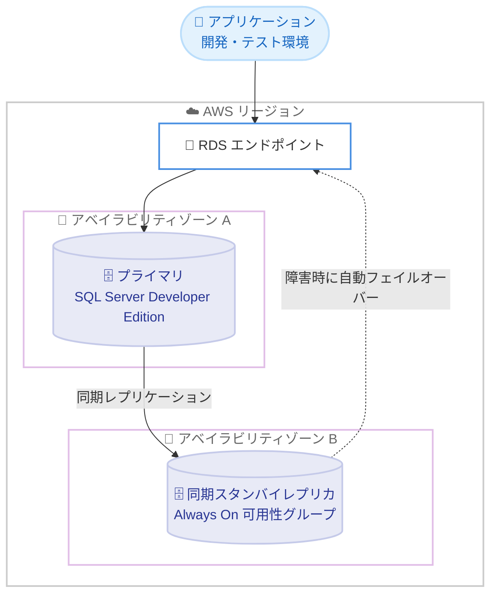

# Amazon RDS for SQL Server - Developer Edition の Multi-AZ 配置サポート

**リリース日**: 2026 年 9 月 24 日
**サービス**: Amazon RDS for SQL Server
**機能**: SQL Server Developer Edition における Always On 可用性グループを使用した Multi-AZ 配置

📊 [このアップデートのインフォグラフィックを見る](https://takech9203.github.io/aws-news-summary/20260924-amazon-rds-sql-server-multi-az-developer-edition.html)

## 概要

Amazon RDS for SQL Server が、SQL Server Developer Edition における Always On 可用性グループを使用した Multi-AZ 配置をサポートしました。Multi-AZ 配置では、異なるアベイラビリティゾーンに同期スタンバイレプリカを維持し、インフラストラクチャ障害時に自動フェイルオーバーを提供します。

Developer Edition は Enterprise Edition のすべての機能をライセンス費用なしで利用できるエディションであり、非本番環境向けにライセンスされています。今回のアップデートにより、Enterprise Edition のライセンス費用をかけずに、開発・テスト環境で本番環境と同等の高可用性構成を構築・検証できるようになりました。

対象は SQL Server Developer Edition のメジャーバージョン 2019 および 2022、ならびに SQL Server 2025 Enterprise Developer Edition です。SQL Server 2025 Standard Developer Edition は本機能をサポートしていません。

**アップデート前の課題**

- Developer Edition ではシングル AZ 配置のみがサポートされており、Multi-AZ 構成の構築・テストができなかった
- 高可用性構成やフェイルオーバー動作を検証するには、ライセンス費用が発生する Enterprise Edition または Standard Edition の非本番インスタンスを用意する必要があった
- 本番環境が Multi-AZ 構成の場合、開発・テスト環境と本番環境の構成差異が大きく、検証の忠実度が低下していた

**アップデート後の改善**

- Developer Edition で Always On 可用性グループを使用した Multi-AZ 配置を構築できるようになった
- SQL Server のライセンス費用なし (AWS インフラストラクチャ費用のみ) で、高可用性構成と自動フェイルオーバーの動作を非本番環境で検証できるようになった
- 開発・テスト環境を本番環境と同等の構成に揃えることで、フェイルオーバーを含めたアプリケーション挙動のテスト精度が向上した

## アーキテクチャ図



Multi-AZ 配置では、プライマリインスタンスから別のアベイラビリティゾーンのスタンバイレプリカへ同期レプリケーションが行われ、インフラストラクチャ障害時にはスタンバイへ自動的にフェイルオーバーします。

## サービスアップデートの詳細

### 主要機能

1. **Always On 可用性グループによる Multi-AZ 配置**
   - 異なるアベイラビリティゾーンに同期スタンバイレプリカを維持
   - インフラストラクチャ障害発生時の自動フェイルオーバーを提供
   - Enterprise Edition の Multi-AZ 配置と同じ Always On 可用性グループテクノロジーを使用

2. **ライセンス費用なしでの高可用性検証**
   - Developer Edition は Enterprise Edition のすべての機能をライセンス費用なしで提供
   - 支払いは AWS インフラストラクチャ費用のみ (追加の SQL Server ライセンス費用は不要)
   - 非本番環境における高可用性構成の構築・テストが可能

3. **対応バージョン**
   - SQL Server Developer Edition メジャーバージョン 2019 および 2022
   - SQL Server 2025 Enterprise Developer Edition (エンジンタイプ `sqlserver-dev-ee`)
   - SQL Server 2025 Standard Developer Edition (エンジンタイプ `sqlserver-dev-se`) は非対応

## 技術仕様

### Developer Edition の Multi-AZ サポート状況

| 項目 | 詳細 |
|------|------|
| 高可用性テクノロジー | Always On 可用性グループ |
| レプリケーション方式 | 同期レプリケーション (別アベイラビリティゾーンのスタンバイレプリカ) |
| フェイルオーバー | インフラストラクチャ障害時に自動実行 |
| SQL Server 2019 Developer Edition | Multi-AZ 対応 (CU 32 GDR, 15.00.4455.2) |
| SQL Server 2022 Developer Edition | Multi-AZ 対応 (CU 21, 16.00.4215.2) |
| SQL Server 2025 Enterprise Developer Edition | Multi-AZ 対応 (`sqlserver-dev-ee`) |
| SQL Server 2025 Standard Developer Edition | Multi-AZ 非対応 (`sqlserver-dev-se`) |
| インスタンス作成方法 | カスタムエンジンバージョン (CEV) 機能で独自の (Microsoft から入手した) インストールメディアを使用 |
| リードレプリカ | 非対応 (Developer Edition の制限) |

### 前提となる仕組み: カスタムエンジンバージョン

Developer Edition の RDS インスタンスは、カスタムエンジンバージョン (CEV) 機能を通じて作成します。Microsoft から直接入手したインストールメディア (ISO と累積更新ファイル) を Amazon S3 バケットにアップロードし、CEV を作成した上で DB インスタンスを起動します。

利用可能なテンプレートエンジンバージョンは、以下のコマンドで確認できます (ステータスが `requires-custom-engine-version` のものが対象)。

```bash
aws rds describe-db-engine-versions \
  --engine sqlserver-dev-ee \
  --output json \
  --query "DBEngineVersions[?Status=='requires-custom-engine-version'].{Engine: Engine, EngineVersion: EngineVersion, Status: Status}"
```

## 設定方法

### 前提条件

1. Microsoft から SQL Server Developer Edition のインストールバイナリ (ISO と累積更新ファイル) を直接入手し、Microsoft のライセンス条項を遵守していること
2. `AmazonRDSFullAccess` および `s3:GetObject` 権限を持つ AWS アカウント
3. インストールメディアを格納する Amazon S3 バケット (CEV を作成するリージョンと同一リージョン、すべてのメディアファイルは同一バケット・同一フォルダパスに配置)

### 手順

#### ステップ 1: インストールメディアを S3 にアップロード

```bash
aws s3 cp ./SQLServer2022-x64-ENU-Dev.iso s3://my-sqlserver-media/dev-edition/
aws s3 cp ./sqlserver2022-kbXXXXXXX-x64.exe s3://my-sqlserver-media/dev-edition/
```

Microsoft から入手した SQL Server Developer Edition の ISO ファイルと累積更新 (CU) ファイルを、CEV を作成するリージョンの S3 バケットにアップロードします。

#### ステップ 2: カスタムエンジンバージョンを作成

```bash
aws rds create-custom-db-engine-version \
  --engine sqlserver-dev-ee \
  --engine-version 16.00.4215.2.my-cev \
  --database-installation-files-s3-bucket-name my-sqlserver-media \
  --database-installation-files-s3-prefix dev-edition/
```

S3 にアップロードしたインストールメディアを指定して、Developer Edition 用のカスタムエンジンバージョンを作成します。

#### ステップ 3: Multi-AZ オプションを有効にして DB インスタンスを作成

```bash
aws rds create-db-instance \
  --db-instance-identifier my-dev-sqlserver-multiaz \
  --engine sqlserver-dev-ee \
  --engine-version 16.00.4215.2.my-cev \
  --db-instance-class db.m5.xlarge \
  --allocated-storage 100 \
  --master-username admin \
  --manage-master-user-password \
  --multi-az
```

`--multi-az` フラグを指定して DB インスタンスを作成します。これにより、別のアベイラビリティゾーンに同期スタンバイレプリカが作成され、自動フェイルオーバーが有効になります。既存のシングル AZ インスタンスの場合は、`modify-db-instance` コマンドで Multi-AZ 配置に変更することも可能です。

## メリット

### ビジネス面

- **ライセンスコストの削減**: Enterprise Edition のライセンス費用をかけずに高可用性構成を検証でき、開発・テスト環境のコストを大幅に削減できる
- **本番リリース前のリスク低減**: フェイルオーバー動作を事前に検証することで、本番環境での想定外の挙動を防止できる
- **環境パリティの確保**: 開発・テスト環境を本番環境と同等の Multi-AZ 構成に揃えられるため、検証の信頼性が向上する

### 技術面

- **自動フェイルオーバーの検証**: インフラストラクチャ障害時のフェイルオーバー動作と、アプリケーションの再接続処理を実環境でテストできる
- **Always On 可用性グループの利用**: 本番の Enterprise Edition と同じ高可用性テクノロジーを使用するため、動作の忠実な再現が可能
- **RDS のマネージド機能との統合**: バックアップ、パッチ適用、モニタリングなどの RDS 自動管理機能をそのまま利用できる

## デメリット・制約事項

### 制限事項

- Developer Edition は Microsoft のライセンス条項により開発・テスト用途に限定され、本番環境では使用できない
- SQL Server 2025 Standard Developer Edition (`sqlserver-dev-se`) は Multi-AZ をサポートしない
- Developer Edition ではリードレプリカがサポートされない
- インストールメディアは Microsoft から直接入手し、ユーザー自身で管理する必要がある
- Developer Edition の CEV はリージョン間・アカウント間で共有できない

### 考慮すべき点

- Multi-AZ 配置ではスタンバイインスタンス分のインフラストラクチャ費用が追加で発生する (シングル AZ の約 2 倍)
- CEV の作成にはインストールメディアの準備と S3 へのアップロードが必要で、標準エディションのインスタンス作成より手順が多い
- Microsoft の Developer Edition ライセンス条項の遵守はユーザーの責任となる

## ユースケース

### ユースケース 1: 本番相当の高可用性構成の事前検証

**シナリオ**: 本番環境で Enterprise Edition の Multi-AZ 構成を運用しており、フェイルオーバー時のアプリケーション挙動を事前にテストしたい。

**実装例**:
```bash
# Developer Edition の Multi-AZ インスタンスでフェイルオーバーをテスト
aws rds reboot-db-instance \
  --db-instance-identifier my-dev-sqlserver-multiaz \
  --force-failover
```

**効果**: ライセンス費用なしで本番と同じ Always On 可用性グループ構成を再現し、フェイルオーバー時の接続断や再接続処理をアプリケーション側で検証できる。

### ユースケース 2: 開発・テスト環境のコスト最適化

**シナリオ**: これまで開発・テスト環境に Enterprise Edition (License Included) を使用しており、ライセンスコストが課題となっている。

**実装例**:
```bash
# Developer Edition のスナップショットからテスト環境を構築し、Multi-AZ を有効化
aws rds modify-db-instance \
  --db-instance-identifier my-dev-sqlserver \
  --multi-az \
  --apply-immediately
```

**効果**: 非本番環境を Developer Edition に置き換えることで SQL Server ライセンス費用を排除しつつ、必要に応じて Multi-AZ 構成の機能検証も実施できる。

### ユースケース 3: 災害復旧・運用手順のリハーサル

**シナリオ**: Multi-AZ 環境での AZ 障害を想定した運用手順 (フェイルオーバー後の確認、監視アラートの検証など) を整備したい。

**実装例**:
```bash
# フェイルオーバーイベントを RDS イベントで監視
aws rds describe-events \
  --source-identifier my-dev-sqlserver-multiaz \
  --source-type db-instance \
  --duration 60
```

**効果**: 本番環境に影響を与えることなく、フェイルオーバー発生時の運用手順や監視・通知フローをリハーサルできる。

## 料金

SQL Server Developer Edition の利用には追加の SQL Server ライセンス費用は発生せず、AWS インフラストラクチャ費用 (インスタンス、ストレージなど) のみを支払います。Multi-AZ 配置ではスタンバイレプリカ分の費用が追加されるため、シングル AZ 配置と比較してインフラストラクチャ費用は概ね 2 倍になります。

### 料金の構成要素

| 項目 | 内容 |
|------|------|
| SQL Server ライセンス | 不要 (Developer Edition はライセンス費用なし) |
| DB インスタンス | Multi-AZ 配置ではプライマリとスタンバイの 2 インスタンス分の料金 |
| ストレージ | Multi-AZ 配置ではレプリケーションのためストレージ費用も増加 |

詳細は [RDS for SQL Server 料金ページ](https://aws.amazon.com/rds/sqlserver/pricing/) を参照してください。

## 利用可能リージョン

RDS for SQL Server Developer Edition は、以下を含む多数の AWS リージョンで利用可能です (ドキュメント記載のリージョン一覧より)。

- 米国東部 (オハイオ、バージニア北部)、米国西部 (北カリフォルニア、オレゴン)
- アジアパシフィック (東京、大阪、ソウル、シンガポール、シドニー、ムンバイ、香港、台北、ハイデラバード、ジャカルタ、マレーシア、メルボルン、ニュージーランド、タイ)
- 欧州 (フランクフルト、アイルランド、ロンドン、ミラノ、パリ、スペイン、ストックホルム、チューリッヒ)
- カナダ (中部)、カナダ西部 (カルガリー)、南米 (サンパウロ)、アフリカ (ケープタウン)、イスラエル (テルアビブ)、メキシコ (中部)
- AWS GovCloud (US-East、US-West)

最新のリージョン対応状況は [Working with SQL Server Developer Edition on RDS for SQL Server](https://docs.aws.amazon.com/AmazonRDS/latest/UserGuide/sqlserver-dev-edition.html) を参照してください。

## 関連サービス・機能

- **Amazon RDS Custom Engine Version (CEV)**: Developer Edition のインスタンス作成に使用する仕組み。ユーザーが用意したインストールメディアから独自のエンジンバージョンを作成する
- **Amazon S3**: CEV 作成に使用するインストールメディア (ISO、累積更新ファイル) の格納先
- **Amazon RDS Multi-AZ 配置**: 異なるアベイラビリティゾーンへの同期レプリケーションと自動フェイルオーバーを提供する RDS の高可用性機能
- **AWS Secrets Manager**: `--manage-master-user-password` オプション使用時にマスターユーザーパスワードを管理

## 参考リンク

- 📊 [インフォグラフィック](https://takech9203.github.io/aws-news-summary/20260924-amazon-rds-sql-server-multi-az-developer-edition.html)
- [公式発表 (What's New)](https://aws.amazon.com/about-aws/whats-new/2026/09/amazon-rds-sql-server-multi-az-developer-edition/)
- [ドキュメント: Working with SQL Server Developer Edition on RDS for SQL Server](https://docs.aws.amazon.com/AmazonRDS/latest/UserGuide/sqlserver-dev-edition.html)
- [製品ページ: Amazon RDS for SQL Server](https://aws.amazon.com/rds/sqlserver/)
- [料金ページ: Amazon RDS for SQL Server Pricing](https://aws.amazon.com/rds/sqlserver/pricing/)

## まとめ

SQL Server Developer Edition の Multi-AZ 配置サポートにより、Enterprise Edition のライセンス費用をかけずに、非本番環境で Always On 可用性グループを使用した高可用性構成の構築・検証が可能になりました。本番環境で Multi-AZ 構成を運用しているチームは、開発・テスト環境を Developer Edition に置き換えることでコストを削減しつつ、フェイルオーバー動作を含めた本番相当の検証環境を整備することを推奨します。SQL Server 2025 では Enterprise Developer Edition のみが対象で、Standard Developer Edition は非対応である点に注意してください。
