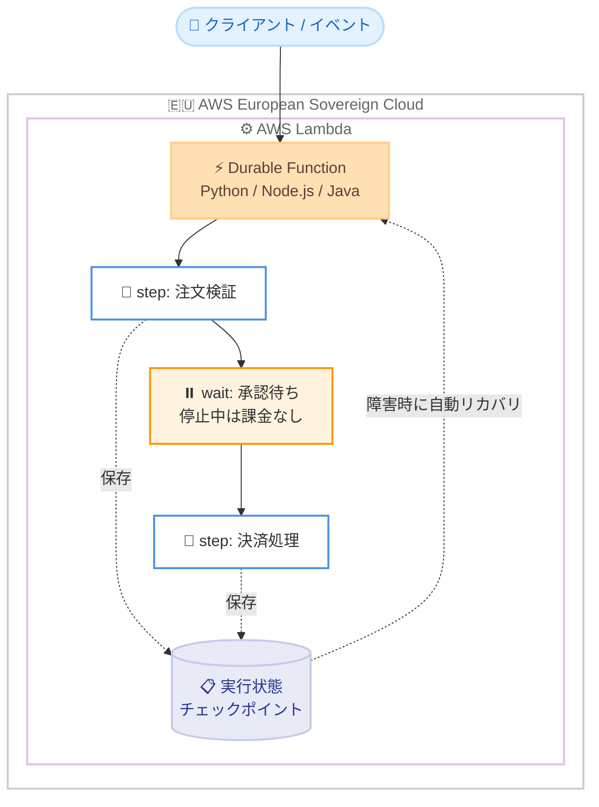

# AWS Lambda - Durable Functions の AWS European Sovereign Cloud 対応

**リリース日**: 2026年9月24日
**サービス**: AWS Lambda
**機能**: Durable Functions の AWS European Sovereign Cloud リージョン対応

📊 [このアップデートのインフォグラフィックを見る](https://takech9203.github.io/aws-news-summary/20260924-durablefunctions-european-sovereign-cloud.html)
<!-- INFOGRAPHIC_BASE_URL は環境変数から取得 -->

## 概要

AWS Lambda の Durable Functions が、AWS European Sovereign Cloud リージョンで利用可能になりました。Durable Functions は、Lambda の開発体験の中で信頼性の高いマルチステップアプリケーションや AI ワークフローを構築できる機能です。「step」や「wait」といった新しいプリミティブで Lambda プログラミングモデルを拡張し、進捗のチェックポイント保存、障害からの自動リカバリ、実行の一時停止を関数コード内で直接実現できます。オンデマンド関数では、実行を一時停止している間のコンピュート料金は発生しません。

AWS European Sovereign Cloud は、データレジデンシー、運用の自律性、レジリエンシーといった欧州の主権要件に対応するために設計された、既存の AWS リージョンから独立して運営されるクラウドです。2026 年 1 月に最初のリージョンがドイツで開設され、専用ドメイン aws.eu で提供されています。

今回のアップデートにより、欧州の厳格なコンプライアンス・セキュリティ要件のもとでシステムを運用するお客様が、注文処理ワークフロー、ユーザーオンボーディング、AI 支援タスクなどの複雑なプロセスを、主権要件を満たしながら Durable Functions でオーケストレーションできるようになります。

**アップデート前の課題**

- AWS European Sovereign Cloud では Durable Functions が利用できず、マルチステップのワークフローを構築するには外部のオーケストレーションサービスや独自の状態管理の実装が必要だった
- 欧州の主権要件 (データレジデンシー、運用の自律性) を満たす環境で、チェックポイントや自動リトライを備えた長時間実行ワークフローを Lambda だけで完結できなかった
- 商用リージョンで Durable Functions を活用しているお客様が、同じアーキテクチャを European Sovereign Cloud に展開できなかった

**アップデート後の改善**

- AWS European Sovereign Cloud 内で、Lambda の関数コードだけで信頼性の高いマルチステップワークフローを構築できるようになった
- 「step」によるチェックポイント保存と障害からの自動リカバリ、「wait」による一時停止 (オンデマンド関数では停止中のコンピュート料金なし) を主権要件を満たす環境で利用できるようになった
- 商用リージョンと同じ Durable Functions のプログラミングモデルとツール (API、コンソール、SDK、CloudFormation、SAM、CDK) を European Sovereign Cloud でも利用できるようになった

## アーキテクチャ図



AWS European Sovereign Cloud 内の Durable Function が、step ごとに実行状態をチェックポイントとして保存し、wait による一時停止と障害からの自動リカバリを主権要件を満たす境界の中で実現します。

## サービスアップデートの詳細

### 主要機能

1. **step プリミティブによるチェックポイントと自動リカバリ**
   - ワークフローの各処理を step として定義し、完了時に進捗をチェックポイントとして保存できる
   - 障害が発生した場合、完了済みの step を再実行することなく、中断した地点から自動的にリカバリできる
   - リトライやエラーハンドリングのための独自実装が不要になる

2. **wait プリミティブによるコスト効率の良い一時停止**
   - 承認待ちや外部イベント待ちなど、実行を一時停止する処理を関数コード内に記述できる
   - オンデマンド関数では、一時停止中のコンピュート料金が発生しない
   - 長時間の待機を含むワークフローを低コストで実現できる

3. **主権要件を満たす環境でのワークフローオーケストレーション**
   - 注文処理ワークフロー、ユーザーオンボーディング、AI 支援タスクなどの複雑なプロセスを、欧州のコンプライアンス・セキュリティ要件を満たしながらオーケストレーションできる
   - AWS European Sovereign Cloud のデータレジデンシーと運用の自律性のもとで、商用リージョンと同じ Lambda 開発体験を利用できる

## 技術仕様

### 対応ランタイムと有効化方法

| 項目 | 詳細 |
|------|------|
| 対応ランタイム | Python 3.13 / 3.14、Node.js 22 / 24、Java 17 以上 |
| 対象関数 | 上記ランタイムで作成する新規の Lambda 関数 |
| 有効化方法 | AWS Lambda API、AWS マネジメントコンソール、AWS SDK |
| IaC 対応 | AWS CloudFormation、AWS SAM、AWS CDK |
| 課金 | オンデマンド関数では一時停止中のコンピュート料金なし |
| 利用環境 | AWS European Sovereign Cloud (専用ドメイン aws.eu) |

## 設定方法

### 前提条件

1. AWS European Sovereign Cloud のアカウントを保有していること
2. Python 3.13/3.14、Node.js 22/24、Java 17 以上のいずれかのランタイムを使用すること
3. Durable Functions は新規作成する Lambda 関数で有効化すること

### 手順

#### ステップ1: Durable Functions を有効化した関数の作成

```bash
aws lambda create-function \
  --function-name my-durable-function \
  --runtime python3.13 \
  --handler app.handler \
  --role arn:aws:iam::111122223333:role/lambda-durable-role \
  --zip-file fileb://function.zip \
  --durable-config '{"ExecutionTimeout": 86400, "RetentionPeriodInDays": 90}'
```

`--durable-config` を指定して、Durable Functions を有効化した新規 Lambda 関数を作成します。実行タイムアウトと実行状態の保持期間をあわせて設定します。

#### ステップ2: step と wait を使用したハンドラーの実装

```python
# Python での実装イメージ
def handler(event, context):
    order = context.durable.step("validate", validate_order, event)
    context.durable.wait_for_condition("approval", timeout=3600)
    result = context.durable.step("charge", charge_payment, order)
    return result
```

イベントハンドラー内で step を使って各処理をチェックポイント化し、wait で承認などの外部イベントを待機します。step の完了状態は自動的に保存され、障害時は未完了の step から再開されます。具体的な API は開発者ガイドを参照してください。

#### ステップ3: 実行とモニタリング

```bash
aws lambda invoke \
  --function-name my-durable-function \
  --payload '{"orderId": "12345"}' \
  response.json
```

関数を呼び出してワークフローを開始します。実行状態や履歴は Lambda の API およびコンソールから確認できます。

## メリット

### ビジネス面

- **主権要件とワークフロー自動化の両立**: 欧州のデータレジデンシーや運用の自律性の要件を満たしながら、複雑な業務プロセスを自動化できる
- **コスト効率**: オンデマンド関数では一時停止中のコンピュート料金が発生せず、承認待ちなど長時間の待機を含むワークフローを低コストで運用できる
- **アーキテクチャの一貫性**: 商用リージョンで構築した Durable Functions ベースのアーキテクチャを、European Sovereign Cloud にも展開できる

### 技術面

- **Lambda 開発体験の維持**: 外部オーケストレーターを導入せず、使い慣れた Lambda のプログラミングモデルの延長でマルチステップワークフローを実装できる
- **自動的な信頼性確保**: step によるチェックポイントと自動リカバリにより、リトライや状態管理の独自実装が不要になる
- **IaC 対応**: CloudFormation、SAM、CDK に対応しており、既存のデプロイパイプラインに組み込みやすい

## デメリット・制約事項

### 制限事項

- Durable Functions を有効化できるのは新規に作成する Lambda 関数に限られる
- 対応ランタイムは Python 3.13/3.14、Node.js 22/24、Java 17 以上に限定される
- AWS European Sovereign Cloud は既存の AWS リージョンから独立しているため、商用リージョンとは別のアカウント・認証情報が必要になる

### 考慮すべき点

- ワークフローの各 step は再実行される可能性を考慮し、冪等性を意識した設計が推奨される
- 実行状態の保持期間 (RetentionPeriodInDays) と実行タイムアウトは、業務要件とデータ保持ポリシーにあわせて設計する必要がある
- European Sovereign Cloud で利用可能な他の AWS サービスとの連携可否を事前に確認する必要がある

## ユースケース

### ユースケース1: 欧州規制下での注文処理ワークフロー

**シナリオ**: 欧州の小売事業者が、在庫確認、決済、配送手配からなる注文処理を、データを EU 域内に保持する要件のもとで自動化したい。

**実装例**:
```
step("在庫確認") → step("決済処理") → step("配送手配")
各 step の完了時に実行状態をチェックポイントとして保存
```

**効果**: 決済処理中に障害が発生しても在庫確認から再実行されることなく自動リカバリでき、データレジデンシー要件を満たしたまま信頼性の高い注文処理を実現できる。

### ユースケース2: 公共部門のユーザーオンボーディング

**シナリオ**: 欧州の公共機関が、本人確認書類の審査と管理者承認を含む利用者登録プロセスを、主権要件を満たす環境で構築したい。承認までに数時間から数日かかる場合がある。

**実装例**:
```
step("書類検証") → wait("管理者承認待ち") → step("アカウント発行")
オンデマンド関数のため承認待ちの間はコンピュート料金なし
```

**効果**: 長時間の承認待ちを含むプロセスを低コストで運用でき、公共部門に求められる運用の自律性とデータ主権を確保できる。

### ユースケース3: コンプライアンス要件下での AI 支援タスク

**シナリオ**: 欧州の金融機関が、複数の AI モデル呼び出しと人間によるレビューを組み合わせた文書処理ワークフローを構築したい。処理データは EU 域内から出せない。

**実装例**:
```
step("文書解析") → step("AI 要約生成") → wait("人間によるレビュー") → step("結果確定")
```

**効果**: AI ワークフローの各段階をチェックポイント化して信頼性を確保しつつ、EU の厳格なコンプライアンス・セキュリティ要件を満たした環境で運用できる。

## 料金

Lambda の標準的な料金体系が適用されます。Durable Functions では、オンデマンド関数の場合、wait などで実行を一時停止している間のコンピュート料金は発生しません。実行中のコンピュート時間とリクエスト数に応じた課金に加え、Durable Functions の実行状態管理に関する料金の詳細は Lambda の料金ページを参照してください。

## 利用可能リージョン

AWS European Sovereign Cloud リージョンで利用可能になりました。AWS European Sovereign Cloud は 2026 年 1 月に最初のリージョンがドイツで開設された、既存の AWS リージョンから独立して運営されるクラウドで、専用ドメイン aws.eu で提供されています。

なお、Durable Functions は商用 AWS リージョンでも提供されています。

## 関連サービス・機能

- **AWS Step Functions**: ワークフローオーケストレーションのマネージドサービス。Durable Functions は Lambda の関数コード内でワークフローを完結させたい場合の選択肢となる
- **AWS European Sovereign Cloud**: 欧州の主権要件に対応する独立運営のクラウド。今回 Durable Functions が利用可能になった環境
- **AWS SAM / AWS CDK / AWS CloudFormation**: Durable Functions の有効化に対応した IaC ツール

## 参考リンク

- 📊 [インフォグラフィック](https://takech9203.github.io/aws-news-summary/20260924-durablefunctions-european-sovereign-cloud.html)
- [公式発表 (What's New)](https://aws.amazon.com/about-aws/whats-new/2026/09/durablefunctions-european-sovereign-cloud/)
- [Lambda Durable Functions 製品ページ](https://aws.amazon.com/lambda/lambda-durable-functions/)
- [開発者ガイド (European Sovereign Cloud)](https://docs.aws.eu/lambda/latest/dg/durable-functions.html)
- [AWS Lambda 料金ページ](https://aws.amazon.com/lambda/pricing/)

## まとめ

Lambda Durable Functions が AWS European Sovereign Cloud で利用可能になり、欧州の主権要件を満たす環境でも、チェックポイントと自動リカバリを備えたマルチステップワークフローや AI ワークフローを Lambda だけで構築できるようになりました。European Sovereign Cloud を利用中または検討中で、注文処理やオンボーディングなどの長時間実行プロセスを抱えるお客様は、Python 3.13/3.14、Node.js 22/24、Java 17 以上の新規関数での Durable Functions の活用を検討することを推奨します。
