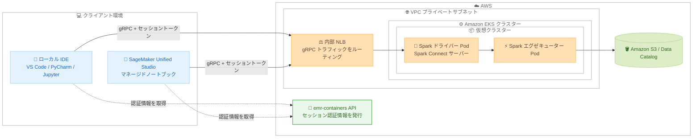

# Amazon EMR on EKS - Spark Connect によるインタラクティブワークロードのサポート

**リリース日**: 2026 年 9 月 24 日
**サービス**: Amazon EMR on EKS
**機能**: Spark Connect を使用したインタラクティブ Apache Spark セッション

📊 [このアップデートのインフォグラフィックを見る](https://takech9203.github.io/aws-news-summary/20260924-emr-eks-spark-connect-interactive.html)

## 概要

Amazon EMR on EKS が、Spark Connect を使用したインタラクティブ Apache Spark セッションをサポートしました。データエンジニアやデータサイエンティストは、Amazon SageMaker Unified Studio のマネージドノートブックや、Jupyter、VS Code、PyCharm などの使い慣れた IDE から、既存の Amazon EKS クラスター上で動作する Spark に接続し、Spark アプリケーションをインタラクティブに開発・デバッグできるようになります。

Spark Connect はクライアントサーバーアーキテクチャを採用しており、アプリケーションクライアントを Spark ドライバーから分離します。インタラクティブセッションは、セルやスクリプトをまたいで維持される永続的な Spark コンテキストを提供するため、ローカルでの Python 実行とリモートでの Spark 処理を組み合わせた反復的な開発が可能です。各セッションは仮想クラスター上の Pod として実行され、IAM 実行ロールで保護され、プロジェクトとユーザーごとにタグ付けされます。

本機能は EMR リリース 7.14 (Apache Spark 3.5) および emr-spark-8.1.0 (Apache Spark 4.1) で利用でき、すべての AWS 商用リージョンで提供されます。

**アップデート前の課題**

- 以前の Amazon EMR on EKS では、インタラクティブな開発には Livy ベースのマネージドエンドポイント (Jupyter Enterprise Gateway) 経由の接続が中心で、ローカル IDE から直接 DataFrame API を実行するワークフローが取りにくかった
- ローカル環境で開発したコードを試すには、ジョブとしてサブミットして結果を待つ必要があり、試行錯誤のサイクルが長かった
- IDE のブレークポイントやステップ実行といったデバッグ機能を、本番規模のデータに対する Spark 処理と組み合わせることが困難だった

**アップデート後の改善**

- VS Code、PyCharm、Jupyter ノートブックなど任意の PySpark クライアントから、EKS クラスター上の Spark に gRPC で直接接続できるようになった
- 永続的な Spark コンテキストにより、セルやスクリプトをまたいだインタラクティブなデータ探索と段階的な PySpark 開発が可能になった
- IDE でブレークポイントを設定してコードをステップ実行しながら、DataFrame 処理は本番規模のデータに対してリモートで実行できるようになった
- 運用中の EKS クラスターをそのまま利用でき、コンピューティング、ネットワーク、セキュリティ構成を完全に制御できる

## アーキテクチャ図



クライアント (IDE やノートブック) は emr-containers API からセッショントークンを取得し、内部 Network Load Balancer 経由の gRPC で EKS クラスター上の Spark Connect サーバー (Spark ドライバー) に接続します。DataFrame や SQL の操作はリモートのドライバーとエグゼキューターで実行されます。

## サービスアップデートの詳細

### 主要機能

1. **Spark Connect マネージドエンドポイント**
   - 仮想クラスター上に Spark Connect サーバーをホストするマネージドエンドポイント (タイプ: `SPARK_CONNECT`) を作成できる
   - エンドポイント作成時に、Amazon EMR on EKS が gRPC サーバーを備えた Spark ドライバーを EKS クラスター上にプロビジョニングする
   - 1 つのエンドポイントで複数の同時セッションをサポートする
   - 従来の Livy インタラクティブエンドポイント (タイプ: `JUPYTER_ENTERPRISE_GATEWAY`) とは別のエンドポイントタイプとして提供される

2. **永続的な Spark コンテキストによるインタラクティブセッション**
   - セッションはセルやスクリプトをまたいで維持される永続的な Spark コンテキストを提供する
   - アドホックなデータ探索や、本番デプロイ前の段階的な PySpark 開発に適している
   - `sessionIdleTimeoutInMinutes` パラメータでアイドルセッションの自動終了までの時間を制御できる (デフォルト: 60 分)

3. **クライアントサーバーアーキテクチャによる分離**
   - Spark Connect のクライアントサーバーモデルにより、アプリケーションクライアントと Spark ドライバープロセスが分離される
   - ローカル IDE で PySpark コードを開発・デバッグしながら、Spark 処理は EKS クラスター上でリモート実行される
   - IDE でブレークポイントを設定し、本番規模のデータに対する DataFrame 処理をステップ実行しながら確認できる

4. **IAM ベースのセキュリティ**
   - 各セッションは仮想クラスター上の Pod として実行され、IAM 実行ロールで保護される
   - セッションはプロジェクトとユーザーごとにタグ付けされる
   - `GetManagedEndpointSessionCredentials` API で時間制限付きのセッショントークンを取得し、認証プロキシ URL 経由で接続する
   - gRPC トラフィックは内部 Network Load Balancer と VPC インターフェイスエンドポイント (AWS PrivateLink) 経由でルーティングされ、パブリックインターネットには公開されない

## 技術仕様

### サポートバージョンと構成要素

| 項目 | 詳細 |
|------|------|
| 対応リリース | `emr-7.14.0` 以降 (Apache Spark 3.5)、`emr-spark-8.1.0` 以降 (Apache Spark 4.1) |
| エンドポイントタイプ | `SPARK_CONNECT` |
| クライアント PySpark バージョン | `emr-7.14.0` は PySpark 3.5.8、`emr-spark-8.1.0` は PySpark 4.0.2 (エンドポイントの Spark バージョンと一致が必須) |
| 通信プロトコル | gRPC (内部 NLB および AWS PrivateLink 経由、SSL 使用) |
| 認証 | IAM 実行ロール + `GetManagedEndpointSessionCredentials` によるセッショントークン |
| サポート API | PySpark の DataFrame API と SQL API (RDD ベースの API は非サポート) |
| アイドルタイムアウト | `sessionIdleTimeoutInMinutes` で設定 (デフォルト: 60 分) |
| 前提インフラ | プライベートサブネットを持つ EKS クラスター、AWS Load Balancer Controller |

### 必要な IAM 権限

エンドポイントの作成と接続には、以下のような権限が必要です。

```json
{
    "Version": "2012-10-17",
    "Statement": [
        {
            "Sid": "EMRContainersEndpointAccess",
            "Effect": "Allow",
            "Action": [
                "emr-containers:CreateManagedEndpoint",
                "emr-containers:DescribeManagedEndpoint",
                "emr-containers:DeleteManagedEndpoint",
                "emr-containers:ListManagedEndpoints",
                "emr-containers:GetManagedEndpointSessionCredentials"
            ],
            "Resource": [
                "arn:aws:emr-containers:region:account-id:/virtualclusters/virtual-cluster-id",
                "arn:aws:emr-containers:region:account-id:/virtualclusters/virtual-cluster-id/endpoints/*"
            ]
        },
        {
            "Sid": "PassRoleToEMRContainers",
            "Effect": "Allow",
            "Action": "iam:PassRole",
            "Resource": "arn:aws:iam::account-id:role/ExecutionRole",
            "Condition": {
                "StringLike": {
                    "iam:PassedToService": "emr-containers.amazonaws.com"
                }
            }
        }
    ]
}
```

## 設定方法

### 前提条件

1. プライベートサブネットを少なくとも 1 つ持つ EKS クラスター (gRPC トラフィックをルーティングする内部 NLB のプロビジョニングに必要)
2. EKS クラスターにインストールされた AWS Load Balancer Controller
3. Amazon S3 バケットや Data Catalog などのデータソースにアクセスできる IAM ジョブ実行ロール
4. EKS クラスターで Cluster Access Management を使用している場合は、Amazon EMR on EKS 用のアクセスエントリ

### 手順

#### ステップ 1: セキュリティ設定の作成

```bash
aws emr-containers create-security-configuration \
  --name "spark-connect-security-config" \
  --security-configuration '{
    "authenticationConfiguration": {
      "identityCenterConfiguration": {
        "enableIdentityCenter": false
      }
    }
  }' \
  --container-provider '{
    "type": "EKS",
    "id": "my-eks-cluster",
    "info": {
      "eksInfo": {
        "namespace": "emr-system-namespace"
      }
    }
  }'
```

Spark Connect エンドポイントに必要なセキュリティ設定を作成します。ここで指定する `namespace` は Spark Connect のインフラコンポーネントが動作するシステム名前空間で、仮想クラスター作成時に指定するユーザー名前空間とは別のものです。セキュリティ設定と仮想クラスターは 1 対 1 の関係になります。

#### ステップ 2: Spark Connect を有効にした仮想クラスターの作成

```bash
aws emr-containers create-virtual-cluster \
  --name "spark-connect-vc" \
  --container-provider '{
    "type": "EKS",
    "id": "my-eks-cluster",
    "info": {
      "eksInfo": {
        "namespace": "emr-user-namespace"
      }
    }
  }' \
  --security-configuration-id SECURITY_CONFIGURATION_ID \
  --session-enabled true
```

ステップ 1 のセキュリティ設定を関連付けた仮想クラスターを作成します。`--session-enabled true` を指定しないと、この仮想クラスターで Spark Connect エンドポイントを作成できません。

#### ステップ 3: Spark Connect エンドポイントの作成

```bash
aws emr-containers create-managed-endpoint \
  --virtual-cluster-id VIRTUAL_CLUSTER_ID \
  --name "spark-connect-endpoint" \
  --type "SPARK_CONNECT" \
  --release-label "emr-7.14.0-latest" \
  --execution-role-arn "arn:aws:iam::account-id:role/ExecutionRole" \
  --security-configuration-id SECURITY_CONFIGURATION_ID \
  --session-idle-timeout-in-minutes 60
```

仮想クラスター上に `SPARK_CONNECT` タイプのマネージドエンドポイントを作成します。EKS クラスターで最初に作成するエンドポイントは、共有ネットワークコンポーネント (内部 NLB と VPC インターフェイスエンドポイント) のプロビジョニングのため `ACTIVE` になるまで数分かかります。これらのコンポーネントは EKS クラスターごとに 1 回だけ作成され、以降のエンドポイントで再利用されます。

#### ステップ 4: PySpark クライアントからの接続

```python
import boto3
from pyspark.sql import SparkSession

client = boto3.client('emr-containers', region_name='REGION')

# エンドポイントの認証プロキシ URL を取得
endpoint = client.describe_managed_endpoint(
    virtualClusterId='VIRTUAL_CLUSTER_ID',
    id='ENDPOINT_ID'
)
auth_proxy_url = endpoint['endpoint']['authProxyUrl']

# セッショントークンを取得
creds = client.get_managed_endpoint_session_credentials(
    virtualClusterId='VIRTUAL_CLUSTER_ID',
    endpointIdentifier='ENDPOINT_ID',
    executionRoleArn='arn:aws:iam::account-id:role/ExecutionRole',
    credentialType='TOKEN'
)
token = creds['credentials']['token']

# Spark Connect で接続
connect_url = f"{auth_proxy_url}/;use_ssl=true;x-aws-proxy-auth={token}"
spark = SparkSession.builder.remote(connect_url).getOrCreate()

spark.sql("SELECT 1+1 AS result").show()
spark.stop()
```

`DescribeManagedEndpoint` で認証プロキシ URL を、`GetManagedEndpointSessionCredentials` でセッショントークンを取得し、`SparkSession.builder.remote()` でリモートの Spark Connect サーバーに接続します。事前に、エンドポイントの Spark バージョンに一致する PySpark クライアント (`pip install pyspark[connect]==3.5.8` など) のインストールが必要です。

## メリット

### ビジネス面

- **開発サイクルの短縮**: ジョブサブミットと結果待ちの繰り返しが不要になり、インタラクティブな試行錯誤により Spark アプリケーションの開発速度が向上する
- **既存インフラの活用**: すでに運用している EKS クラスターをそのまま利用でき、インタラクティブ開発のための追加基盤を構築する必要がない
- **ガバナンスの向上**: セッションが IAM 実行ロールで保護され、プロジェクトとユーザーごとにタグ付けされるため、利用状況の把握とアクセス制御を統一的に管理できる

### 技術面

- **クライアントとドライバーの分離**: Spark Connect のクライアントサーバーアーキテクチャにより、ローカルの開発ツールを自由に選択しながら、Spark 処理は EKS 上でスケーラブルに実行できる
- **本格的なデバッグ体験**: IDE のブレークポイントやステップ実行を使用しながら、DataFrame 処理は本番規模のデータに対してリモートで実行できる
- **永続的なセッション**: セルやスクリプトをまたいで Spark コンテキストが維持されるため、中間結果を保持したまま段階的に処理を組み立てられる
- **セキュアな接続経路**: gRPC トラフィックは内部 NLB と AWS PrivateLink 経由でルーティングされ、パブリックインターネットに公開されない

## デメリット・制約事項

### 制限事項

- Spark Connect は PySpark の DataFrame API と SQL API のみをサポートし、RDD ベースの API はサポートされない
- セッショントークンには有効期限があり、期限切れ後は gRPC 呼び出しが認証エラーになるため、トークンを再取得して新しい `SparkSession` を作成する必要がある
- セキュリティ設定と仮想クラスターは 1 対 1 の関係で、複数の仮想クラスター間でセキュリティ設定を共有できない
- セキュリティ設定を削除するには、それを使用するすべてのエンドポイントを先に削除する必要がある
- ローカルの PySpark バージョンはエンドポイントの Spark バージョンと一致している必要があり、不一致の場合は接続エラーや予期しない動作の原因となる
- Trusted Identity Propagation はサポートされない
- Lake Formation のきめ細かなアクセス制御 (FGAC) は現時点でサポートされず、アクセス制御にはエンドポイントに関連付けた IAM 実行ロールを使用する

### 考慮すべき点

- 最初の Spark Connect エンドポイント作成時に内部 NLB と VPC インターフェイスエンドポイントがプロビジョニングされるため、`ACTIVE` になるまで数分かかる
- NLB は最初のエンドポイント作成時に作成され、セッション有効な仮想クラスターがすべて削除されるまで存続するため、その間の NLB コストが発生する
- Python UDF (`@udf` や `spark.udf.register`) を使用する場合、ローカルの Python マイナーバージョンがリモートワーカーと一致していないと `PYTHON_VERSION_MISMATCH` エラーで失敗する
- SageMaker Unified Studio からの利用は、SageMaker Unified Studio がサポートするリージョンに限られる

## ユースケース

### ユースケース 1: ローカル IDE からのアドホックなデータ探索

**シナリオ**: データサイエンティストが、S3 上の大規模データセットに対して VS Code や Jupyter からアドホックにクエリを実行し、データの傾向を把握したい。

**実装例**:
```python
spark = SparkSession.builder.remote(connect_url).getOrCreate()

df = spark.read.parquet("s3://my-bucket/events/")
df.groupBy("event_type").count().orderBy("count", ascending=False).show()
```

**効果**: ローカルマシンのリソース制約を受けずに、EKS クラスターの計算能力を使用して本番規模のデータをインタラクティブに探索できる。永続的なセッションにより、読み込んだ DataFrame を保持したまま複数のクエリを試行できる。

### ユースケース 2: 本番デプロイ前の段階的な PySpark 開発とデバッグ

**シナリオ**: データエンジニアが ETL パイプラインの変換ロジックを開発しており、IDE のデバッガでロジックを検証しながら段階的にコードを完成させたい。

**実装例**:
```python
# IDE でブレークポイントを設定しながら段階的に開発
raw_df = spark.read.parquet("s3://my-bucket/raw/")
cleaned_df = raw_df.dropna(subset=["user_id"])

# 中間結果を確認 (ここにブレークポイントを設定)
print(f"Cleaned rows: {cleaned_df.count()}")

result_df = cleaned_df.groupBy("user_id").agg({"amount": "sum"})
result_df.write.mode("overwrite").parquet("s3://my-bucket/processed/")
```

**効果**: ジョブサブミットを繰り返すことなく、IDE のブレークポイントとステップ実行で変換ロジックを検証でき、開発とデバッグのサイクルが大幅に短縮される。検証済みのコードはそのまま本番ジョブとしてデプロイできる。

### ユースケース 3: SageMaker Unified Studio からのチーム開発

**シナリオ**: データ分析チームが SageMaker Unified Studio のマネージドノートブックを使用し、組織で運用中の EKS クラスター上の Spark でプロジェクトを進めたい。

**実装例**:
```text
1. 管理者が仮想クラスターと Spark Connect エンドポイントを作成
2. 各メンバーは SageMaker Unified Studio のノートブックからセッションに接続
3. セッションはプロジェクトとユーザーごとにタグ付けされ、IAM 実行ロールで保護される
```

**効果**: チームメンバーは環境構築なしでノートブックから Spark を利用でき、管理者はタグと IAM 実行ロールにより利用状況の追跡とアクセス制御を統一的に実施できる。

## 料金

Spark Connect のインタラクティブセッション自体に追加料金はなく、既存の Amazon EMR on EKS の料金体系に従います。以下のコストが発生します。

- **Amazon EMR on EKS 料金**: セッション中に Spark ドライバーおよびエグゼキューター Pod が消費する vCPU とメモリのリソースに基づく従量課金
- **Amazon EKS 料金**: EKS クラスターおよびワーカーノード (EC2 または Fargate) の料金
- **Network Load Balancer 料金**: gRPC トラフィックのルーティングに使用される内部 NLB の料金。NLB は最初のエンドポイント作成時に作成され、セッション有効な仮想クラスターがすべて削除されるまで存続する

アイドルセッションは `sessionIdleTimeoutInMinutes` (デフォルト: 60 分) で自動終了されるため、不要なリソース消費を抑制できます。

## 利用可能リージョン

すべての AWS 商用リージョンで利用可能です。ただし、Amazon SageMaker Unified Studio のノートブック体験は、SageMaker Unified Studio がサポートするリージョンに限られます。

## 関連サービス・機能

- **Amazon EKS**: Spark ドライバーとエグゼキューターが Pod として動作する基盤。コンピューティング、ネットワーク、セキュリティ構成を完全に制御できる
- **Amazon SageMaker Unified Studio**: マネージドノートブックから Spark Connect エンドポイントに接続し、統合された開発体験を提供する
- **AWS Load Balancer Controller**: 内部 NLB のプロビジョニングに必要な EKS アドオン
- **AWS PrivateLink**: gRPC トラフィックをパブリックインターネットに公開せずにルーティングする VPC インターフェイスエンドポイントを提供する
- **AWS IAM**: セッションの認証と、S3 や Data Catalog などデータソースへのアクセス制御を担う実行ロールを提供する

## 参考リンク

- 📊 [インフォグラフィック](https://takech9203.github.io/aws-news-summary/20260924-emr-eks-spark-connect-interactive.html)
- [公式発表 (What's New)](https://aws.amazon.com/about-aws/whats-new/2026/09/emr-eks-spark-connect-interactive/)
- [ドキュメント: Run interactive sessions with Amazon EMR on EKS through Spark Connect](https://docs.aws.amazon.com/emr/latest/EMR-on-EKS-DevelopmentGuide/emr-eks-spark-connect.html)
- [ドキュメント: SageMaker Unified Studio での Spark Connect の利用](https://docs.aws.amazon.com/sagemaker-unified-studio/latest/userguide/notebooks-spark-connect.html#spark-connect-emr-eks)
- [ドキュメント: SageMaker Unified Studio のサポートリージョン](https://docs.aws.amazon.com/sagemaker-unified-studio/latest/adminguide/supported-regions.html)
- [料金ページ: Amazon EMR の料金](https://aws.amazon.com/emr/pricing/)

## まとめ

Amazon EMR on EKS の Spark Connect サポートにより、使い慣れた IDE やノートブックから既存の EKS クラスター上の Spark にインタラクティブに接続できるようになり、Spark アプリケーションの開発・デバッグ体験が大きく向上します。EMR on EKS でバッチジョブを運用しているチームは、EMR 7.14 以降のリリースで Spark Connect エンドポイントを試し、開発ワークフローへの組み込みを検討することを推奨します。導入時は、PySpark クライアントのバージョン一致、RDD API 非サポート、NLB コストなどの制約事項を事前に確認してください。
