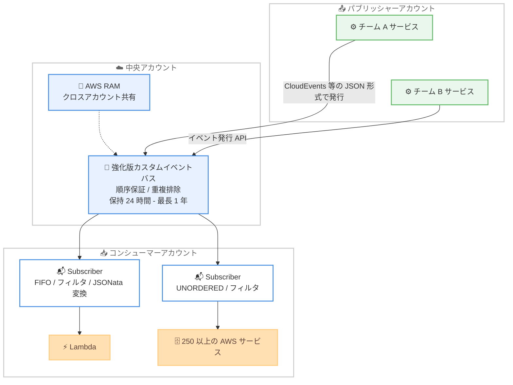

# Amazon EventBridge - エンタープライズスケール向け強化版カスタムイベントバスの再始動

**リリース日**: 2026 年 9 月 24 日
**サービス**: Amazon EventBridge
**機能**: 強化版カスタムイベントバス (Enhanced Custom Event Bus)

📊 [このアップデートのインフォグラフィックを見る](https://takech9203.github.io/aws-news-summary/20260924-eventbridge-relaunches-custom-event-buses.html)

## 概要

Amazon EventBridge は、イベントバスを刷新し、組織規模でスケールするイベント駆動型アプリケーションを構築できる新しい「強化版カスタムイベントバス」を発表しました。カスタムイベントバスを 1 つ作成して AWS Resource Access Manager (RAM) で複数アカウントに共有すると、各チームは厳密な順序保証、オープンなイベントフォーマット、組み込みのイベント保持、高度なイベント変換のサポートを利用してイベントを発行・消費できます。

新しいイベント発行 API により、CloudEvents などの JSON ベースのイベントフォーマットでイベントを発行できます。イベントは既定で 24 時間保持され、最長 1 年まで延長可能です。新しい Subscriber リソースはイベントのフィルタリングと 250 以上の AWS サービスへの配信を単一リソースで実現し、厳密な順序付き配信とコンテンツベースの自動重複排除もネイティブでサポートされます。既存のイベントバスは「Custom event bus - classic」に名称変更され、既存の API はすべて変更なく利用できます。

**アップデート前の課題**

- クロスアカウントでイベントを集約するには、アカウントごとにリソースポリシーやバス間ルーティングを手動で構成する必要があった
- 順序保証や重複排除が必要な場合、EventBridge と Lambda の間に SQS FIFO キューを挟むなど、追加のコンポーネントと運用が必要だった
- イベントバス自体に保持機能がなく、障害復旧や新規コンシューマへの過去イベント提供には別途アーカイブとリプレイの仕組みが必要だった
- ルール、ターゲット、リトライ設定、デッドレターキューを個別に構成する必要があり、サブスクリプション管理が煩雑だった

**アップデート後の改善**

- RAM によるイベントバス共有で、アカウント、OU、組織全体、IAM ロール/ユーザー単位のクロスアカウント連携が簡単に構成可能になった
- EventGroupId による厳密な順序付き配信と、コンテンツベースの自動重複排除がバスのネイティブ機能として利用可能になった
- 24 時間の組み込み保持 (最長 1 年まで延長可) により、エラー復旧や新規コンポーネントへの過去イベントの提供が容易になった
- Subscriber リソースにフィルタリング、変換、リトライポリシー、失敗時の宛先設定が統合され、構成がシンプルになった

## アーキテクチャ図



中央アカウントに作成した強化版カスタムイベントバスを AWS RAM で共有し、複数アカウントのチームがイベントを発行・購読する構成です。Subscriber リソースがフィルタリング、変換、配信を担います。

## サービスアップデートの詳細

### 主要機能

1. **AWS RAM によるクロスアカウント共有**
   - イベントバスを 1 つ以上のアカウントと AWS Resource Access Manager 経由で共有可能
   - 共有先はアカウント ID、組織全体、OU、IAM ロール/ユーザーから選択可能
   - 従来必要だったクロスアカウント権限やバス間ルーティングの手動設定が不要

2. **オープンなイベントフォーマットに対応した新しい発行 API**
   - CloudEvents などの JSON ベースのイベントフォーマットでイベントを発行可能
   - 既存のイベントスキーマを変更せずにそのまま利用できる
   - Apache Avro / Protocol Buffers ペイロードを JSON にデシリアライズし、フルペイロードでのフィルタリングとルーティングが可能

3. **組み込みのイベント保持 (Retention)**
   - 既定で 24 時間のイベント保持が組み込まれており、最長 1 年まで延長可能
   - エラーからの復旧や、新規コンポーネントへの過去イベントの提供 (ハイドレーション) に活用できる
   - Subscriber の開始位置を LATEST または POINT_IN_TIME から選択でき、イベントリプレイが容易

4. **新しい Subscriber リソース**
   - イベントのフィルタリング、ターゲット設定、リトライポリシー、失敗時の宛先 (OnFailure) を単一リソースに統合
   - 250 以上の AWS サービスへイベントを配信可能
   - JSONata 式によるイベント変換 (フィールド抽出、リネーム、値の計算) をサポート
   - バスあたりのデフォルトクォータは 10,000 Subscriber (引き上げ申請可能)

5. **厳密な順序保証と自動重複排除**
   - パブリッシャーが付与する EventGroupId 単位で、順序付き配信 (FIFO タイプの Subscriber) をネイティブサポート
   - コンテンツベースの自動重複排除により、5 分以内に到着した同一内容のイベントを統合し、リトライに対して exactly-once 配信セマンティクスを提供
   - Lambda などのターゲットへの同期呼び出し (REQUEST_RESPONSE) に対応し、処理成功を確認してからイベントを承認できる

6. **既存バスとの互換性**
   - 既存のカスタムイベントバスは「Custom event bus - classic」に名称変更
   - 既存の API はすべて変更なく利用可能で、移行は任意のペースで実施できる

## 技術仕様

### 強化版カスタムイベントバスの主な仕様

| 項目 | 詳細 |
|------|------|
| イベント保持 | 既定 24 時間、最長 1 年まで延長可能 (RetentionPeriodInDays) |
| 順序保証 | EventGroupId 単位の FIFO 配信 (Subscriber タイプ: FIFO / UNORDERED) |
| 重複排除 | コンテンツベースの自動重複排除 (5 分間のウィンドウ) |
| イベントフォーマット | CloudEvents などの JSON ベース形式、Avro / Protobuf のデシリアライズに対応 |
| 共有 | AWS RAM によるクロスアカウント / 組織 / OU / IAM プリンシパル単位の共有 |
| Subscriber | バスあたり 10,000 (デフォルトクォータ、引き上げ可)、配信先は 250 以上の AWS サービス |
| 変換 | RAW / WITH_METADATA / JSONata の 3 タイプ |
| 開始位置 | LATEST / POINT_IN_TIME (タイムスタンプ指定によるリプレイ) |
| 暗号化 | KMS キーによる暗号化設定 (KmsKeyIdentifier) |
| 操作手段 | AWS マネジメントコンソール、AWS CLI、SDK、CloudFormation、Serverless Agent スキル |

### API変更履歴

| 日付 | サービス | 変更内容 |
|------|----------|----------|
| 2026/09/24 | [Amazon EventBridgeV2 (eventsv2)](https://awsapichanges.com/archive/changes/60d28e-eventsv2.html) | 25 new api methods - 強化版カスタムイベントバス用の新 API 群 (CreateSubscriber、DescribeSubscriber、ListSubscribers、UpdateSubscriber、DeleteSubscriber、CreateEventSource、DescribeEventBus、GetResourcePolicy など) |
| 2026/09/24 | [Amazon EventBridge (events)](https://awsapichanges.com/archive/changes/60d28e-events.html) | 2 updated api methods - DescribeEventBus と ListEventBuses のレスポンスに ManagedBy フィールドを追加 |

### Subscriber リソースの構成例 (boto3)

```python
import boto3

client = boto3.client("eventsv2")

response = client.create_subscriber(
    Name="order-processor",
    EventBusArn="arn:aws:events:ap-northeast-1:123456789012:eventbusv2/central-bus",
    # 順序付き配信を有効化
    Type="FIFO",
    StartingPosition="LATEST",
    # イベントのフィルタリング
    FilterConfiguration={
        "Language": "EVENT_BRIDGE_PATTERN",
        "Filters": [
            {"Pattern": '{"type": ["order.created"]}', "Scope": "DATA"}
        ],
    },
    # JSONata によるイベント変換
    Transformer={
        "Type": "JSONATA",
        "JsonataConfiguration": {"Expression": "{ 'orderId': data.id }"},
    },
    # Lambda を同期呼び出しし、成功を確認してからイベントを承認
    InvokeConfiguration={
        "RoleArn": "arn:aws:iam::123456789012:role/subscriber-role",
        "LambdaParameters": {"InvocationType": "REQUEST_RESPONSE"},
        "TargetArn": "arn:aws:lambda:ap-northeast-1:123456789012:function:process-order",
    },
    # リトライポリシーと失敗時の宛先
    RetryPolicy={"MaxRetryAttempts": 10, "MaxEventAgeInSeconds": 3600, "RetryStrategy": "ALL"},
    OnFailureConfiguration={"Arn": "arn:aws:sqs:ap-northeast-1:123456789012:dlq"},
)
```

フィルタ、変換、ターゲット、リトライ、失敗時の宛先が単一の Subscriber リソースにまとまっている点が、従来のルール + ターゲットの構成との大きな違いです。

## 設定方法

### 前提条件

1. 強化版カスタムイベントバスが利用可能なリージョンであること (東京リージョン対応済み)
2. クロスアカウント共有を行う場合は AWS Organizations と AWS RAM の利用環境
3. Subscriber がターゲットを呼び出すための IAM ロール

### 手順

#### ステップ1: 強化版カスタムイベントバスの作成

```bash
# EventBridge コンソールの Create custom event bus ページで
# 新しい enhanced オプションを選択して作成する
# CLI / SDK / CloudFormation からも作成可能
```

コンソールの「Create custom event bus」ページで強化版のオプションを選択し、必要に応じて保持期間 (24 時間 - 1 年) と KMS 暗号化を設定します。

#### ステップ2: AWS RAM によるイベントバスの共有

```bash
# コンソールで Enable event bus sharing を有効化し、
# 共有先プリンシパルを選択する
# - AWS アカウント ID
# - 組織全体または OU
# - IAM ロール / ユーザー
```

共有を有効化すると、共有先アカウントのチームは中央のバスへ直接イベントを発行・購読できます。クロスアカウント権限やバス間ルーティングの手動設定は不要です。

#### ステップ3: Subscriber の作成とイベント発行

```bash
# Subscriber を作成し、フィルタ・変換・ターゲットを設定する
# パブリッシャーは新しい発行 API で CloudEvents などの
# JSON ベースのイベントを発行する
# 順序保証が必要な場合は EventGroupId を付与する
```

Subscriber でフィルタリング条件と配信先 (250 以上の AWS サービス) を設定します。順序保証が必要なユースケースでは、パブリッシャーがイベントに EventGroupId を付与し、Subscriber タイプに FIFO を選択します。

## メリット

### ビジネス面

- **チーム間の疎結合化**: 中央のイベントバスを共有するだけで、組織内の複数チームが独立してイベント駆動型アプリケーションを開発・運用できる
- **アーキテクチャの簡素化によるコスト削減**: 順序保証や重複排除のために SQS FIFO などの中間コンポーネントを構築・運用する必要がなくなる
- **スケールに適した新料金モデル**: イベント数ではなくデータ転送量ベースの課金となり、マルチバス構成でのクロスアカウントルーティング料金の累積が解消される

### 技術面

- **exactly-once 処理の実現**: コンテンツベースの自動重複排除と同期呼び出しにより、リトライに対して exactly-once 配信セマンティクスを実現できる
- **イベントリプレイの容易さ**: 組み込み保持と POINT_IN_TIME 開始位置により、障害復旧や新規コンシューマのオンボーディングで過去イベントを再処理できる
- **オープンフォーマット対応**: CloudEvents 形式をそのまま発行でき、Avro / Protobuf ペイロードのデシリアライズとフルペイロードフィルタリングにも対応する

## デメリット・制約事項

### 制限事項

- 提供リージョンはローンチ時点で 14 リージョンに限定される (大阪リージョンは未対応)
- Subscriber のデフォルトクォータはバスあたり 10,000 (引き上げ申請可能)
- コンテンツベースの重複排除ウィンドウは 5 分間であり、それ以降に到着した重複イベントは統合されない

### 考慮すべき点

- 既存バスは「Custom event bus - classic」として継続利用できるが、強化版の新機能 (順序保証、保持、RAM 共有など) を利用するには新しいバスへの移行が必要
- 料金モデルがイベント数ベースからデータ転送量ベースに変わるため、既存ワークロードのイベントサイズと流量からコストを再試算する必要がある
- 独自の冪等性トークンを既に実装している場合は、自動重複排除と併用せずそのまま利用することが推奨されている

## ユースケース

### ユースケース1: 組織全体の中央イベントバス

**シナリオ**: 大規模組織で、複数アカウントに分散した数十のチームがイベントを相互に連携させたい。従来はアカウントごとのバスとクロスアカウントルーティングの構成が煩雑だった。

**実装例**:
```
1. 中央アカウントに強化版カスタムイベントバスを作成
2. AWS RAM で組織全体または特定 OU に共有
3. 各チームは自アカウントからイベントを発行し、Subscriber で必要なイベントのみ購読
```

**効果**: バス間ルーティングとリソースポリシーの手動管理が不要になり、チームの追加が RAM の共有設定だけで完結する。

### ユースケース2: 順序保証が必要な注文処理パイプライン

**シナリオ**: EC サイトの注文イベント (作成、更新、キャンセル) を顧客単位で順序どおりに処理したい。従来は EventBridge の後段に SQS FIFO キューを配置していた。

**実装例**:
```
1. パブリッシャーが顧客 ID を EventGroupId としてイベントに付与
2. FIFO タイプの Subscriber を作成し、Lambda を REQUEST_RESPONSE で同期呼び出し
3. コンテンツベースの重複排除を有効化してリトライ時の二重処理を防止
```

**効果**: SQS FIFO キューが不要になり、順序保証と exactly-once 処理をイベントバスのネイティブ機能だけで実現できる。

### ユースケース3: 過去イベントによる新規コンシューマのハイドレーション

**シナリオ**: 分析用の新しいマイクロサービスを追加する際に、直近のイベント履歴を使って初期データを構築したい。従来はアーカイブとリプレイの仕組みを別途構築する必要があった。

**実装例**:
```
1. イベントバスの保持期間を必要な期間 (最長 1 年) に延長
2. 新規 Subscriber を StartingPosition=POINT_IN_TIME で作成し、開始時刻を指定
3. 過去イベントの処理が追いついた後は通常のリアルタイム処理に移行
```

**効果**: 追加のアーカイブ基盤なしで、新規コンポーネントへの過去イベントの提供と障害復旧を実現できる。

## 料金

強化版カスタムイベントバスでは、イベント数ではなくデータ転送量に基づく新しい料金モデルが採用されています。パブリッシャーは取り込み (イングレス) データ量に、サブスクライバーは配信 (イーグレス) データ量に対して課金されます。ワークロードのスケールに伴いコスト効率が向上する設計で、従来のマルチバス構成で発生していたクロスアカウント / バス間ルーティング料金の累積が解消されます。

具体的な単価は [EventBridge 料金ページ](https://aws.amazon.com/eventbridge/pricing/) を参照してください。

## 利用可能リージョン

ローンチ時点で以下の 14 リージョンで利用可能です。

- **米国**: バージニア北部、オハイオ、オレゴン
- **欧州**: アイルランド、フランクフルト、ストックホルム、スペイン
- **アジアパシフィック**: 東京、シンガポール、シドニー、マレーシア、タイ、ムンバイ、香港

## 関連サービス・機能

- **AWS Resource Access Manager (RAM)**: イベントバスをアカウント、OU、組織全体、IAM プリンシパルと共有するために使用
- **AWS Lambda**: Subscriber からの同期呼び出し (REQUEST_RESPONSE) に対応し、処理成功を確認してからイベントを承認できる
- **Amazon SQS / SNS / Kinesis / Step Functions**: Subscriber の配信先としてパラメータ設定に対応した主要ターゲット
- **AWS KMS**: イベントバスの暗号化キー設定に使用
- **AWS CloudFormation**: 強化版カスタムイベントバスと Subscriber の IaC 管理に対応

## 参考リンク

- 📊 [インフォグラフィック](https://takech9203.github.io/aws-news-summary/20260924-eventbridge-relaunches-custom-event-buses.html)
- [公式発表 (What's New)](https://aws.amazon.com/about-aws/whats-new/2026/09/eventbridge-relaunches-custom-event-buses/)
- [AWS Blog: Introducing enhanced custom event buses in Amazon EventBridge](https://aws.amazon.com/blogs/aws/introducing-enhanced-custom-event-buses-in-amazon-eventbridge-for-enterprise-scale-event-driven-applications)
- [Amazon EventBridge 製品ページ](https://aws.amazon.com/eventbridge/)
- [Amazon EventBridge ユーザーガイド](https://docs.aws.amazon.com/eventbridge/latest/userguide/eb-what-is.html)
- [料金ページ](https://aws.amazon.com/eventbridge/pricing/)

## まとめ

強化版カスタムイベントバスは、順序保証、重複排除、組み込み保持、RAM によるクロスアカウント共有をネイティブ機能として提供し、これまで SQS FIFO や独自のアーカイブ基盤で補っていたイベント駆動アーキテクチャの課題を大きく解消するアップデートです。東京リージョンでもローンチ時点から利用可能なため、マルチアカウントでイベント連携を運用しているチームは、新しい発行 API と Subscriber モデル、およびデータ転送量ベースの料金モデルへの適合性を評価することを推奨します。
