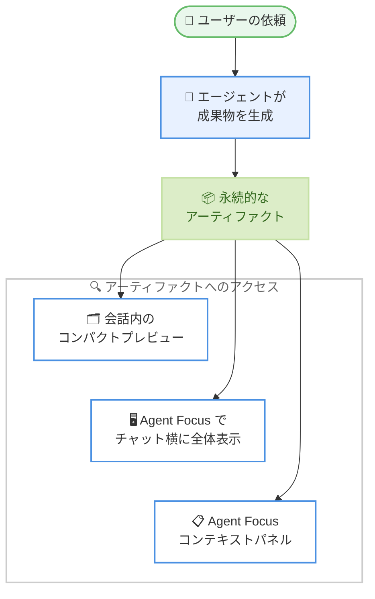

# Kiro - Agent Artifacts and Native ARM64 Builds

**リリース日**: 2026 年 9 月 24 日
**サービス**: Kiro (AWS が提供する AI 搭載 IDE)
**機能**: IDE 1.1 - エージェントアーティファクト、Windows / Linux 向けネイティブ ARM64 ビルド、Code OSS 1.131 への基盤更新

📊 [このアップデートのインフォグラフィックを見る](https://takech9203.github.io/aws-news-summary/20260924-kiro-changelog-2026-09-24-agent-artifacts.html)

## 概要

Kiro IDE 1.1 がリリースされ、エージェントの成果物を「アーティファクト」として永続化できるようになりました。Kiro はドキュメント、図、コード、画像などのエージェント出力を、チャットの履歴に埋もれさせるのではなく、後から見返せる永続的なアーティファクトに変換します。会話からコンパクトなプレビューを開く、Agent Focus でチャットの横に全体を表示してレビューする、Agent Focus のコンテキストパネルから再度アクセスする、といった操作が可能です。

また、Windows および Linux 向けのネイティブ ARM64 ビルドが追加され、x64 エミュレーションに依存せずに ARM64 環境へ Kiro をインストールできるようになりました。エディタの基盤も Code OSS 1.131 に更新されています。

このほか、コンパクト化された会話が適切なコンテキストを保持するようになり、MCP の失敗はより明確に表示され、Hooks の信頼性が向上し、エンタープライズプロファイルはリクエストを選択したリージョンにルーティングするようになりました。

**アップデート前の課題**

- エージェントが生成したドキュメント、図、コードなどの成果物がチャットの履歴に埋もれ、後から見つけて再利用することが難しかった
- Windows / Linux の ARM64 環境では x64 エミュレーションに頼る必要があり、ネイティブ実行と比べてオーバーヘッドが発生していた
- 会話のコンパクト化により、必要なコンテキストが失われる場合があった
- MCP サーバーの失敗時に原因が把握しにくかった
- エンタープライズプロファイルのリクエストが、選択したリージョンにルーティングされる保証がなかった

**アップデート後の改善**

- エージェントの出力を永続的なアーティファクトとして保存し、プレビュー、レビュー、再アクセスが可能になった
- Windows / Linux 向けのネイティブ ARM64 ビルドが提供され、エミュレーションなしで動作するようになった
- エディタ基盤が Code OSS 1.131 に更新された
- コンパクト化された会話が適切なコンテキストを保持するようになった
- MCP の失敗内容がより明確になり、Hooks の信頼性が向上した
- エンタープライズプロファイルのリクエストが、選択したリージョンにルーティングされるようになった

## アーキテクチャ図



エージェントが生成したドキュメント、図、コード、画像などの出力が永続的なアーティファクトとなり、会話内のプレビュー、Agent Focus のフルビュー、コンテキストパネルの 3 つの経路からアクセスできる流れを示しています。

## サービスアップデートの詳細

### 主要機能

1. **エージェントアーティファクトのレビュー**
   - エージェントの出力 (ドキュメント、図、コード、画像など) を、チャット履歴に埋もれさせずに永続的なアーティファクトとして保存できる
   - 会話からコンパクトなプレビューを開いて内容を確認できる
   - Agent Focus では、チャットの横にアーティファクト全体を表示してレビューできる
   - Agent Focus のコンテキストパネルから、過去のアーティファクトに再度アクセスできる

2. **Windows / Linux 向けネイティブ ARM64 ビルド**
   - x64 エミュレーションに依存せず、ネイティブ ARM64 ビルドをインストールできる
   - Kiro のダウンロードページから、プラットフォームに応じた ARM64 ビルドを選択できる

3. **エディタ基盤の更新**
   - エディタの基盤が Code OSS 1.131 に更新された

4. **会話・エージェント動作の信頼性向上**
   - コンパクト化された会話が、適切なコンテキストを保持するようになった
   - MCP の失敗時に、原因がより明確に表示されるようになった
   - Hooks の信頼性が向上した

5. **エンタープライズプロファイルのリージョンルーティング**
   - エンタープライズプロファイルのリクエストが、選択したリージョンにルーティングされるようになった

## 技術仕様

### アップデートの構成要素

| 項目 | 詳細 |
|------|------|
| バージョン | IDE 1.1 (最新パッチ: 1.1.70) |
| アーティファクト対象 | ドキュメント、図、コード、画像などのエージェント出力 |
| アーティファクトの表示方法 | 会話内プレビュー / Agent Focus のフルビュー / コンテキストパネル |
| ネイティブ ARM64 ビルド | Windows および Linux (ダウンロードページから選択) |
| エディタ基盤 | Code OSS 1.131 |
| エンタープライズプロファイル | リクエストを選択したリージョンにルーティング |

## 設定方法

### 前提条件

1. Kiro IDE を使用していること
2. ARM64 ビルドを利用する場合は、Windows または Linux の ARM64 環境であること

### 手順

#### ステップ 1: Kiro IDE の更新

Kiro IDE をバージョン 1.1 系に更新します。IDE 内の更新通知に従うか、[Kiro のダウンロードページ](https://kiro.dev/downloads/) から最新版を取得します。ARM64 環境の場合は、プラットフォームに応じた ARM64 ビルドを選択します。

#### ステップ 2: アーティファクトの生成とプレビュー

エージェントにドキュメントや図などの作成を依頼します。生成された出力はアーティファクトとして扱われ、会話からコンパクトなプレビューを開いて内容を確認できます。

#### ステップ 3: Agent Focus でのレビューと再アクセス

Agent Focus を開くと、チャットの横にアーティファクト全体を表示してレビューできます。後から見返す場合は、Agent Focus のコンテキストパネルからアーティファクトに再度アクセスします。

## メリット

### ビジネス面

- **成果物の資産化**: エージェントが生成したドキュメントや図が永続的なアーティファクトとして残るため、チームでの共有やレビューに再利用しやすくなる
- **レビュー効率の向上**: チャット履歴をさかのぼって成果物を探す手間がなくなり、レビューサイクルが短縮される
- **エンタープライズ要件への対応**: リクエストが選択したリージョンにルーティングされるため、組織のリージョン要件に沿った利用がしやすくなる

### 技術面

- **ARM64 環境でのネイティブ実行**: x64 エミュレーションのオーバーヘッドなしに、Windows / Linux の ARM64 マシンで Kiro を実行できる
- **コンテキストの一貫性**: コンパクト化された会話が適切なコンテキストを保持し、長い対話でもエージェントの精度を維持しやすい
- **トラブルシューティングの容易化**: MCP の失敗が明確に表示されるため、外部ツール連携の問題を特定しやすい

## デメリット・制約事項

### 考慮すべき点

- アーティファクトのフルビューやコンテキストパネルは Agent Focus での利用が前提となる
- ネイティブ ARM64 ビルドの対象は Windows および Linux であり、ダウンロード時にプラットフォームに応じたビルドを選択する必要がある

## ユースケース

### ユースケース 1: 設計ドキュメントの反復レビュー

**シナリオ**: エージェントにアーキテクチャ設計のドキュメントと図の作成を依頼し、複数回の対話を通じて内容をブラッシュアップする。

**実装例**:
```text
エージェントに設計ドキュメントの作成を依頼
→ 会話内のコンパクトプレビューで概要を確認
→ Agent Focus でチャット横に全体を表示し、対話しながら修正
→ 後日、コンテキストパネルから同じアーティファクトに再アクセス
```

**効果**: 成果物がチャット履歴に埋もれず、対話と成果物のレビューを並行して進められる。

### ユースケース 2: ARM64 開発マシンへの導入

**シナリオ**: Windows on ARM や ARM64 Linux の開発マシンで Kiro を利用したいが、これまでは x64 エミュレーションによるオーバーヘッドが懸念だった。

**実装例**:
```text
Kiro ダウンロードページで ARM64 ビルドを選択
→ ネイティブ ARM64 版をインストール
```

**効果**: エミュレーションを介さずにネイティブ実行でき、ARM64 マシンでの動作が効率化される。

### ユースケース 3: エンタープライズ環境でのリージョン統制

**シナリオ**: 企業のポリシーにより、AI 関連のリクエストを特定のリージョンで処理する必要がある。

**実装例**:
```text
エンタープライズプロファイルでリージョンを選択
→ Kiro のリクエストが選択したリージョンにルーティングされる
```

**効果**: 組織のリージョン要件に沿った形で Kiro を利用できる。

## 利用可能リージョン

Kiro はグローバルに利用可能です。

## 関連サービス・機能

- **Agent Focus**: エージェントとの対話に集中できる Kiro のビュー。今回のアップデートでアーティファクトのフルビュー表示とコンテキストパネルからの再アクセスに対応した
- **MCP (Model Context Protocol)**: Kiro と外部ツールを連携する仕組み。今回のアップデートで失敗時の表示が明確になった
- **Kiro Hooks**: イベントに応じて処理を実行する Kiro の機能。今回のアップデートで信頼性が向上した

## 参考リンク

- 📊 [インフォグラフィック](https://takech9203.github.io/aws-news-summary/20260924-kiro-changelog-2026-09-24-agent-artifacts.html)
- [Kiro Changelog - IDE 1.1](https://kiro.dev/changelog/ide/1-1/)
- [Kiro Changelog](https://kiro.dev/changelog/)
- [ドキュメント: アーティファクト](https://kiro.dev/docs/ide/chat/artifacts/)
- [Kiro ダウンロードページ](https://kiro.dev/downloads/)

## まとめ

Kiro IDE 1.1 は、エージェントの成果物を永続的なアーティファクトとして扱う新しい体験と、Windows / Linux 向けネイティブ ARM64 ビルドを提供する大きなアップデートです。エージェントに生成させたドキュメントや図をレビュー・再利用するワークフローが大幅に改善されるため、エージェント主導の開発を行っているユーザーは IDE 1.1 への更新を推奨します。ARM64 マシンを利用している場合は、ダウンロードページからネイティブビルドへの切り替えも検討してください。
