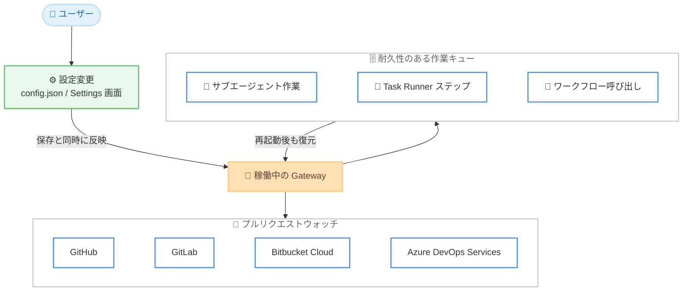

# Kiro - Crew 0.7.0: Live Settings, Durable Work, and Broader Pull Request Watches

**リリース日**: 2026 年 9 月 24 日
**サービス**: Kiro (AWS が提供する AI 搭載 IDE)
**機能**: Kiro Crew 0.7.0 - 設定の保存時即時反映、Gateway 再起動を越えて存続する耐久性のある作業、プルリクエストウォッチの対応プラットフォーム拡大ほか

📊 [このアップデートのインフォグラフィックを見る](https://takech9203.github.io/aws-news-summary/20260924-kiro-changelog-2026-09-24-crew.html)

## 概要

Kiro Crew 0.7.0 がリリースされ、日々の作業の耐久性と操作性が大きく向上しました。ほとんどの設定が保存と同時に稼働中の Gateway に反映されるようになり (Live Settings)、承認済みのバックグラウンド作業は Gateway の再起動後も失われずに復元されます (Durable Work)。また、自動アップデートは実行中の作業がアイドルになるのを待ってから適用されるようになりました。

チャット体験も強化され、長い会話向けのターンミニマップ、モデルと推論努力度 (Reasoning Effort) を 1 か所で切り替えられるモデルチップ、実行中エージェントへの Steer / Queue 操作、メイン会話の横で一時的な質問ができる Side Chat が追加されました。プルリクエストウォッチは GitHub に加えて GitLab、Bitbucket Cloud、Azure DevOps Services に対応します。

さらに、Windows での分離ポッド (Isolated Pods) 対応と Gateway 起動の高速化、プレビュー機能としてエージェントバックエンドの追加 (OpenCode、goose、Pi)、Jev によるターン単位のモデルルーティング、AWS Fargate 上でのリモートクルー実行が提供されます。

**アップデート前の課題**

- 設定を変更するたびに Gateway の再起動が必要で、作業を中断せずに設定を反映できなかった
- Gateway が再起動すると、受け付け済みのサブエージェント作業や Task Runner のステップ、ワークフロー呼び出しが失われていた
- 自動アップデートが実行中の作業と競合する可能性があった
- 構造化されたプルリクエストウォッチは GitHub の URL のみに対応していた
- 長いチャットでは過去のターンへの移動や全体像の把握が難しかった
- リモートクルーの接続方法は SSH と AWS Systems Manager Session Manager (SSM) に限られていた
- 分離ポッドのワークフローは Windows では利用できなかった

**アップデート後の改善**

- ほとんどの設定が `config.json` の保存または Settings 画面での変更と同時に稼働中の Gateway へ反映されるようになった
- 承認済みの作業が耐久性のあるキューに入り、Gateway 再起動後もキューが復元されるようになった
- 自動アップデートがアクティブなターン、スケジュール実行、サブエージェント、Task Runner ステップ、ワークフローのアイドルを待ってから適用されるようになった
- プルリクエストウォッチが GitHub、GitLab、Bitbucket Cloud、Azure DevOps Services の URL を受け付けるようになった
- ターンミニマップ、モデルチップ、Steer / Queue、Side Chat により長い会話の操作性が向上した
- AWS Fargate がリモートクルーの接続方法に追加された
- Windows でも Task Scheduler を通じて分離ポッドのワークフローを実行できるようになった

## アーキテクチャ図



設定の保存が稼働中の Gateway に即時反映され、承認済みの作業が耐久性のあるキューを経由して Gateway 再起動後も復元されること、プルリクエストウォッチが 4 つのプラットフォームに対応したことを示しています。

## サービスアップデートの詳細

### 主要機能

1. **作業中に反映される設定 (Live Settings)**
   - `config.json` の保存または Settings 画面での値の変更と同時に、ほとんどの設定が稼働中の Gateway に反映される
   - 再起動が必要なフィールドは UI 上で自身を明示する。現時点で起動時のみ反映される設定は Slack スラッシュコマンドのフィールドで、「Changes need a restart」バッジが表示される

2. **追従性の高いチャット体験**
   - デスクトップチャットの左ガターにターンミニマップが表示され、ロード済みターンごとのマーカー、ホバープレビュー、クリックによるジャンプ、過去履歴の読み込みに対応
   - モデルチップでモデルと推論努力度の選択を 1 か所に集約。「Selectable Models」で表示するオプションを制御できる
   - エージェントの作業中は「Steer」で現在のターンをリダイレクト、「Queue」で次のターンを待機。Cmd または Ctrl + Enter で 1 回の送信に限りもう一方の動作を実行できる
   - `/side` または `/btw` で Side Chat を開き、メイン会話の横で一時的な質問が可能。Kiro CLI バックエンドのセッションでは承認なしで読み取り専用の参照を実行でき、変更や MCP ツールは拒否される
   - テーブルを Markdown または CSV としてコピーでき、長いコードブロックは下部にもアクションが表示される

3. **Gateway 再起動を越えて存続する作業 (Durable Work)**
   - 承認済みのサブエージェント作業、Task Runner ステップ、ワークフロー呼び出しは、実行前に耐久性のあるキューに入る
   - Gateway が再起動しても、キューに入った作業は破棄されずに復元される。System ページにアクティブなキューと現在有効な同時実行キャパシティが表示される
   - 長期的な作業向けに、オプションの Crew log が追記専用のセッション履歴を記録し、コンテキストコンパクション後も持続するセッション台帳を提供する。`~/.kiro/crew/.env` に `KIROCREW_CREW_LOG=1` を設定して Gateway を再起動すると、ステータス、使用量、タイムライン、ツール、承認のビューが有効になる。`kirocrew-crew-log` MCP サーバーがエージェント向けの読み取り専用アクセスを提供する

4. **GitHub を越えたプルリクエストウォッチ**
   - 構造化されたプルリクエストウォッチが GitHub、GitLab、Bitbucket Cloud、Azure DevOps Services の URL を受け付ける
   - GitLab は `glab` を使用。Azure DevOps は azure-devops 拡張機能を含む `az` と、`az login` セッションまたは `AZURE_DEVOPS_EXT_PAT` を使用。プライベートな Bitbucket プルリクエストは `BITBUCKET_EMAIL` と `BITBUCKET_API_TOKEN` を使用できる
   - Azure DevOps Server と Bitbucket Data Center は非対応。Azure DevOps とプライベート Bitbucket のウォッチはダッシュボード会話から開始する必要がある
   - 停止 (Stop) と検査 (Inspect) の操作が、プレーンなタイマーループ、プルリクエストウォッチ、ワークフローウォッチにわたって利用でき、Webex からも操作できる

5. **エージェントバックエンドの追加 (Preview)**
   - Agent Backend セレクターに OpenCode と goose が加わり、Kiro CLI、Claude Code、Codex、KAS と並ぶ選択肢になった
   - Crew は最初のプロンプトの前に各バックエンドの権限パスを検証し、不足しているインストールコンポーネントをセレクターに表示する
   - Codex と OpenCode のセッションはコンパクションに対応し、Crew 自身のツールが OpenCode と goose のセッションから利用できる
   - `pi` と `pi-acp` の両方がインストールされている場合は Pi も利用可能。ただし Pi セッションは Kiro Crew の MCP ツールを持たないため、Crew のサブエージェント、スケジューリング、メモリなどの MCP 機能が必要な場合は別のバックエンドを選択する。`kirocrew doctor` がこの制限を報告する

6. **Jev によるターン単位の判断 (Preview)**
   - 「Settings > Developer > Feature Previews」で「Decisions (Jev)」を有効化し、チャットのモデルピッカーで「Auto (Jev)」を選択すると、各メッセージを simple / medium / complex に分類して `decisions.model_route` 経由でルーティングする
   - ビジー状態の送信ボタンで「Auto (Jev)」を選ぶと、ターン実行中のメッセージを Steer と Queue のどちらで扱うかを Jev が判断する
   - 各判断は対象メッセージ上に表示され、フィードバックコントロールを備える。Preview はオプトインであり、設定カードにどのようなコンテンツがプロバイダーに送信され得るかの説明が表示される。ツール引数、コンパクション入力、リコールされたメモリスニペットには個別の同意スイッチがある

7. **Fargate リモートクルー (Preview)**
   - リモートクルーの接続方法として、SSH と AWS Systems Manager Session Manager (SSM) に加えて AWS Fargate が利用可能になった
   - Crew はインバウンドのネットワークルールなしで SSM 経由でタスクに到達する。ローカルマシンには AWS CLI と Session Manager プラグインが必要
   - タスクの生存期間はデフォルトで 6 時間、ランタイムが同時に受け付けるタスクは最大 10 個。生存期間は `cloud.json` の `fargate.task_ttl_seconds` で変更できるが、10 タスクの上限は固定

8. **実行中の作業を待つアップデート**
   - Gateway は起動時と 12 時間ごとにアップデートを確認する。自動アップデートは新規作業の受け付けを一時停止し、アクティブなターン、スケジュール実行、サブエージェント、Task Runner ステップ、ワークフローがアイドルになるのを待ってから適用し、Gateway を再起動する
   - ソースアップデートが現在の仮想環境よりも新しい Python を必要とする場合、Crew はチェックアウトを移動する前に拒否し、対応が必要なインタープリターを提示する
   - マネージドインストールでは、「Settings > About」に表示されるものと同じ時間制限付きホスト承認を使用して、アップデートダイアログと What's New ダイアログからアップデートを準備できる

9. **Windows での分離ポッド (Isolated Pods)**
   - 分離ポッドのワークフローが Task Scheduler を通じて Windows で動作するようになった
   - `kirocrew pod up`、`down`、`ls`、`status`、`token`、`url`、`logs`、`prune`、`provision` が Kiro Crew ソースワークツリーのポッドライフサイクルをカバーする
   - `pod api` はプライベートリクエストチャネルが Unix ドメインソケットを必要とするため、Windows では利用できない
   - 「Apps > Library」で Dev Fleet を有効にすると、エージェントがチャット内からワークツリーポッドの起動・停止を行い、アドレス、ポート、短期トークンを受け取れる

10. **検索で発見されるスキル**
    - `skills.max_triggered` のデフォルトが `0` になった。セッションには短いスキルインデックスが提供され、トリガーに一致するすべてのスキルを自動注入する代わりに、エージェントが `skill_search` で関連する指示をロードする
    - 正の値を設定すると、メッセージごとにその数まで一致したスキルを注入できる

## 技術仕様

### アップデートの構成要素

| 項目 | 詳細 |
|------|------|
| バージョン | Kiro Crew 0.7.0 |
| 設定の即時反映 | `config.json` の保存または Settings 画面での変更と同時に反映。起動時のみの設定は Slack スラッシュコマンドフィールド |
| 耐久性のあるキューの対象 | 承認済みサブエージェント作業、Task Runner ステップ、ワークフロー呼び出し |
| Crew log の有効化 | `~/.kiro/crew/.env` に `KIROCREW_CREW_LOG=1` を設定して Gateway を再起動 |
| プルリクエストウォッチ対応 | GitHub / GitLab (`glab`) / Bitbucket Cloud / Azure DevOps Services (`az` + azure-devops 拡張) |
| プルリクエストウォッチ非対応 | Azure DevOps Server、Bitbucket Data Center |
| エージェントバックエンド (Preview) | Kiro CLI、Claude Code、Codex、KAS、OpenCode、goose、Pi |
| Fargate リモートクルー | SSM 経由で接続、デフォルト生存期間 6 時間 (`fargate.task_ttl_seconds` で変更可)、同時タスク上限 10 (固定) |
| アップデート確認 | 起動時および 12 時間ごと |
| スキル注入 | `skills.max_triggered` のデフォルトが `0`、`skill_search` による検索ベースのロード |

### Crew log の設定例

```bash
# ~/.kiro/crew/.env に追記して Gateway を再起動
KIROCREW_CREW_LOG=1
```

Crew log を有効にすると、追記専用のセッション履歴が記録され、ステータス、使用量、タイムライン、ツール、承認のビューが利用できます。

## 設定方法

### 前提条件

1. Kiro Crew を使用していること (バージョン 0.7.0 以降)
2. GitLab / Azure DevOps / Bitbucket のプルリクエストウォッチを使用する場合は、対応する CLI ツールまたは認証情報 (`glab`、`az` + azure-devops 拡張、`BITBUCKET_EMAIL` / `BITBUCKET_API_TOKEN`) が準備されていること
3. Fargate リモートクルーを使用する場合は、ローカルマシンに AWS CLI と Session Manager プラグインがインストールされていること

### 手順

#### ステップ 1: Kiro Crew の更新

Kiro Crew を 0.7.0 に更新します。今回のアップデートにより、Gateway は起動時と 12 時間ごとにアップデートを確認し、実行中の作業がアイドルになるのを待ってから自動適用します。

#### ステップ 2: 設定の即時反映を確認

`config.json` を編集して保存するか、Settings 画面で値を変更します。ほとんどの設定は保存と同時に稼働中の Gateway に反映されます。再起動が必要なフィールドには「Changes need a restart」バッジが表示されるため、バッジの有無で判断できます。

#### ステップ 3: プルリクエストウォッチの設定

```text
GitLab: glab をインストールして認証
Azure DevOps: az と azure-devops 拡張をインストールし、az login または AZURE_DEVOPS_EXT_PAT を設定
Bitbucket Cloud のプライベート PR: BITBUCKET_EMAIL と BITBUCKET_API_TOKEN を設定
```

対応プラットフォームのプルリクエスト URL を構造化ウォッチに渡します。Azure DevOps とプライベート Bitbucket のウォッチは、ダッシュボード会話から開始する必要があります。

#### ステップ 4: Crew log の有効化 (オプション)

長期的な作業のセッション履歴が必要な場合は、`~/.kiro/crew/.env` に `KIROCREW_CREW_LOG=1` を設定して Gateway を再起動します。エージェントからは `kirocrew-crew-log` MCP サーバー経由で読み取り専用アクセスが可能です。

## メリット

### ビジネス面

- **作業の継続性向上**: 承認済みのバックグラウンド作業が Gateway の再起動で失われないため、長時間の自動化タスクを安心して任せられる
- **マルチプラットフォーム対応**: GitLab、Bitbucket Cloud、Azure DevOps Services を利用する組織でもプルリクエストの監視を Crew に統合できる
- **運用中断の最小化**: 設定変更に再起動が不要になり、自動アップデートも実行中の作業を待つため、運用の中断が減る

### 技術面

- **耐久性のあるキュー**: サブエージェント作業、Task Runner ステップ、ワークフロー呼び出しがキューで管理され、System ページで可視化される
- **柔軟なバックエンド選択**: OpenCode、goose、Pi を含む複数のエージェントバックエンドを用途に応じて選択できる (Preview)
- **セキュアなリモート実行**: Fargate リモートクルーはインバウンドのネットワークルールなしで SSM 経由で接続でき、ネットワーク設定の負担が小さい
- **コンテキスト効率の改善**: スキルの自動注入が検索ベースのロードに変わり、セッションのコンテキスト消費を抑えられる

## デメリット・制約事項

### 制限事項

- Slack スラッシュコマンドのフィールドは引き続き起動時のみ反映される設定であり、変更には再起動が必要
- プルリクエストウォッチは Azure DevOps Server と Bitbucket Data Center に対応していない
- Azure DevOps とプライベート Bitbucket のウォッチはダッシュボード会話から開始する必要がある
- Pi バックエンドのセッションは Kiro Crew の MCP ツール (サブエージェント、スケジューリング、メモリなど) を利用できない
- Fargate リモートクルーの同時タスク上限 10 は固定で変更できない
- Windows の分離ポッドでは `pod api` が利用できない (Unix ドメインソケットが必要なため)

### 考慮すべき点

- エージェントバックエンドの追加、Jev によるターン単位の判断、Fargate リモートクルーはプレビュー機能であり、仕様が変更される可能性がある
- Jev の Decisions 機能では、ツール引数、コンパクション入力、リコールされたメモリスニペットの送信について個別の同意スイッチを確認する必要がある
- Crew log はオプトイン機能であり、有効化には環境変数の設定と Gateway の再起動が必要

## ユースケース

### ユースケース 1: 長時間のバックグラウンド作業の耐久化

**シナリオ**: 夜間に複数のサブエージェント作業とワークフローを実行しているが、Gateway の再起動やアップデートで作業が失われることを避けたい。

**実装例**:
```text
承認済みの作業が自動的に耐久性のあるキューに入る
→ Gateway が再起動してもキューが復元される
→ System ページでアクティブなキューと同時実行キャパシティを確認
→ 必要に応じて KIROCREW_CREW_LOG=1 でセッション履歴を記録
```

**効果**: 再起動や自動アップデートをまたいで長時間の自動化タスクを安全に実行できる。

### ユースケース 2: GitLab / Azure DevOps を使う組織でのプルリクエスト監視

**シナリオ**: 組織のリポジトリが GitLab と Azure DevOps Services に分散しており、プルリクエストのレビュー状況を Crew で一元的に監視したい。

**実装例**:
```text
glab と az (azure-devops 拡張) をセットアップ
→ 各プラットフォームのプルリクエスト URL を構造化ウォッチに登録
→ Stop / Inspect 操作でウォッチを制御 (Webex からも操作可能)
```

**効果**: GitHub 以外のプラットフォームでもプルリクエストの監視を自動化し、レビューサイクルを短縮できる。

### ユースケース 3: Fargate によるローカルリソースに依存しないリモートクルー

**シナリオ**: ローカルマシンのリソースを消費せずにクルーを実行したいが、SSH 用のインバウンドポート開放は避けたい。

**実装例**:
```text
ローカルに AWS CLI と Session Manager プラグインを準備
→ Fargate をリモートクルーの接続方法として選択
→ SSM 経由で接続 (インバウンドのネットワークルール不要)
→ 必要に応じて cloud.json の fargate.task_ttl_seconds で生存期間を調整
```

**効果**: インバウンドのネットワーク設定なしで、クラウド上のコンテナでクルーを実行できる。

## 料金

Kiro Crew 自体の追加料金に関する記載はありません。Fargate リモートクルーを使用する場合は、AWS アカウント側で AWS Fargate のタスク実行料金が発生します。

## 利用可能リージョン

Kiro はグローバルに利用可能です。

## 関連サービス・機能

- **AWS Fargate**: サーバーレスコンテナ実行環境。今回のアップデートでリモートクルーの実行環境として利用可能になった
- **AWS Systems Manager Session Manager (SSM)**: インバウンドポートを開放せずにリモート接続を実現するサービス。Fargate リモートクルーへの接続経路として使用される
- **MCP (Model Context Protocol)**: エージェントと外部ツールを連携する仕組み。`kirocrew-crew-log` MCP サーバーが Crew log への読み取り専用アクセスを提供する
- **Kiro CLI**: Kiro のコマンドラインツール。Crew のエージェントバックエンドの 1 つであり、Side Chat の読み取り専用参照に対応する

## 参考リンク

- 📊 [インフォグラフィック](https://takech9203.github.io/aws-news-summary/20260924-kiro-changelog-2026-09-24-crew.html)
- [Kiro Changelog - Crew 0.7.0](https://kiro.dev/changelog/crew/0-7/)
- [Kiro Changelog](https://kiro.dev/changelog/)
- [ドキュメント: Crew の設定](https://kiro.dev/docs/crew/configuration/)
- [ドキュメント: Crew のチャット](https://kiro.dev/docs/crew/chat/)
- [ドキュメント: Crew の System ページ](https://kiro.dev/docs/crew/system/)
- [ドキュメント: エージェントバックエンド](https://kiro.dev/docs/crew/features/agent-backends/)
- [ドキュメント: ワークフロー](https://kiro.dev/docs/crew/features/workflows/)
- [ドキュメント: スキル](https://kiro.dev/docs/crew/capabilities/skills/)

## まとめ

Kiro Crew 0.7.0 は、設定の保存時即時反映、Gateway 再起動を越えて存続する耐久性のある作業キュー、GitLab / Bitbucket Cloud / Azure DevOps Services へのプルリクエストウォッチ拡大を中心とした、運用の継続性を大きく高めるアップデートです。長時間のバックグラウンド自動化や GitHub 以外のプラットフォームでの監視を検討しているユーザーは、0.7.0 への更新と耐久性のあるキュー、プルリクエストウォッチの活用を推奨します。プレビュー機能のエージェントバックエンド追加や Fargate リモートクルーも、用途に応じて試す価値があります。
