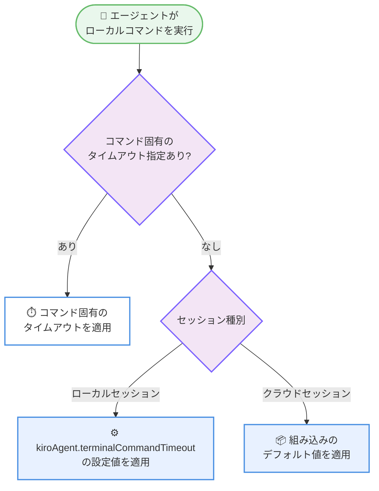

# Kiro - Configurable Terminal Timeouts, Clickable File Links, and Agent Focus Session Restore

**リリース日**: 2026 年 9 月 24 日
**サービス**: Kiro (AWS が提供する AI 搭載 IDE)
**機能**: IDE 1.1.70 - ターミナルタイムアウト設定、ワークスペースファイルリンク、Agent Focus セッション復元の改善

📊 [このアップデートのインフォグラフィックを見る](https://takech9203.github.io/aws-news-summary/20260924-kiro-changelog-2026-09-24.html)

## 概要

Kiro IDE 1.1.70 がリリースされ、ローカルエージェントコマンドのデフォルトタイムアウトを設定できるようになりました。新しい設定 `kiroAgent.terminalCommandTimeout` により、エージェントがローカルで実行するターミナルコマンドの待機時間をユーザーが制御できます。設定変更は再起動なしで開いているローカルセッションに適用されます。

また、Markdown リンクの宛先がワークスペース内のファイルである場合、リンクをクリックするとエディタで直接開けるようになりました。`./src/index.ts` のような相対パスや `package.json` のようなファイル名のみの記述にも対応します。さらに、Agent Focus の `#File` および `#Folder` ピッカーがアクティブなセッションのプロジェクトと連動するようになり、プロジェクトを切り替えた際にも正しいファイル一覧が表示されます。

修正面では、復元された Agent Focus セッションが空白のチャットペインを表示せずに再接続されるようになったほか、バックグラウンドプロセスの出力カード、Markdown テーブルのスタイル、ストリーミング中の Mermaid 図の表示に関する不具合が解消されています。

**アップデート前の課題**

- エージェントが実行するローカルターミナルコマンドのタイムアウトを一括で調整する手段がなく、長時間かかるコマンドが途中で打ち切られる場合があった
- チャット内の Markdown リンクがワークスペースのファイルを指していても、エディタで直接開くことができなかった
- プロジェクトを切り替えても Agent Focus の `#File` / `#Folder` ピッカーが切り替え前のプロジェクトのファイルを表示することがあった
- Agent Focus を再度開いた際、前回のセッションが選択されていてもチャットペインが空白のまま表示されることがあった
- バックグラウンドプロセスが出力を生成していても、Get Process Output カードに `No output` と表示されることがあった
- エージェント応答内の Markdown テーブルがスタイルを失って表示されたり、ストリーミング中の未完成な Mermaid 図が構文エラーの画像をチャットに残すことがあった

**アップデート後の改善**

- `kiroAgent.terminalCommandTimeout` でローカルエージェントコマンドのデフォルトタイムアウトを設定可能になり、再起動なしで開いているローカルセッションに反映される
- ワークスペースファイルへの Markdown リンク (相対パスやファイル名のみを含む) がエディタで直接開くようになった
- `#File` / `#Folder` ピッカーがアクティブなセッションのプロジェクトのファイルを一覧表示するようになった
- 復元された Agent Focus セッションが空白のチャットペインを残さず再接続されるようになった
- バックグラウンドプロセスの出力カードが実際の結果を表示し、Markdown テーブルのスタイルが維持され、Mermaid 図がストリーミング中にエラー画像を残さなくなった

## アーキテクチャ図



ローカルエージェントコマンドのタイムアウト適用順序を示しています。コマンド固有のタイムアウトが最優先され、次にユーザー設定、クラウドセッションでは組み込みのデフォルト値が使用されます。

## サービスアップデートの詳細

### 主要機能

1. **設定可能なローカルコマンドタイムアウト**
   - 新しい設定 `kiroAgent.terminalCommandTimeout` により、エージェントがローカルで実行するターミナルコマンドのデフォルトタイムアウトを制御できる
   - 設定変更は再起動なしで、開いているローカルセッションに即時適用される
   - コマンド固有のタイムアウトが指定されている場合はそちらが優先される
   - クラウドセッションでは組み込みのデフォルト値が使用される

2. **クリック可能なワークスペースファイルリンク**
   - 宛先がワークスペース内のファイルである Markdown リンクが、クリックするとエディタで直接開くようになった
   - `./src/index.ts` のような相対パスに対応
   - `package.json` のようなファイル名のみの記述にも対応

3. **プロジェクトに連動する Agent Focus コンテキスト**
   - `#File` および `#Folder` ピッカーが、アクティブなセッションのプロジェクトのファイルを一覧表示するようになった
   - プロジェクトを切り替えた場合でも、正しいプロジェクトのファイルコンテキストが維持される

### 不具合修正

- バックグラウンドプロセスが出力を生成しているにもかかわらず、Get Process Output カードに `No output` と表示される問題を修正
- Agent Focus を再度開いた際に、前回のセッションが選択されているもののチャットサーフェスの初期化が完了するまで空白のチャットペインが表示される問題を修正
- エージェント応答内の Markdown テーブルがテーブルスタイルを失う問題を修正
- 応答のストリーミング中に、未完成の Mermaid 図が構文エラーの画像をチャットに残す問題を修正

## 技術仕様

### 新しい設定項目

| 項目 | 詳細 |
|------|------|
| 設定キー | `kiroAgent.terminalCommandTimeout` |
| 対象 | ローカルエージェントが実行するターミナルコマンドのデフォルトタイムアウト |
| 適用タイミング | 再起動不要。開いているローカルセッションに即時反映 |
| 優先順位 | コマンド固有のタイムアウト > 本設定 > 組み込みデフォルト |
| クラウドセッション | 本設定の対象外。組み込みのデフォルト値を使用 |

### ファイルリンクの対応形式

| リンク形式 | 例 | 動作 |
|------------|-----|------|
| 相対パス | `./src/index.ts` | エディタで直接開く |
| ファイル名のみ | `package.json` | エディタで直接開く |

## 設定方法

### 前提条件

1. Kiro IDE をバージョン 1.1.70 以降に更新していること
2. ローカルセッションでエージェントを使用していること (クラウドセッションはタイムアウト設定の対象外)

### 手順

#### ステップ 1: Kiro IDE の更新

Kiro IDE を最新バージョン (1.1.70 以降) に更新します。IDE 内の更新通知に従うか、[Kiro のダウンロードページ](https://kiro.dev/downloads) から最新版を取得します。

#### ステップ 2: タイムアウト設定の変更

```json
{
  "kiroAgent.terminalCommandTimeout": 300
}
```

Kiro IDE の設定 (Settings) で `kiroAgent.terminalCommandTimeout` を検索し、希望するタイムアウト値を設定します。設定は再起動なしで、開いているローカルセッションに適用されます。

#### ステップ 3: 動作確認

エージェントにローカルコマンドの実行を依頼し、設定したタイムアウトが適用されることを確認します。コマンド固有のタイムアウトが指定されている場合は、そちらが優先される点に注意してください。

## メリット

### ビジネス面

- **開発ワークフローの中断削減**: 長時間かかるビルドやテストコマンドがタイムアウトで打ち切られることが減り、エージェント主導の作業が安定して完了する
- **生産性の向上**: チャット内のファイルリンクからエディタへ直接移動できるため、ファイル探索の手間が削減される
- **信頼性の向上**: セッション復元や出力表示の不具合修正により、エージェントとの対話体験が安定する

### 技術面

- **タイムアウトの柔軟な制御**: プロジェクトの特性 (重いビルド、長時間のテストなど) に応じてデフォルトタイムアウトを調整できる
- **プロジェクト切り替え時の一貫性**: `#File` / `#Folder` ピッカーがアクティブなプロジェクトと常に整合し、誤ったコンテキストの添付を防げる
- **再起動不要の設定反映**: タイムアウト設定の変更が開いているローカルセッションに即時適用され、作業を中断せずに調整できる

## デメリット・制約事項

### 制限事項

- `kiroAgent.terminalCommandTimeout` はローカルセッションのみが対象で、クラウドセッションは組み込みのデフォルト値を使用する
- コマンド固有のタイムアウトが指定されている場合は、デフォルト設定より優先される

### 考慮すべき点

- タイムアウトを長く設定しすぎると、ハングしたコマンドの検出が遅れる可能性がある
- ファイルリンクのクリック動作はワークスペース内のファイルが対象であり、ワークスペース外のパスは対象外

## ユースケース

### ユースケース 1: 長時間のビルドコマンドを伴う開発

**シナリオ**: モノレポの大規模プロジェクトで、エージェントにビルドやテストの実行を依頼すると、デフォルトのタイムアウトでは完了前に打ち切られてしまう。

**実装例**:
```json
{
  "kiroAgent.terminalCommandTimeout": 600
}
```

**効果**: 長時間のビルドやテストがタイムアウトで中断されず、エージェントが結果を確認して次のアクションへ進めるようになる。

### ユースケース 2: エージェント応答からのコードレビュー

**シナリオ**: エージェントが調査結果を Markdown で報告し、`./src/index.ts` や `package.json` などの関連ファイルをリンクとして提示する。

**実装例**:
```text
エージェントの応答内リンクをクリック
→ 該当ファイルがエディタで直接開く
```

**効果**: 報告内容と実際のコードをすばやく往復でき、レビューや修正作業の効率が向上する。

### ユースケース 3: 複数プロジェクトを横断する作業

**シナリオ**: Agent Focus で複数のプロジェクトのセッションを切り替えながら作業し、`#File` / `#Folder` でコンテキストを添付する。

**実装例**:
```text
プロジェクト A のセッション → #File で A のファイル一覧を表示
プロジェクト B のセッションへ切り替え → #File で B のファイル一覧を表示
```

**効果**: 切り替え前のプロジェクトのファイルが誤って表示されることがなくなり、正確なコンテキストをエージェントに渡せる。

## 利用可能リージョン

Kiro はグローバルに利用可能です。

## 関連サービス・機能

- **Agent Focus**: エージェントとの対話に集中できる Kiro のビュー。今回のアップデートでセッション復元とコンテキストピッカーが改善された
- **Kiro ターミナル統合**: エージェントがターミナルコマンドを実行する機能。今回のアップデートでタイムアウトが設定可能になった
- **Kiro Cloud Sessions**: クラウド上で実行されるエージェントセッション。タイムアウト設定は組み込みのデフォルト値が使用される

## 参考リンク

- 📊 [インフォグラフィック](https://takech9203.github.io/aws-news-summary/20260924-kiro-changelog-2026-09-24.html)
- [Kiro Changelog - IDE 1.1.70](https://kiro.dev/changelog/ide/1-1-70)
- [Kiro Changelog](https://kiro.dev/changelog/)
- [ドキュメント: ターミナル操作](https://kiro.dev/docs/ide/chat/terminal)

## まとめ

Kiro IDE 1.1.70 は、ローカルエージェントコマンドのタイムアウト設定、ワークスペースファイルへの直接リンク、プロジェクトに連動する Agent Focus コンテキストなど、日常の開発体験を着実に改善するアップデートです。長時間のビルドやテストをエージェントに任せているユーザーは、`kiroAgent.terminalCommandTimeout` の設定を見直すことで、より安定したワークフローを実現できます。まずは IDE を 1.1.70 以降に更新し、プロジェクトに合ったタイムアウト値を設定することを推奨します。
