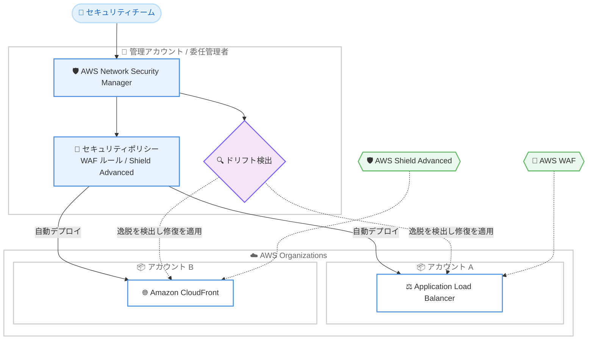

# AWS Network Security Manager - 一般提供開始

**リリース日**: 2026 年 9 月 24 日
**サービス**: AWS Network Security Manager
**機能**: 組織全体のネットワークセキュリティポリシーを一元管理する新サービスの一般提供開始

📊 [このアップデートのインフォグラフィックを見る](https://takech9203.github.io/aws-news-summary/20260924-network-security-manager-us-east-va.html)

## 概要

AWS は、ネットワークセキュリティ管理ソリューションである AWS Network Security Manager の一般提供開始を発表しました。Network Security Manager は、セキュリティポリシーのデプロイと適用を大規模に簡素化するために設計された新サービスで、AWS Organizations 配下のアカウントとリソース全体に対して、ファイアウォールおよび DDoS 保護の設定を一貫して適用できます。

ローンチ時点では AWS WAF と AWS Shield Advanced をサポートしており、AWS Network Firewall のサポートも近日中に追加される予定です。常時稼働のセキュリティデプロイ自動化により、Application Load Balancer や Amazon CloudFront といったインターネット向けアセットに保護を自動適用します。セキュリティチームはセキュリティポリシーを一元管理し、設定ドリフトを自動検出して修復を適用できるため、手動でのセキュリティ管理オーバーヘッドを削減できます。

組織全体のセキュリティベースラインを維持したい中央セキュリティチームや、マルチアカウント環境で WAF / DDoS 保護の適用漏れを防ぎたい組織が主な対象ユーザーです。

**アップデート前の課題**

- 以前はマルチアカウント環境で WAF ルールや Shield Advanced 保護をリソースごとに個別に設定・管理する必要があり、アカウント数の増加とともに運用負荷が増大していた
- 新規作成されたインターネット向けリソースへの保護適用が手動または個別の自動化に依存しており、適用漏れのリスクがあった
- 各アカウントでの設定変更によるドリフト (ベースラインからの逸脱) を検出・修復する仕組みを個別に構築する必要があった

**アップデート後の改善**

- 今回のアップデートにより、AWS Organizations 全体でファイアウォールと DDoS 保護の設定を一元的に定義し、一貫して適用できるようになった
- 常時稼働のデプロイ自動化により、Application Load Balancer や Amazon CloudFront などのインターネット向けアセットへ保護が自動適用されるようになった
- 設定ドリフトの自動検出と修復の適用により、手動でのセキュリティ管理作業が削減された

## アーキテクチャ図



セキュリティチームが Network Security Manager で定義したポリシーが、AWS Organizations 配下の各アカウントのインターネット向けアセットに自動デプロイされ、ドリフト検出と修復により保護状態が継続的に維持されます。

## サービスアップデートの詳細

### 主要機能

1. **一元的なセキュリティポリシー管理**
   - AWS Organizations 配下のアカウントとリソース全体に対して、ファイアウォールおよび DDoS 保護の設定を一元的に定義・適用
   - ローンチ時点で AWS WAF と AWS Shield Advanced をサポート、AWS Network Firewall のサポートも近日提供予定
   - 製品ページによると、アカウント、OU、リソースタイプ、タグ、リソース属性による AND / OR / NOT ロジックでポリシーの適用範囲を指定可能

2. **常時稼働のセキュリティデプロイ自動化**
   - Application Load Balancer や Amazon CloudFront などのインターネット向けアセットに保護を自動適用
   - 製品ページによると、新規作成されたリソースにもポリシーが自動的に適用される
   - 更新したルールを公開すると、組織全体に数分でデプロイされる

3. **設定ドリフトの自動検出と修復**
   - ポリシーで定義したベースラインからの設定の逸脱を自動検出
   - 修復を適用してベースラインを自動的に復元し、手動でのセキュリティ管理オーバーヘッドを削減

4. **階層型ポリシーと安全な変更管理**
   - 製品ページによると、組織全体のベースラインからアプリケーション固有のルールまで、ポリシーを階層的にレイヤー化し、リソースごとに 1 つの統合された設定に解決
   - デプロイ前のドラフト状態、公開前検証、ワンクリックロールバック、監査可能な不変の公開バージョンをサポート
   - 自然言語による要件の記述からルールを生成する機能も提供

## 技術仕様

### サービス仕様

| 項目 | 詳細 |
|------|------|
| サポートするセキュリティサービス | AWS WAF、AWS Shield Advanced (AWS Network Firewall は近日提供予定) |
| 保護対象アセット | Application Load Balancer、Amazon CloudFront など (料金ページでは API Gateway にも言及) |
| ポリシー適用範囲の指定 | アカウント、OU、リソースタイプ、タグ、リソース属性 (AND / OR / NOT ロジック) |
| ドリフト管理 | 設定ドリフトの自動検出と修復の適用 |
| 前提環境 | AWS Organizations 配下のアカウント・リソースへの適用を想定 |

### API変更履歴

| 日付 | サービス | 変更内容 |
|------|----------|----------|
| 2026/09/23 | [network-security-manager](https://awsapichanges.com/archive/changes/93a35b-network-security-manager.html) | 46 new api methods - AWS Network Security Manager Customer API の新規リリース。AWS Organization 内のアカウントとリソース全体でネットワークセキュリティサービスのセキュリティポリシーを一元的に設定・デプロイ・継続的に適用するための API 群 |

## 設定方法

### 前提条件

1. AWS Organizations が有効化されており、対象アカウントが組織に所属していること
2. 保護対象となるインターネット向けアセット (Application Load Balancer、Amazon CloudFront など) が存在すること
3. AWS WAF / AWS Shield Advanced の利用に必要な権限と、Shield Advanced を利用する場合はそのサブスクリプション

### 手順

#### ステップ1: セットアップ

[セットアップガイド](https://docs.aws.amazon.com/network-security-manager/latest/devguide/setting-up.html)に従い、US East (N. Virginia) リージョンで Network Security Manager のコンソールを開き、初期セットアップを行います。組織全体への適用には AWS Organizations との連携設定が必要です。

#### ステップ2: セキュリティポリシーの作成

コンソールでセキュリティポリシーを作成し、AWS WAF ルールや AWS Shield Advanced 保護の内容を定義します。適用範囲はアカウント、OU、リソースタイプ、タグなどの条件で指定します。ポリシーはドラフト状態で作成し、公開前検証を経てデプロイできます。

#### ステップ3: デプロイとモニタリング

ポリシーを公開すると、適用範囲内のインターネット向けアセットに保護が自動デプロイされます。以降は新規リソースへの自動適用、ドリフト検出、修復の適用状況をコンソールでモニタリングします。

## メリット

### ビジネス面

- **セキュリティガバナンスの強化**: 組織全体で一貫したファイアウォール・DDoS 保護の設定を強制でき、コンプライアンス要件への対応が容易になる
- **運用コストの削減**: 保護の自動適用とドリフトの自動修復により、手動でのセキュリティ管理オーバーヘッドを削減できる
- **脅威への迅速な対応**: 更新したルールを組織全体に数分でデプロイできるため、新たな脅威への対応時間を短縮できる

### 技術面

- **適用漏れの防止**: 常時稼働のデプロイ自動化により、新規作成されたインターネット向けアセットにも保護が自動適用される
- **ドリフトの自動修復**: ベースラインからの設定逸脱を自動検出し、修復を適用して定義済みの状態を維持できる
- **柔軟なスコープ指定**: アカウント、OU、タグ、リソース属性による論理条件で、きめ細かなポリシー適用範囲を定義できる

## デメリット・制約事項

### 制限事項

- 一般提供リージョンは現時点で US East (N. Virginia) のみ
- AWS Network Firewall のサポートは未提供 (近日提供予定)
- 発表時点で明示されている保護対象アセットは Application Load Balancer と Amazon CloudFront が中心

### 考慮すべき点

- Network Security Manager 自体の料金 (アカウントあたりの時間課金と保護対象アセットあたりの時間課金) に加え、ポリシーによってデプロイされる AWS WAF や AWS Shield Advanced の利用料金が別途発生する
- 既存の AWS Firewall Manager で同様のポリシー管理を行っている場合、両者の役割分担や移行方針の検討が必要
- 東京リージョンなど他リージョンでの利用可否は今後の展開を確認する必要がある

## ユースケース

### ユースケース1: 組織全体の WAF ベースラインの強制

**シナリオ**: 数十のアカウントを持つ企業が、すべてのインターネット向け Application Load Balancer に共通の WAF ルールセットを適用したい。

**実装例**:
```
1. 管理アカウントで Network Security Manager をセットアップ
2. 共通 WAF ルールを含むベースラインポリシーを作成
3. 適用範囲を「本番 OU 配下の全アカウント + リソースタイプ = ALB」に設定
4. ポリシーを公開し、自動デプロイとドリフト検出を有効化
```

**効果**: 全アカウントの ALB に WAF 保護が自動適用され、新規作成された ALB にも適用漏れなく保護が行き渡る。

### ユースケース2: CloudFront ディストリビューションへの DDoS 保護の一元適用

**シナリオ**: 複数チームが運用する Amazon CloudFront ディストリビューションに対して、AWS Shield Advanced による DDoS 保護を一貫して適用したい。

**実装例**:
```
1. Shield Advanced 保護を定義したポリシーを作成
2. タグ条件 (例: Environment=Production) で対象ディストリビューションを指定
3. ポリシーを公開し、保護状態をコンソールで一元的にモニタリング
```

**効果**: チームごとの設定ばらつきを排除し、本番環境の CloudFront ディストリビューション全体で DDoS 保護を確実に維持できる。

### ユースケース3: 設定ドリフトの自動修復によるベースライン維持

**シナリオ**: アプリケーションチームが誤って WAF の設定を変更・削除してしまうケースがあり、セキュリティベースラインからの逸脱を防ぎたい。

**実装例**:
```
1. ベースラインポリシーでドリフト検出と修復を有効化
2. 各アカウントでの設定変更を Network Security Manager が継続的に監視
3. 逸脱を検出した場合、定義済みベースラインへ自動的に修復
```

**効果**: 手動監査に頼らずにベースラインが自動的に維持され、セキュリティチームの運用負荷とリスクを低減できる。

## 料金

Network Security Manager の料金は、以下の 2 つのディメンションによる従量課金です。最低料金や前払いのコミットメントはありません。なお、ポリシーによってデプロイされる AWS WAF や AWS Shield Advanced の保護には、各サービスの料金が別途発生します。

- **サービス利用料**: ポリシーを作成したアカウントごと・リージョンごとに 0.35 USD/時間
- **保護対象アセット**: 保護対象アセットごと・リージョンごと・保護するファイアウォールごとに 0.004 USD/時間

### 料金例

| 使用量 | 月額料金 (概算) |
|--------|------------------|
| 1 アカウント、ALB 4 台を WAF で保護 | 263.52 USD (利用料 252.00 USD + アセット 11.52 USD) |
| 4 アカウント、2 リージョンで 40 アセットを保護 | 1,123.20 USD (利用料 1,008.00 USD + アセット 115.20 USD) |

詳細は[料金ページ](https://aws.amazon.com/network-security-manager/pricing/)を参照してください。

## 利用可能リージョン

- 米国東部 (バージニア北部)

## 関連サービス・機能

- **AWS WAF**: Network Security Manager のポリシーによって、Web アプリケーションへの WAF ルールの適用が一元管理される
- **AWS Shield Advanced**: DDoS 保護の設定を組織全体で一貫して適用できる
- **AWS Network Firewall**: 近日中にサポートが追加される予定のネットワークファイアウォールサービス
- **AWS Firewall Manager**: 従来から WAF / Shield Advanced のポリシーを組織全体で管理してきたサービス。Network Security Manager との使い分けや移行方針の確認が推奨される
- **AWS Organizations**: マルチアカウント環境でのポリシー適用範囲 (アカウント、OU) の基盤となるサービス

## 参考リンク

- 📊 [インフォグラフィック](https://takech9203.github.io/aws-news-summary/20260924-network-security-manager-us-east-va.html)
- [公式発表 (What's New)](https://aws.amazon.com/about-aws/whats-new/2026/09/network-security-manager-us-east-va/)
- [製品ページ](https://aws.amazon.com/network-security-manager/)
- [セットアップガイド](https://docs.aws.amazon.com/network-security-manager/latest/devguide/setting-up.html)
- [料金ページ](https://aws.amazon.com/network-security-manager/pricing/)

## まとめ

AWS Network Security Manager の一般提供開始により、マルチアカウント環境における WAF / DDoS 保護の一元管理、自動デプロイ、ドリフト修復が単一のサービスで実現できるようになりました。現時点では US East (N. Virginia) のみの提供ですが、組織全体のネットワークセキュリティガバナンスを強化したいセキュリティチームは、既存の AWS Firewall Manager の運用との比較を含めて評価を開始することを推奨します。
