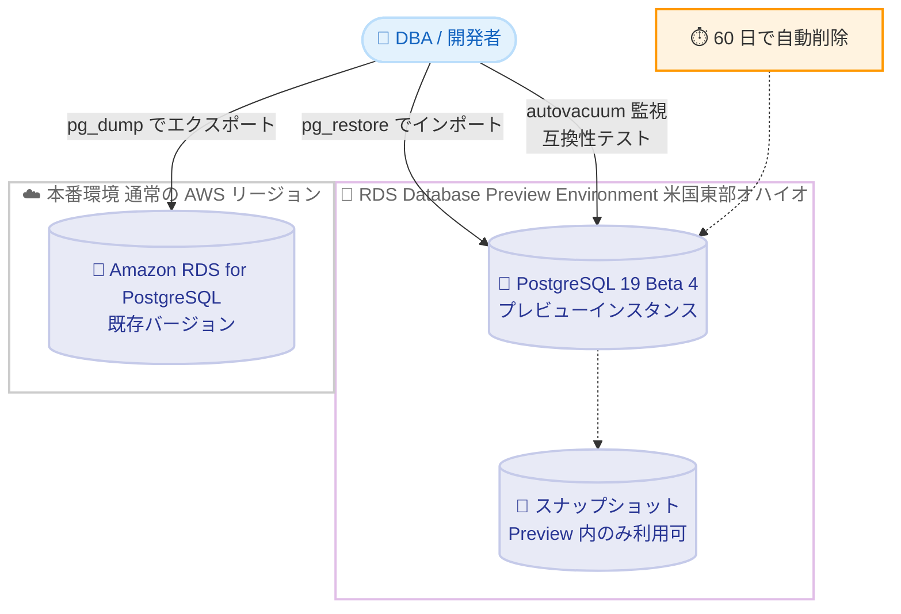

# Amazon RDS for PostgreSQL - PostgreSQL 19 Beta 4 が RDS Database Preview Environment で利用可能に

**リリース日**: 2026 年 9 月 24 日
**サービス**: Amazon RDS for PostgreSQL
**機能**: Amazon RDS Database Preview Environment での PostgreSQL 19 Beta 4 サポート

📊 [このアップデートのインフォグラフィックを見る](https://takech9203.github.io/aws-news-summary/20260924-postgresql-19-beta-4-amazon-rds-database-preview-environment.html)

## 概要

Amazon RDS for PostgreSQL において、PostgreSQL 19 Beta 4 が Amazon RDS Database Preview Environment で利用可能になりました。これにより、正式リリース前の PostgreSQL 19 の最新ベータ版をマネージドサービスである Amazon RDS 上で評価できます。

PostgreSQL 19 Beta 4 は、これまでのベータリリースで導入されたクエリパフォーマンスと autovacuum 管理機能を洗練させたリリースであり、Beta 3 以降に報告されたバグ修正と安定性の改善が含まれています。具体的には、TOAST テーブルに対する pg_stat_autovacuum_scores ビューのレポーティングの修正、autovacuum の優先度チューニングに関わる freeze スコアのスケーリングの修正が含まれます。また、並列 autovacuum はリバランスされたコスト制限をワーカー間で共有するようになり、大規模テーブルのメンテナンスが設定した制限内に収まるようになりました。

このアップデートは、PostgreSQL 19 の正式リリース (GA) に先立ち、既存アプリケーションとの互換性検証や新機能の評価を行いたいデータベース管理者や開発者を対象としています。GA が近づくこの段階での検証は、アップグレード計画の精度向上に直結します。

**アップデート前の課題**

このアップデート以前に存在していた課題や制限は以下のとおりです。

- Beta 3 では、TOAST テーブルに対する pg_stat_autovacuum_scores ビューのレポーティングに不具合があり、autovacuum 優先度の正確な監視が難しいケースがあった
- freeze スコアのスケーリングに問題があり、autovacuum の優先度チューニングの判断材料として利用しにくかった
- 並列 autovacuum のワーカーごとのコスト制限の扱いにより、大規模テーブルのメンテナンスが設定した I/O コスト制限を意図どおりに守れない可能性があった

**アップデート後の改善**

今回のアップデートにより可能になったことは以下のとおりです。

- TOAST テーブルを含めて pg_stat_autovacuum_scores ビューが正しくレポーティングされるようになり、autovacuum 優先度の監視精度が向上した
- freeze スコアのスケーリングが修正され、autovacuum の優先度チューニングをより正確に行えるようになった
- 並列 autovacuum がリバランスされたコスト制限をワーカー間で共有するようになり、大規模テーブルのメンテナンスを設定した制限内に維持できるようになった
- Beta 3 のテスト期間中に報告されたバグ修正と安定性改善を、マネージド環境である RDS 上で GA 前に検証できるようになった

## アーキテクチャ図



RDS Database Preview Environment 上に PostgreSQL 19 Beta 4 のインスタンスを作成し、pg_dump / pg_restore で既存データベースを持ち込んで評価する流れを示しています。プレビューインスタンスは最大 60 日で自動削除され、スナップショットは Preview Environment 内でのみ利用できます。

## サービスアップデートの詳細

### 主要機能

1. **pg_stat_autovacuum_scores ビューの TOAST テーブル対応修正**
   - autovacuum の優先度スコアを可視化する pg_stat_autovacuum_scores ビューについて、TOAST テーブルに対するレポーティングの不具合が修正された
   - 大きな値を格納する TOAST テーブルを含めた形で autovacuum の挙動を正確に監視できる
   - 「なぜこのテーブルの vacuum が遅れるのか」という調査の精度が向上する

2. **freeze スコアのスケーリング修正**
   - autovacuum の優先度付けに使用される freeze スコアのスケーリングが修正された
   - トランザクション ID 周回対策としての freeze 処理の優先度を、より正確にチューニングできる

3. **並列 autovacuum のコスト制限のリバランス**
   - 並列 autovacuum がリバランスされたコスト制限を複数のワーカー間で共有するようになった
   - 大規模テーブルのメンテナンスが、設定した vacuum コスト制限内に収まるようになり、メンテナンス処理が本番ワークロードの I/O を圧迫するリスクを抑制できる

4. **Beta 3 以降のバグ修正と安定性改善**
   - これまでのベータリリースで導入されたクエリパフォーマンスと autovacuum 管理機能 (pg_stat_autovacuum_scores、並列 autovacuum など) を洗練させたリリース
   - Beta 3 のテスト期間中に報告された問題への修正が含まれる

## 技術仕様

### Preview Environment の制約

| 項目 | 詳細 |
|------|------|
| 提供リージョン | 米国東部 (オハイオ) リージョンのみ |
| インスタンス保持期間 | 最大 60 日間 (期間経過後は自動削除) |
| スナップショット | Preview Environment 内でのみ作成・復元が可能 |
| データの持ち込み / 持ち出し | pg_dump / pg_restore (dump and load) を使用 |
| 料金 | 米国東部 (オハイオ) リージョンの通常の RDS for PostgreSQL 料金に準拠 |
| 本番利用 | 不可 (ベータ版のため評価・テスト用途のみ) |

### PostgreSQL 19 Beta 4 の主な修正・改善点

| 項目 | カテゴリ | 概要 |
|------|----------|------|
| pg_stat_autovacuum_scores の修正 | 運用管理 | TOAST テーブルに対するレポーティングの修正 |
| freeze スコアスケーリングの修正 | 運用管理 | autovacuum 優先度チューニングの精度向上 |
| 並列 autovacuum のコスト制限共有 | 運用管理 | ワーカー間でリバランスされたコスト制限を共有 |
| バグ修正・安定性改善 | 全般 | Beta 3 以降に報告された問題への対応 |

## 設定方法

### 前提条件

1. AWS アカウントを保有していること
2. Amazon RDS Database Preview Environment は米国東部 (オハイオ) リージョンで提供されるため、同リージョンを使用すること
3. 評価用データを持ち込む場合は、pg_dump / pg_restore が利用できるクライアント環境があること

### 手順

#### ステップ 1: Preview Environment コンソールへアクセス

```text
https://console.aws.amazon.com/rds-preview/
```

Amazon RDS Database Preview Environment は通常の RDS コンソールとは別の専用コンソールから利用します。上記 URL にアクセスし、データベース作成画面を開きます。

#### ステップ 2: PostgreSQL 19 Beta 4 インスタンスの作成

```bash
# Preview Environment のエンドポイントを指定して DB インスタンスを作成
aws rds create-db-instance \
  --db-instance-identifier pg19-beta4-test \
  --engine postgres \
  --engine-version 19.0-beta4 \
  --db-instance-class db.m7g.large \
  --allocated-storage 100 \
  --master-username postgres \
  --master-user-password <パスワード> \
  --region us-east-2 \
  --endpoint-url https://rds-preview.us-east-2.amazonaws.com
```

Preview Environment 専用のエンドポイント URL を指定して、PostgreSQL 19 Beta 4 の DB インスタンスを作成します。エンジンバージョンの正確な表記はコンソールまたは `describe-db-engine-versions` で確認してください。

#### ステップ 3: 既存データベースのインポートと評価

```bash
# 既存データベースをエクスポート
pg_dump -h <本番エンドポイント> -U postgres -Fc mydb > mydb.dump

# Preview Environment のインスタンスへインポート
pg_restore -h <プレビューエンドポイント> -U postgres -d mydb mydb.dump

# 修正された autovacuum スコアビューの確認例
psql -h <プレビューエンドポイント> -U postgres -d mydb \
  -c "SELECT * FROM pg_stat_autovacuum_scores;"
```

pg_dump で既存データベースを論理バックアップとしてエクスポートし、pg_restore で Preview Environment 上の PostgreSQL 19 Beta 4 インスタンスにインポートします。その後、実際のクエリやアプリケーションを接続して互換性と新機能を評価します。

## メリット

### ビジネス面

- **アップグレード計画の前倒し**: GA 前の最終段階に近いベータ版で互換性検証を進められるため、PostgreSQL 19 GA 後の本番アップグレードを迅速かつ低リスクに計画できる
- **インフラ構築コストの削減**: ベータ版評価のためにセルフマネージド環境を構築・運用する必要がなく、評価にかかる工数を削減できる
- **コミュニティへの貢献**: ベータ期間中に発見した問題を PostgreSQL コミュニティへ報告することで、GA 品質の向上に貢献できる

### 技術面

- **監視精度の向上**: TOAST テーブルを含む pg_stat_autovacuum_scores の正確なレポーティングにより、autovacuum 運用の監視・チューニングを実データで検証できる
- **メンテナンス影響の制御**: 並列 autovacuum のコスト制限がワーカー間で共有されるため、大規模テーブルのメンテナンスによる I/O 影響を制限内に維持する挙動を事前に確認できる
- **GA 品質に近い検証**: Beta 3 からの修正が反映された、より安定したベータ版で自社ワークロードの互換性と性能を評価できる

## デメリット・制約事項

### 制限事項

- ベータ版のため本番利用は不可であり、評価・テスト用途に限定される
- Preview Environment は米国東部 (オハイオ) リージョンでのみ提供される
- DB インスタンスの保持期間は最大 60 日間で、期間経過後は自動削除される
- Preview Environment で作成したスナップショットは、Preview Environment 内でのみ作成・復元に使用できる (本番環境への復元は不可)
- Preview Environment から本番環境へのデータ移行は pg_dump / pg_restore による論理的な方法に限られる

### 考慮すべき点

- ベータ版の機能は GA までに変更・削除される可能性がある
- PostgreSQL 19 の GA 時期は未定であり、コミュニティのテスト状況によって決定される
- 評価期間中も通常の RDS 料金 (米国東部オハイオリージョンの料金) が発生するため、評価完了後は速やかにインスタンスを削除することが望ましい
- Beta 3 で評価を実施済みの場合も、今回の修正内容 (autovacuum 関連の監視・コスト制御) に関わるテストは Beta 4 で再確認することが望ましい

## ユースケース

### ユースケース 1: 既存アプリケーションの互換性検証

**シナリオ**: PostgreSQL 16 で稼働中の基幹システムを、将来的に PostgreSQL 19 へアップグレードする計画がある。GA 後すぐにアップグレードできるよう、GA に近い品質のベータ版で事前に互換性を確認したい。

**実装例**:
```bash
# 本番データベースのスキーマとデータをエクスポート
pg_dump -h prod-db.xxxx.ap-northeast-1.rds.amazonaws.com -Fc mydb > mydb.dump

# Preview Environment の PostgreSQL 19 Beta 4 へリストア
pg_restore -h preview-db.xxxx.us-east-2.rds-preview.amazonaws.com -d mydb mydb.dump

# アプリケーションのテストスイートを Preview 環境に向けて実行
```

**効果**: 非互換の SQL や拡張機能の問題を GA 前に発見でき、アップグレード時の手戻りを防止できる。

### ユースケース 2: TOAST テーブルを含む autovacuum 監視の検証

**シナリオ**: JSON や大きなテキストを格納するカラムを多用しており、TOAST テーブルの肥大化が課題になっている。修正された pg_stat_autovacuum_scores ビューで、TOAST テーブルを含めた autovacuum の優先度を正確に把握したい。

**実装例**:
```sql
-- TOAST テーブルを含む autovacuum の優先度スコアを確認
SELECT * FROM pg_stat_autovacuum_scores;

-- 大きな値の更新負荷をかけた状態で
-- TOAST テーブルのスコアが正しく報告されることを確認
```

**効果**: TOAST テーブルを含めた vacuum 運用の全体像を可視化でき、肥大化対策のチューニング精度が向上する。

### ユースケース 3: 並列 autovacuum のコスト制限遵守の検証

**シナリオ**: 数 TB 規模のテーブルを持つデータベースで、並列 autovacuum によるメンテナンス高速化を検討している。ただし、メンテナンス処理が本番ワークロードの I/O を圧迫しないか懸念がある。

**実装例**:
```sql
-- vacuum コスト制限の設定を確認
SHOW autovacuum_vacuum_cost_limit;

-- 大規模テーブルに更新負荷をかけた状態で並列 autovacuum を実行し、
-- ワーカー全体の I/O がコスト制限内に収まることをモニタリング
```

**効果**: リバランスされたコスト制限の共有により、メンテナンス高速化と本番ワークロードへの影響抑制を両立できることを事前に確認できる。

## 料金

Amazon RDS Database Preview Environment の DB インスタンスは、米国東部 (オハイオ) リージョンにおける Amazon RDS for PostgreSQL の通常料金に準拠して課金されます。Preview Environment 自体への追加料金はありませんが、インスタンス稼働時間、ストレージ、バックアップなどに対して標準の RDS 料金が発生します。

詳細は [Amazon RDS for PostgreSQL 料金ページ](https://aws.amazon.com/rds/postgresql/pricing/) を参照してください。

## 利用可能リージョン

Amazon RDS Database Preview Environment は米国東部 (オハイオ) リージョンで提供されます。

## 関連サービス・機能

- **Amazon RDS for PostgreSQL**: 本アップデートの対象サービス。PostgreSQL 19 の GA 後は通常環境でも新バージョンが提供される見込み
- **Amazon Aurora PostgreSQL 互換エディション**: PostgreSQL 互換のクラウドネイティブデータベース。メジャーバージョン対応の動向を併せて確認したい関連サービス
- **AWS Database Migration Service (DMS)**: 本番環境への移行やバージョン間のデータ移行を支援するサービス。ただし Preview Environment との間のデータ移動は pg_dump / pg_restore の利用が案内されている

## 参考リンク

- 📊 [インフォグラフィック](https://takech9203.github.io/aws-news-summary/20260924-postgresql-19-beta-4-amazon-rds-database-preview-environment.html)
- [公式発表 (What's New)](https://aws.amazon.com/about-aws/whats-new/2026/09/postgresql-19-beta-4-amazon-rds-database-preview-environment/)
- [Amazon RDS Database Preview Environment ドキュメント](https://docs.aws.amazon.com/AmazonRDS/latest/UserGuide/create-db-instance-in-preview-environment.html)
- [PostgreSQL コミュニティ発表 (19 Beta 4)](https://www.postgresql.org/about/news/postgresql-19-beta-4-released-3386/)
- [Amazon RDS for PostgreSQL](https://aws.amazon.com/rds/postgresql/)
- [料金ページ](https://aws.amazon.com/rds/postgresql/pricing/)

## まとめ

PostgreSQL 19 Beta 4 が Amazon RDS Database Preview Environment で利用可能になり、autovacuum 監視ビューの修正や並列 autovacuum のコスト制限共有など、運用に直結する改善を GA 前にマネージド環境で評価できるようになりました。PostgreSQL 19 へのアップグレードを検討している場合は、60 日間の保持期間内に既存ワークロードの互換性検証と autovacuum 運用の評価を実施し、GA 後の円滑な移行に備えることを推奨します。ベータ版のため本番利用は避け、評価で問題を発見した場合は PostgreSQL コミュニティへ報告してください。
