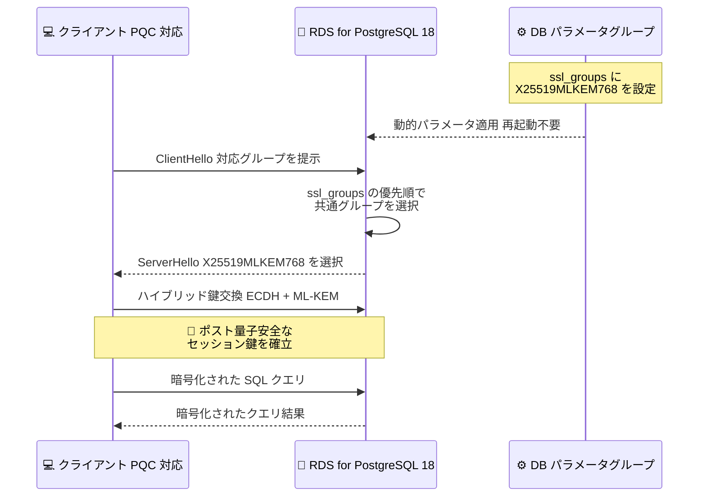

# Amazon RDS for PostgreSQL - ポスト量子 TLS 鍵交換のサポート

**リリース日**: 2026 年 9 月 24 日
**サービス**: Amazon RDS for PostgreSQL
**機能**: ポスト量子 TLS (PQ-TLS) 鍵交換のサポート

📊 [このアップデートのインフォグラフィックを見る](https://takech9203.github.io/aws-news-summary/20260924-postgresql-post-quantum-tls-key-exchange.html)

## 概要

Amazon RDS for PostgreSQL がポスト量子 TLS (PQ-TLS) 鍵交換のサポートを開始しました。これにより、アプリケーションとデータベース間の転送中データの暗号化に、ポスト量子暗号 (PQC) の選択肢を利用できるようになります。

RDS for PostgreSQL バージョン 18 以降では、DB パラメータグループの `ssl_groups` パラメータを変更し、TLS 鍵交換に使用する名前付きグループを RDS の許可リストから選択できます。許可リストには NIST 標準のポスト量子鍵カプセル化アルゴリズムである ML-KEM を用いたハイブリッドグループ (`X25519MLKEM768`、`SecP256r1MLKEM768`) が含まれており、組織のセキュリティ基準に合わせた暗号グループの構成が可能です。

このアップデートは、将来の量子コンピュータによる「harvest now, decrypt later (今収集して後で復号する)」型攻撃への対策を進めたい、金融、医療、公共など高いセキュリティ要件を持つ組織にとって特に重要です。

**アップデート前の課題**

このアップデート以前は、RDS for PostgreSQL への TLS 接続における鍵交換に以下の制限がありました。

- 鍵交換には従来の楕円曲線ベースのグループ (prime256v1、X25519 など) のみが使用され、ポスト量子暗号を選択できなかった
- 将来の量子コンピュータによって、現在記録された暗号化通信が事後に解読されるリスク (harvest now, decrypt later) に対して、データベース接続レイヤーで対策する手段がなかった
- 組織のセキュリティ基準で PQC への移行が求められても、RDS for PostgreSQL の TLS 鍵交換アルゴリズムを制御できなかった

**アップデート後の改善**

今回のアップデートにより、以下が可能になりました。

- ML-KEM を用いたハイブリッドポスト量子鍵交換グループ (`X25519MLKEM768`、`SecP256r1MLKEM768`) を TLS 接続に使用できるようになった
- `ssl_groups` パラメータで許可リストから暗号グループを選択し、組織のセキュリティ標準に合わせた構成が可能になった
- `ssl_groups` は動的パラメータであるため、DB インスタンスを再起動することなく設定を変更できる

## アーキテクチャ図



DB パラメータグループの `ssl_groups` にポスト量子グループを設定すると、TLS ハンドシェイク時にサーバーの優先順位に従って鍵交換グループが選択され、ML-KEM を組み合わせたハイブリッド鍵交換でセッション鍵が確立されます。

## サービスアップデートの詳細

### 主要機能

1. **ssl_groups パラメータの変更サポート**
   - RDS for PostgreSQL 18 以降で、TLS 鍵交換に使用する名前付きグループを指定可能
   - 動的パラメータであり、DB インスタンスの再起動は不要
   - リストの順序がサーバー側の優先順位となり、クライアントも対応する最初のグループが接続に使用される

2. **ポスト量子ハイブリッド鍵交換グループ**
   - `X25519MLKEM768`: X25519 (楕円曲線) と ML-KEM-768 (ポスト量子) のハイブリッド
   - `SecP256r1MLKEM768`: SecP256r1 (楕円曲線) と ML-KEM-768 (ポスト量子) のハイブリッド
   - ハイブリッド方式のため、従来の楕円曲線暗号の安全性を維持しつつポスト量子耐性を追加

3. **従来グループとの併用**
   - 許可リストには従来の楕円曲線グループ (`X25519`、`prime256v1`、`secp384r1`) も含まれる
   - PQC 対応クライアントと非対応クライアントが混在する環境でも、段階的な移行が可能

## 技術仕様

### ssl_groups パラメータ

| 項目 | 詳細 |
|------|------|
| 対象バージョン | RDS for PostgreSQL 18 以降 |
| デフォルト値 | `prime256v1:X25519` |
| 許可リスト | `X25519MLKEM768`、`SecP256r1MLKEM768`、`X25519`、`prime256v1`、`secp384r1` |
| パラメータ種別 | 動的パラメータ (再起動不要) |
| 優先順位 | リストの順序がサーバー側の優先順位。クライアントも対応する最初のグループを使用 |
| ML-KEM の要件 | ML-KEM グループの使用には TLS v1.3 が必要 |

### 動作に関する注意点

- `ssl_groups` は名前付きグループを使用する鍵交換にのみ適用されます。RSA 鍵交換を使用する TLS v1.2 の暗号スイートでは無視されます
- 指定したグループのみを確実に使用するには、`rds.force_ssl` を有効にした上で、`ssl_min_protocol_version` を `TLSv1.3` に設定するか、TLS v1.2 接続向けに `ssl_ciphers` を ECDHE ベースのスイートに制限します
- ML-KEM グループの使用を強制するには、`ssl_min_protocol_version` を `TLSv1.3` に設定します

## 設定方法

### 前提条件

1. RDS for PostgreSQL バージョン 18 以降の DB インスタンス
2. カスタム DB パラメータグループ (デフォルトのパラメータグループは変更不可)
3. ポスト量子鍵交換に対応したクライアント側 TLS ライブラリ (ML-KEM 対応の OpenSSL、AWS-LC など)

### 手順

#### ステップ 1: 許可されている暗号グループの確認

```bash
aws rds describe-db-parameters \
    --db-parameter-group-name my-pg18-parameter-group \
    --output json | jq '.Parameters[] | select(.ParameterName == "ssl_groups")'
```

DB パラメータグループの `ssl_groups` パラメータについて、現在の値と許可されている値を確認します。

#### ステップ 2: ssl_groups にポスト量子グループを設定

```bash
aws rds modify-db-parameter-group \
    --db-parameter-group-name my-pg18-parameter-group \
    --parameters "ParameterName='ssl_groups',ParameterValue='X25519MLKEM768:SecP256r1MLKEM768:X25519:prime256v1',ApplyMethod=immediate"
```

`ssl_groups` パラメータにポスト量子ハイブリッドグループを優先順で設定します。動的パラメータのため即時適用され、DB インスタンスの再起動は不要です。先頭にポスト量子グループを配置することで、対応クライアントとの接続では PQ-TLS が優先されます。

#### ステップ 3: TLS v1.3 の強制 (ML-KEM の使用を保証する場合)

```bash
aws rds modify-db-parameter-group \
    --db-parameter-group-name my-pg18-parameter-group \
    --parameters "ParameterName='ssl_min_protocol_version',ParameterValue='TLSv1.3',ApplyMethod=immediate" \
    "ParameterName='rds.force_ssl',ParameterValue='1',ApplyMethod=immediate"
```

ML-KEM グループは TLS v1.3 を必要とするため、最小プロトコルバージョンを TLS v1.3 に設定し、あわせて SSL 接続を強制します。

#### ステップ 4: 接続状態の確認

```sql
SELECT name AS "Parameter name", setting AS value
FROM pg_settings
WHERE name = 'ssl_groups';
```

DB インスタンスに接続し、`pg_settings` ビューで `ssl_groups` の設定値が反映されていることを確認します。

## メリット

### ビジネス面

- **将来リスクへの先行対策**: 「harvest now, decrypt later」型攻撃に備え、長期間の機密性が求められるデータの転送中暗号化を強化できる
- **コンプライアンス対応**: NIST 標準の PQC アルゴリズム (ML-KEM) を採用することで、政府機関や規制業界の PQC 移行要件に対応しやすくなる
- **追加コストなしの移行**: パラメータ変更のみで PQ-TLS を有効化でき、アーキテクチャ変更や追加インフラが不要

### 技術面

- **無停止での適用**: `ssl_groups` は動的パラメータのため、DB インスタンスの再起動なしで設定を変更できる
- **ハイブリッド方式の安全性**: ML-KEM と従来の楕円曲線暗号を組み合わせるため、どちらかのアルゴリズムが破られても接続の機密性が維持される
- **段階的な移行が可能**: 従来グループと併記することで、PQC 非対応クライアントとの互換性を維持しながら移行を進められる

## デメリット・制約事項

### 制限事項

- RDS for PostgreSQL バージョン 18 以降でのみ `ssl_groups` パラメータを変更可能 (17 以前は非対応)
- ML-KEM グループの使用には TLS v1.3 が必要
- 選択できるグループは RDS の許可リスト (`X25519MLKEM768`、`SecP256r1MLKEM768`、`X25519`、`prime256v1`、`secp384r1`) に限定される
- `ssl_groups` は RSA 鍵交換を使用する TLS v1.2 暗号スイートには適用されない

### 考慮すべき点

- クライアント側の TLS ライブラリが ML-KEM ハイブリッドグループに対応している必要があるため、接続元アプリケーションの対応状況を事前に確認する
- ポスト量子グループのみに制限すると、非対応クライアントが接続できなくなる可能性があるため、移行期間中は従来グループとの併用を推奨
- ML-KEM は鍵交換のデータサイズが従来方式より大きいため、ハンドシェイク時の通信量がわずかに増加する点を考慮する

## ユースケース

### ユースケース 1: 金融機関における長期機密データの保護

**シナリオ**: 金融機関が顧客の取引データを RDS for PostgreSQL で管理しており、規制要件により数十年単位でデータの機密性を確保する必要がある。将来の量子コンピュータによる解読リスクに今から備えたい。

**実装例**:
```bash
aws rds modify-db-parameter-group \
    --db-parameter-group-name finance-pg18-params \
    --parameters "ParameterName='ssl_groups',ParameterValue='X25519MLKEM768:SecP256r1MLKEM768',ApplyMethod=immediate" \
    "ParameterName='ssl_min_protocol_version',ParameterValue='TLSv1.3',ApplyMethod=immediate" \
    "ParameterName='rds.force_ssl',ParameterValue='1',ApplyMethod=immediate"
```

**効果**: すべてのデータベース接続でポスト量子ハイブリッド鍵交換が強制され、現在傍受された通信が将来解読されるリスクを低減できる。

### ユースケース 2: 段階的な PQC 移行

**シナリオ**: 多数のアプリケーションが接続する共有データベースで、クライアントの PQC 対応状況がまちまちである。対応済みクライアントから順次 PQ-TLS へ移行したい。

**実装例**:
```bash
aws rds modify-db-parameter-group \
    --db-parameter-group-name shared-pg18-params \
    --parameters "ParameterName='ssl_groups',ParameterValue='X25519MLKEM768:X25519:prime256v1:secp384r1',ApplyMethod=immediate"
```

**効果**: PQC 対応クライアントは自動的にポスト量子鍵交換を使用し、非対応クライアントは従来の楕円曲線グループで接続を継続できるため、サービス断なく移行を進められる。

### ユースケース 3: 組織のセキュリティ標準への準拠

**シナリオ**: 官公庁向けシステムを運用する組織で、セキュリティ標準により使用可能な暗号アルゴリズムが指定されている。TLS 鍵交換に使用するグループを明示的に制御したい。

**実装例**:
```sql
-- 設定値の反映を確認
SELECT name, setting FROM pg_settings WHERE name IN ('ssl_groups', 'ssl_min_protocol_version');

-- 接続ごとの SSL 使用状況を監査
SELECT datname, usename, ssl, client_addr
FROM pg_stat_ssl JOIN pg_stat_activity ON pg_stat_ssl.pid = pg_stat_activity.pid
ORDER BY ssl;
```

**効果**: 許可された暗号グループのみで鍵交換が行われることを構成として保証し、監査時に設定と接続状況を証跡として提示できる。

## 料金

公式発表に追加料金に関する記載はありません。`ssl_groups` パラメータの変更は DB パラメータグループの標準機能であり、通常の Amazon RDS for PostgreSQL の料金体系の範囲で利用できます。

## 利用可能リージョン

公式発表にリージョンの明記はありません。RDS for PostgreSQL の SSL/TLS サポートはすべての AWS リージョンで利用可能であり、本機能は RDS for PostgreSQL バージョン 18 以降を利用できる環境で使用できます。最新の対応状況は公式ドキュメントを確認してください。

## 関連サービス・機能

- **AWS-LC**: RDS for PostgreSQL 18 の TLS ライブラリとして使用される AWS のオープンソース暗号ライブラリ。ML-KEM を FIPS 140-3 検証に含めた初のオープンソース暗号モジュール
- **AWS KMS / ACM / Secrets Manager**: 2025 年 4 月よりサービスエンドポイントで ML-KEM を用いた TLS ハイブリッド鍵合意をサポートしており、AWS 全体の PQC 移行の一環として位置付けられる
- **ssl_ciphers / ssl_tls13_ciphers パラメータ**: RDS for PostgreSQL 16 以降 (TLS v1.2) および 18 以降 (TLS v1.3) で暗号スイートをカスタマイズ可能。`ssl_groups` と組み合わせて TLS 構成全体を制御できる

## 参考リンク

- 📊 [インフォグラフィック](https://takech9203.github.io/aws-news-summary/20260924-postgresql-post-quantum-tls-key-exchange.html)
- [公式発表 (What's New)](https://aws.amazon.com/about-aws/whats-new/2026/09/postgresql-post-quantum-tls-key-exchange/)
- [ドキュメント: TLS key-exchange groups in RDS for PostgreSQL](https://docs.aws.amazon.com/AmazonRDS/latest/UserGuide/PostgreSQL.Concepts.General.SSL.html#PostgreSQL.Concepts.General.SSL.Groups)
- [AWS Post-Quantum Cryptography](https://aws.amazon.com/security/post-quantum-cryptography/)
- [Amazon RDS for PostgreSQL 製品ページ](https://aws.amazon.com/rds/postgresql/)
- [料金ページ](https://aws.amazon.com/rds/postgresql/pricing/)

## まとめ

Amazon RDS for PostgreSQL 18 以降で、`ssl_groups` パラメータによるポスト量子 TLS 鍵交換の構成が可能になり、転送中データの暗号化を将来の量子コンピュータの脅威に備えて強化できるようになりました。動的パラメータのため再起動なしで適用でき、従来グループとの併用による段階的な移行も可能です。長期の機密性が求められるデータを扱う組織は、PostgreSQL 18 へのアップグレード計画とあわせて、PQ-TLS の有効化を検討することを推奨します。
