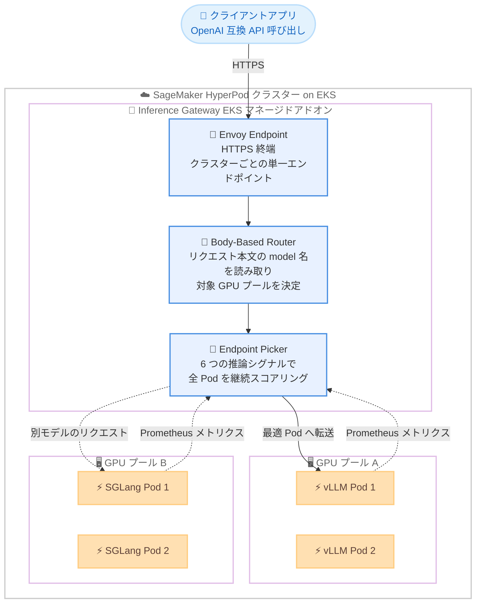

# Amazon SageMaker HyperPod - Inference Gateway によるスケーラブルな LLM 推論

**リリース日**: 2026年09月24日
**サービス**: Amazon SageMaker HyperPod
**機能**: Amazon SageMaker HyperPod Inference Gateway

📊 [このアップデートのインフォグラフィックを見る](https://takech9203.github.io/aws-news-summary/20260924-sagemaker-hyperpod-inference-gateway.html)

## 概要

Amazon SageMaker HyperPod Inference Gateway が発表されました。これは Kubernetes ネイティブかつ GPU の内部状態を認識するルーティングシステムで、既存の SageMaker HyperPod (Amazon EKS オーケストレーション) インフラストラクチャ上に単一の EKS マネージドアドオンとしてデプロイでき、アプリケーション側の変更は一切不要です。

従来のラウンドロビン方式のロードバランシングを、リアルタイムの推論シグナルに基づくルーティングに置き換えることで、初回トークンレイテンシ (TTFT) を最大 82% 削減します。ハードウェア世代が混在する環境やバーストトラフィックのシナリオでは、p99 TTFT を 97〜98% 削減するベンチマーク結果が示されています。vLLM や SGLang をはじめとする OpenAI 互換の任意のモデルサーバーで動作するため、特定の推論エンジンへのロックインもありません。

大規模な LLM 推論を HyperPod クラスター上でセルフホストしている組織にとって、GPU の過剰プロビジョニングを抑えながらテールレイテンシを大幅に改善できる重要なアップデートです。

**アップデート前の課題**

Kubernetes 標準のロードバランサーは GPU 内部の状態を把握できず、推論ワークロード特有の問題が発生していました。

- ラウンドロビン方式は KV キャッシュの飽和状況、長文生成の進行状況、LoRA アダプタのロード状況を考慮できず、ビジー状態の Pod にリクエストが滞留する一方でアイドル容量が未使用のままだった
- トラフィックバースト時には初回トークンレイテンシが 4 秒超に達することがあり、SLO を満たすために GPU の過剰プロビジョニングが必要でコスト増を招いていた
- 複数モデルを提供する場合、モデルごとに個別のエンドポイントを用意し、クライアント側でルーティングを管理する必要があった

**アップデート後の改善**

- KV キャッシュ使用率やキュー深度などのリアルタイム推論シグナルに基づき、リクエストごとに最適な Pod へルーティングされるようになった (混在 GPU 環境で p99 TTFT を最大 97〜98% 削減、ブログ例では 4.4 秒から 800 ミリ秒未満に短縮)
- クラスターごとの単一プライベートエンドポイントで複数モデルを提供でき、リクエスト本文の `model` フィールドから自動的に適切な GPU プールへルーティングされるため、クライアント側の変更が不要になった
- 単一の EKS マネージドアドオンとして約 5 分でセットアップでき、OpenAI 互換 API をそのまま利用できるためアプリケーションコードの変更ゼロで導入できるようになった

## アーキテクチャ図



Inference Gateway は Envoy Endpoint、Body-Based Router、Endpoint Picker の 3 コンポーネントで構成され、各モデルサーバー Pod の Prometheus メトリクスをリアルタイムに評価して最適な Pod へリクエストをルーティングします。

## サービスアップデートの詳細

### 主要機能

1. **Envoy Endpoint (HTTPS 終端と単一エンドポイント)**
   - 高性能な L7 プロキシである Envoy Gateway が HTTPS トラフィックを終端
   - クラスターごとに単一のプライベートエンドポイントを公開し、複数モデルへの入口を一本化
   - ACM 証明書の指定、または cert-manager による証明書の自動発行 (ACM へのインポート) に対応

2. **Body-Based Router (モデル名ベースのルーティング)**
   - OpenAI 互換リクエスト本文の `model` フィールドを検査し、対応する GPU プールへルーティング
   - LoRA アダプタ名をベースモデルに解決し、`X-Gateway-Model-Name` および `X-Gateway-Base-Model-Name` ヘッダーを設定
   - 1 つのゲートウェイと単一のエンドポイント URL で最大 100 スケジューラ (モデル) を提供可能

3. **Endpoint Picker (推論シグナルによる Pod スコアリング)**
   - 全モデルサーバー Pod を 6 つの推論レベルシグナルで継続的にスコアリング: KV キャッシュ使用率、キュー深度、LoRA アダプタ常駐性、プレフィックスキャッシュヒット率、予測レイテンシ、実行中リクエスト数
   - 各スコアラーの重みは設定可能で、レイテンシ重視・スループット重視などワークロードに合わせて調整可能
   - レプリカ数 2 以上でリーダー選出によるハイアベイラビリティ構成に対応

4. **モデルサーバー非依存の OpenAI 互換設計**
   - vLLM、SGLang など OpenAI 互換の任意のモデルサーバーで動作
   - 標準の `/v1/chat/completions` エンドポイントにそのままリクエストを送信でき、SDK やアプリケーションコードの変更は不要
   - 推論トラフィックに SigV4 署名は不要 (JWT 認証の有効化を強く推奨)

5. **障害耐性と可観測性**
   - Pod 障害時はメトリクスが古い Pod を自動的に除外し、自動復旧
   - プール枯渇時は HTTP 429 と Retry-After ヘッダーを返却し、オートスケーリングで回復
   - Body-Based Router と Endpoint Picker に OpenTelemetry Collector サイドカーが自動注入され、HyperPod 推論可観測性スタックの Grafana ダッシュボードでメトリクスを可視化

## 技術仕様

### パフォーマンスベンチマーク (ラウンドロビン比、デフォルト設定)

| 条件 | TTFT P95 | TTFT P99 | スループット |
|------|----------|----------|--------------|
| 混在 GPU 世代 (Llama-3.1-8B) | -97% | -97% | +8% |
| 混在 GPU 世代 (Qwen3-32B) | -98% | -97% | +50% |
| バーストトラフィック (Llama-3.1-70B) | -94% | -98% | +12% |
| バーストトラフィック (Qwen3-235B) | 同等 | -89% | 同等 |
| 共有プロンプトプレフィックス (Llama-3.1-8B) | -26% | -43% | 同等 |
| 均一フリート・定常トラフィック (Qwen3-235B) | 同等 | 同等 | 同等 |

ベンチマーク環境は 8B〜235B の 4 モデル、p5.48xlarge (H100) と g5 (A10G) の混在構成です。効果はハードウェア混在、バーストトラフィック、共有プレフィックスのシナリオで最大化されます。

### 主な要件

| 項目 | 詳細 |
|------|------|
| 提供形態 | EKS マネージドアドオン `amazon-sagemaker-hyperpod-inference` |
| 必要アドオンバージョン | v2.0.0-eksbuild.2 以降 |
| モデルサーバー要件 | vLLM v0.9.2 以降、SGLang v0.3.5.post1 以降 (`--enable-metrics` フラグ必須) |
| クラスター依存関係 | cert-manager (TLS 自動発行時)、AWS Load Balancer Controller (ALB エンドポイント時) |
| 設定リソース | `InferenceGatewayConfig` CRD (`inference.sagemaker.aws.amazon.com/v1alpha1`) |
| スケジューラ数 | 1 ゲートウェイあたり最大 100 |
| LoRA アダプタ | 1 スケジューラあたり最大 50 |
| 認証 | JWT ベアラートークン認証 (`spec.auth.jwt`) を強く推奨。未設定時はリクエストレベルの認証なし |

### InferenceGatewayConfig の設定例

```yaml
apiVersion: inference.sagemaker.aws.amazon.com/v1alpha1
kind: InferenceGatewayConfig
metadata:
  name: inference-gateway-demo
  namespace: inference-gateway
spec:
  bbr:
    enabled: true
  tls: {}   # cert-manager で証明書を自動発行し ACM にインポート
  schedulers:
    - name: llama
      modelName: "meta-llama/Llama-3.2-1B-Instruct"
      modelSelector:
        matchLabels:
          app: vllm-llama
      targetPort: 8000
      scheduler: llm-d
```

## 設定方法

### 前提条件

1. Amazon EKS オーケストレーションの SageMaker HyperPod クラスターが稼働していること
2. HyperPod Inference Operator でモデルサーバー Pod がデプロイ済みで、Pod のラベルを把握していること
3. モデルサーバーが要件バージョンを満たしていること (vLLM v0.9.2 以降、SGLang v0.3.5.post1 以降)
4. TLS 自動発行を使用する場合、cert-manager がインストール済みで、証明書発行用 IAM ロール (IRSA) を事前に作成していること

### 手順

#### ステップ1: 証明書発行用 IAM ロールの作成

```bash
export CLUSTER=EKS_CLUSTER_NAME
export REGION=REGION
export ACCOUNT=AWS_ACCOUNT_ID
export ROLE_NAME=CERT_ISSUER_ROLE_NAME

export OIDC_ID=$(aws eks describe-cluster --name $CLUSTER --region $REGION \
  --query 'cluster.identity.oidc.issuer' --output text | sed 's|https://||')

aws iam create-role --role-name $ROLE_NAME \
  --assume-role-policy-document file://trust-policy.json
aws iam attach-role-policy --role-name $ROLE_NAME \
  --policy-arn arn:aws:iam::aws:policy/AmazonSageMakerHyperPodInferenceGatewayAccess
```

EKS クラスターの OIDC プロバイダーを取得し、`hyperpod-inference-system` 名前空間の `inference-gateway-controller` サービスアカウントが引き受ける IAM ロールを作成します。マネージドポリシー `AmazonSageMakerHyperPodInferenceGatewayAccess` により、証明書の ACM インポートに必要な権限が付与されます。TLS 自動発行はデフォルトで有効なため、アドオンのインストール前にロールを作成する必要があります。

#### ステップ2: EKS アドオンのインストール

```bash
aws eks create-addon \
  --cluster-name $CLUSTER --region $REGION \
  --addon-name amazon-sagemaker-hyperpod-inference \
  --addon-version v2.0.0-eksbuild.2 \
  --configuration-values '{
    "executionRoleArn": "arn:aws:iam::<ACCOUNT>:role/<EXEC_ROLE>",
    "inferenceOperator": { "enabled": true },
    "inferenceGateway": {
      "enabled": true,
      "serviceAccount": { "roleArn": "arn:aws:iam::<ACCOUNT>:role/<CERT_ISSUER_ROLE_NAME>" }
    }
  }'
```

HyperPod Inference アドオンをインストールし、Inference Operator と Inference Gateway の両方を有効化します。既にアドオンがインストール済みの場合は `create-addon` を `update-addon` に置き換え、`--resolve-conflicts OVERWRITE` を追加します。インストール後、`kubectl rollout status deploy/inference-gateway-controller -n hyperpod-inference-system` でコントローラーの起動を確認します。

#### ステップ3: InferenceGatewayConfig の適用

```bash
kubectl get pods -n <NAMESPACE> --show-labels   # モデル Pod のラベルを確認
kubectl apply -f inference-gateway-config.yaml  # 前述の設定例を適用
```

モデルサーバー Pod のラベルを確認し、`modelSelector` に指定した `InferenceGatewayConfig` リソースを適用します。コントローラーが `InferencePool`、Endpoint Picker、HTTPRoute、`EnvoyExtensionPolicy` を自動生成します。Inference Operator 経由の場合は、モデルの `InferenceEndpointConfig` に `spec.inferenceGateway.enabled: true` を設定するだけで自動的にゲートウェイへ接続されます。

#### ステップ4: ゲートウェイの呼び出し

```bash
curl https://your-gateway-endpoint/v1/chat/completions \
  -H "Content-Type: application/json" \
  -d '{
    "model": "meta-llama/Llama-3.2-1B-Instruct",
    "messages": [
      {"role": "user", "content": "Hello"}
    ]
  }'
```

OpenAI 互換の標準エンドポイントにリクエストを送信します。リクエスト本文の `model` フィールドがスケジューラの `modelName` と照合され、Body-Based Router が適切な GPU プールへルーティングします。

## メリット

### ビジネス面

- **GPU コストの削減**: テールレイテンシの改善により SLO 達成のための GPU 過剰プロビジョニングが不要になり、既存の GPU 容量をより効率的に活用できる
- **導入コストの低さ**: 約 5 分でセットアップでき、アプリケーションコードの変更ゼロで既存の HyperPod 推論基盤に追加できる
- **ロックインの回避**: OpenAI 互換の任意のモデルサーバーで動作するため、推論エンジンの選択や将来の移行の自由度が保たれる

### 技術面

- **推論シグナル駆動のルーティング**: KV キャッシュ使用率やキュー深度など GPU 内部の状態に基づく最適配置により、p99 TTFT を最大 97〜98% 削減
- **マルチモデルの単一エンドポイント化**: Body-Based Router により、1 つのエンドポイント URL で複数モデルと LoRA アダプタを提供可能
- **Kubernetes ネイティブ設計**: オープンソースの Gateway API Inference Extension 上に構築され、CRD による宣言的な設定と Prometheus / Grafana / CloudWatch による可観測性を標準装備

## デメリット・制約事項

### 制限事項

- 均一なフリートかつ定常トラフィックの環境では、ラウンドロビンと同等の性能となり効果は限定的 (効果はハードウェア混在、バースト、共有プレフィックスのシナリオで最大化)
- クロスクラスター / クロスリージョンルーティング (Global Inference Router)、グローバルレート制限、コスト階層を考慮したトラフィック制御は今後提供予定
- vLLM v0.9.2 未満では KV キャッシュメトリクスが読み取れず (エラーは報告されない)、SGLang は v0.3.5.post1 未満だとコンテナが起動しない

### 考慮すべき点

- ゲートウェイのエンドポイントはデフォルトでリクエストレベルの認証がなく、VPC とネットワーク制御のみでアクセスが制限される。`spec.auth.jwt` による JWT 認証の有効化が強く推奨される
- TLS 自動発行を使用する場合、cert-manager のインストールと証明書発行用 IAM ロール (IRSA) の事前作成が必要
- 同一モデルで `inferenceGateway.enabled` と `intelligentRoutingSpec.enabled` は併用できない (相互排他)

## ユースケース

### ユースケース1: 混在 GPU 世代でのマルチモデル提供

**シナリオ**: H100 (p5) と A10G (g5) が混在するクラスターで、サイズの異なる複数の LLM を単一エンドポイントから提供したい。

**実装例**:
```yaml
spec:
  bbr:
    enabled: true
  schedulers:
    - name: llama-70b
      modelName: "llama-3.1-70b"
      modelSelector:
        matchLabels:
          app: vllm-llama
      targetPort: 8000
      scheduler: llm-d
    - name: qwen-32b
      modelName: "qwen3-32b"
      modelSelector:
        matchLabels:
          app: vllm-qwen
      targetPort: 8000
```

**効果**: GPU 世代の性能差を考慮したルーティングにより、混在環境で p99 TTFT を最大 97% 削減し、スループットを最大 50% 向上。

### ユースケース2: バーストトラフィックへの対応

**シナリオ**: チャットアプリケーションで時間帯によりトラフィックが急増し、ラウンドロビンでは初回トークンレイテンシが 4 秒超に達してしまう。

**実装例**:
```yaml
schedulers:
  - name: chat-model
    modelName: "llama-3.1-70b"
    modelSelector:
      matchLabels:
        app: vllm-chat
    weights:
      queue: 3
      kvCache: 2
      runningRequests: 2
```

**効果**: キュー深度と実行中リクエスト数を重視したスコアリングにより、バースト時の p99 TTFT を最大 98% 削減 (ブログ例では 4.4 秒から 800 ミリ秒未満)。プール枯渇時は HTTP 429 と Retry-After で適切にバックプレッシャーを返す。

### ユースケース3: LoRA アダプタを活用したマルチテナント推論

**シナリオ**: 共通のベースモデルに対しテナントごとの LoRA アダプタを提供しており、アダプタがロード済みの Pod へ優先的にルーティングしてロード遅延を避けたい。

**実装例**:
```yaml
apiVersion: v1
kind: ConfigMap
metadata:
  name: deepseek-adapters
  labels:
    inference.networking.k8s.io/bbr-managed: "true"
data:
  baseModel: deepseek/vllm-deepseek-r1
  adapters: |
    - ski-resorts
    - movie-critique
```

**効果**: Body-Based Router がアダプタ名をベースモデルに解決し、Endpoint Picker の LoRA アダプタ常駐性スコアリングによりアダプタロード済み Pod へ優先ルーティング。アダプタの再ロードによるレイテンシスパイクを回避できる。

## 料金

Inference Gateway 自体の追加料金に関する記載はありません。SageMaker HyperPod クラスターのコンピューティングリソース (GPU インスタンス) に対する既存の料金が適用されます。むしろ推論シグナル駆動のルーティングにより GPU の過剰プロビジョニングを抑制でき、コスト削減効果が期待できます。詳細は [SageMaker 料金ページ](https://aws.amazon.com/sagemaker/pricing/) を参照してください。

## 利用可能リージョン

クラスター単位のルーティングは、SageMaker HyperPod 推論アドオンがサポートされているすべての AWS リージョンで利用可能です。

今後の提供予定として、Global Inference Router によるクロスクラスター / クロスリージョンルーティング、グローバルレート制限、コスト階層を考慮したトラフィック制御が挙げられています。

## 関連サービス・機能

- **Amazon SageMaker HyperPod**: 本ゲートウェイが動作する基盤。大規模な基盤モデルのトレーニングと推論のためのマネージドクラスター
- **HyperPod Inference Operator**: モデルのデプロイとオーケストレーションを担当。ゲートウェイはその前段に LLM 対応ルーティング層を追加する補完関係
- **Amazon EKS**: ゲートウェイは EKS マネージドアドオンとして提供され、Gateway API Inference Extension 上に構築
- **AWS Certificate Manager (ACM)**: ゲートウェイの HTTPS 終端に使用する証明書を管理。cert-manager による自動発行と ACM インポートに対応
- **Amazon Managed Grafana / Amazon CloudWatch**: ゲートウェイ、スケジューラ、モデルサーバーの各レベルのメトリクスを可視化

## 参考リンク

- 📊 [インフォグラフィック](https://takech9203.github.io/aws-news-summary/20260924-sagemaker-hyperpod-inference-gateway.html)
- [公式発表 (What's New)](https://aws.amazon.com/about-aws/whats-new/2026/09/sagemaker-hyperpod-inference-gateway/)
- [AWS Blog: Introducing Amazon SageMaker HyperPod Inference Gateway](https://aws.amazon.com/blogs/machine-learning/introducing-amazon-sagemaker-hyperpod-inference-gateway/)
- [ドキュメント: Inference Gateway for Amazon SageMaker HyperPod Inference](https://docs.aws.amazon.com/sagemaker/latest/dg/sagemaker-hyperpod-model-deployment-inference-gateway.html)
- [料金ページ](https://aws.amazon.com/sagemaker/pricing/)

## まとめ

Amazon SageMaker HyperPod Inference Gateway は、GPU 内部の推論シグナルに基づくインテリジェントなルーティングにより、LLM 推論のテールレイテンシを劇的に改善する EKS マネージドアドオンです。アプリケーション変更ゼロ・約 5 分のセットアップで導入でき、特にハードウェア混在環境やバーストトラフィックを抱える HyperPod ユーザーには大きな効果が見込めます。導入時は JWT 認証の有効化とモデルサーバーのバージョン要件を確認した上で、まず既存クラスターへのアドオン追加から評価を始めることを推奨します。
