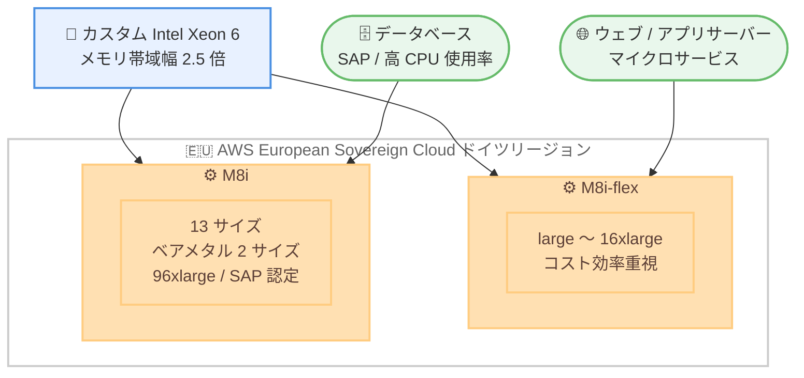

# Amazon EC2 - M8i / M8i-flex インスタンスが追加リージョンで利用可能に

**リリース日**: 2026 年 9 月 25 日
**サービス**: Amazon EC2
**機能**: M8i / M8i-flex インスタンスのリージョン拡大 (AWS European Sovereign Cloud)

📊 [このアップデートのインフォグラフィックを見る](https://takech9203.github.io/aws-news-summary/20260925-amazon-ec2-m8i-m8i-flex-thf.html)

## 概要

Amazon EC2 の汎用インスタンスである M8i および M8i-flex インスタンスが、新たに AWS European Sovereign Cloud (ドイツ) リージョンで利用可能になりました。M8i / M8i-flex は、クラウド上の同等の Intel プロセッサの中で最高のパフォーマンスと最速のメモリ帯域幅を実現する、AWS 専用のカスタム Intel Xeon 6 プロセッサを搭載しています。

M8i / M8i-flex は、前世代の Intel ベースインスタンスと比較して最大 15% 優れた価格性能と 2.5 倍のメモリ帯域幅を提供します。また、M7i / M7i-flex と比較して最大 20% 高いパフォーマンスを発揮し、ワークロード別では PostgreSQL データベースで最大 30%、NGINX ウェブアプリケーションで最大 60%、AI 深層学習レコメンデーションモデルで最大 40% の高速化が確認されています。

今回のリージョン拡大により、データ主権要件の厳しい EU の公共部門や規制産業のお客様も、AWS European Sovereign Cloud 内で最新世代の Intel ベース汎用インスタンスを利用できるようになりました。

**アップデート前の課題**

このアップデート以前に存在していた課題や制限は以下のとおりです。

- AWS European Sovereign Cloud (ドイツ) リージョンでは M8i / M8i-flex が利用できず、最新世代の Intel ベース汎用インスタンスの性能メリットを享受できなかった
- データ主権要件により AWS European Sovereign Cloud の利用が必須のお客様は、前世代インスタンスでワークロードを稼働させる必要があった
- SAP ワークロードなど高いメモリ帯域幅を必要とするワークロードで、最新のカスタム Intel Xeon 6 プロセッサを選択できなかった

**アップデート後の改善**

今回のアップデートにより可能になったことは以下のとおりです。

- AWS European Sovereign Cloud (ドイツ) リージョンで M8i / M8i-flex インスタンスを起動できるようになった
- データ主権要件を満たしながら、M7i / M7i-flex 比で最大 20% 高いパフォーマンスを利用できるようになった
- SAP 認定済みの M8i インスタンス (ベアメタル 2 サイズと 96xlarge を含む 13 サイズ) を同リージョンで選択できるようになった

## アーキテクチャ図



AWS European Sovereign Cloud (ドイツ) リージョンで利用可能になった M8i / M8i-flex インスタンスと、それぞれの主なワークロードの対応関係を示しています。

## サービスアップデートの詳細

### 主要機能

1. **カスタム Intel Xeon 6 プロセッサ**
   - AWS 専用にカスタマイズされた Intel Xeon 6 プロセッサを搭載
   - クラウド上の同等の Intel プロセッサの中で最高のパフォーマンスと最速のメモリ帯域幅を実現
   - 前世代の Intel ベースインスタンス比で 2.5 倍のメモリ帯域幅を提供

2. **大幅な性能向上**
   - 前世代の Intel ベースインスタンス比で最大 15% 優れた価格性能
   - M7i / M7i-flex 比で最大 20% 高いパフォーマンス
   - PostgreSQL データベースで最大 30% 高速
   - NGINX ウェブアプリケーションで最大 60% 高速
   - AI 深層学習レコメンデーションモデルで最大 40% 高速

3. **M8i-flex: コスト効率重視の汎用インスタンス**
   - large から 16xlarge までの一般的なサイズを提供
   - ウェブ / アプリケーションサーバー、マイクロサービス、中小規模データストア、仮想デスクトップ、エンタープライズアプリケーションなど、コンピュートリソースを常時フル活用しないワークロードの最初の選択肢

4. **M8i: フルパフォーマンスの汎用インスタンス**
   - ベアメタル 2 サイズと新しい 96xlarge を含む 13 サイズを提供
   - SAP 認定済みで、SAP ワークロードの稼働に対応
   - 大規模インスタンスサイズや継続的に高い CPU 使用率を必要とするワークロードに最適

## 技術仕様

### インスタンスファミリーの比較

| 項目 | M8i-flex | M8i |
|------|----------|-----|
| プロセッサ | カスタム Intel Xeon 6 | カスタム Intel Xeon 6 |
| サイズ展開 | large 〜 16xlarge | 13 サイズ (ベアメタル 2 サイズ、96xlarge を含む) |
| SAP 認定 | - | 認定済み |
| 主な用途 | CPU を常時フル活用しない汎用ワークロード | 高 CPU 使用率が継続する汎用ワークロード、大規模サイズが必要なワークロード |
| 位置づけ | コスト効率を重視した最初の選択肢 | フルパフォーマンスが必要な場合の選択肢 |

### 性能向上の概要

| 比較対象 / ワークロード | 向上幅 |
|------------------------|--------|
| 価格性能 (前世代 Intel ベース比) | 最大 15% 向上 |
| メモリ帯域幅 (前世代 Intel ベース比) | 2.5 倍 |
| 全体性能 (M7i / M7i-flex 比) | 最大 20% 向上 |
| PostgreSQL データベース | 最大 30% 高速 |
| NGINX ウェブアプリケーション | 最大 60% 高速 |
| AI 深層学習レコメンデーションモデル | 最大 40% 高速 |

## 設定方法

### 前提条件

1. AWS European Sovereign Cloud (ドイツ) リージョンへのアクセス権限を持つ AWS アカウント
2. EC2 インスタンスを起動するための IAM 権限
3. 起動先の VPC およびサブネットの準備

### 手順

#### ステップ 1: 利用可能なインスタンスタイプの確認

```bash
aws ec2 describe-instance-type-offerings \
  --location-type region \
  --filters "Name=instance-type,Values=m8i.*,m8i-flex.*" \
  --query "InstanceTypeOfferings[].InstanceType" \
  --output table
```

対象リージョンで利用可能な M8i / M8i-flex のインスタンスタイプ一覧を取得しています。リージョンは AWS CLI のプロファイルまたは `--region` オプションで指定します。

#### ステップ 2: M8i-flex インスタンスの起動

```bash
aws ec2 run-instances \
  --image-id ami-xxxxxxxxxxxxxxxxx \
  --instance-type m8i-flex.large \
  --subnet-id subnet-xxxxxxxxxxxxxxxxx \
  --security-group-ids sg-xxxxxxxxxxxxxxxxx \
  --key-name my-key-pair
```

指定した AMI、サブネット、セキュリティグループを使用して m8i-flex.large インスタンスを起動しています。フルパフォーマンスが必要な場合は `--instance-type m8i.large` などに変更します。

#### ステップ 3: 既存ワークロードの移行検証

既存の M7i / M7i-flex や前世代インスタンスからの移行では、以下を確認します。

- AMI が第 8 世代インスタンスの要件を満たしているか (最新のドライバー、カーネルの利用を推奨)
- アプリケーションのベンチマークを実施し、価格性能の改善を検証
- Auto Scaling グループや起動テンプレートのインスタンスタイプ設定を更新

## メリット

### ビジネス面

- **データ主権要件との両立**: AWS European Sovereign Cloud を利用する EU の公共部門や規制産業のお客様が、主権要件を満たしながら最新世代インスタンスを利用可能
- **コスト効率の向上**: 前世代の Intel ベースインスタンス比で最大 15% 優れた価格性能により、インフラコストを最適化
- **SAP ワークロードへの対応**: SAP 認定済みの M8i により、基幹システムを最新インスタンスへ移行可能

### 技術面

- **メモリ帯域幅の大幅向上**: 前世代比 2.5 倍のメモリ帯域幅により、データベースやインメモリ処理の性能が向上
- **ワークロード別の高速化**: PostgreSQL で最大 30%、NGINX で最大 60%、AI 深層学習レコメンデーションモデルで最大 40% の高速化
- **柔軟なサイズ選択**: M8i はベアメタル 2 サイズと 96xlarge を含む 13 サイズを提供し、大規模ワークロードにも対応

## デメリット・制約事項

### 制限事項

- 今回追加されたのは AWS European Sovereign Cloud (ドイツ) リージョンであり、その他のリージョンでの利用可否は公式ページで確認が必要
- M8i-flex のサイズ展開は large から 16xlarge までで、ベアメタルや 96xlarge は M8i のみの提供

### 考慮すべき点

- M8i-flex はコンピュートリソースを常時フル活用しないワークロード向けの設計のため、継続的に高い CPU 使用率が必要な場合は M8i を選択する
- 既存インスタンスからの移行時は、AMI やドライバーの互換性、アプリケーションの動作検証を事前に実施する
- リージョンごとの料金は異なるため、移行前に料金ページで確認する

## ユースケース

### ユースケース 1: EU 公共部門のウェブアプリケーション基盤

**シナリオ**: データ主権要件により AWS European Sovereign Cloud の利用が必須の政府機関が、ウェブアプリケーションとマイクロサービスの基盤を構築する。

**実装例**:
```
- m8i-flex.large 〜 m8i-flex.xlarge で NGINX ベースのウェブ層を構成
- Auto Scaling グループでトラフィックに応じてスケール
- ALB と組み合わせて可用性を確保
```

**効果**: NGINX ウェブアプリケーションで最大 60% の高速化により、少ないインスタンス数で同等のスループットを実現し、コストを削減。

### ユースケース 2: PostgreSQL データベースの性能改善

**シナリオ**: 前世代インスタンスで自己管理型 PostgreSQL を運用している企業が、性能向上とコスト最適化のために移行する。

**実装例**:
```
- m8i.4xlarge へデータベースサーバーを移行
- 2.5 倍のメモリ帯域幅を活かして共有バッファとキャッシュ性能を改善
- 移行前後で pgbench によるベンチマークを実施
```

**効果**: PostgreSQL で最大 30% の高速化により、クエリレイテンシーを改善しながら価格性能を最大 15% 向上。

### ユースケース 3: SAP ワークロードの主権クラウドでの稼働

**シナリオ**: EU の規制産業の企業が、SAP アプリケーションをデータ主権要件を満たす環境で最新インスタンス上に稼働させる。

**実装例**:
```
- SAP 認定済みの M8i インスタンス (大規模サイズまたはベアメタル) を選択
- AWS European Sovereign Cloud 内で SAP アプリケーション層を構成
- 高いメモリ帯域幅を活かしてバッチ処理時間を短縮
```

**効果**: 主権要件を満たしつつ、M7i 比で最大 20% の性能向上により SAP ワークロードの処理能力を強化。

## 料金

M8i / M8i-flex インスタンスは、オンデマンド、Savings Plans、スポットインスタンスなどの通常の EC2 購入オプションで利用できます。リージョンおよびインスタンスサイズごとの具体的な料金は、EC2 料金ページで確認してください。

前世代の Intel ベースインスタンスと比較して最大 15% 優れた価格性能を提供するため、同等のワークロードをより低い実効コストで稼働できます。

## 利用可能リージョン

今回のアップデートで、以下のリージョンで新たに利用可能になりました。

- AWS European Sovereign Cloud (ドイツ)

利用可能なリージョンの全一覧は、[M8i / M8i-flex インスタンスページ](https://aws.amazon.com/ec2/instance-types/m8i/) で確認してください。

## 関連サービス・機能

- **Amazon EC2 M7i / M7i-flex**: 前世代の Intel ベース汎用インスタンス。M8i / M8i-flex は最大 20% 高いパフォーマンスを提供
- **AWS European Sovereign Cloud**: EU のデータ主権要件に対応する独立したクラウド環境。今回のリージョン拡大の対象
- **EC2 Auto Scaling / 起動テンプレート**: インスタンスタイプの更新により、既存のスケーリング構成を M8i / M8i-flex へ移行可能
- **AWS Compute Optimizer**: 既存ワークロードに対する最適なインスタンスタイプの推奨に活用可能

## 参考リンク

- 📊 [インフォグラフィック](https://takech9203.github.io/aws-news-summary/20260925-amazon-ec2-m8i-m8i-flex-thf.html)
- [公式発表 (What's New)](https://aws.amazon.com/about-aws/whats-new/2026/09/amazon-ec2-m8i-m8i-flex-thf/)
- [AWS Blog: New general purpose Amazon EC2 M8i and M8i-flex instances](https://aws.amazon.com/blogs/aws/new-general-purpose-amazon-ec2-m8i-and-m8i-flex-instances-are-now-available/)
- [M8i / M8i-flex インスタンスページ](https://aws.amazon.com/ec2/instance-types/m8i/)
- [Amazon EC2 料金ページ](https://aws.amazon.com/ec2/pricing/)

## まとめ

M8i / M8i-flex インスタンスが AWS European Sovereign Cloud (ドイツ) リージョンに拡大し、データ主権要件の厳しいお客様も最新のカスタム Intel Xeon 6 プロセッサによる高い性能とコスト効率を利用できるようになりました。同リージョンで前世代インスタンスや M7i / M7i-flex を利用中の場合は、ベンチマークを実施した上で M8i / M8i-flex への移行を検討することを推奨します。
