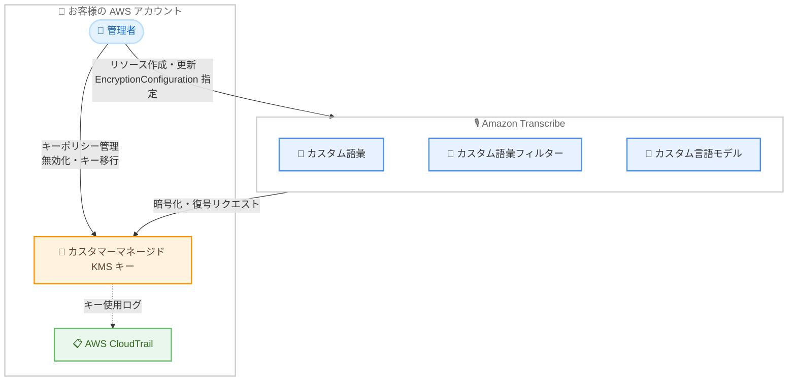

# Amazon Transcribe - カスタムリソースのカスタマーマネージド KMS キー対応

**リリース日**: 2026 年 9 月 25 日
**サービス**: Amazon Transcribe
**機能**: カスタム語彙、カスタム語彙フィルター、カスタム言語モデルの保存時暗号化におけるカスタマーマネージド AWS KMS キーのサポート

📊 [このアップデートのインフォグラフィックを見る](https://takech9203.github.io/aws-news-summary/20260925-amazon-transcribe.html)

## 概要

Amazon Transcribe が、カスタム語彙 (Custom Vocabulary)、カスタム語彙フィルター (Custom Vocabulary Filter)、カスタム言語モデル (Custom Language Model、CLM) の保存時暗号化に、カスタマーマネージド AWS KMS キーを使用できるようになりました。これまでこれらのカスタムリソースは常に AWS 所有キーで暗号化されていましたが、今回のアップデートにより、リソースの作成時または更新時にお客様自身の対称 KMS キーを指定できます。

カスタマーマネージドキーを使用することで、キーのアクセス許可を自ら管理し、どのプリンシパルやサービスがカスタムリソースを暗号化・復号できるかを正確に制御できます。すべてのキー使用は AWS CloudTrail に記録されるため、コンプライアンス要件や監査要件への対応が容易になります。また、キーの無効化や別のキーへの移行も任意のタイミングで実行できます。

本機能はオプトイン方式です。キーを指定しない場合、カスタムリソースは従来どおり AWS 所有キーで暗号化されるため、既存の利用者に必須の対応はありません。金融、医療、公共など、暗号化キーの自己管理が求められる規制業界のユーザーに特に有用なアップデートです。

**アップデート前の課題**

- 以前はカスタム語彙、カスタム語彙フィルター、カスタム言語モデルは常に AWS 所有キーで暗号化され、お客様がキーを選択できなかった
- キーの使用状況を CloudTrail で監査できず、組織のコンプライアンス要件 (キーの自己管理、使用ログの取得など) を満たせないケースがあった
- キーのアクセス許可を制御したり、キーを無効化してリソースへのアクセスを即時に遮断する手段がなかった

**アップデート後の改善**

- リソースの作成・更新時に `EncryptionConfiguration` パラメータで独自の対称 KMS キーを指定できるようになった
- キーポリシーによりカスタムリソースの暗号化・復号を実行できるプリンシパルを厳密に制御できるようになった
- すべてのキー使用が AWS CloudTrail に記録され、監査・コンプライアンス対応が可能になった
- キーの無効化や別キーへの移行 (CLM では新しい `UpdateLanguageModel` API を使用) が可能になった

## アーキテクチャ図



カスタムリソースの作成・更新時にカスタマーマネージド KMS キーを指定すると、Amazon Transcribe がそのキーでリソースを暗号化・復号し、すべてのキー使用が CloudTrail に記録される構成を示しています。

## サービスアップデートの詳細

### 主要機能

1. **カスタムリソースのカスタマーマネージドキー暗号化**
   - カスタム語彙、カスタム語彙フィルター、カスタム言語モデルの 3 種類のリソースが対象
   - 作成 API (`CreateVocabulary`、`CreateVocabularyFilter`、`CreateLanguageModel`) と更新 API に `EncryptionConfiguration` パラメータが追加され、対称 KMS キーと暗号化コンテキストを指定可能
   - キーを指定しない場合は従来どおり AWS 所有キーで暗号化 (オプトイン方式)

2. **キーアクセスの完全な制御**
   - KMS キーポリシーにより、暗号化・復号を実行できるプリンシパルとサービスを厳密に制御
   - すべてのキー使用が AWS CloudTrail に記録され、監査証跡として利用可能
   - キーの無効化により、必要に応じてリソースへのアクセスを即時に遮断可能

3. **キーの移行 (新 API: UpdateLanguageModel)**
   - カスタム言語モデルの暗号化キーを別の KMS キーに移行するための `UpdateLanguageModel` API が新規追加
   - カスタム語彙とカスタム語彙フィルターは既存の `UpdateVocabulary`、`UpdateVocabularyFilter` API で `EncryptionConfiguration` を更新可能

4. **取得系 API での暗号化設定の確認**
   - `GetVocabulary`、`GetVocabularyFilter`、`DescribeLanguageModel`、`ListLanguageModels` のレスポンスに `EncryptionConfiguration` が追加され、各リソースの暗号化設定を確認可能

## 技術仕様

### EncryptionConfiguration パラメータ

| 項目 | 詳細 |
|------|------|
| `KMSKey` | 暗号化に使用する対称 KMS キー (キー ID、キー ARN、エイリアスなど) |
| `KMSEncryptionContext` | 暗号化コンテキストとして使用するキーと値のペア (オプション) |
| `DataAccessRoleArn` | S3 の入力ファイルへのアクセス権限を持つ IAM ロールの ARN。`EncryptionConfiguration` を指定する場合、このロールには指定した KMS キーへのアクセス権限も必要 |
| 対応キータイプ | 対称 AWS KMS キーのみ |
| デフォルト動作 | キー未指定時は AWS 所有キーで暗号化 |

### API 変更履歴

| 日付 | サービス | 変更内容 |
|------|----------|----------|
| 2026/09/18 | [Amazon Transcribe Service](https://awsapichanges.com/archive/changes/cfdf90-transcribe.html) | 1 new 9 updated api methods - `UpdateLanguageModel` が新規追加。`CreateVocabulary`、`UpdateVocabulary`、`CreateVocabularyFilter`、`UpdateVocabularyFilter`、`CreateLanguageModel`、`GetVocabulary`、`GetVocabularyFilter`、`DescribeLanguageModel`、`ListLanguageModels` に `EncryptionConfiguration` が追加 |

### リクエスト例 (CreateVocabulary)

```json
{
  "VocabularyName": "my-custom-vocabulary",
  "LanguageCode": "ja-JP",
  "VocabularyFileUri": "s3://amzn-s3-demo-bucket/my-vocab-file.txt",
  "DataAccessRoleArn": "arn:aws:iam::111122223333:role/TranscribeDataAccessRole",
  "EncryptionConfiguration": {
    "KMSKey": "arn:aws:kms:ap-northeast-1:111122223333:key/1234abcd-12ab-34cd-56ef-1234567890ab",
    "KMSEncryptionContext": {
      "Department": "CustomerService"
    }
  }
}
```

## 設定方法

### 前提条件

1. Amazon Transcribe のカスタムリソース (カスタム語彙、カスタム語彙フィルター、カスタム言語モデル) を作成・更新する権限を持つこと
2. 対称のカスタマーマネージド AWS KMS キーが作成済みであること
3. `DataAccessRoleArn` に指定する IAM ロールが、入力ファイルを格納する S3 バケットと指定する KMS キーの両方にアクセスできること

### 手順

#### ステップ 1: カスタマーマネージド KMS キーの作成

```bash
aws kms create-key \
  --description "Key for Amazon Transcribe custom resources" \
  --key-usage ENCRYPT_DECRYPT \
  --key-spec SYMMETRIC_DEFAULT
```

Amazon Transcribe のカスタムリソース暗号化用に対称 KMS キーを作成します。既存の対称キーがある場合はこのステップは不要です。

#### ステップ 2: KMS キーポリシーと IAM ロールの設定

```bash
aws kms put-key-policy \
  --key-id 1234abcd-12ab-34cd-56ef-1234567890ab \
  --policy-name default \
  --policy file://key-policy.json
```

キーポリシーで、Transcribe のカスタムリソースを操作するプリンシパルおよび `DataAccessRoleArn` に指定するロールに対して、キーの使用 (暗号化・復号) を許可します。指定したロールに適切な権限がない場合、リソースの作成リクエストは失敗します。

#### ステップ 3: カスタムリソースの作成時にキーを指定

```bash
aws transcribe create-vocabulary \
  --vocabulary-name my-custom-vocabulary \
  --language-code ja-JP \
  --vocabulary-file-uri s3://amzn-s3-demo-bucket/my-vocab-file.txt \
  --data-access-role-arn arn:aws:iam::111122223333:role/TranscribeDataAccessRole \
  --encryption-configuration KMSKey=arn:aws:kms:ap-northeast-1:111122223333:key/1234abcd-12ab-34cd-56ef-1234567890ab
```

カスタム語彙の作成時に `--encryption-configuration` でカスタマーマネージド KMS キーを指定します。これにより語彙のアーティファクトが指定したキーで保存時に暗号化されます。

#### ステップ 4: 既存リソースのキー移行 (必要に応じて)

```bash
aws transcribe update-language-model \
  --model-name my-custom-language-model \
  --data-access-role-arn arn:aws:iam::111122223333:role/TranscribeDataAccessRole \
  --encryption-configuration KMSKey=arn:aws:kms:ap-northeast-1:111122223333:key/new-key-id
```

新しい `UpdateLanguageModel` API により、既存のカスタム言語モデルの暗号化を別の KMS キーに移行します。カスタム語彙とカスタム語彙フィルターは、それぞれ `update-vocabulary` と `update-vocabulary-filter` の `--encryption-configuration` で同様に更新できます。

## メリット

### ビジネス面

- **コンプライアンス対応の強化**: 暗号化キーの自己管理が求められる規制業界 (金融、医療、公共など) でも、Transcribe のカスタムリソースを利用しやすくなる
- **監査性の向上**: すべてのキー使用が CloudTrail に記録されるため、誰がいつカスタムリソースにアクセスしたかを追跡でき、監査対応が容易になる
- **リスク管理の強化**: 情報漏えいの懸念が生じた場合など、キーを無効化することでカスタムリソースへのアクセスを即時に遮断できる

### 技術面

- **細かいアクセス制御**: KMS キーポリシーにより、暗号化・復号を実行できるプリンシパルとサービスを厳密に制御できる
- **暗号化コンテキストのサポート**: `KMSEncryptionContext` により、追加の認証済みデータを使用したより厳密な暗号化制御が可能
- **柔軟なキーライフサイクル管理**: キーのローテーション、無効化、別キーへの移行を組織のポリシーに合わせて実施できる

## デメリット・制約事項

### 制限事項

- 対称 KMS キーのみサポートされ、非対称キーは使用できない
- `EncryptionConfiguration` を指定する場合、`DataAccessRoleArn` のロールに KMS キーへのアクセス権限が必要であり、権限が不足しているとリクエストが失敗する
- カスタム言語モデルのキー移行には新しい `UpdateLanguageModel` API を使用する必要がある

### 考慮すべき点

- カスタマーマネージドキーには AWS KMS の料金 (キーの保管料金と API リクエスト料金) が発生する
- キーを無効化または削除すると、そのキーで暗号化されたカスタムリソースを使用する文字起こしジョブが失敗する可能性があるため、キーのライフサイクル管理は慎重に行う必要がある
- キーポリシーの設定ミスにより正当なワークロードがリソースにアクセスできなくなるリスクがあるため、最小権限の原則に基づいた設計と十分なテストが必要

## ユースケース

### ユースケース 1: 金融機関のコールセンター文字起こし基盤

**シナリオ**: 金融機関がコールセンターの通話録音を Transcribe で文字起こしし、金融商品名を登録したカスタム語彙を使用している。社内のセキュリティポリシーで、機密データに関連するすべてのリソースをカスタマーマネージドキーで暗号化することが義務付けられている。

**実装例**:
```bash
aws transcribe create-vocabulary \
  --vocabulary-name financial-products-vocab \
  --language-code ja-JP \
  --vocabulary-file-uri s3://amzn-s3-demo-bucket/financial-terms.txt \
  --data-access-role-arn arn:aws:iam::111122223333:role/TranscribeRole \
  --encryption-configuration KMSKey=alias/financial-transcribe-key
```

**効果**: カスタム語彙を含むすべての関連リソースを自社管理キーで暗号化し、社内セキュリティポリシーと金融規制のコンプライアンス要件を満たせる。

### ユースケース 2: 医療機関での専門用語カスタム言語モデルの保護

**シナリオ**: 医療機関が診療記録の音声入力に Transcribe を利用し、医療用語に特化したカスタム言語モデルをトレーニングしている。トレーニングデータに機微な情報が含まれる可能性があるため、モデル自体の暗号化キーを自己管理し、使用状況を監査したい。

**実装例**:
```bash
aws transcribe create-language-model \
  --language-code ja-JP \
  --base-model-name WideBand \
  --model-name medical-clm \
  --input-data-config S3Uri=s3://amzn-s3-demo-bucket/training-data/,DataAccessRoleArn=arn:aws:iam::111122223333:role/TranscribeRole \
  --encryption-configuration KMSKey=alias/medical-clm-key
```

**効果**: カスタム言語モデルを自己管理キーで暗号化し、CloudTrail のログでキー使用を継続的に監査することで、医療情報保護の要件に対応できる。

### ユースケース 3: 定期的なキーローテーションポリシーへの対応

**シナリオ**: 企業のセキュリティポリシーにより、暗号化キーを定期的に新しいキーへ移行することが求められている。既存のカスタム言語モデルの暗号化キーを、運用を止めずに新しいキーへ切り替えたい。

**実装例**:
```bash
aws transcribe update-language-model \
  --model-name medical-clm \
  --data-access-role-arn arn:aws:iam::111122223333:role/TranscribeRole \
  --encryption-configuration KMSKey=alias/medical-clm-key-2026
```

**効果**: 新しい `UpdateLanguageModel` API により、モデルを再作成することなく暗号化キーを移行でき、キーローテーションポリシーへの準拠を維持できる。

## 料金

この機能自体に Amazon Transcribe の追加料金はありません。ただし、カスタマーマネージド KMS キーを使用する場合、AWS KMS の標準料金 (キーの保管料金および暗号化・復号 API リクエストの料金) が発生します。AWS 所有キーを使用する場合 (デフォルト) は KMS の料金は発生しません。

詳細は [AWS KMS 料金ページ](https://aws.amazon.com/kms/pricing/) および [Amazon Transcribe 料金ページ](https://aws.amazon.com/transcribe/pricing/) を参照してください。

## 利用可能リージョン

Amazon Transcribe が提供されているすべての AWS リージョンで利用可能です (東京、大阪リージョンを含む)。

## 関連サービス・機能

- **AWS KMS**: カスタマーマネージドキーの作成、キーポリシー管理、ローテーション、無効化を行う暗号化キー管理サービス
- **AWS CloudTrail**: KMS キーの使用履歴を記録し、カスタムリソースへのアクセスの監査証跡を提供
- **AWS IAM**: `DataAccessRoleArn` に指定するロールの権限管理により、S3 入力ファイルと KMS キーへのアクセスを制御
- **Amazon S3**: カスタム語彙ファイルやカスタム言語モデルのトレーニングデータの格納先。文字起こし結果の出力には従来から `OutputEncryptionKMSKeyId` による KMS 暗号化が利用可能

## 参考リンク

- 📊 [インフォグラフィック](https://takech9203.github.io/aws-news-summary/20260925-amazon-transcribe.html)
- [公式発表 (What's New)](https://aws.amazon.com/about-aws/whats-new/2026/09/amazon-transcribe/)
- [Amazon Transcribe 開発者ガイド](https://docs.aws.amazon.com/transcribe/latest/dg/what-is.html)
- [CreateVocabulary API リファレンス](https://docs.aws.amazon.com/transcribe/latest/APIReference/API_CreateVocabulary.html)
- [AWS API Changes - Amazon Transcribe](https://awsapichanges.com/archive/changes/cfdf90-transcribe.html)
- [Amazon Transcribe 料金ページ](https://aws.amazon.com/transcribe/pricing/)

## まとめ

Amazon Transcribe のカスタム語彙、カスタム語彙フィルター、カスタム言語モデルをカスタマーマネージド KMS キーで暗号化できるようになり、キーのアクセス制御、CloudTrail による監査、キーの無効化・移行が可能になりました。オプトイン方式のため既存環境への影響はありませんが、暗号化キーの自己管理が求められる組織では、`EncryptionConfiguration` の指定と `DataAccessRoleArn` ロールへの KMS 権限付与を検討することを推奨します。
