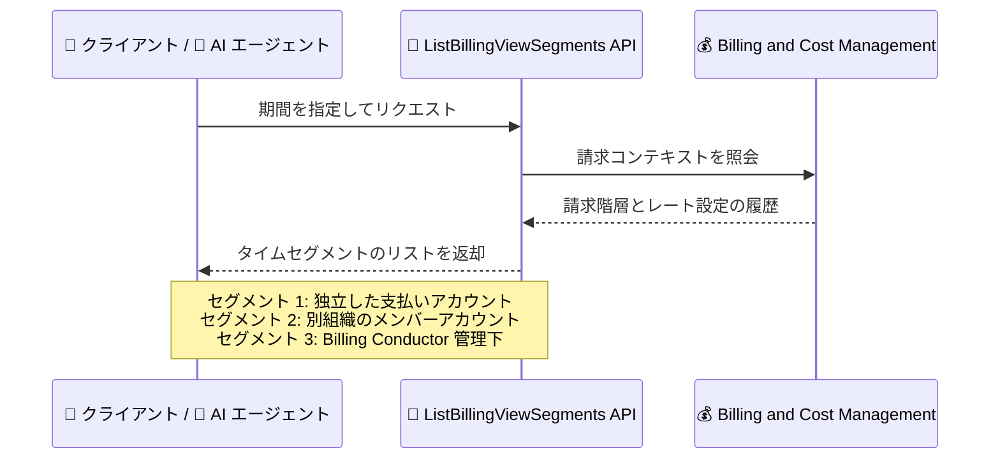

# AWS Billing and Cost Management - ListBillingViewSegments API による請求コンテキストの取得

**リリース日**: 2026 年 9 月 25 日
**サービス**: AWS Billing and Cost Management
**機能**: ListBillingViewSegments API (請求コンテキストの取得)

📊 [このアップデートのインフォグラフィックを見る](https://takech9203.github.io/aws-news-summary/20260925-aws-billing-and-cost-management-billing-context-api.html)

## 概要

AWS Billing and Cost Management に、アカウントの請求コンテキスト (billing context) を取得できる新しい API「ListBillingViewSegments」が追加されました。この API は、指定した期間におけるアカウントの請求階層上の位置づけ (管理アカウント、メンバーアカウント、AWS Billing Conductor の請求グループプライマリアカウント)、請求関係を管理していたアカウント、コストデータに適用されるレート設定 (billable または pro forma) を返します。

請求コンテキストは期間の途中で変化することがあります。たとえば、あるアカウントが独立した支払いアカウントとして開始し、その後別の AWS Organizations 組織にメンバーアカウントとして参加し、さらに支払いアカウントが AWS Billing Conductor で請求を管理するようになった場合、その期間全体を指定して API を呼び出すと 3 つのタイムセグメントが返され、それぞれに有効期間と当時のアカウント関係・設定が含まれます。

この API はコストや使用量データそのものは返さず、請求コンテキストのみを返します。直接呼び出すことも、AI エージェント経由で呼び出すこともでき、コスト分析ツールや FinOps の自動化基盤が「このコストデータはどの請求関係・レート設定のもとで生成されたのか」をプログラムで正確に判断できるようになります。

**アップデート前の課題**

- コストデータを解釈する際に、アカウントがいつどの組織に所属していたか、どのアカウントが請求を管理していたかをプログラムで確認する標準的な方法がなかった
- 期間の途中で組織移動や AWS Billing Conductor の適用が発生した場合、コストデータに適用されたレート設定 (billable / pro forma) の切り替わりタイミングを把握しづらかった
- コスト分析ツールや AI エージェントが請求階層の変遷を考慮した正確な分析を行うには、手動での確認や個別の実装が必要だった

**アップデート後の改善**

- 指定期間におけるアカウントの請求階層上の位置づけと請求関係を API で一括取得できるようになった
- 請求コンテキストの変化がタイムセグメントとして分割して返されるため、期間途中の組織移動やレート設定の変更を正確に追跡できるようになった
- API を直接または AI エージェント経由で呼び出せるため、コスト分析の自動化やエージェントベースの FinOps ワークフローに組み込めるようになった

## アーキテクチャ図



指定期間内で請求コンテキストが変化した場合、API は期間をタイムセグメントに分割し、各セグメントに有効期間・アカウント関係・レート設定を含めて返します。

## サービスアップデートの詳細

### 主要機能

1. **請求階層情報の取得**
   - アカウントが管理アカウント、メンバーアカウント、請求グループプライマリアカウントのいずれとして位置づけられているかを取得できる
   - 各セグメントには管理アカウント ID (`managementAccountId`)、請求グループプライマリアカウント ID (`billingGroupPrimaryAccountId`)、請求転送アカウント ID (`billingTransferAccountId`) が含まれる
   - どのアカウントが自アカウントの請求関係を管理していたかを特定できる

2. **レート設定 (ドメイン) の識別**
   - 各セグメントの `domain` フィールドで、コストデータに適用されるレート設定を識別できる
   - `BILLABLE`: 実際の請求レートが適用されるデータ
   - `PRO_FORMA`: AWS Billing Conductor によるプロフォーマ (仮計算) レートが適用されるデータ

3. **タイムセグメントによる期間分割**
   - 請求コンテキストが期間の途中で変化した場合、リクエスト期間を複数のセグメントに分割して返す
   - 各セグメントには有効期間 (`beginDateInclusive` / `endDateExclusive`) が含まれる
   - 非表示 (hidden) のセグメントはレスポンスから除外されるため、返されるセグメントがリクエスト期間全体をカバーしない場合がある

4. **AI エージェントからの利用**
   - API は直接呼び出すことも、AI エージェント経由で呼び出すこともできる
   - エージェントがコストデータを解釈する際の前提情報として請求コンテキストを自動取得するといった使い方が可能

## 技術仕様

### ListBillingViewSegments API

| 項目 | 詳細 |
|------|------|
| リクエストパラメータ `arn` | 照会する請求ビューの ARN。省略時は呼び出し元の `PRIMARY` 請求ビューを使用。プライマリ請求ビューのみサポートし、カスタム請求ビューは非対応 |
| リクエストパラメータ `timeRange` | 照会する請求期間。省略時は現在の請求期間 (UTC の暦月) を使用 |
| リクエストパラメータ `maxResults` | ページあたりの件数。1〜100、デフォルト 100 |
| リクエストパラメータ `nextToken` | ページネーション用トークン |
| レスポンス `items[].domain` | `BILLABLE` または `PRO_FORMA` |
| レスポンス `items[].managementAccountId` | 所属組織の管理アカウント ID |
| レスポンス `items[].billingGroupPrimaryAccountId` | Billing Conductor 請求グループのプライマリアカウント ID |
| レスポンス `items[].billingTransferAccountId` | 請求転送アカウント ID |
| レスポンス `items[].timeRange` | セグメントの有効期間 |
| 主なエラー | `AccessDeniedException`、`BillingViewHealthStatusException`、`ResourceNotFoundException`、`ThrottlingException`、`ValidationException` |

### API 変更履歴

| 日付 | サービス | 変更内容 |
|------|----------|----------|
| 2026/09/23 | [AWS Billing](https://awsapichanges.com/archive/changes/93a35b-billing.html) | 1 new api method - ListBillingViewSegments API を追加。指定した請求ビュー ARN と期間に対する請求ビューセグメント情報を返し、アカウントの請求コンテキストをプログラムで判断可能に |

### レスポンス例

```json
{
  "items": [
    {
      "domain": "BILLABLE",
      "managementAccountId": "111111111111",
      "timeRange": {
        "beginDateInclusive": 1756684800,
        "endDateExclusive": 1757894400
      }
    },
    {
      "domain": "PRO_FORMA",
      "managementAccountId": "222222222222",
      "billingGroupPrimaryAccountId": "333333333333",
      "timeRange": {
        "beginDateInclusive": 1757894400,
        "endDateExclusive": 1759276800
      }
    }
  ]
}
```

## 設定方法

### 前提条件

1. AWS CLI v2 または各言語の AWS SDK が最新バージョンであること
2. 呼び出し元の IAM プリンシパルに `billing:ListBillingViewSegments` 相当の権限が付与されていること
3. 照会対象の請求ビューがプライマリ請求ビューであること (カスタム請求ビューは非対応)

### 手順

#### ステップ 1: 現在の請求期間の請求コンテキストを取得

```bash
aws billing list-billing-view-segments
```

パラメータを省略すると、呼び出し元アカウントのプライマリ請求ビューについて、現在の請求期間 (UTC の暦月) のセグメントを取得します。

#### ステップ 2: 期間を指定して取得

```bash
aws billing list-billing-view-segments \
  --time-range beginDateInclusive=1756684800,endDateExclusive=1759276800
```

`--time-range` で照会期間を Unix エポック秒で指定します。期間中に請求コンテキストの変化があった場合、複数のセグメントが返されます。

#### ステップ 3: 請求ビュー ARN を指定して取得

```bash
aws billing list-billing-view-segments \
  --arn "arn:aws:billing::123456789012:billingview/primary"
```

`--arn` で対象のプライマリ請求ビューを明示的に指定します。ページネーションが必要な場合はレスポンスの `nextToken` を次回リクエストの `--next-token` に指定します。

## メリット

### ビジネス面

- **コスト分析の正確性向上**: コストデータがどの請求関係・レート設定のもとで生成されたかを把握したうえで分析でき、組織移動をまたぐ期間の誤った解釈を防止できる
- **FinOps 業務の効率化**: 組織構成や請求管理の変遷を手動で調査する必要がなくなり、請求関連の問い合わせ対応や監査の工数を削減できる
- **追加コストなし**: API の利用に追加料金は発生しない

### 技術面

- **プログラムによる請求コンテキストの判別**: コスト管理ツールや社内システムが請求階層とレート設定を API で自動判別できる
- **タイムセグメントによる変化点の追跡**: 期間途中の組織移動や Billing Conductor 適用のタイミングを、セグメントの有効期間から正確に特定できる
- **AI エージェント連携**: エージェントベースのコスト分析ワークフローに組み込み、コストデータ解釈の前提情報として活用できる

## デメリット・制約事項

### 制限事項

- コストおよび使用量データそのものは返さない (請求コンテキストのみ)
- プライマリ請求ビューのみサポートし、カスタム請求ビューは指定できない
- 非表示のセグメントはレスポンスから除外されるため、返されるセグメントがリクエスト期間全体をカバーしない場合がある
- 請求ビューが `HEALTHY` 以外の状態の場合、`BillingViewHealthStatusException` により操作が失敗することがある

### 考慮すべき点

- コストや使用量の実データが必要な場合は、Cost Explorer API や Data Exports など既存の仕組みと組み合わせる必要がある
- `timeRange` は Unix エポック秒で指定するため、請求期間 (暦月) との対応付けに注意が必要
- 1 ページあたり最大 100 セグメントのため、長期間を照会する場合はページネーション処理を実装する

## ユースケース

### ユースケース 1: 組織移動をまたぐコスト分析の前処理

**シナリオ**: あるメンバーアカウントが四半期の途中で別の AWS Organizations 組織に移動した。四半期全体のコストレポートを作成する際に、どの期間がどの管理アカウントの請求下にあったかを正確に反映したい。

**実装例**:
```bash
aws billing list-billing-view-segments \
  --time-range beginDateInclusive=1751328000,endDateExclusive=1759276800
```

**効果**: セグメントごとの `managementAccountId` と有効期間をもとに、コストデータを請求関係の変化点で正しく区切って集計でき、レポートの正確性が向上する。

### ユースケース 2: Billing Conductor 環境でのレート設定の自動判別

**シナリオ**: AWS Billing Conductor を利用してエンドカスタマー向けにプロフォーマレートで請求しているリセラーが、コストデータに適用されているレート設定が billable か pro forma かをツール側で自動判別したい。

**実装例**:
```python
import boto3

client = boto3.client("billing")
response = client.list_billing_view_segments()
for segment in response["items"]:
    print(segment["domain"], segment.get("billingGroupPrimaryAccountId"))
```

**効果**: セグメントの `domain` フィールドから `PRO_FORMA` / `BILLABLE` を判別し、請求グループのプライマリアカウントも特定できるため、リセラーの請求処理を自動化できる。

### ユースケース 3: AI エージェントによる請求問い合わせ対応

**シナリオ**: 社内の FinOps チームが AI エージェントを使ってコスト関連の問い合わせに対応しており、「先月のこのアカウントの請求はどこが管理していたか」といった質問に自動回答させたい。

**実装例**:
```
エージェントのツールとして ListBillingViewSegments を登録し、
対象期間を指定して請求コンテキストを取得したうえで、
セグメント情報をもとに回答を生成する
```

**効果**: エージェントが請求階層とレート設定を根拠付きで回答できるようになり、FinOps チームの一次対応工数を削減できる。

## 料金

ListBillingViewSegments API の利用に追加料金は発生しません。

## 利用可能リージョン

すべての商用 AWS リージョンで利用できます。

## 関連サービス・機能

- **AWS Organizations**: 管理アカウント・メンバーアカウントの階層を構成するサービス。本 API はこの階層上の位置づけの変遷を返す
- **AWS Billing Conductor**: プロフォーマレートによる請求グループを構成するサービス。本 API は請求グループプライマリアカウントと `PRO_FORMA` ドメインを識別できる
- **AWS Cost Explorer / Data Exports**: コストと使用量の実データを提供する機能。本 API の請求コンテキストと組み合わせることで正確なコスト分析が可能

## 参考リンク

- 📊 [インフォグラフィック](https://takech9203.github.io/aws-news-summary/20260925-aws-billing-and-cost-management-billing-context-api.html)
- [公式発表 (What's New)](https://aws.amazon.com/about-aws/whats-new/2026/09/aws-billing-and-cost-management-billing-context-api/)
- [ListBillingViewSegments API リファレンス](https://docs.aws.amazon.com/aws-cost-management/latest/APIReference/API_billing_ListBillingViewSegments.html)
- [API 変更履歴 (awsapichanges.com)](https://awsapichanges.com/archive/changes/93a35b-billing.html)

## まとめ

ListBillingViewSegments API により、アカウントの請求階層・請求関係・レート設定の変遷をプログラムで正確に取得できるようになりました。組織移動や AWS Billing Conductor を利用している環境でコスト分析ツールや AI エージェントを運用している場合は、コストデータ解釈の前提情報としてこの API の組み込みを検討することを推奨します。
