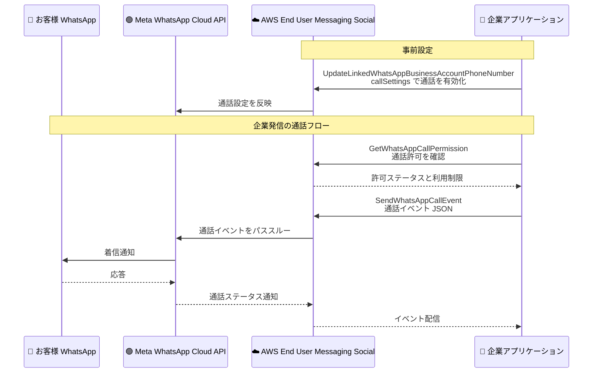

# AWS End User Messaging - WhatsApp 音声通話サポート

**リリース日**: 2026 年 9 月 25 日
**サービス**: AWS End User Messaging (Social)
**機能**: WhatsApp 上での音声通話 (WhatsApp Calling) のサポート

📊 [このアップデートのインフォグラフィックを見る](https://takech9203.github.io/aws-news-summary/20260925-aws-end-user-messaging-voice-calling-whatsapp.html)

## 概要

AWS End User Messaging が、WhatsApp 上での音声通話 (WhatsApp Calling) をサポートしました。企業はメッセージングで既に使用している認証済みビジネスアイデンティティ (WhatsApp ビジネス電話番号) をそのまま使い、WhatsApp 内でお客様と音声通話を発信・受信できるようになりました。チャットスレッドから音声通話へ、別のチャネルに切り替えることなくシームレスに移行できます。

音声通話は双方向で機能します。お客様は WhatsApp チャット内から企業に発信でき、企業は事前に許可を得たお客様に発信できます。通話の有効化と管理は、登録済みの WhatsApp ビジネス電話番号に対して AWS End User Messaging コンソールまたは API から行えます。営業時間や休日スケジュールの設定、通話ボタンの表示制御、発信前の通話許可の確認など、電話番号ごとにきめ細かな制御が可能です。

カスタマーサポート、予約確認、本人確認など、テキストだけでは解決が難しいコミュニケーションを WhatsApp という単一チャネル内で完結できるため、コンタクトセンターやカスタマーエンゲージメント基盤を構築するユーザーに有用なアップデートです。

**アップデート前の課題**

- 以前は AWS End User Messaging Social で扱えるのはテキスト・メディア・インタラクティブメッセージなどのメッセージングのみで、音声通話には対応していなかった
- チャットで解決できない問い合わせを音声で対応する場合、電話番号を案内して通常の電話回線や別の通話アプリに誘導する必要があり、会話のコンテキストが分断されていた
- 別チャネルからの着信は WhatsApp の認証済みビジネスアイデンティティと紐付かないため、お客様が発信者を信頼しにくかった

**アップデート後の改善**

- WhatsApp チャットから離れることなく、同じ会話の流れで音声通話を開始できるようになった
- メッセージングと同じ認証済みビジネス電話番号で発着信できるため、お客様は通話相手が正規の企業であることを確認できるようになった
- `UpdateLinkedWhatsAppBusinessAccountPhoneNumber` API の `callSettings` により、通話の有効化、営業時間、通話アイコンの表示制御を電話番号単位で管理できるようになった
- `GetWhatsAppCallPermission` API で発信前にお客様の通話許可の状態と利用制限を確認できるようになった

## アーキテクチャ図



企業アプリケーションが AWS End User Messaging Social の API を通じて通話設定・許可確認・通話イベント送信を行い、AWS End User Messaging が Meta の WhatsApp Calling API へイベントをパススルーする流れを示しています。

## サービスアップデートの詳細

### 主要機能

1. **双方向の音声通話**
   - お客様は WhatsApp チャット内の通話ボタンから企業に発信可能 (ユーザー起点の通話)
   - 企業は通話許可を付与したお客様に発信可能 (ビジネス起点の通話)
   - メッセージングで使用している認証済みビジネス電話番号をそのまま利用し、チャットから通話へシームレスに移行

2. **電話番号単位の通話設定管理**
   - WhatsApp Business Account (WABA) 内の電話番号ごとに通話のオン・オフを制御
   - タイムゾーン、曜日ごとの営業時間 (`weeklyOperatingHours`)、休日スケジュール (`holidaySchedule`) を設定し、通話を受け付ける時間帯を制御
   - WhatsApp ユーザーに通話ボタンを表示するかどうか (`callIconVisibility`) を制御

3. **通話許可の事前確認**
   - `GetWhatsAppCallPermission` API で、発信前に対象ユーザーの許可ステータスと有効期限を確認
   - 実行可能なアクションと期間ごとの利用上限 (`maxAllowed`、`currentUsage`) も取得可能
   - Meta の要件により、ユーザーが事前に許可を付与した場合のみビジネス起点の通話が可能

4. **Meta Calling API へのイベントパススルー**
   - `SendWhatsAppCallEvent` API で通話の接続・終了などのイベントを送信
   - 通話イベントは Meta の Calling API が定義する JSON 形式で、AWS End User Messaging Social が変更せずに Meta へパススルー
   - レスポンスとして Meta が割り当てた通話 ID (`callId`) を取得

## 技術仕様

### 通話設定 (callSettings) の構成要素

| 項目 | 詳細 |
|------|------|
| `callEnabled` | 電話番号での通話機能の有効・無効 |
| `callHours` | タイムゾーン、曜日ごとの営業時間、休日スケジュールの設定 |
| `callIconVisibility` | WhatsApp ユーザーへの通話ボタン表示の制御 |
| `callbackPermissionStatus` | コールバック許可のステータス |

### 新規・更新 API

| API | 種別 | 内容 |
|-----|------|------|
| `GetWhatsAppCallPermission` | 新規 | ユーザーの通話許可ステータス、有効期限、利用制限を取得 |
| `SendWhatsAppCallEvent` | 新規 | 通話イベント (JSON) を Meta の Calling API へ送信し、通話 ID を取得 |
| `UpdateLinkedWhatsAppBusinessAccountPhoneNumber` | 新規 | 電話番号の通話設定 (`callSettings`) を更新 |
| `GetLinkedWhatsAppBusinessAccountPhoneNumber` | 更新 | レスポンスに `callSettings` が追加 |

### API変更履歴

| 日付 | サービス | 変更内容 |
|------|----------|----------|
| 2026/09/17 | [AWS End User Messaging Social](https://awsapichanges.com/archive/changes/7ffc56-social-messaging.html) | 3 new 1 updated api methods - WhatsApp Calling API のサポート追加 |

## 設定方法

### 前提条件

1. 発信元のビジネス電話番号が、AWS アカウントにリンクされた WhatsApp Business Account (WABA) に属していること
2. 企業が Meta の WhatsApp Calling API の利用資格要件を満たしていること
3. ビジネス起点の通話では、ユーザーが事前に通話許可を付与していること

### 手順

#### ステップ1: 電話番号の通話設定を有効化する

```bash
aws socialmessaging update-linked-whatsapp-business-account-phone-number \
  --id "phone-number-id-xxxxxxxx" \
  --call-settings '{
    "callEnabled": true,
    "callHours": {
      "enabled": true,
      "timezone": "Asia/Tokyo",
      "weeklyOperatingHours": [
        {
          "dayOfWeek": "MONDAY",
          "openTime": {"hours": 9, "minutes": 0},
          "closeTime": {"hours": 18, "minutes": 0}
        }
      ]
    }
  }'
```

登録済みの WhatsApp ビジネス電話番号に対して通話機能を有効化し、タイムゾーンと営業時間を設定しています。AWS End User Messaging コンソールからも同様の設定が可能です。

#### ステップ2: 発信前にユーザーの通話許可を確認する

```bash
aws socialmessaging get-whatsapp-call-permission \
  --origination-phone-number-id "phone-number-id-xxxxxxxx" \
  --destination-phone-number "+81901234xxxx"
```

発信元の電話番号 ID と宛先の電話番号を指定し、対象ユーザーが通話許可を付与しているか、および期間ごとの発信上限と現在の使用量を確認しています。

#### ステップ3: 通話イベントを送信する

```bash
aws socialmessaging send-whatsapp-call-event \
  --origination-phone-number-id "phone-number-id-xxxxxxxx" \
  --meta-api-version "v20.0" \
  --call-event fileb://call-event.json
```

Meta の Calling API が定義する JSON 形式の通話イベント (接続、終了など) を送信しています。AWS End User Messaging Social はイベントを変更せずに Meta へパススルーし、Meta が割り当てた通話 ID を返します。

## メリット

### ビジネス面

- **チャネル切り替えの排除**: チャットから通話まで WhatsApp 内で完結するため、お客様の離脱を防ぎ、問題解決までの時間を短縮できる
- **信頼性の向上**: 認証済みビジネスアイデンティティで発着信するため、お客様は通話相手が正規の企業であることを確認でき、詐欺電話との差別化が図れる
- **顧客体験の向上**: テキストで伝えにくい複雑な問い合わせや緊急性の高い案件を、コンテキストを維持したまま音声で対応できる

### 技術面

- **既存基盤の活用**: メッセージングで使用している WABA と電話番号をそのまま利用でき、新たな通話インフラの調達が不要
- **きめ細かな制御**: 営業時間、休日スケジュール、通話ボタンの表示可否を電話番号単位で API から制御可能
- **許可ベースの発信管理**: 発信前に許可ステータスと利用上限を API で確認でき、Meta のポリシーに準拠した実装が容易

## デメリット・制約事項

### 制限事項

- ビジネス起点の通話には、ユーザーによる事前の許可付与が必須 (許可・資格要件のルールは Meta が定義)
- ビジネス起点の通話は Meta が定める国の制限の対象となり、発信元ビジネス電話番号の国番号がサポート対象国である必要がある。米国、カナダ、エジプト、ベトナム、ナイジェリアの電話番号からの発信は非サポート (着信側ユーザーの国に制限はない)
- 企業が Meta の WhatsApp Calling API の利用資格要件を満たす必要がある

### 考慮すべき点

- 通話イベントの JSON スキーマとサポートされる Graph API バージョンは Meta が定義しており、Meta のドキュメントに沿った実装が必要
- 通話許可には有効期限と期間ごとの発信上限があるため、発信前の `GetWhatsAppCallPermission` による確認をワークフローに組み込むことが望ましい
- 通話料金が発生するため、事前に料金ページの確認が必要

## ユースケース

### ユースケース1: カスタマーサポートのエスカレーション

**シナリオ**: EC サイトのサポート窓口で、チャットボットや有人チャットで解決できない複雑な問い合わせを音声対応にエスカレーションする。

**実装例**:
```
1. お客様が WhatsApp チャットで問い合わせ
2. チャットで解決できない場合、オペレーターが通話を提案し許可を取得
3. GetWhatsAppCallPermission で許可を確認
4. SendWhatsAppCallEvent で通話を開始し、同一スレッドで音声対応
```

**効果**: チャネルを切り替えることなく音声対応に移行でき、解決までの時間と顧客の手間を削減できる。

### ユースケース2: ユーザー起点の問い合わせ窓口

**シナリオ**: 金融機関がお客様からの緊急の問い合わせ (カード紛失など) を WhatsApp 経由で受け付ける。

**実装例**:
```
1. UpdateLinkedWhatsAppBusinessAccountPhoneNumber で通話を有効化し、
   callIconVisibility で通話ボタンを表示
2. callHours で営業時間・休日スケジュールを設定
3. お客様が WhatsApp チャット内の通話ボタンから発信
4. 通話イベントを受信して社内のコンタクトセンター基盤に連携
```

**効果**: 認証済みビジネスアイデンティティへの着信となるため、お客様は安心して発信でき、営業時間外の着信も自動制御できる。

### ユースケース3: 予約・配送のフォローアップコール

**シナリオ**: 医療機関や配送業者が、予約確認や配達調整のためにお客様へ発信する。

**実装例**:
```
1. チャットのやり取りの中で通話許可をリクエスト
2. GetWhatsAppCallPermission で許可ステータスと発信上限を確認
3. 許可済みのお客様に SendWhatsAppCallEvent で発信
4. 通話 ID を記録し、通話結果を CRM に連携
```

**効果**: 通常の電話と異なり WhatsApp の会話コンテキストを維持したまま連絡でき、応答率と顧客満足度の向上が期待できる。

## 料金

WhatsApp 通話の料金は AWS End User Messaging の料金ページに記載されています。メッセージングとは別に通話に対する料金が発生するため、利用前に最新の料金体系の確認を推奨します。

詳細は [AWS End User Messaging Pricing](https://aws.amazon.com/end-user-messaging/pricing/) を参照してください。

## 利用可能リージョン

AWS End User Messaging Social が利用可能なすべての AWS リージョンで利用できます。東京 (ap-northeast-1)、大阪 (ap-northeast-3) を含む、北米、欧州、アジア、オセアニアなどの各リージョンで提供されています。

なお、ビジネス起点の通話については、発信元ビジネス電話番号の国番号に対する Meta の国別制限 (米国、カナダ、エジプト、ベトナム、ナイジェリアは非サポート) がある点に注意してください。

## 関連サービス・機能

- **AWS End User Messaging SMS**: SMS によるメッセージ送信。WhatsApp と組み合わせたマルチチャネル戦略に活用可能
- **AWS End User Messaging Push**: モバイルプッシュ通知の送信。通話・チャットと併用した顧客エンゲージメントを構成可能
- **Amazon Connect**: コンタクトセンターサービス。WhatsApp 通話イベントを社内の応対フローと連携するアーキテクチャを検討可能
- **Amazon SES**: E メール送信サービス。メール・SMS・WhatsApp を組み合わせた通知基盤を構築可能

## 参考リンク

- 📊 [インフォグラフィック](https://takech9203.github.io/aws-news-summary/20260925-aws-end-user-messaging-voice-calling-whatsapp.html)
- [公式発表 (What's New)](https://aws.amazon.com/about-aws/whats-new/2026/09/aws-end-user-messaging-voice-calling-whatsapp)
- [ドキュメント: WhatsApp calling in AWS End User Messaging Social](https://docs.aws.amazon.com/social-messaging/latest/userguide/whatsapp-calling.html)
- [ドキュメント: What is AWS End User Messaging Social?](https://docs.aws.amazon.com/social-messaging/latest/userguide/what-is-service.html)
- [Meta: WhatsApp Cloud API Calling](https://developers.facebook.com/docs/whatsapp/cloud-api/calling)
- [料金ページ](https://aws.amazon.com/end-user-messaging/pricing/)

## まとめ

AWS End User Messaging の WhatsApp 音声通話サポートにより、企業はメッセージングと通話を単一の認証済みチャネルに統合し、チャットから音声へシームレスに移行する顧客体験を提供できるようになりました。WhatsApp を顧客接点として活用している場合は、通話設定 API と許可確認のワークフローを確認し、Meta の資格要件と国別制限を踏まえた導入検討を推奨します。
