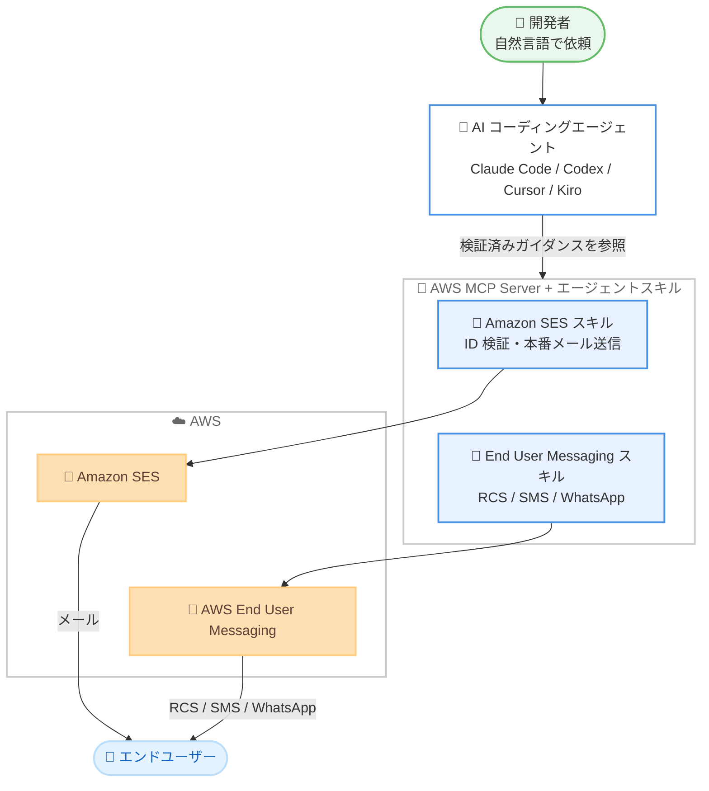

# AWS End User Messaging / Amazon SES - AWS MCP Server 向け AI エージェントスキルの提供開始

**リリース日**: 2026 年 9 月 25 日
**サービス**: AWS End User Messaging、Amazon SES (Simple Email Service)
**機能**: AWS MCP Server 向け AI エージェントスキル (Agent Skills)

📊 [このアップデートのインフォグラフィックを見る](https://takech9203.github.io/aws-news-summary/20260925-aws-messaging-ses-ai-skills-mcp-server.html)

## 概要

AWS End User Messaging と Amazon SES が、AWS MCP Server 向けの AI エージェントスキルを公開しました。開発者は Claude Code、Codex、Cursor、Kiro などの AI コーディングエージェントに自然言語で依頼するだけで、メッセージングやメール送信の構築・実行が可能になります。

各スキルは、送信 ID (Sending Identity) の検証、ブランド RCS (Rich Communication Services) エージェントの構築、本番メールの送信といったタスクについて、ステップバイステップの検証済みガイダンスを AI エージェントに提供します。例えば「送信 ID を検証して最初の本番メールを送信して」と Amazon SES に依頼したり、「RCS エージェントを構築してカードとボタン付きのリッチメッセージを送信して」と AWS End User Messaging に依頼したりできます。

セットアップは、まず AWS MCP Server をエージェントに接続することから始めます。Claude Code、Codex、Cursor では aws-core プラグインによりサーバーと厳選されたスキルを一括インストールでき、Kiro などその他のエージェントでは MCP 設定ファイルにサーバーを追加した上で、利用したいチャネルのスキルを追加します。

**アップデート前の課題**

- 以前は、メッセージング関連のタスクを完了するために、複数のドキュメントページとコンソール画面を行き来する必要があった
- AI コーディングエージェントに依頼しても、サービス固有の正しい手順 (ID 検証、RCS エージェント登録など) を確実に踏ませることが難しかった
- 送信 ID の検証や本番送信への移行など、手順の多い作業で試行錯誤やミスが発生しやすかった

**アップデート後の改善**

- 自然言語で AI コーディングエージェントに依頼するだけで、メッセージの構築・送信までを実行できるようになった
- 各スキルが検証済みのステップバイステップガイダンスを提供するため、エージェントが正確な手順でタスクを完了できるようになった
- aws-core プラグイン (Claude Code / Codex / Cursor) により、AWS MCP Server とスキルを 1 回の操作でインストールできるようになった

## アーキテクチャ図



開発者が AI コーディングエージェントに自然言語で依頼すると、エージェントは AWS MCP Server 経由で各サービスのスキル (検証済みガイダンス) を参照し、Amazon SES や AWS End User Messaging でのメッセージ構築・送信タスクを正確に実行します。

## サービスアップデートの詳細

### 主要機能

1. **自然言語によるメッセージング開発**
   - AI コーディングエージェントに平易な言葉で依頼するだけで、メッセージの構築から送信までを実行できる
   - 例: 「送信 ID を検証して最初の本番メールを送信して」(Amazon SES)
   - 例: 「RCS エージェントを構築してカードとボタン付きのリッチメッセージを送信して」(AWS End User Messaging)

2. **検証済みのステップバイステップガイダンス**
   - 各スキルが、送信 ID の検証、ブランド RCS エージェントの構築、本番メール送信などのタスクについて、検証済みの手順をエージェントに提供
   - 複数のドキュメントページやコンソール画面を行き来する必要がなくなり、エージェントが正しい手順でタスクを完遂できる

3. **主要な AI コーディングエージェントとの統合**
   - Claude Code、Codex、Cursor、Kiro などの人気の AI コーディングエージェントと連携
   - Claude Code / Codex / Cursor: aws-core プラグインで AWS MCP Server と厳選されたスキルを一括インストール
   - Kiro などその他のエージェント: MCP 設定ファイルに AWS MCP Server を追加し、利用したいチャネルのスキルを追加

## 技術仕様

### 対応チャネルとスキル

| 項目 | 詳細 |
|------|------|
| Amazon SES | 送信 ID の検証、本番メール送信などのメール開発タスク |
| AWS End User Messaging SMS / RCS | RCS エージェントのセットアップ、リッチメッセージ送信など |
| AWS End User Messaging WhatsApp | WhatsApp メッセージングのセットアップと送信 |
| 対応 AI エージェント | Claude Code、Codex、Cursor、Kiro など |
| 導入方法 | aws-core プラグイン (Claude Code / Codex / Cursor)、MCP 設定ファイル (Kiro など) |

### セットアップの流れ

```text
1. AWS MCP Server を AI コーディングエージェントに接続する
   - Claude Code / Codex / Cursor: aws-core プラグインを 1 回インストール
   - Kiro など: MCP 設定ファイルにサーバーを追加
2. 利用したいチャネルのスキルを追加する
   - Amazon SES / SMS・RCS / WhatsApp の各セットアップガイドを参照
3. エージェントに自然言語でタスクを依頼する
```

## 設定方法

### 前提条件

1. Claude Code、Codex、Cursor、Kiro などの AI コーディングエージェントが利用可能であること
2. AWS アカウントと、Amazon SES または AWS End User Messaging を操作できる IAM 認証情報があること
3. AWS MCP Server をエージェントに接続できる環境であること

### 手順

#### ステップ 1: AWS MCP Server の接続

Claude Code / Codex / Cursor の場合は、aws-core プラグインをインストールします。これにより AWS MCP Server と厳選されたスキルが一括で導入されます。

Kiro などその他のエージェントの場合は、MCP 設定ファイルに AWS MCP Server を追加します。詳細は [AWS MCP Server の接続ガイド](https://docs.aws.amazon.com/agent-toolkit/latest/userguide/getting-started-aws-mcp-server.html) を参照してください。

#### ステップ 2: チャネルごとのスキルの追加

利用したいチャネルに応じて、以下のセットアップガイドに従いスキルを追加します。

- [AWS End User Messaging SMS / RCS エージェントセットアップガイド](https://docs.aws.amazon.com/sms-voice/latest/userguide/agent-setup-guide.html)
- [AWS End User Messaging WhatsApp エージェントセットアップガイド](https://docs.aws.amazon.com/social-messaging/latest/userguide/agent-setup-guide.html)
- [Amazon SES エージェントセットアップガイド](https://docs.aws.amazon.com/ses/latest/dg/agent-setup-guide.html)

#### ステップ 3: 自然言語でタスクを依頼

エージェントに対して自然言語でタスクを依頼します。例えば「送信 ID を検証して最初の本番メールを送信して」と入力すると、スキルの検証済みガイダンスに沿ってエージェントがタスクを実行します。

## メリット

### ビジネス面

- **開発期間の短縮**: ドキュメントとコンソールを行き来する調査作業が不要になり、メッセージング機能の立ち上げまでの時間を短縮できる
- **参入障壁の低減**: メッセージングやメール送信の専門知識が浅い開発者でも、正しい手順で本番運用まで到達しやすくなる
- **チャネル拡大の加速**: RCS や WhatsApp など新しいチャネルへの対応を、AI エージェント主導で迅速に進められる

### 技術面

- **検証済みガイダンスによる正確性**: スキルがステップバイステップの検証済み手順を提供するため、AI エージェントの誤った手順実行 (ハルシネーション) のリスクを低減できる
- **主要エージェントへの幅広い対応**: Claude Code、Codex、Cursor、Kiro など、開発チームが既に使用しているツールにそのまま組み込める
- **一括インストール**: aws-core プラグインにより、AWS MCP Server とスキルの導入が 1 回の操作で完了する

## デメリット・制約事項

### 制限事項

- スキルの対象は現時点で発表に記載されたタスク (送信 ID 検証、RCS エージェント構築、本番メール送信など) が中心であり、すべての機能を網羅しているわけではない
- aws-core プラグインによる一括インストールは Claude Code / Codex / Cursor が対象で、Kiro などその他のエージェントでは MCP 設定ファイルへの手動追加が必要

### 考慮すべき点

- AI エージェントが AWS リソースを操作するため、付与する IAM 権限は最小権限の原則に従って設計する必要がある
- 本番メール送信や RCS エージェント登録などの操作は実環境に影響するため、エージェントの実行内容を確認するワークフロー (承認プロセスなど) を検討することが望ましい
- RCS エージェントのブランド登録やキャリア審査など、スキルのガイダンス外で時間を要するプロセスが存在する

## ユースケース

### ユースケース 1: 新規サービスのトランザクションメール立ち上げ

**シナリオ**: スタートアップが新規 Web サービスのサインアップ確認メールを Amazon SES で送信したいが、SES の運用経験者がいない。

**実装例**:
```text
開発者が Claude Code に依頼:
「Amazon SES で example.com の送信 ID を検証して、
サンドボックスから本番アクセスに移行し、
最初のサインアップ確認メールを送信して」
```

**効果**: SES スキルの検証済みガイダンスに沿って、ID 検証から本番送信までの一連の手順をエージェントが正確に実行し、立ち上げ時間を大幅に短縮できる。

### ユースケース 2: ブランド RCS エージェントによるリッチメッセージ配信

**シナリオ**: 小売企業が SMS からのアップグレードとして、カードやボタンを含むリッチな RCS メッセージでキャンペーン通知を送りたい。

**実装例**:
```text
開発者が Cursor に依頼:
「AWS End User Messaging でブランド RCS エージェントを構築して、
商品カードと購入ボタン付きのリッチメッセージを
テスト端末に送信して」
```

**効果**: RCS エージェントのセットアップという手順の多い作業を、スキルのガイダンスに沿って AI エージェントが進めるため、試行錯誤なくリッチメッセージング環境を構築できる。

### ユースケース 3: Kiro を使った WhatsApp 通知機能の追加

**シナリオ**: 既存アプリケーションに WhatsApp での配送通知機能を追加したい開発チームが、IDE として Kiro を使用している。

**実装例**:
```text
1. Kiro の MCP 設定ファイルに AWS MCP Server を追加
2. WhatsApp チャネルのスキルを追加
3. 「AWS End User Messaging で WhatsApp の送信環境を
   セットアップして配送通知テンプレートを送信して」と依頼
```

**効果**: IDE を離れることなく、WhatsApp メッセージングのセットアップから送信テストまでを完結でき、開発フローが途切れない。

## 料金

AI エージェントスキルおよび AWS MCP Server 自体の利用に追加料金は発表されていません。スキル経由で実行される Amazon SES のメール送信や AWS End User Messaging のメッセージ送信には、各サービスの通常の料金が適用されます。

- [Amazon SES 料金](https://aws.amazon.com/ses/pricing/)
- [AWS End User Messaging 料金](https://aws.amazon.com/end-user-messaging/pricing/)

## 利用可能リージョン

発表にはリージョン固有の記載はありません。スキル経由で操作する Amazon SES および AWS End User Messaging は、各サービスが提供されているリージョンで利用できます。

## 関連サービス・機能

- **AWS MCP Server**: AWS サービスの操作を AI エージェントに提供する MCP サーバー。今回のスキルはこのサーバー上で動作する
- **Amazon SES**: メール送受信サービス。送信 ID 検証や本番メール送信のスキルが提供される
- **AWS End User Messaging**: SMS、RCS、WhatsApp などのエンドユーザー向けメッセージングサービス。RCS エージェント構築などのスキルが提供される
- **Kiro**: AWS が提供する AI 搭載 IDE。MCP 設定ファイルへの追加によりスキルを利用できる

## 参考リンク

- 📊 [インフォグラフィック](https://takech9203.github.io/aws-news-summary/20260925-aws-messaging-ses-ai-skills-mcp-server.html)
- [公式発表 (What's New)](https://aws.amazon.com/about-aws/whats-new/2026/09/aws-messaging-ses-ai-skills-mcp-server/)
- [AWS Blog: Getting started with Amazon SES Agent Skills for AI-assisted email development](https://aws.amazon.com/blogs/messaging-and-targeting/getting-started-with-amazon-ses-agent-skills-for-ai-assisted-email-development/)
- [AWS Blog: Setting up an RCS agent with an AI coding assistant and AWS End User Messaging](https://aws.amazon.com/blogs/messaging-and-targeting/setting-up-an-rcs-agent-with-an-ai-coding-assistant-and-aws-end-user-messaging/)
- [ドキュメント: AWS MCP Server の接続](https://docs.aws.amazon.com/agent-toolkit/latest/userguide/getting-started-aws-mcp-server.html)
- [ドキュメント: AWS End User Messaging SMS / RCS エージェントセットアップガイド](https://docs.aws.amazon.com/sms-voice/latest/userguide/agent-setup-guide.html)
- [ドキュメント: AWS End User Messaging WhatsApp エージェントセットアップガイド](https://docs.aws.amazon.com/social-messaging/latest/userguide/agent-setup-guide.html)
- [ドキュメント: Amazon SES エージェントセットアップガイド](https://docs.aws.amazon.com/ses/latest/dg/agent-setup-guide.html)

## まとめ

AWS End User Messaging と Amazon SES の AI エージェントスキルにより、メッセージングやメール送信の構築が自然言語での依頼だけで完結するようになり、開発の参入障壁が大きく下がります。Claude Code / Codex / Cursor を利用中のチームは aws-core プラグインの導入から、Kiro などを利用中のチームは MCP 設定ファイルへのサーバー追加から始めることを推奨します。
