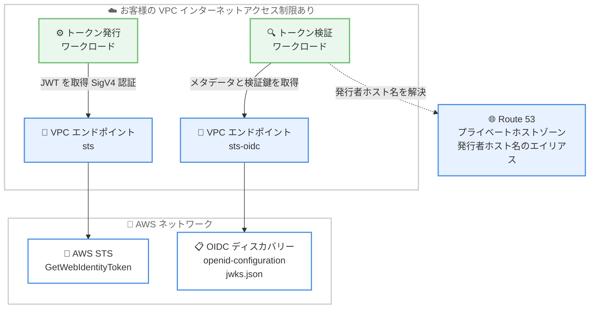

# AWS IAM - アウトバウンド ID フェデレーションの OIDC ディスカバリーがインターフェイス VPC エンドポイントをサポート

**リリース日**: 2026 年 9 月 25 日
**サービス**: AWS Identity and Access Management (IAM) / AWS Security Token Service (STS)
**機能**: アウトバウンド ID フェデレーションの OIDC ディスカバリー API に対するインターフェイス VPC エンドポイントのサポート

📊 [このアップデートのインフォグラフィックを見る](https://takech9203.github.io/aws-news-summary/20260925-aws-sts-vpc-oidc.html)

## 概要

AWS IAM のアウトバウンド ID フェデレーションが、OpenID Connect (OIDC) ディスカバリー API に対する Amazon VPC インターフェイスエンドポイントのサポートを開始しました。これにより、OIDC ディスカバリーメタデータおよび JWKS (JSON Web Key Set) 検証鍵エンドポイントへ、AWS PrivateLink を経由して VPC 内からプライベートにアクセスできるようになり、トラフィックがパブリックインターネットを経由しなくなります。

アウトバウンド ID フェデレーションは、AWS ワークロードが外部サービス (他のクラウドプロバイダー、SaaS プラットフォーム、オンプレミスアプリケーションなど) にアクセスする際の長期認証情報を排除する機能です。ワークロードは AWS STS の `GetWebIdentityToken` API から短期の JWT を取得し、外部サービスは OIDC ディスカバリーエンドポイントで公開される検証鍵を使用してトークンを検証します。

今回のアップデートは、インターネットアクセスが制限された VPC 内でトークン検証を行うワークロードを運用する組織や、トラフィックを AWS ネットワーク内に閉じることでネットワークセキュリティ要件を満たす必要がある金融、公共などの規制業界の組織にとって特に重要です。

**アップデート前の課題**

このアップデート以前は、OIDC ディスカバリーエンドポイントへのアクセスに以下の制限がありました。

- OIDC ディスカバリーメタデータと JWKS エンドポイントはパブリックインターネット経由でのみ到達可能だった
- VPC 内の検証側ワークロードが検証鍵を取得するには、インターネットゲートウェイ、NAT デバイス、または VPN 接続が必要だった
- インターネットアクセスが禁止された閉域ネットワーク環境では、VPC 内でのトークン検証が困難だった

**アップデート後の改善**

今回のアップデートにより、以下が可能になりました。

- インターフェイス VPC エンドポイント (`com.amazonaws.{region}.sts-oidc`) を作成し、OIDC ディスカバリードキュメントと JWKS を AWS ネットワーク内で取得できるようになった
- トラフィックがパブリックインターネットを経由しないため、インターネットアクセスが制限された VPC のネットワークセキュリティ要件を満たせるようになった
- Route 53 プライベートホストゾーンと組み合わせることで、標準の OIDC ライブラリをコード変更なしで利用できるようになった

## アーキテクチャ図



VPC 内のワークロードは、`sts` エンドポイント経由で JWT を発行し、`sts-oidc` エンドポイント経由で OIDC ディスカバリードキュメントと JWKS 検証鍵を取得します。発行者ホスト名は Route 53 プライベートホストゾーンのエイリアスレコードで VPC エンドポイントに解決させます。

## サービスアップデートの詳細

### 主要機能

1. **OIDC ディスカバリー用インターフェイス VPC エンドポイント**
   - 新しいエンドポイントサービス名 `com.amazonaws.{region}.sts-oidc` を使用してインターフェイス VPC エンドポイントを作成可能
   - `{issuer_url}/.well-known/openid-configuration` (OIDC ディスカバリードキュメント) と `{issuer_url}/.well-known/jwks.json` (JWKS 検証鍵) の 2 つのパスへの HTTPS GET リクエストのみを処理
   - どちらの API も認証不要 (公開データを提供) で、AWS SigV4 認証は使用しない

2. **プライベート DNS のサポート**
   - プライベート DNS を有効にすると、`sts-oidc.{region}.amazonaws.com` へのリクエストが VPC 内のエンドポイントネットワークインターフェイスに解決される
   - 発行者ホスト名 (例: `{uuid}.tokens.sts.global.api.aws`) は別ドメインのため、Route 53 プライベートホストゾーンにエイリアスレコードを作成して VPC エンドポイントにルーティングする
   - プライベートホストゾーン設定後は、標準の OIDC ライブラリがコード変更なしでディスカバリードキュメントを取得可能

3. **パーティション内のすべての発行者に対応するリージョナルエンドポイント**
   - エンドポイントサービスはリージョナルだが、単一のエンドポイントでパーティション内の任意の発行者 UUID のディスカバリーリクエストを処理可能
   - 検証側ワークロードが稼働するリージョンにエンドポイントを作成すればよく、発行者アカウントごとにエンドポイントを作成する必要はない

## 技術仕様

### エンドポイントサービスの使い分け

アウトバウンド ID フェデレーションは 2 つの異なるネットワークパスを使用します。トークンの発行と検証の両方を行うワークロードには、両方のエンドポイントサービスが必要です。

| タスク | エンドポイントサービス | 認証 |
|------|----------|------|
| JWT の発行 (`sts:GetWebIdentityToken`) | `com.amazonaws.{region}.sts` | AWS SigV4 |
| `/.well-known/openid-configuration` の取得 | `com.amazonaws.{region}.sts-oidc` | なし (認証不要) |
| `/.well-known/jwks.json` の取得 | `com.amazonaws.{region}.sts-oidc` | なし (認証不要) |

### OIDC ディスカバリーエンドポイントの仕様

| 項目 | 詳細 |
|------|------|
| エンドポイントサービス名 | `com.amazonaws.{region}.sts-oidc` |
| プライベート DNS 名 | `sts-oidc.{region}.amazonaws.com` |
| 発行者 URL の形式 | `https://{uuid}.tokens.sts.global.api.aws` (アカウント固有) |
| 提供パス | `/.well-known/openid-configuration` および `/.well-known/jwks.json` のみ |
| 許可メソッド | HTTPS GET のみ (その他のパスとメソッドはエラー) |
| VPC エンドポイントポリシー | サポートされない (公開データのためポリシーを適用しない) |

## 設定方法

### 前提条件

1. アウトバウンド ID フェデレーションが有効化されており、アカウント固有の発行者 URL が発行されていること
2. VPC エンドポイントを作成する VPC とサブネットが存在すること
3. VPC エンドポイントの作成と Route 53 プライベートホストゾーンの操作に必要な IAM 権限があること

### 手順

#### ステップ 1: OIDC ディスカバリー用のインターフェイス VPC エンドポイントを作成

```bash
aws ec2 create-vpc-endpoint \
  --vpc-id vpc-0123456789abcdef0 \
  --vpc-endpoint-type Interface \
  --service-name com.amazonaws.ap-northeast-1.sts-oidc \
  --subnet-ids subnet-0123456789abcdef0 \
  --security-group-ids sg-0123456789abcdef0 \
  --private-dns-enabled
```

指定した VPC に STS OIDC ディスカバリー用のインターフェイス VPC エンドポイントを作成します。プライベート DNS を有効にすることで、`sts-oidc.ap-northeast-1.amazonaws.com` への名前解決が VPC 内のエンドポイントに向けられます。セキュリティグループでは、検証側ワークロードからの HTTPS (443 番ポート) インバウンドを許可します。

#### ステップ 2: 発行者ホスト名用の Route 53 プライベートホストゾーンを作成

```bash
aws route53 create-hosted-zone \
  --name "{uuid}.tokens.sts.global.api.aws" \
  --caller-reference "sts-oidc-$(date +%s)" \
  --hosted-zone-config PrivateZone=true \
  --vpc VPCRegion=ap-northeast-1,VPCId=vpc-0123456789abcdef0
```

発行者ホスト名 (例: `{uuid}.tokens.sts.global.api.aws`) は VPC エンドポイントのドメインとは異なるため、デフォルトでは VPC エンドポイントに解決されません。このコマンドで発行者ホスト名のプライベートホストゾーンを作成し、対象の VPC に関連付けます。作成後、VPC エンドポイントを指すエイリアスレコードをホストゾーンに追加します。

#### ステップ 3: VPC 内から OIDC ディスカバリードキュメントの取得を確認

```bash
curl https://{uuid}.tokens.sts.global.api.aws/.well-known/openid-configuration
curl https://{uuid}.tokens.sts.global.api.aws/.well-known/jwks.json
```

VPC 内のインスタンスから発行者 URL に対して OIDC ディスカバリードキュメントと JWKS を取得できることを確認します。プライベートホストゾーンにより名前解決が VPC エンドポイントのネットワークインターフェイスに向けられ、トラフィックは AWS ネットワーク内に閉じられます。標準の OIDC ライブラリを使用している場合も、コード変更なしでそのまま動作します。

## メリット

### ビジネス面

- **コンプライアンス要件への対応**: トラフィックがパブリックインターネットを経由しないため、閉域ネットワークを求める規制要件や社内セキュリティポリシーを満たしやすくなる
- **長期認証情報の排除の推進**: インターネットアクセスが制限された環境でもアウトバウンド ID フェデレーションを採用でき、API キーやパスワードの管理・ローテーション負担を削減できる
- **追加コストの最小化**: 標準の AWS PrivateLink 料金以外の追加費用は発生しない

### 技術面

- **プライベートなトークン検証**: インターネットゲートウェイや NAT デバイスなしで、VPC 内のワークロードが JWT の検証鍵を取得可能
- **コード変更不要**: Route 53 プライベートホストゾーンとエイリアスレコードの設定により、標準の OIDC ライブラリがそのまま動作する
- **シンプルなエンドポイント設計**: 単一のリージョナルエンドポイントでパーティション内の任意の発行者 UUID に対応するため、発行者アカウントごとの設定が不要

## デメリット・制約事項

### 制限事項

- VPC エンドポイントポリシーはサポートされない (公開データを提供するため)。アクセス制御にはセキュリティグループとサブネット配置を使用する
- エンドポイントは `/.well-known/openid-configuration` と `/.well-known/jwks.json` の 2 つのパスへの HTTPS GET のみを処理し、その他のパスとメソッドはエラーを返す
- この OIDC ディスカバリーエンドポイントは STS の API オペレーションを処理しない。`GetWebIdentityToken` や `AssumeRole` をプライベートに呼び出すには、別途 `com.amazonaws.{region}.sts` エンドポイントが必要

### 考慮すべき点

- トークンの検証を行うのが AWS 外部の外部サービスのみである場合、そのサービスはパブリックインターネット経由で発行者 URL にアクセスするため、この VPC エンドポイントは不要
- 発行者ホスト名を VPC エンドポイントに解決させるには、Route 53 プライベートホストゾーンの追加設定が必要
- インターフェイス VPC エンドポイントには AWS PrivateLink の標準料金 (時間課金およびデータ処理料金) が発生する

## ユースケース

### ユースケース 1: 閉域 VPC 内のマイクロサービス間でのトークン検証

**シナリオ**: インターネットアクセスが禁止された VPC 内で稼働するマイクロサービスが、他の AWS ワークロードから提示された STS 発行の JWT を検証してアクセスを許可する。

**実装例**:
```
1. 検証側サービスが稼働するリージョンに sts-oidc の VPC エンドポイントを作成
2. 発行者ホスト名のプライベートホストゾーンとエイリアスレコードを設定
3. 検証側サービスの OIDC ライブラリに発行者 URL を設定し、JWKS を VPC 内で取得
```

**効果**: NAT ゲートウェイやインターネットゲートウェイを追加することなく、閉域環境で標準 OIDC に準拠したトークン検証を実現できる。

### ユースケース 2: 規制業界におけるハイブリッド環境のセキュアな認証基盤

**シナリオ**: 金融機関が、AWS 上のワークロードとオンプレミスの Kubernetes クラスター間の認証にアウトバウンド ID フェデレーションを採用する。監査要件により、AWS 内の検証コンポーネントの通信はすべて AWS ネットワーク内に閉じる必要がある。

**実装例**:
```
1. VPC 内の検証プロキシが sts-oidc エンドポイント経由で JWKS をキャッシュ
2. Direct Connect / VPN 経由で接続するオンプレミス側にも検証鍵を配布
3. CloudTrail でトークン生成を監査し、VPC フローログで通信を記録
```

**効果**: パブリックインターネットを経由する通信経路を排除し、監査要件とネットワーク分離要件を同時に満たせる。

### ユースケース 3: マルチアカウント環境での検証基盤の集約

**シナリオ**: 複数の AWS アカウントがそれぞれアウトバウンド ID フェデレーションでトークンを発行し、共有サービス VPC 内の集約された検証サービスがそれらを検証する。

**実装例**:
```
1. 共有サービス VPC に sts-oidc の VPC エンドポイントを 1 つ作成
2. 各発行者アカウントの発行者ホスト名ごとにプライベートホストゾーンを設定
3. 単一のエンドポイントでパーティション内のすべての発行者 UUID の検証鍵を取得
```

**効果**: リージョナルエンドポイント 1 つでパーティション内の任意の発行者に対応できるため、アカウント数が増えてもエンドポイントの追加が不要でコストと運用負担を抑えられる。

## 料金

この機能自体に追加料金はなく、AWS PrivateLink の標準料金が適用されます。インターフェイス VPC エンドポイントには、エンドポイントがプロビジョニングされている時間ごとの料金と、処理データ量に応じた料金が発生します。

### 料金例 (東京リージョン、参考)

| 項目 | 料金 (概算) |
|--------|------------------|
| インターフェイスエンドポイント (AZ ごと、時間あたり) | 約 0.014 USD |
| データ処理料金 (最初の 1 PB まで、GB あたり) | 約 0.01 USD |

最新の料金は [AWS PrivateLink 料金ページ](https://aws.amazon.com/privatelink/pricing/) を確認してください。

## 利用可能リージョン

すべての商用 AWS リージョンおよび AWS GovCloud (US) リージョンで利用可能です。

## 関連サービス・機能

- **AWS STS (`GetWebIdentityToken`)**: アウトバウンド ID フェデレーションで短期 JWT を発行する API。プライベートアクセスには別途 `com.amazonaws.{region}.sts` エンドポイントを使用
- **AWS PrivateLink**: VPC と AWS サービス間のプライベート接続を提供する基盤技術。今回のアップデートで OIDC ディスカバリー API に対応
- **Amazon Route 53 プライベートホストゾーン**: 発行者ホスト名を VPC エンドポイントのネットワークインターフェイスに解決させるために使用
- **AWS CloudTrail**: トークン生成のログを記録し、監査とコンプライアンスに活用

## 参考リンク

- 📊 [インフォグラフィック](https://takech9203.github.io/aws-news-summary/20260925-aws-sts-vpc-oidc.html)
- [公式発表 (What's New)](https://aws.amazon.com/about-aws/whats-new/2026/09/aws-sts-vpc-oidc/)
- [IAM アウトバウンド ID フェデレーション製品ページ](https://aws.amazon.com/identity/federation/outbound-federation/)
- [ドキュメント: Create a VPC endpoint for AWS STS OIDC discovery](https://docs.aws.amazon.com/IAM/latest/UserGuide/reference_sts_oidc_vpc_endpoint_create.html)
- [AWS PrivateLink](https://aws.amazon.com/privatelink/)
- [料金ページ (AWS PrivateLink)](https://aws.amazon.com/privatelink/pricing/)

## まとめ

アウトバウンド ID フェデレーションの OIDC ディスカバリー API が AWS PrivateLink に対応したことで、インターネットアクセスが制限された VPC 内でも短期 JWT の検証鍵をプライベートに取得できるようになりました。閉域環境で長期認証情報の排除を進めたい組織は、`com.amazonaws.{region}.sts-oidc` エンドポイントの作成と Route 53 プライベートホストゾーンの設定を検討することを推奨します。
