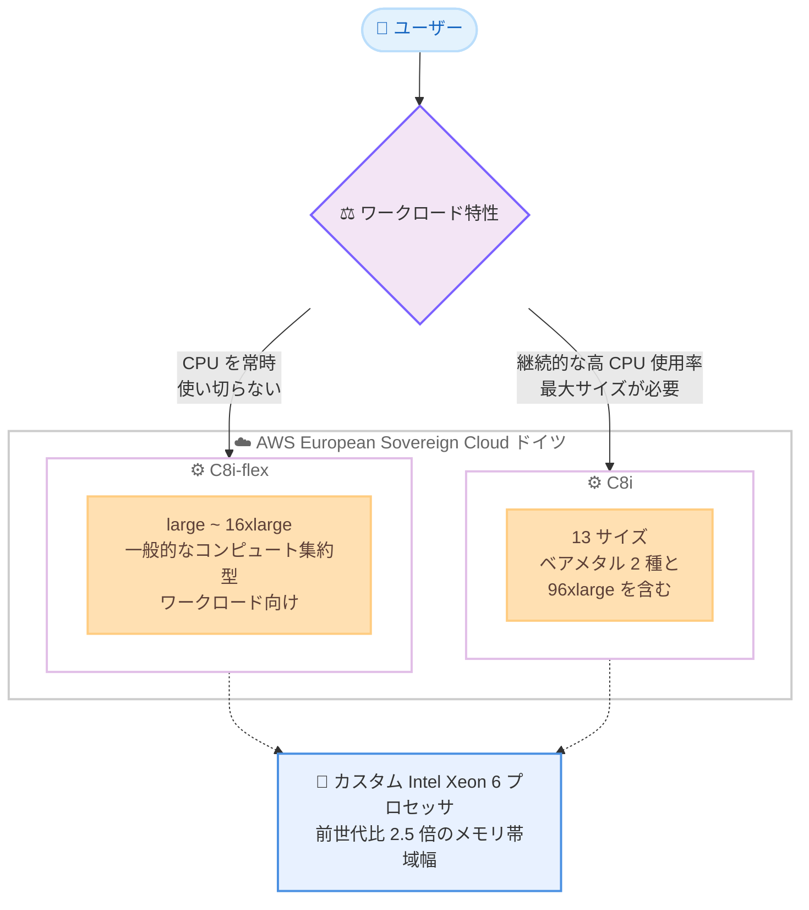

# Amazon EC2 - C8i/C8i-flex インスタンスが AWS European Sovereign Cloud で利用可能に

**リリース日**: 2026 年 09 月 25 日
**サービス**: Amazon EC2
**機能**: C8i および C8i-flex インスタンスのリージョン拡大

📊 [このアップデートのインフォグラフィックを見る](https://takech9203.github.io/aws-news-summary/20260925-c8i-c8i-flex-thf-september-2026.html)

## 概要

Amazon Elastic Compute Cloud (Amazon EC2) の C8i および C8i-flex インスタンスが、AWS European Sovereign Cloud (ドイツ) リージョンで利用可能になりました。これらのインスタンスは AWS 専用のカスタム Intel Xeon 6 プロセッサを搭載しており、クラウド上の同等の Intel プロセッサの中で最高のパフォーマンスと最速のメモリ帯域幅を提供します。

C8i および C8i-flex インスタンスは、前世代の Intel ベースインスタンスと比較して最大 15% 優れた価格パフォーマンスと 2.5 倍のメモリ帯域幅を実現します。C7i および C7i-flex インスタンスと比較すると最大 20% 高いパフォーマンスを発揮し、特定のワークロードではさらに大きな向上が見られます。NGINX ウェブアプリケーションでは最大 60%、AI ディープラーニング推奨モデルでは最大 40%、Memcached ストアでは 35% 高速化されます。

今回の拡大により、データ主権やコンプライアンス要件のために AWS European Sovereign Cloud を利用する欧州の組織も、最新世代の Intel ベースコンピュート最適化インスタンスを活用できるようになりました。

**アップデート前の課題**

- C8i/C8i-flex インスタンスが AWS European Sovereign Cloud (ドイツ) リージョンで利用できなかった
- 厳格なデータ主権要件を持つ欧州の組織は、最新世代の Intel ベースコンピュートインスタンスの恩恵を受けられなかった
- 前世代インスタンスを使用する場合、価格パフォーマンスやメモリ帯域幅の面で制約があった

**アップデート後の改善**

- AWS European Sovereign Cloud (ドイツ) リージョンで C8i/C8i-flex インスタンスを直接起動できるようになった
- データ主権要件を満たしながら、最大 15% 優れた価格パフォーマンスと 2.5 倍のメモリ帯域幅を活用できるようになった
- Savings Plans、オンデマンド、スポットインスタンスの各購入オプションで柔軟に調達できるようになった

## アーキテクチャ図



ワークロード特性に応じた C8i と C8i-flex の選択と、AWS European Sovereign Cloud (ドイツ) リージョンでの提供構成を示しています。

## サービスアップデートの詳細

### 主要機能

1. **AWS European Sovereign Cloud (ドイツ) リージョンでの提供開始**
   - データ主権要件を満たす環境で最新世代 Intel ベースインスタンスを利用可能
   - 欧州の規制産業 (公共、金融、医療など) のワークロードにも最新のコンピュート性能を提供
   - Savings Plans、オンデマンド、スポットインスタンスで購入可能

2. **C8i-flex インスタンス**
   - コンピュート集約型ワークロードの大部分で価格パフォーマンスの恩恵を受けられる最も簡単な選択肢
   - large から 16xlarge まで、最も一般的なサイズを提供
   - すべてのコンピュートリソースを完全に活用しないアプリケーションに最適
   - ウェブ/アプリケーションサーバー、データベース、キャッシュ、Apache Kafka、Elasticsearch、エンタープライズアプリケーションなどに適合

3. **C8i インスタンス**
   - 継続的な高 CPU 使用率や最大インスタンスサイズを必要とするワークロードに最適
   - ベアメタル 2 サイズと新しい 96xlarge を含む 13 サイズを提供
   - 最大規模のアプリケーションにも対応

4. **カスタム Intel Xeon 6 プロセッサ**
   - AWS 専用のカスタムプロセッサ
   - クラウド上の同等の Intel プロセッサの中で最高のパフォーマンスと最速のメモリ帯域幅
   - 前世代の Intel ベースインスタンス比で 2.5 倍のメモリ帯域幅

## 技術仕様

### パフォーマンス比較

| ワークロード | C7i/C7i-flex 比較 | 用途 |
|------------|------------------|------|
| 全般 | 最大 20% 高速 | コンピュート集約型ワークロード全般 |
| NGINX ウェブアプリケーション | 最大 60% 高速 | ウェブサーバー、アプリケーションサーバー |
| AI ディープラーニング推奨モデル | 最大 40% 高速 | 機械学習推論、推奨エンジン |
| Memcached ストア | 35% 高速 | キャッシュ、インメモリデータストア |

### インスタンスタイプ

| タイプ | サイズ範囲 | 最適なユースケース |
|--------|----------|-------------------|
| C8i-flex | large ~ 16xlarge | ウェブ/アプリケーションサーバー、データベース、キャッシュ、Apache Kafka、Elasticsearch、エンタープライズアプリケーション |
| C8i | 13 サイズ (ベアメタル 2 種、96xlarge を含む) | 継続的な高 CPU 使用率、最大サイズを必要とする大規模ワークロード |

## 設定方法

### 前提条件

1. AWS アカウント (AWS European Sovereign Cloud を利用する場合は同クラウドのアカウント)
2. AWS European Sovereign Cloud (ドイツ) リージョンへのアクセス権限
3. 適切な IAM 権限 (EC2 インスタンス起動権限)

### 手順

#### ステップ 1: AWS Management Console にサインイン

[AWS Management Console](https://aws.amazon.com/console/) にアクセスします。

#### ステップ 2: リージョンの選択

コンソール右上のリージョンセレクターから、AWS European Sovereign Cloud (ドイツ) リージョンを選択します。

#### ステップ 3: EC2 インスタンスの起動

EC2 コンソールから「インスタンスを起動」を選択し、インスタンスタイプで C8i または C8i-flex ファミリーのサイズを選択します。ワークロードが CPU を常時使い切らない場合は C8i-flex、継続的な高 CPU 使用率や最大サイズが必要な場合は C8i を選択します。

#### ステップ 4: 購入オプションの選択

Savings Plans、オンデマンドインスタンス、またはスポットインスタンスから、ワークロードの特性とコスト要件に合った購入オプションを選択します。

## メリット

### ビジネス面

- **データ主権とパフォーマンスの両立**: AWS European Sovereign Cloud のデータ主権要件を満たしながら最新世代インスタンスを利用可能
- **コスト効率の向上**: 前世代の Intel ベースインスタンス比で最大 15% 優れた価格パフォーマンス
- **柔軟な調達オプション**: Savings Plans、オンデマンド、スポットインスタンスから選択可能

### 技術面

- **パフォーマンス向上**: C7i/C7i-flex 比で最大 20% 高速
- **メモリ帯域幅の向上**: 前世代比で 2.5 倍のメモリ帯域幅により、メモリバウンドな処理が高速化
- **ワークロード別の大幅な高速化**: NGINX で最大 60%、AI 推論で最大 40%、Memcached で 35% の向上

## デメリット・制約事項

### 制限事項

- AWS European Sovereign Cloud は通常の AWS リージョンとは分離された環境であり、利用には専用のアカウントが必要
- 既存の C7i/C7i-flex インスタンスからの自動移行はサポートされていない

### 考慮すべき点

- ワークロードの特性に応じて C8i-flex と C8i を適切に選択する必要がある
- 移行前に対象ワークロードでのパフォーマンスとコストのバランスを評価することが推奨される

## ユースケース

### ユースケース 1: 規制産業のウェブアプリケーション

**シナリオ**: データ主権要件のある欧州の公共機関や金融機関が、NGINX ベースの高トラフィックウェブアプリケーションを運用する

**実装例**:
```
- AWS European Sovereign Cloud (ドイツ) リージョンで c8i-flex.8xlarge を Auto Scaling グループに設定
- Application Load Balancer と組み合わせて負荷分散
```

**効果**: データ主権要件を満たしながら、C7i-flex 比で最大 60% のパフォーマンス向上により同じコストでより多くのリクエストを処理可能

### ユースケース 2: AI 推論ワークロード

**シナリオ**: ディープラーニングベースの推奨エンジンを CPU で実行し、欧州域内でデータを完結させたい

**実装例**:
```
- c8i.16xlarge インスタンスで推論モデルを実行
- 2.5 倍のメモリ帯域幅により大規模モデルの処理を高速化
```

**効果**: C7i 比で最大 40% 高速な推論処理により、レスポンスタイムを大幅に短縮

### ユースケース 3: インメモリキャッシュ

**シナリオ**: Memcached を使用した高速キャッシュレイヤーを構築する

**実装例**:
```
- c8i-flex.4xlarge インスタンスで Memcached クラスターを構築
- アプリケーションサーバーとデータベース間のキャッシュ層として使用
```

**効果**: C7i-flex 比で 35% 高速なキャッシュ操作により、アプリケーション全体のレスポンスが改善

## 料金

C8i および C8i-flex インスタンスの料金は、インスタンスサイズ、リージョン、購入オプションによって異なります。

購入オプション:
- **オンデマンド**: 時間単位の従量課金
- **Savings Plans**: 1 年または 3 年の利用コミットメントで割引
- **スポットインスタンス**: 余剰キャパシティを活用した大幅な割引

詳細な料金情報は [Amazon EC2 料金ページ](https://aws.amazon.com/ec2/pricing/) を参照してください。

## 利用可能リージョン

今回のアップデートで、C8i および C8i-flex インスタンスは以下のリージョンで新たに利用可能になりました。

- AWS European Sovereign Cloud (ドイツ) - 新規対応

最新のリージョン対応状況は [C8i/C8i-flex インスタンスページ](https://aws.amazon.com/ec2/instance-types/c8i/) を参照してください。

## 関連サービス・機能

- **AWS European Sovereign Cloud**: EU の主権要件に対応するために設計された、物理的・論理的に独立した AWS のクラウド環境
- **Amazon EC2 Auto Scaling**: C8i/C8i-flex インスタンスの自動スケーリング
- **AWS Compute Optimizer**: ワークロードに最適なインスタンスタイプの推奨

## 参考リンク

- 📊 [インフォグラフィック](https://takech9203.github.io/aws-news-summary/20260925-c8i-c8i-flex-thf-september-2026.html)
- [公式発表 (What's New)](https://aws.amazon.com/about-aws/whats-new/2026/09/c8i-c8i-flex-thf-september-2026/)
- [AWS Blog - C8i および C8i-flex インスタンスの紹介](https://aws.amazon.com/blogs/aws/introducing-new-compute-optimized-amazon-ec2-c8i-and-c8i-flex-instances/)
- [C8i/C8i-flex インスタンスタイプページ](https://aws.amazon.com/ec2/instance-types/c8i/)
- [AWS Management Console](https://aws.amazon.com/console/)

## まとめ

Amazon EC2 C8i および C8i-flex インスタンスが AWS European Sovereign Cloud (ドイツ) リージョンに拡大したことで、データ主権要件を持つ欧州の組織も最新世代のカスタム Intel Xeon 6 プロセッサによる高性能と優れた価格パフォーマンスを活用できるようになりました。同リージョンでコンピュート集約型ワークロードを運用している組織は、C8i/C8i-flex インスタンスへの移行を検討し、パフォーマンスとコスト効率の向上を実現してください。
