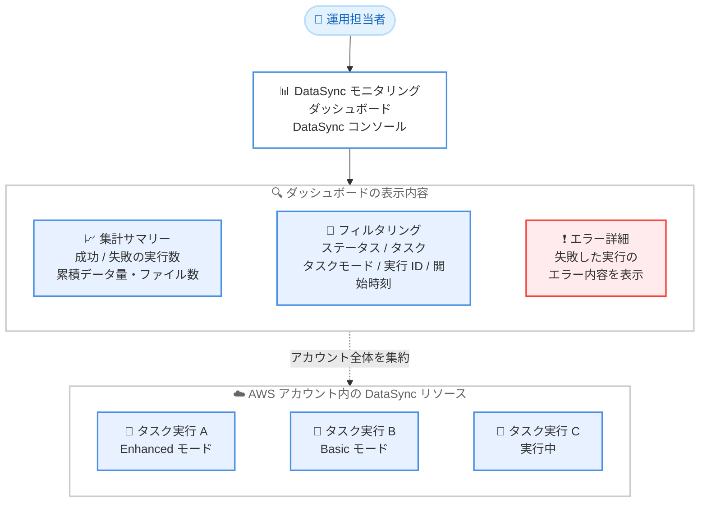

# AWS DataSync - アカウント全体のタスク実行を追跡するモニタリングダッシュボード

**リリース日**: 2026 年 9 月 25 日
**サービス**: AWS DataSync
**機能**: モニタリングダッシュボード (アカウント全体のタスク実行の可視化)

📊 [このアップデートのインフォグラフィックを見る](https://takech9203.github.io/aws-news-summary/20260925-datasync-monitoring-dashboard.html)

## 概要

AWS DataSync のコンソールに、アカウント全体のデータ転送を一元的に可視化するモニタリングダッシュボードが追加されました。各タスク実行について、ステータス、データおよびファイルの転送レート、実行時間、転送済みのデータ量とファイル数の合計を 1 つの画面で確認できます。

ダッシュボードでは、ステータス、タスク、タスクモード、実行 ID、開始時刻によるフィルタリングが可能です。フィルタリングした結果は、成功・失敗した実行数、タスクごとにグループ化された累積のデータ転送量とファイル転送数として集計表示されます。失敗した実行を選択すると、そのエラー内容を直接確認できます。さらに、設定済みのタスク数、ロケーション数、エージェント数と、アカウント全体のリアルタイムの合計転送レートも表示されます。

大規模なデータ移行や定期的な転送で多数のタスクを同時に実行している場合に、転送全体の健全性・パフォーマンス・進捗を単一のビューで把握できるようになる、運用性を大きく向上させるアップデートです。

**アップデート前の課題**

- 複数の転送を監視するには、各タスク実行を個別に開いて確認する必要があった
- アカウント全体の転送状況を俯瞰するには、Amazon CloudWatch でカスタムダッシュボードを独自に構築する必要があった
- 失敗した実行の特定とエラー内容の確認に、複数の画面を行き来する手間がかかっていた

**アップデート後の改善**

- DataSync コンソールの標準機能として、アカウント全体のタスク実行を単一のダッシュボードで監視できるようになった
- ステータス、タスク、タスクモード、実行 ID、開始時刻によるフィルタリングと、タスクごとの集計表示が可能になった
- 失敗した実行をダッシュボードから選択し、エラー内容を直接確認できるようになった
- 設定済みのタスク・ロケーション・エージェントの数と、リアルタイムの合計転送レートを一目で把握できるようになった

## アーキテクチャ図



モニタリングダッシュボードは、アカウント内のすべての DataSync タスク実行を集約し、集計サマリー・フィルタリング・エラー詳細の確認を単一のビューで提供します。

## サービスアップデートの詳細

### 主要機能

1. **タスク実行の一元的なモニタリング**
   - アカウント全体のタスク実行を DataSync コンソールの単一ダッシュボードで確認可能
   - 各タスク実行について、ステータス、データ転送レート、ファイル転送レート、実行時間、転送済みデータ量・ファイル数の合計を表示
   - 実行中の転送についてはアカウント全体のリアルタイムの合計転送レートを表示

2. **柔軟なフィルタリングと集計**
   - ステータス、タスク、タスクモード (Enhanced / Basic)、実行 ID、開始時刻でタスク実行をフィルタリング可能
   - フィルタリング結果を、成功・失敗した実行数、タスクごとにグループ化された累積データ転送量・ファイル転送数として集計表示

3. **エラーのトラブルシューティング**
   - 失敗したタスク実行をダッシュボードから選択し、エラー内容を直接確認可能
   - 個々の実行詳細ページを順番に開く作業が不要になり、障害の特定と対応が迅速化

4. **リソースの俯瞰**
   - アカウント内に設定済みのタスク数、ロケーション数、エージェント数を表示
   - DataSync 環境全体の構成規模を一目で把握可能

## 技術仕様

### ダッシュボードの表示項目

| 項目 | 詳細 |
|------|------|
| タスク実行ごとの情報 | ステータス、データ / ファイル転送レート、実行時間、転送済みデータ量・ファイル数の合計 |
| フィルタ条件 | ステータス、タスク、タスクモード、実行 ID、開始時刻 |
| 集計サマリー | 成功 / 失敗した実行数、タスクごとの累積データ転送量・ファイル転送数 |
| エラー確認 | 失敗した実行を選択してエラー内容を表示 |
| リソース情報 | 設定済みのタスク数、ロケーション数、エージェント数 |
| リアルタイム情報 | アカウント全体の合計転送レート |

### 既存のモニタリング手段との関係

| モニタリング手段 | 特徴 |
|------|------|
| モニタリングダッシュボード (今回追加) | コンソール標準機能。アカウント全体のタスク実行を追加設定なしで俯瞰 |
| Amazon CloudWatch メトリクス | `aws/datasync` 名前空間で 5 分間隔のメトリクスを提供。アラームや長期分析に活用 (保持期間 15 か月) |
| タスクレポート | 転送されたファイル・オブジェクト単位の詳細なレポートを Amazon S3 に出力 |
| CloudWatch Logs | タスク実行のログを記録。個別ファイルレベルのトラブルシューティングに活用 |

## 設定方法

### 前提条件

1. AWS アカウントで DataSync のタスクが作成済みであること
2. DataSync コンソールへのアクセス権限 (タスク実行の参照権限を含む) を持つ IAM プリンシパルであること

### 手順

#### ステップ1: モニタリングダッシュボードを開く

AWS Management Console で DataSync コンソールを開き、モニタリングダッシュボードに移動します。追加の設定やリソースの作成は不要で、アカウント内のタスク実行が自動的に表示されます。

#### ステップ2: タスク実行をフィルタリングする

ステータス (成功 / 失敗など)、タスク、タスクモード、実行 ID、開始時刻の条件を指定してタスク実行を絞り込みます。フィルタリング結果には、成功・失敗した実行数と、タスクごとにグループ化された累積データ転送量・ファイル転送数のサマリーが表示されます。

#### ステップ3: 失敗した実行のエラーを確認する

ダッシュボード上で失敗したタスク実行を選択し、エラー内容を確認します。必要に応じて CloudWatch Logs やタスクレポートを参照し、ファイルレベルの詳細な原因を調査します。

#### ステップ4: CLI で補足情報を確認する (任意)

```bash
# タスク実行の一覧を取得
aws datasync list-task-executions \
  --task-arn "arn:aws:datasync:ap-northeast-1:123456789012:task/task-0123456789abcdef0"

# 特定のタスク実行の詳細を確認
aws datasync describe-task-execution \
  --task-execution-arn "arn:aws:datasync:ap-northeast-1:123456789012:task/task-0123456789abcdef0/execution/exec-0123456789abcdef0"
```

ダッシュボードで特定した実行について、CLI の `describe-task-execution` で転送統計やエラーの詳細情報を取得し、自動化された調査フローに組み込むこともできます。

## メリット

### ビジネス面

- **移行プロジェクトの進捗可視化**: 大規模なデータ移行で多数のタスクを並行実行する場合でも、全体の進捗と健全性を単一のビューで関係者に示せる
- **運用コストの削減**: カスタム CloudWatch ダッシュボードの構築・維持が不要になり、監視基盤の開発・運用工数を削減できる
- **追加コストなし**: 本ダッシュボードは追加料金なしで利用可能

### 技術面

- **障害対応の迅速化**: 失敗した実行のフィルタリングとエラー内容の直接確認により、障害の特定から対応までの時間を短縮できる
- **設定不要の標準機能**: コンソールを開くだけで利用でき、メトリクスの選定やウィジェットの配置といった事前作業が不要
- **タスクモード横断の可視化**: Enhanced モードと Basic モードのタスクを同じダッシュボードで横断的に監視できる

## デメリット・制約事項

### 制限事項

- DataSync コンソール上の機能であり、ダッシュボード自体を API 経由で取得することはできない (プログラムからの取得には従来どおり DataSync API や CloudWatch メトリクスを使用)
- 表示対象は同一アカウント・同一リージョン内の DataSync リソースであり、マルチアカウントの一元監視には別途仕組みが必要

### 考慮すべき点

- しきい値ベースの自動通知 (アラーム) が必要な場合は、引き続き CloudWatch メトリクスと CloudWatch アラームの併用が必要
- ファイル・オブジェクト単位の詳細な転送結果の監査にはタスクレポートが適しており、ダッシュボードはあくまで俯瞰的なモニタリング手段として位置づけるのが適切

## ユースケース

### ユースケース1: 大規模移行プロジェクトの一元監視

**シナリオ**: オンプレミスのファイルサーバーから Amazon S3 への大規模移行で、データセットを分割した数十のタスクを並行実行しており、全体の進捗と失敗の有無を毎日確認したい。

**実装例**:
```
1. DataSync コンソールのモニタリングダッシュボードを開く
2. 開始時刻フィルタで当日の実行に絞り込む
3. 集計サマリーで成功 / 失敗の実行数と累積転送量を確認
4. 失敗があれば該当実行を選択してエラーを確認
```

**効果**: 各タスク実行を個別に開くことなく、移行全体の進捗確認と障害検知を数分で完了できる。

### ユースケース2: 定期転送ジョブの運用監視

**シナリオ**: 日次・週次でスケジュール実行している複数の DataSync タスクについて、失敗した実行だけを効率的に洗い出して対応したい。

**実装例**:
```
1. ダッシュボードでステータスフィルタを「失敗」に設定
2. タスクごとにグループ化されたサマリーで失敗傾向を把握
3. 失敗した実行を選択してエラー内容を確認
4. 恒常的な監視には CloudWatch アラームを併設
```

**効果**: 失敗した実行の特定とエラー確認が単一画面で完結し、定期ジョブの運用対応時間を短縮できる。

### ユースケース3: 転送パフォーマンスのリアルタイム確認

**シナリオ**: メンテナンスウィンドウ内に完了させる必要がある転送について、実行中の転送レートと残りの進捗をリアルタイムに把握したい。

**実装例**:
```
1. ダッシュボードでアカウント全体のリアルタイム合計転送レートを確認
2. 実行中のタスク実行のデータ / ファイル転送レートと経過時間を確認
3. 想定より遅い場合は帯域制限設定やネットワーク状況を調査
```

**効果**: 転送の遅延を早期に検知し、メンテナンスウィンドウ超過のリスクに事前に対処できる。

## 料金

モニタリングダッシュボードは追加料金なしで利用できます。DataSync のデータ転送料金 (コピーされたデータ量に応じた課金) は従来どおり発生します。

## 利用可能リージョン

DataSync が利用可能なすべての商用 AWS リージョンおよび AWS GovCloud (US) リージョンで利用できます。東京・大阪リージョンを含みます。

## 関連サービス・機能

- **Amazon CloudWatch**: DataSync のメトリクス (`aws/datasync` 名前空間) を提供。アラームによる自動通知や長期のトレンド分析に活用
- **DataSync タスクレポート**: ファイル・オブジェクト単位の詳細な転送結果を Amazon S3 に出力し、監査や詳細調査に活用
- **Amazon EventBridge**: DataSync のタスク実行ステータス変更イベントを検知し、通知や自動対応をトリガー
- **AWS CloudTrail**: DataSync API 呼び出しの記録によるガバナンス・監査

## 参考リンク

- 📊 [インフォグラフィック](https://takech9203.github.io/aws-news-summary/20260925-datasync-monitoring-dashboard.html)
- [公式発表 (What's New)](https://aws.amazon.com/about-aws/whats-new/2026/09/datasync-monitoring-dashboard)
- [ドキュメント: DataSync 転送のモニタリング](https://docs.aws.amazon.com/datasync/latest/userguide/monitoring-overview.html)
- [ドキュメント: CloudWatch メトリクスによるモニタリング](https://docs.aws.amazon.com/datasync/latest/userguide/monitor-datasync.html)
- [料金ページ](https://aws.amazon.com/datasync/pricing/)

## まとめ

AWS DataSync のモニタリングダッシュボードにより、これまで実行ごとの個別確認やカスタム CloudWatch ダッシュボードの構築が必要だったアカウント全体の転送監視が、追加コストなしのコンソール標準機能として利用できるようになりました。多数のタスクを並行実行する大規模移行や定期転送を運用している場合は、日常の監視フローにこのダッシュボードを組み込み、アラームが必要な要件には CloudWatch との併用を検討することを推奨します。
