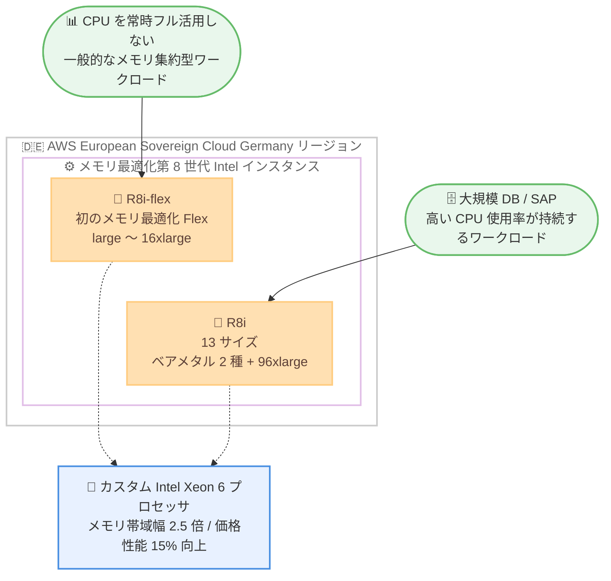

# Amazon EC2 - R8i / R8i-flex インスタンスの提供リージョン拡大

**リリース日**: 2026 年 9 月 25 日
**サービス**: Amazon EC2
**機能**: R8i および R8i-flex インスタンスの AWS European Sovereign Cloud (Germany) リージョンでの提供開始

📊 [このアップデートのインフォグラフィックを見る](https://takech9203.github.io/aws-news-summary/20260925-ec2-r8i-r8i-flex-thf.html)

## 概要

Amazon EC2 のメモリ最適化インスタンスである R8i および R8i-flex インスタンスが、新たに AWS European Sovereign Cloud (Germany) リージョンで利用可能になりました。両インスタンスは AWS 専用にカスタマイズされた Intel Xeon 6 プロセッサを搭載しており、クラウド上の同等の Intel プロセッサの中で最高のパフォーマンスと最速のメモリ帯域幅を提供します。

R8i / R8i-flex は、前世代の Intel ベースインスタンスと比較して最大 15% 優れた価格性能と 2.5 倍のメモリ帯域幅を実現します。また R7i インスタンスと比較して 20% 高いパフォーマンスを発揮し、ワークロードによってはさらに大きな効果が得られます (PostgreSQL データベースで最大 30% 高速、NGINX Web アプリケーションで最大 60% 高速、AI 深層学習レコメンデーションモデルで最大 40% 高速)。

このリージョン拡大により、データ主権要件を持つ欧州のお客様も、大規模インメモリデータベースや SAP ワークロードなどのメモリ集約型アプリケーションを最新世代の Intel ベースインスタンスで実行できるようになります。

**アップデート前の課題**

- AWS European Sovereign Cloud (Germany) リージョンでは R8i / R8i-flex インスタンスが利用できず、メモリ集約型ワークロードには前世代のインスタンスを使用する必要があった
- データ主権要件により AWS European Sovereign Cloud の利用が必須のお客様は、最新世代 Intel プロセッサの性能向上 (メモリ帯域幅 2.5 倍、価格性能 15% 向上) の恩恵を受けられなかった
- 大規模 SAP ワークロードに対して、当該リージョンで最高水準の SAP 認定性能を持つインスタンスを選択できなかった

**アップデート後の改善**

- AWS European Sovereign Cloud (Germany) リージョンで R8i / R8i-flex インスタンスを起動できるようになった
- データ主権要件を満たしながら、PostgreSQL や NGINX、AI レコメンデーションモデルなどのワークロードで大幅な性能向上を実現できるようになった
- SAP 認定済みの R8i インスタンス (142,100 aSAPS) により、当該リージョンでも大規模 SAP ワークロードを高い性能で実行できるようになった

## アーキテクチャ図



ワークロード特性に応じた R8i と R8i-flex の使い分けと、両インスタンスが共通のカスタム Intel Xeon 6 プロセッサを基盤としていることを示しています。

## サービスアップデートの詳細

### 主要機能

1. **カスタム Intel Xeon 6 プロセッサ搭載**
   - AWS でのみ利用可能なカスタム Intel Xeon 6 プロセッサを採用
   - クラウド上の同等 Intel プロセッサの中で最高のパフォーマンスと最速のメモリ帯域幅を提供
   - 前世代の Intel ベースインスタンス比で最大 15% 優れた価格性能、2.5 倍のメモリ帯域幅を実現

2. **R7i 比での大幅な性能向上**
   - R7i インスタンス比で 20% 高いパフォーマンス
   - PostgreSQL データベース: 最大 30% 高速
   - NGINX Web アプリケーション: 最大 60% 高速
   - AI 深層学習レコメンデーションモデル: 最大 40% 高速

3. **R8i-flex: 初のメモリ最適化 Flex インスタンス**
   - メモリ最適化ファミリーとして初の Flex インスタンス
   - 大多数のメモリ集約型ワークロードに対して、最も簡単に価格性能の向上を得られる選択肢
   - large から 16xlarge までの汎用的なサイズで提供
   - コンピュートリソースを常時フル活用しないアプリケーションに最適

4. **R8i: 幅広いサイズ展開と SAP 認定**
   - ベアメタル 2 サイズと新しい 96xlarge を含む 13 サイズで提供
   - 最大サイズや持続的な高 CPU 使用率を必要とするワークロードに対応
   - SAP 認定済みで 142,100 aSAPS を達成 (オンプレミス・クラウドを通じて同等マシン中最高値)

## 技術仕様

### インスタンスの比較

| 項目 | R8i-flex | R8i |
|------|----------|-----|
| 位置付け | 初のメモリ最適化 Flex インスタンス | フル性能のメモリ最適化インスタンス |
| サイズ展開 | large 〜 16xlarge | 13 サイズ (ベアメタル 2 種、96xlarge を含む) |
| 適したワークロード | CPU を常時フル活用しないメモリ集約型ワークロード | 大規模サイズや持続的に高い CPU 使用率が必要なワークロード |
| プロセッサ | カスタム Intel Xeon 6 | カスタム Intel Xeon 6 |
| SAP 認定 | - | 認定済み (142,100 aSAPS) |

### 性能向上の概要

| 比較対象 / ワークロード | 向上幅 |
|------------------------|--------|
| 前世代 Intel 系インスタンス比の価格性能 | 最大 15% 向上 |
| 前世代 Intel 系インスタンス比のメモリ帯域幅 | 2.5 倍 |
| R7i 比の全体性能 | 20% 向上 |
| PostgreSQL データベース | 最大 30% 高速 |
| NGINX Web アプリケーション | 最大 60% 高速 |
| AI 深層学習レコメンデーションモデル | 最大 40% 高速 |

## 設定方法

### 前提条件

1. AWS European Sovereign Cloud (Germany) リージョンへのアクセス権を持つ AWS アカウント
2. EC2 インスタンスを起動するための IAM 権限
3. 起動先の VPC およびサブネットの準備

### 手順

#### ステップ 1: 利用可能なインスタンスタイプの確認

```bash
aws ec2 describe-instance-type-offerings \
  --location-type region \
  --filters "Name=instance-type,Values=r8i.*,r8i-flex.*" \
  --query "InstanceTypeOfferings[].InstanceType" \
  --output table
```

対象リージョンで利用可能な R8i / R8i-flex のインスタンスサイズ一覧を取得します。

#### ステップ 2: R8i-flex インスタンスの起動

```bash
aws ec2 run-instances \
  --image-id ami-xxxxxxxxxxxxxxxxx \
  --instance-type r8i-flex.large \
  --subnet-id subnet-xxxxxxxx \
  --security-group-ids sg-xxxxxxxx \
  --key-name my-key-pair
```

指定した AMI、サブネット、セキュリティグループを使用して R8i-flex インスタンスを起動します。

#### ステップ 3: 既存インスタンスのタイプ変更

```bash
aws ec2 stop-instances --instance-ids i-xxxxxxxxxxxxxxxxx

aws ec2 modify-instance-attribute \
  --instance-id i-xxxxxxxxxxxxxxxxx \
  --instance-type "{\"Value\": \"r8i.xlarge\"}"

aws ec2 start-instances --instance-ids i-xxxxxxxxxxxxxxxxx
```

既存のインスタンスを停止し、インスタンスタイプを R8i に変更してから再起動します。前世代インスタンスからの移行はこの手順で実施できます。

## メリット

### ビジネス面

- **データ主権要件との両立**: AWS European Sovereign Cloud を利用する必要がある欧州のお客様が、最新世代インスタンスの性能を享受できる
- **コスト効率の向上**: 前世代比で最大 15% 優れた価格性能により、同等ワークロードの実行コストを削減できる
- **SAP ワークロードの信頼性**: SAP 認定済み (142,100 aSAPS) のため、基幹系 SAP システムを安心して移行・運用できる

### 技術面

- **メモリ帯域幅の大幅向上**: 2.5 倍のメモリ帯域幅により、インメモリデータベースやリアルタイム分析の性能が向上する
- **ワークロード特性に応じた選択肢**: フル性能の R8i と価格性能重視の R8i-flex を使い分けられる
- **豊富なサイズ展開**: ベアメタル 2 サイズと 96xlarge を含む 13 サイズから、要件に合ったサイズを選択できる

## デメリット・制約事項

### 制限事項

- R8i-flex のサイズ展開は large から 16xlarge までであり、それを超えるサイズが必要な場合は R8i を選択する必要がある
- 今回のリージョン拡大は AWS European Sovereign Cloud (Germany) が対象であり、他リージョンでの利用可否は各リージョンの提供状況に依存する

### 考慮すべき点

- R8i-flex は Flex インスタンスのため、持続的に高い CPU 使用率が必要なワークロードには R8i の方が適している
- 前世代からの移行時は、アプリケーションの互換性やベンチマークを事前に検証することが推奨される
- 性能向上率 (最大 30%、60%、40% など) はワークロードにより異なるため、実環境での測定が必要

## ユースケース

### ユースケース 1: データ主権要件のある大規模 PostgreSQL データベース

**シナリオ**: 欧州の公共機関や規制産業のお客様が、データ主権要件を満たしつつ大規模な PostgreSQL データベースを高性能に運用したい。

**実装例**:
```bash
aws ec2 run-instances \
  --image-id ami-xxxxxxxxxxxxxxxxx \
  --instance-type r8i.8xlarge \
  --subnet-id subnet-xxxxxxxx \
  --ebs-optimized
```

**効果**: AWS European Sovereign Cloud 内で PostgreSQL を最大 30% 高速に実行でき、データ主権と性能を両立できる。

### ユースケース 2: SAP 基幹システムの欧州ソブリンクラウドへの移行

**シナリオ**: 欧州企業が SAP ワークロードを AWS European Sovereign Cloud に移行し、オンプレミスを上回る性能を確保したい。

**実装例**:
```bash
# SAP 認定インスタンス (r8i.48xlarge など) を選定し、
# SAP on AWS のガイドラインに沿って構築
aws ec2 describe-instance-types \
  --instance-types r8i.48xlarge r8i.96xlarge \
  --query "InstanceTypes[].{Type:InstanceType,Mem:MemoryInfo.SizeInMiB,vCPU:VCpuInfo.DefaultVCpus}"
```

**効果**: 142,100 aSAPS という同等マシン中最高の SAP 認定性能により、大規模 SAP 環境を高い性能で運用できる。

### ユースケース 3: コスト効率を重視した Web アプリケーション基盤

**シナリオ**: CPU 使用率が変動するメモリ集約型の NGINX ベース Web アプリケーションを、コスト効率よく運用したい。

**実装例**:
```bash
aws ec2 run-instances \
  --image-id ami-xxxxxxxxxxxxxxxxx \
  --instance-type r8i-flex.2xlarge \
  --subnet-id subnet-xxxxxxxx
```

**効果**: R8i-flex により NGINX Web アプリケーションを最大 60% 高速化しつつ、Flex インスタンスの価格性能メリットを享受できる。

## 料金

R8i / R8i-flex インスタンスは以下の購入オプションで利用できます。

- **オンデマンドインスタンス**: 初期費用なし、秒単位の従量課金
- **Savings Plans**: 1 年または 3 年のコミットメントによる割引
- **スポットインスタンス**: 未使用キャパシティを活用した大幅な割引

リージョンおよびサイズごとの具体的な料金は [Amazon EC2 料金ページ](https://aws.amazon.com/ec2/pricing/) を参照してください。

## 利用可能リージョン

今回のアップデートにより、以下のリージョンで新たに利用可能になりました。

- AWS European Sovereign Cloud (Germany)

その他の利用可能リージョンは [R8i インスタンスページ](https://aws.amazon.com/ec2/instance-types/r8i) を参照してください。

## 関連サービス・機能

- **Amazon EC2 R7i**: 前世代のメモリ最適化 Intel インスタンス。R8i は R7i 比で 20% 高い性能を提供
- **Amazon EC2 M8i / C8i**: 同じカスタム Intel Xeon 6 プロセッサを採用する汎用・コンピューティング最適化ファミリー
- **SAP on AWS**: R8i は SAP 認定済みで、SAP HANA などの基幹ワークロードに利用可能
- **Savings Plans / スポットインスタンス**: R8i / R8i-flex のコスト最適化に利用できる購入オプション

## 参考リンク

- 📊 [インフォグラフィック](https://takech9203.github.io/aws-news-summary/20260925-ec2-r8i-r8i-flex-thf.html)
- [公式発表 (What's New)](https://aws.amazon.com/about-aws/whats-new/2026/09/ec2-r8i-r8i-flex-thf/)
- [AWS Blog: Best performance and fastest memory with the new Amazon EC2 R8i and R8i-flex instances](https://aws.amazon.com/blogs/aws/best-performance-and-fastest-memory-with-the-new-amazon-ec2-r8i-and-r8i-flex-instances/)
- [R8i インスタンスページ](https://aws.amazon.com/ec2/instance-types/r8i)
- [SAP 認定 EC2 インスタンス (ドキュメント)](https://docs.aws.amazon.com/sap/latest/general/sap-hana-aws-ec2.html)
- [Amazon EC2 料金ページ](https://aws.amazon.com/ec2/pricing/)

## まとめ

R8i / R8i-flex インスタンスの AWS European Sovereign Cloud (Germany) リージョンへの拡大により、データ主権要件を持つ欧州のお客様も最新世代 Intel ベースインスタンスの高い性能 (メモリ帯域幅 2.5 倍、R7i 比 20% 高性能) を利用できるようになりました。当該リージョンでメモリ集約型ワークロードや SAP システムを運用している場合は、R8i / R8i-flex への移行によるコスト効率と性能の改善を検討することを推奨します。
