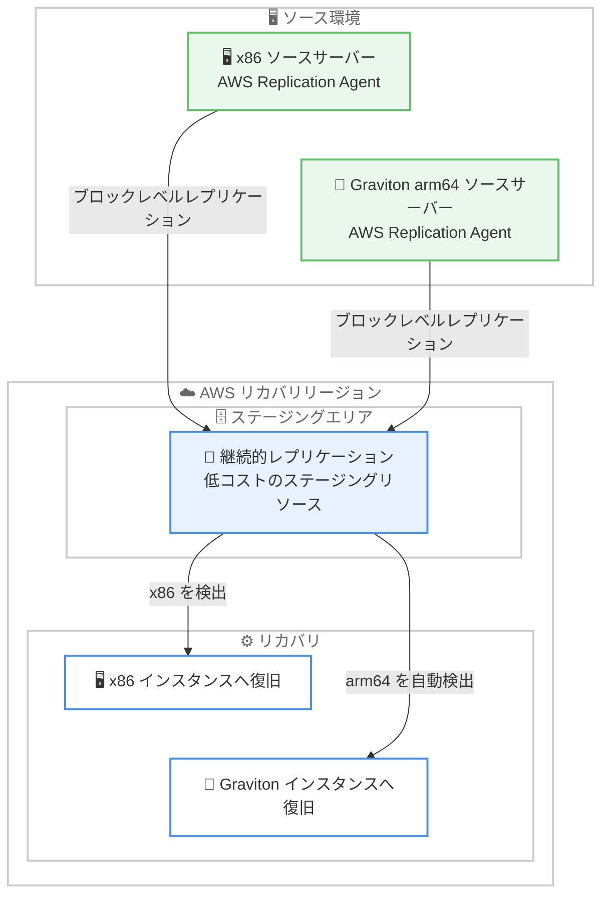

# AWS Elastic Disaster Recovery - AWS Graviton ベースのソースサーバーをサポート

**リリース日**: 2026 年 9 月 25 日
**サービス**: AWS Elastic Disaster Recovery (AWS DRS)
**機能**: AWS Graviton ベース (arm64) ソースサーバーのディザスタリカバリサポート

📊 [このアップデートのインフォグラフィックを見る](https://takech9203.github.io/aws-news-summary/20260925-elastic-disaster-recovery-graviton.html)

## 概要

AWS Elastic Disaster Recovery (AWS DRS) が、AWS Graviton ベース (arm64 アーキテクチャ) のソースサーバーのディザスタリカバリをサポートしました。これまで x86 ワークロード向けに提供されてきたものと同じ DRS の操作体験で、Graviton ワークロードの保護と復旧が可能になります。

DRS は arm64 のソースサーバーを自動的に検出し、Graviton インスタンス上に復旧します。ソースからリカバリまでワークロードのアーキテクチャがエンドツーエンドで維持され、追加の設定は一切不要です。復旧プロセスは他のサーバーと同様に機能します。

価格性能比の高さから Graviton の採用を進めている組織にとって、Graviton ワークロードにも環境全体と同水準の DR カバレッジを適用できるようになる重要なアップデートです。AWS DRS が提供されているすべての AWS リージョンで、追加料金なしで利用できます。

**アップデート前の課題**

- AWS DRS は x86 ベースのソースサーバーのみをサポートしており、Graviton ベース (arm64) のワークロードは DRS で保護できなかった
- Graviton を採用したワークロードには、別の DR 手法 (バックアップ / リストアや独自のレプリケーション構成など) を用意する必要があった
- x86 と Graviton が混在する環境では、DR 戦略やツールが分断され、運用が複雑になっていた

**アップデート後の改善**

- Graviton ベース (arm64) のソースサーバーを、x86 ワークロードと同じ DRS の操作体験で保護・復旧できるようになった
- DRS が arm64 ソースサーバーを自動検出し、Graviton インスタンスへ復旧するため、アーキテクチャがエンドツーエンドで維持される
- 追加の設定が不要で、既存の DRS 運用フローをそのまま Graviton ワークロードに適用できるようになった

## アーキテクチャ図



DRS はソースサーバーの CPU アーキテクチャを自動検出し、arm64 サーバーは Graviton インスタンスへ、x86 サーバーは x86 インスタンスへ、アーキテクチャを維持したまま復旧します。

## サービスアップデートの詳細

### 主要機能

1. **Graviton ベース arm64 ソースサーバーの保護**
   - AWS Graviton ベース (arm64) のソースサーバーを DRS で保護できるようになった
   - x86 ワークロードで使用されているものと同じ DRS の操作体験で利用可能
   - 継続的なブロックレベルレプリケーションによる保護を Graviton ワークロードにも適用できる

2. **arm64 の自動検出と Graviton インスタンスへの復旧**
   - DRS が arm64 のソースサーバーを自動的に検出
   - 検出した arm64 サーバーを Graviton インスタンス上に復旧
   - ソースからリカバリまでワークロードのアーキテクチャをエンドツーエンドで維持

3. **追加設定不要のシンプルな運用**
   - アーキテクチャの検出と復旧先の選択は自動で行われ、追加の設定は不要
   - 復旧プロセスは他のサーバーと同様に機能し、既存の DRS 運用フローをそのまま利用できる

## 技術仕様

### サポート内容

| 項目 | 詳細 |
|------|------|
| 対象アーキテクチャ | arm64 (AWS Graviton ベースのソースサーバー) |
| 検出方法 | DRS が arm64 ソースサーバーを自動検出 |
| 復旧先 | Graviton インスタンス (アーキテクチャを維持) |
| 追加設定 | 不要 |
| 追加料金 | なし |
| 利用可能リージョン | AWS DRS が提供されているすべての AWS リージョン |

## 設定方法

### 前提条件

1. AWS DRS の初期化 (リカバリ先リージョンでのセットアップ) が完了していること
2. 保護対象の Graviton ベース (arm64) ソースサーバーが、DRS がサポートするオペレーティングシステムを実行していること
3. ソースサーバーからステージングエリアサブネットへのネットワーク接続 (TCP 443 および TCP 1500) が確保されていること

### 手順

#### ステップ 1: AWS Replication Agent のインストール

```bash
# Linux の場合: エージェントインストーラーをダウンロードして実行
wget -O ./aws-replication-installer-init https://aws-elastic-disaster-recovery-{region}.s3.{region}.amazonaws.com/latest/linux/aws-replication-installer-init
sudo chmod +x aws-replication-installer-init
sudo ./aws-replication-installer-init --region {region}
```

Graviton ベースのソースサーバーに AWS Replication Agent をインストールします。エージェントがサーバーのアーキテクチャ (arm64) を含む情報を DRS に登録し、継続的なブロックレベルレプリケーションを開始します。

#### ステップ 2: レプリケーションの完了を確認

```bash
# ソースサーバーの一覧とレプリケーション状態を確認
aws drs describe-source-servers --region {region}
```

DRS コンソールまたは CLI で、ソースサーバーが「Ready」状態になり、初期同期が完了したことを確認します。arm64 サーバーは自動的に検出されるため、アーキテクチャに関する追加設定は不要です。

#### ステップ 3: リカバリドリルの実行

```bash
# ドリル (テストリカバリ) を起動
aws drs start-recovery \
  --source-servers sourceServerID={source-server-id} \
  --is-drill \
  --region {region}
```

ドリルを実行し、arm64 ソースサーバーが Graviton インスタンス上に正しく復旧されることを確認します。ドリルは本番環境のレプリケーションに影響を与えずに実施できます。

## メリット

### ビジネス面

- **DR カバレッジの統一**: Graviton 採用済みのワークロードにも環境全体と同水準の DR 保護を適用でき、コンプライアンス要件や事業継続計画 (BCP) への対応が容易になる
- **Graviton 採用の障壁を解消**: DR 対応を理由に Graviton への移行をためらっていた組織が、価格性能比の高い Graviton を安心して採用できる
- **追加コストなし**: 既存の DRS 料金のまま追加料金なしで利用でき、DR コストの増加を伴わない

### 技術面

- **アーキテクチャのエンドツーエンド維持**: arm64 のソースサーバーが Graviton インスタンスに復旧されるため、復旧後の互換性問題や性能差を心配する必要がない
- **設定不要の自動検出**: アーキテクチャの検出と復旧先の選択が自動化されており、運用者による追加の設定・管理が不要
- **運用フローの一元化**: x86 と Graviton が混在する環境でも、単一の DRS 運用フロー (レプリケーション、ドリル、フェイルオーバー、フェイルバック) で管理できる

## デメリット・制約事項

### 制限事項

- 復旧先は Graviton インスタンスとなるため、リカバリ先リージョンで対象の Graviton インスタンスタイプが利用可能である必要がある
- ソースサーバーのオペレーティングシステムが、DRS のサポート対象 (arm64 対応版) である必要がある

### 考慮すべき点

- リカバリ先リージョンにおける Graviton インスタンスのキャパシティやインスタンスタイプの提供状況を事前に確認しておくことが推奨される
- 既存の DR 計画に Graviton ワークロードを組み込む場合は、リカバリドリルを実施して復旧手順と RTO を検証することが望ましい

## ユースケース

### ユースケース 1: Graviton 移行済みワークロードへの DR 適用

**シナリオ**: コスト最適化のために EC2 ワークロードを Graviton インスタンスへ移行済みだが、DRS が arm64 をサポートしていなかったため DR 保護の対象外となっていた。

**実装例**:
```
1. Graviton ベースの各ソースサーバーに AWS Replication Agent をインストール
2. DRS がアーキテクチャを自動検出し、レプリケーションを開始
3. リカバリドリルで Graviton インスタンスへの復旧を検証
```

**効果**: x86 ワークロードと同じ運用フローで Graviton ワークロードにも DR 保護を適用でき、環境全体の DR カバレッジが統一される。

### ユースケース 2: 混在環境における DR 運用の一元化

**シナリオ**: x86 と Graviton のインスタンスが混在する環境で、アーキテクチャごとに異なる DR 手法を運用しており、管理が複雑化している。

**実装例**:
```
1. Graviton ワークロード向けの独自 DR 構成 (手動バックアップ / リストアなど) を廃止
2. すべてのサーバーを DRS の保護対象に統一
3. フェイルオーバー・フェイルバック手順を単一のランブックに集約
```

**効果**: DR ツールと手順が一本化され、運用負荷の軽減と復旧手順の信頼性向上が期待できる。

### ユースケース 3: Graviton 採用計画の推進

**シナリオ**: 価格性能比の観点から Graviton への移行を検討しているが、DR 要件を満たせないことが移行の障壁となっていた。

**実装例**:
```
1. 移行候補ワークロードの DR 要件 (RTO / RPO) を整理
2. Graviton へ移行後、DRS で保護を継続できることを前提に移行計画を策定
3. 移行後にリカバリドリルを実施し、DR 要件の充足を確認
```

**効果**: DR 要件を維持したまま Graviton の価格性能比のメリットを享受でき、移行の意思決定が容易になる。

## 料金

Graviton ベースのソースサーバーのサポートによる追加料金はありません。AWS DRS の既存の料金体系 (ソースサーバーごとの時間課金と、ステージングエリアの EBS ボリューム・EC2 リソースなどの利用料金) がそのまま適用されます。

詳細は [AWS Elastic Disaster Recovery 料金ページ](https://aws.amazon.com/disaster-recovery/pricing/) を参照してください。

## 利用可能リージョン

AWS Elastic Disaster Recovery が提供されているすべての AWS リージョンで利用可能です。

## 関連サービス・機能

- **AWS Graviton**: AWS が設計した arm64 ベースのプロセッサ。高い価格性能比が特長で、今回のアップデートにより Graviton ワークロードも DRS で保護可能になった
- **Amazon EC2**: DRS のリカバリ先となるコンピューティングサービス。arm64 ソースサーバーは Graviton インスタンスに復旧される
- **AWS Backup**: バックアップ / リストアによる保護を提供するサービス。より短い RTO / RPO が必要なワークロードでは DRS が適する

## 参考リンク

- 📊 [インフォグラフィック](https://takech9203.github.io/aws-news-summary/20260925-elastic-disaster-recovery-graviton.html)
- [公式発表 (What's New)](https://aws.amazon.com/about-aws/whats-new/2026/09/elastic-disaster-recovery-graviton/)
- [ドキュメント (AWS Elastic Disaster Recovery User Guide)](https://docs.aws.amazon.com/drs/)
- [料金ページ](https://aws.amazon.com/disaster-recovery/pricing/)

## まとめ

AWS DRS が Graviton ベース (arm64) ソースサーバーをサポートしたことで、Graviton ワークロードにも x86 と同じ操作体験・追加設定不要で DR 保護を適用できるようになりました。Graviton を採用済み、または採用を検討している場合は、対象サーバーへの AWS Replication Agent の導入とリカバリドリルの実施により、環境全体の DR カバレッジ統一を進めることを推奨します。
