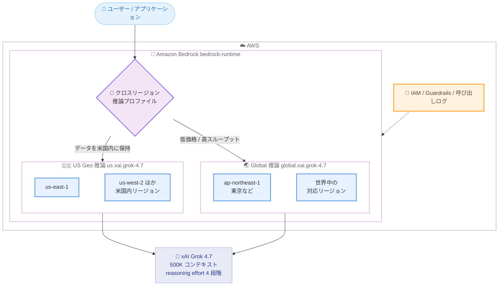

# Amazon Bedrock - xAI Grok 4.7 の提供開始

**リリース日**: 2026 年 9 月 28 日
**サービス**: Amazon Bedrock
**機能**: xAI Grok 4.7 モデルの提供開始

📊 [このアップデートのインフォグラフィックを見る](https://takech9203.github.io/aws-news-summary/20260928-amazon-bedrock-grok-4-7.html)

## 概要

xAI の最新フロンティアモデル Grok 4.7 が Amazon Bedrock で利用可能になりました。Grok 4.7 はコーディング、エージェントタスク、ナレッジワークのために構築されたモデルで、テキストと画像の入力に対応し、500K トークンのコンテキストウィンドウと 4 段階 (low / medium / high / xhigh) の調整可能な reasoning effort を備えています。US Geo および Global のクロスリージョン推論で提供されます。

前世代の Grok 4.6 と比較して、混在ドキュメントワークロードの処理、計画とエラーリカバリを伴うリポジトリ規模のコーディングの信頼性、フォーム入力や Web ポータル操作を行うブラウザ操作エージェントが強化されています。xAI によると、より難易度の高い数時間規模のタスクを対象とした長時間の強化学習によりトレーニングされており、モデルが自身の出力を検証してから処理を継続するため、長いエージェント軌跡での信頼性が向上しています。

Responses、Chat Completions、Converse、InvokeModel の各 API に対応し、OpenAI SDK 互換エンドポイント経由でも AWS SDK 経由でも利用できます。IAM によるアクセス制御、Amazon Bedrock Guardrails、呼び出しログなど、AWS のセキュリティ・ガバナンス機能と統合した形で最新のフロンティアモデルを運用できます。

**アップデート前の課題**

- Bedrock 上の Grok 4.6 では、複数形式のドキュメントが混在するワークロードの処理精度に課題があった
- リポジトリ規模の大きなコーディングタスクにおいて、計画立案やエラーからの回復を伴う長時間の自律的な作業の信頼性が限定的だった
- ブラウザ操作エージェントによるフォーム入力や Web ポータルのナビゲーションの精度に改善の余地があった

**アップデート後の改善**

- 混在ドキュメントワークロードの処理が改善され、ドキュメントや資料の生成を含むナレッジワークの品質が向上した
- 計画とエラーリカバリを伴うリポジトリ規模のコーディングがより信頼性の高いものになった
- ブラウザ操作エージェントが強化され、フォーム入力や Web ポータル操作の自動化精度が向上した
- 4 段階の reasoning effort により、タスクの難易度に応じて品質・レイテンシー・コストのバランスを制御できる
- Standard に加えて Priority / Flex のサービスティアを選択でき、ワークロード特性に応じた料金最適化が可能になった

## アーキテクチャ図



Grok 4.7 は 2 種類のクロスリージョン推論プロファイルで提供されます。データレジデンシー要件がある場合は米国内で処理が完結する US Geo プロファイル、コストとスループットを優先する場合は Global プロファイルを選択します。

## サービスアップデートの詳細

### 主要機能

1. **コーディング・エージェントタスク・ナレッジワーク向けフロンティアモデル**
   - Grok 4.6 と比較して、混在ドキュメントワークロードの処理が改善
   - 計画とエラーリカバリを伴うリポジトリ規模のコーディングの信頼性が向上
   - フォーム入力や Web ポータルをナビゲートするブラウザ操作エージェントを強化
   - 独立系ベンチマークの Artificial Analysis による評価では、Intelligence Index が 44 から 46、Coding Agent Index が 47 から 56 に向上し、ハルシネーション率は 34% から 29% に低下

2. **500K トークンのコンテキストウィンドウと調整可能な reasoning effort**
   - 500K トークンのコンテキストウィンドウにより、大規模なコードベースやドキュメント群を一括処理可能
   - reasoning effort は low / medium / high / xhigh の 4 段階 (デフォルトは high)
   - 推論はデフォルトで常に有効で、推論内容は暗号化されて返却可能。マルチターン会話では暗号化された推論コンテンツを次のターンに渡して推論コンテキストを維持できる

3. **2 種類のクロスリージョン推論プロファイル**
   - US Geo プロファイル `us.xai.grok-4.7`: 処理を米国内に保持し、データレジデンシー要件と予測可能なレイテンシーに対応
   - Global プロファイル `global.xai.grok-4.7`: 対応する商用リージョンへ世界中でルーティングし、より低価格・高スループットを実現
   - インリージョン推論は非対応のため、リクエストではモデル ID ではなく推論プロファイル ID を指定する必要がある

4. **幅広い API 対応**
   - Responses、Chat Completions、Converse、InvokeModel の各 API に対応
   - OpenAI SDK 互換エンドポイント (`https://bedrock-runtime.{region}.amazonaws.com/openai/v1`) 経由で、Bedrock API キーまたは IAM 認証情報から生成した短期トークンで認証可能
   - AWS SDK からは Converse API と SigV4 署名で利用可能

5. **Bedrock 機能との統合**
   - 暗黙的プロンプトキャッシュにより、繰り返し利用するプロンプトプレフィックスのコストとレイテンシーを削減
   - Amazon Bedrock Guardrails (コンテンツフィルター、拒否トピック、PII マスキング) をアタッチ可能
   - JSON Schema による構造化出力、レスポンスストリーミング、呼び出しログに対応

## 技術仕様

### モデル仕様

| 項目 | 詳細 |
|------|------|
| プロバイダー | xAI |
| モデル ID | `xai.grok-4.7` |
| 推論プロファイル | `us.xai.grok-4.7` (US Geo) / `global.xai.grok-4.7` (Global) |
| コンテキストウィンドウ | 500K トークン |
| 入力モダリティ | テキスト、画像 |
| 出力モダリティ | テキスト |
| reasoning effort | low / medium / high / xhigh (デフォルト: high) |
| 対応 API | Responses / Chat Completions / Converse / InvokeModel |
| 対応エンドポイント | bedrock-runtime (bedrock-mantle は非対応) |
| サービスティア | Standard / Priority / Flex (Reserved は非対応) |
| モデルリリース日 | 2026 年 9 月 28 日 |
| EOL | 2027 年 9 月 28 日以降 (レガシー期間は最低 6 か月) |

### 対応機能

| 対応 | 非対応 |
|------|--------|
| レスポンスストリーミング | サーバーサイドツール使用 |
| 暗黙的プロンプトキャッシュ | インテリジェントプロンプトルーティング |
| Reasoning | トークンカウント (Count tokens) |
| 構造化出力 | インリージョン推論 |
| Guardrails | - |
| 呼び出しログ | - |
| アプリケーション推論プロファイル (Invoke / Converse API のみ) | - |

### IAM 権限に関する注意

bedrock-runtime エンドポイントで利用する場合、IAM アイデンティティには推論プロファイルに加えて、アカウントのデフォルトプロジェクト (`arn:aws:bedrock:{region}:{account-id}:project/default`) に対する `bedrock:InvokeModel` 権限が必要です。また、IAM ポリシーでは US Geo と Global の各推論プロファイルを個別に指定する必要があります。

## 設定方法

### 前提条件

1. AWS アカウントと Amazon Bedrock へのアクセス権限
2. Bedrock コンソールでのモデルアクセスの有効化
3. Bedrock API キーまたは IAM 認証情報

### 手順

#### ステップ 1: モデルアクセスの有効化

Amazon Bedrock コンソールの [モデルアクセス] で Grok 4.7 へのアクセスを有効化します。

#### ステップ 2: 環境変数の設定 (OpenAI SDK を使用する場合)

```bash
export OPENAI_API_KEY="<Bedrock API キー>"
export OPENAI_BASE_URL="https://bedrock-runtime.us-east-1.amazonaws.com/openai/v1"
```

OpenAI SDK が Bedrock の OpenAI 互換エンドポイントを参照するように、API キーとベース URL を環境変数に設定します。本番環境では長期 API キーではなく、`aws-bedrock-token-generator` で生成する短期トークン (`bedrock:CallWithBearerToken` 権限が必要) の使用が推奨されます。

#### ステップ 3: 推論リクエストの実行 (Chat Completions API)

```python
from openai import OpenAI

client = OpenAI()

response = client.chat.completions.create(
    model="us.xai.grok-4.7",
    messages=[
        {"role": "user", "content": "Amazon Bedrock の特徴を説明してください。"}
    ]
)
print(response)
```

OpenAI SDK から Chat Completions API で Grok 4.7 を呼び出します。model にはモデル ID ではなく推論プロファイル ID (`us.xai.grok-4.7` または `global.xai.grok-4.7`) を指定します。リクエストは Bedrock 上の xAI モデルで処理され、OpenAI には送信されません。

#### ステップ 4: 推論リクエストの実行 (Converse API)

```python
import boto3

client = boto3.client("bedrock-runtime", region_name="us-east-1")

response = client.converse(
    modelId="us.xai.grok-4.7",
    messages=[
        {"role": "user", "content": [{"text": "Amazon Bedrock の特徴を説明してください。"}]}
    ],
    inferenceConfig={"maxTokens": 2048},
    additionalModelRequestFields={"reasoning_effort": "high"},
)
print(response["output"]["message"]["content"])
```

AWS SDK (boto3) の Converse API で呼び出します。reasoning effort は `additionalModelRequestFields` で指定します。推論が常に有効なため、レスポンスの content ブロックを走査してテキストブロックを取得する実装が推奨されます。

## メリット

### ビジネス面

- **エージェントワークフローの実用性向上**: 計画とエラーリカバリを伴う長時間の自律タスクの信頼性が向上し、リポジトリ規模の開発作業やブラウザ操作の自動化を業務に適用しやすくなる
- **柔軟なコスト管理**: Standard / Priority / Flex のサービスティアと Global 推論の低価格設定により、ワークロードの重要度に応じた料金最適化が可能
- **統制された利用**: IAM、Guardrails、呼び出しログといった AWS のガバナンス基盤の中で xAI の最新フロンティアモデルを利用できる

### 技術面

- **コーディングエージェント性能の向上**: Artificial Analysis の Coding Agent Index が 47 から 56 に向上し、ハルシネーション率も 34% から 29% に低下
- **大規模コンテキスト**: 500K トークンのコンテキストウィンドウにより、大規模コードベースや混在ドキュメント群を扱える
- **reasoning effort の調整**: 4 段階の設定でタスクごとに品質・レイテンシー・コストのトレードオフを制御可能
- **OpenAI SDK 互換**: 既存の OpenAI SDK ベースの実装からベース URL と認証の変更のみで移行可能

## デメリット・制約事項

### 制限事項

- インリージョン推論は非対応で、クロスリージョン推論プロファイル (US Geo または Global) の指定が必須
- サーバーサイドツール使用、インテリジェントプロンプトルーティング、トークンカウント、Reserved ティアは非対応
- アプリケーション推論プロファイルは Invoke / Converse API のみ対応で、Responses / Chat Completions API では利用不可
- Chat Completions API は推論トークンを返却しない

### 考慮すべき点

- Grok 4.6 と比較して性能向上の代わりにタスクあたりの出力トークン数が約 2 倍 (約 38K から約 81K) に増加しており、コストに直結するため reasoning effort の設定を意図的に選択する必要がある
- Global プロファイルは低価格・高スループットだがレイテンシーが変動しうるため、レイテンシー要件とデータレジデンシー要件に応じて US Geo と使い分ける必要がある
- What's New の発表ではプロバイダー名が「SpaceXAI」と記載されているが、モデルカードおよびモデル ID では「xAI」(`xai.grok-4.7`) と表記されている

## ユースケース

### ユースケース 1: リポジトリ規模のコーディングエージェント

**シナリオ**: 開発チームが大規模なコードベース全体を対象とした機能実装やリファクタリングを、計画立案からエラー回復まで含めて AI エージェントに委任したい。

**実装例**:
```text
1. Bedrock で Grok 4.7 へのモデルアクセスを有効化
2. reasoning effort を high または xhigh に設定
3. 500K トークンのコンテキストにリポジトリの関連コードを投入し、
   Converse API 経由でマルチステップのコーディングタスクを実行
```

**効果**: 計画とエラーリカバリを伴うリポジトリ規模のコーディングの信頼性が向上しており、長時間の自律的な開発タスクを高い完遂率で実行できる。

### ユースケース 2: ブラウザ操作エージェントによる業務自動化

**シナリオ**: 社内の Web ポータルへの定型的なフォーム入力やデータ登録作業を、ブラウザ操作エージェントで自動化したい。

**実装例**:
```text
1. Grok 4.7 をエージェントフレームワークの推論モデルとして構成
2. 画像入力 (スクリーンショット) とツール呼び出しでブラウザ操作を実行
3. Guardrails をアタッチして入出力の安全性を担保
```

**効果**: Grok 4.6 から強化されたブラウザ操作能力により、フォーム入力や Web ポータルのナビゲーションをより高い精度で自動化できる。

### ユースケース 3: 混在ドキュメントを扱うナレッジワーク支援

**シナリオ**: 法務、臨床、金融などの専門業務で、形式の異なる複数のドキュメントを横断的に分析し、資料やレポートを生成したい。

**実装例**:
```text
1. 分析対象のドキュメント群を 500K トークンのコンテキストに投入
2. 構造化出力 (JSON Schema) で分析結果を定型フォーマットに整形
3. コストを抑えたいバッチ処理は Flex ティアと Global 推論を利用
```

**効果**: 混在ドキュメントワークロードの処理改善とドキュメント・プレゼンテーション生成能力の向上により、専門業務の品質と効率を高められる。

## 料金

トークン単位の従量課金です。Standard ティアのオンデマンド料金は以下のとおりです (100 万トークンあたり)。

| 推論オプション | 入力 | 出力 | キャッシュ読み取り |
|----------------|------|------|--------------------|
| Geo CRIS (US) | 2.20 USD | 6.60 USD | 0.55 USD |
| Global CRIS | 2.00 USD | 6.00 USD | 0.50 USD |

Priority ティアは Standard の 1.75 倍 (75% プレミアム)、Flex ティアは 0.5 倍 (50% 割引) で課金されます。Global 推論は Geo 推論より低価格に設定されています。最新の料金は [Amazon Bedrock 料金ページ](https://aws.amazon.com/bedrock/pricing/)を参照してください。

## 利用可能リージョン

US Geo クロスリージョン推論は米国リージョン (us-east-1、us-east-2、us-west-1、us-west-2) から利用でき、処理は米国内で完結します。Global クロスリージョン推論は東京 (ap-northeast-1)、大阪 (ap-northeast-3) を含む世界中の幅広い商用リージョンから利用できます。インリージョン推論は非対応です。最新の対応状況は[モデルのリージョン対応状況のドキュメント](https://docs.aws.amazon.com/bedrock/latest/userguide/models-region-compatibility.html)で確認してください。

## 関連サービス・機能

- **Amazon Bedrock クロスリージョン推論**: US Geo / Global の推論プロファイルにより、データレジデンシーとコスト・スループットの要件に応じたルーティングが可能
- **Amazon Bedrock Guardrails**: コンテンツフィルター、拒否トピック、PII マスキングを Grok 4.7 の呼び出しにアタッチ可能
- **Amazon Bedrock サービスティア**: Standard / Priority / Flex の選択によりワークロード特性に応じた料金・性能の最適化が可能
- **Amazon CloudWatch**: 呼び出しログにより推論トークン数を含むモデル呼び出しの記録・監視が可能

## 参考リンク

- 📊 [インフォグラフィック](https://takech9203.github.io/aws-news-summary/20260928-amazon-bedrock-grok-4-7.html)
- [公式発表 (What's New)](https://aws.amazon.com/about-aws/whats-new/2026/09/amazon-bedrock-grok-4-7/)
- [AWS Blog: Grok 4.7 is now available on Amazon Bedrock](https://aws.amazon.com/blogs/machine-learning/grok-4-7-is-now-available-on-amazon-bedrock/)
- [ドキュメント: Grok 4.7 モデルカード](https://docs.aws.amazon.com/bedrock/latest/userguide/model-card-xai-grok-4-7.html)
- [ドキュメント: モデルのリージョン対応状況](https://docs.aws.amazon.com/bedrock/latest/userguide/models-region-compatibility.html)
- [料金ページ](https://aws.amazon.com/bedrock/pricing/)

## まとめ

xAI Grok 4.7 の Amazon Bedrock 対応により、リポジトリ規模のコーディング、ブラウザ操作エージェント、混在ドキュメントを扱うナレッジワークに強いフロンティアモデルを、AWS のセキュリティ・ガバナンス基盤の中で利用できるようになりました。前世代比で出力トークン数が約 2 倍に増加している点を踏まえ、まずは reasoning effort とサービスティアの組み合わせをワークロードごとに評価し、データレジデンシー要件に応じて US Geo と Global の推論プロファイルを使い分けることを推奨します。
