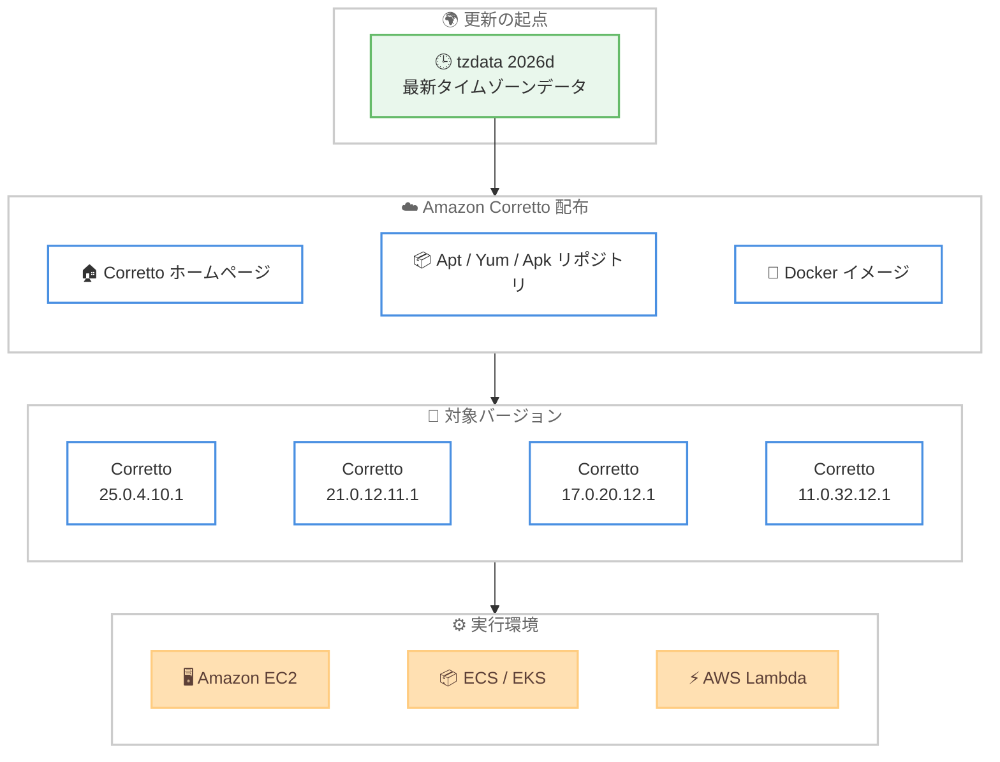

# Amazon Corretto - 2026 年 9 月パッチアップデート

**リリース日**: 2026年09月28日
**サービス**: Amazon Corretto
**機能**: 2026 年 9 月パッチアップデート (tzdata 2026d 対応)

📊 [このアップデートのインフォグラフィックを見る](https://takech9203.github.io/aws-news-summary/20260928-amazon-corretto-sept-2026-updates.html)
<!-- INFOGRAPHIC_BASE_URL は環境変数から取得 -->

## 概要

2026 年 9 月 25 日、Amazon は Amazon Corretto の Long-Term Support (LTS) バージョンおよび Feature Release (FR) バージョンの OpenJDK に対するパッチアップデートを発表しました。Corretto 25.0.4.10.1、21.0.12.11.1、17.0.20.12.1、および 11.0.32.12.1 が[ダウンロード](https://aws.amazon.com/corretto/)可能になりました。Amazon Corretto は、無料で、マルチプラットフォームに対応した、本番環境対応の OpenJDK ディストリビューションです。

今回のパッチには、最新のタイムゾーンデータベースである tzdata 2026d のアップデートが含まれています。tzdata は世界各国・地域のタイムゾーン定義やサマータイムのルールを収録したデータベースであり、各国の法改正などに追随するために定期的に更新されます。日時処理を行う Java アプリケーションが正確なタイムゾーン情報を参照するためには、JDK に同梱される tzdata を最新に保つことが重要です。

本番環境で Java アプリケーションを運用しているすべての組織が対象です。Corretto ホームページからのダウンロードに加えて、Linux システムでは Apt、Yum、または Apk リポジトリを設定することでアップデートを取得できます。

**アップデート前の課題**

- 既存の Corretto バージョンには、tzdata 2026d より前のタイムゾーンデータが同梱されていた
- 各国のタイムゾーンやサマータイムのルール変更が JDK 側に反映されるまで、日時計算が最新の定義とずれる可能性があった
- タイムゾーン定義のずれは、スケジュール処理、ログのタイムスタンプ、国際的な取引処理などで不整合を引き起こすリスクがあった

**アップデート後の改善**

- 最新の tzdata 2026d が同梱され、各国の最新のタイムゾーン定義に基づいた正確な日時処理が可能になった
- Corretto 25、21、17、11 のサポート対象バージョンに対して修正版が一斉に提供された
- Corretto ホームページ、および Linux 向けの Apt / Yum / Apk リポジトリ経由で速やかにアップデートを取得できる

## アーキテクチャ図



最新の tzdata 2026d を含むパッチが、各配布チャネルを通じて対象バージョンに展開され、EC2、コンテナ、Lambda などの実行環境に適用される流れを示しています。

## サービスアップデートの詳細

### 主要機能

1. **tzdata 2026d アップデートの同梱**
   - 最新のタイムゾーンデータベース tzdata 2026d を JDK に同梱
   - 各国・地域のタイムゾーン定義やサマータイムのルール変更に追随
   - `java.time` パッケージなどの日時 API が最新の定義に基づいて動作

2. **複数バージョンへの一斉提供**
   - Corretto 25.0.4.10.1 (最新 LTS)
   - Corretto 21.0.12.11.1 (LTS)
   - Corretto 17.0.20.12.1 (LTS)
   - Corretto 11.0.32.12.1 (LTS)

3. **複数の配布チャネル**
   - [Corretto ホームページ](https://aws.amazon.com/corretto)からの直接ダウンロード
   - Linux 向けの [Apt、Yum、Apk リポジトリ](https://docs.aws.amazon.com/corretto/latest/corretto-26-ug/generic-linux-install.html)経由での取得
   - フィードバックは [GitHub](https://github.com/corretto) で受付

## 技術仕様

### 更新されたバージョン

| バージョン | アップデート | サポート状況 |
|-----------|------------|------------|
| Corretto 25 | 25.0.4.10.1 | LTS |
| Corretto 21 | 21.0.12.11.1 | LTS |
| Corretto 17 | 17.0.20.12.1 | LTS |
| Corretto 11 | 11.0.32.12.1 | LTS |

### 対応プラットフォーム

- Linux (x86_64、aarch64)
- Windows (x86_64)
- macOS (x86_64、aarch64)
- Docker コンテナイメージ

### パッチの内容

| 項目 | 詳細 |
|------|------|
| 主な変更 | tzdata 2026d アップデートの同梱 |
| セキュリティ修正 | 今回の発表では個別の CVE や脆弱性修正は言及されていない |
| リリース種別 | 四半期アップデートや CSPU とは別に提供されるパッチアップデート |

## 設定方法

### 前提条件

1. Java アプリケーションまたは開発環境
2. 適切なプラットフォーム (Linux、Windows、macOS)
3. 管理者権限 (インストールに必要)

### 手順

#### ステップ1: Corretto のダウンロード

[Corretto ホームページ](https://aws.amazon.com/corretto) から適切なバージョンをダウンロードします。Corretto 27、25、21、17、11、8 の各プラットフォーム向けインストーラーやアーカイブを入手できます。

#### ステップ2: Linux での apt/yum/apk リポジトリの設定 (オプション)

Linux システムでは、Corretto の apt、yum、または apk リポジトリを設定することで、パッケージマネージャー経由でインストールおよびアップデートを受け取ることができます。

```bash
# apt の例 (Debian/Ubuntu)
wget -O- https://apt.corretto.aws/corretto.key | sudo gpg --dearmor -o /usr/share/keyrings/corretto-keyring.gpg
echo "deb [signed-by=/usr/share/keyrings/corretto-keyring.gpg] https://apt.corretto.aws stable main" | sudo tee /etc/apt/sources.list.d/corretto.list
sudo apt-get update
sudo apt-get install -y java-21-amazon-corretto-jdk
```

上記のコマンドは、Corretto の署名キーを登録し、apt リポジトリを追加したうえで、Corretto 21 の JDK をインストールしています。既にリポジトリを設定済みの場合は、`sudo apt-get update && sudo apt-get upgrade` で最新のパッチ版へ更新できます。

#### ステップ3: yum を使用したアップデート (Amazon Linux などの場合)

```bash
# yum の例 (Amazon Linux 2023)
sudo yum update java-21-amazon-corretto
```

このコマンドは、インストール済みの Corretto 21 パッケージを今回のパッチを含む最新版へ更新しています。

#### ステップ4: バージョンの確認

インストールまたはアップデート後、Java バージョンを確認します。

```bash
java -version
```

このコマンドで、今回のパッチバージョン (例: 21.0.12.11.1) が正しく反映されていることを確認できます。

## メリット

### ビジネス面

- **無料**: ライセンス費用なしで商用利用可能
- **日時処理の信頼性向上**: 各国の最新のタイムゾーン定義に追随することで、スケジュール処理や国際取引における日時の不整合リスクを低減
- **運用負荷の軽減**: JDK のパッチ適用だけで tzdata の更新が完了し、個別のタイムゾーンデータ管理が不要

### 技術面

- **最新の tzdata 2026d**: `java.time` などの日時 API が最新のタイムゾーン定義で動作
- **複数の配布チャネル**: ホームページからのダウンロードと Apt / Yum / Apk リポジトリの両方に対応し、運用形態に合わせた適用が可能
- **本番環境対応**: AWS が本番環境での使用をサポートする OpenJDK ディストリビューション

## デメリット・制約事項

### 制限事項

- 今回の発表で言及されている変更は tzdata 2026d のアップデートであり、セキュリティ修正や機能追加は明示されていない
- 特定の商用 Java ディストリビューションの独自機能は含まれない

### 考慮すべき点

- タイムゾーン定義の変更が日時計算の結果に影響する可能性があるため、日時処理に依存するアプリケーションではテストを実施したうえで適用することが推奨される
- コンテナ環境では、ベースイメージの更新と再ビルド、再デプロイが必要になる
- OS 側の tzdata と JDK 同梱の tzdata は別管理であるため、両方の更新状況を確認する必要がある

## ユースケース

### ユースケース1: 国際展開するアプリケーションのタイムゾーン精度維持

**シナリオ**: 複数の国や地域のユーザー向けにスケジュール機能や日時表示を提供する Java アプリケーションで、最新のタイムゾーン定義を維持する

**実装例**:
- yum / apt リポジトリ経由で Corretto パッケージを最新のパッチ版へ更新
- 各リージョンのタイムゾーン変換テストをステージング環境で実施
- `java -version` でパッチ版 (例: 17.0.20.12.1) の適用を確認

**効果**: 各国のタイムゾーンやサマータイムのルール変更に正確に追随し、日時表示やスケジュール処理の不整合を防止できる

### ユースケース2: コンテナ化された Java アプリケーションの定期更新

**シナリオ**: Amazon ECS / EKS 上で稼働する Java マイクロサービスのベースイメージを更新する

**実装例**:
```dockerfile
FROM amazoncorretto:21
COPY target/myapp.jar /app.jar
ENTRYPOINT ["java", "-jar", "/app.jar"]
```

**効果**: 最新の Corretto イメージを取得して再ビルド・再デプロイすることで、コンテナ環境全体に tzdata 2026d を含むパッチを一括適用できる

### ユースケース3: バッチ処理基盤における日時計算の正確性確保

**シナリオ**: 日次・月次バッチや cron 相当のスケジューラーを Java で運用しており、タイムゾーンをまたぐ処理の正確性を確保したい

**実装例**:
- Corretto 11.0.32.12.1 または 21.0.12.11.1 へアップデート
- サマータイム切り替え日をまたぐスケジュールのテストケースを実行して検証

**効果**: 最新のタイムゾーン定義に基づいてバッチの起動時刻や日時計算が行われ、ルール変更に起因する処理ずれを回避できる

## 料金

Amazon Corretto は完全に無料で、ライセンス費用は発生しません。

## 利用可能リージョン

Amazon Corretto は、すべての AWS リージョンおよびオンプレミス環境で利用可能です。

## 関連サービス・機能

- **AWS Lambda**: サーバーレス Java 関数の実行
- **Amazon EC2**: Java アプリケーションのホスティング
- **Amazon ECS/EKS**: コンテナ化された Java アプリケーションの実行
- **AWS CodeBuild**: Corretto を使用した Java アプリケーションのビルド
- **AWS Systems Manager Patch Manager**: EC2 フリートへのパッチ適用の自動化

## 参考リンク

- 📊 [インフォグラフィック](https://takech9203.github.io/aws-news-summary/20260928-amazon-corretto-sept-2026-updates.html)
- [公式発表 (What's New)](https://aws.amazon.com/about-aws/whats-new/2026/09/amazon-corretto-sept-2026-updates/)
- [Corretto ホームページ](https://aws.amazon.com/corretto)
- [Corretto ダウンロード](https://aws.amazon.com/corretto/)
- [Corretto Linux インストールガイド](https://docs.aws.amazon.com/corretto/latest/corretto-26-ug/generic-linux-install.html)
- [GitHub - Corretto](https://github.com/corretto)

## まとめ

Amazon Corretto の 2026 年 9 月パッチアップデートにより、Corretto 25.0.4.10.1、21.0.12.11.1、17.0.20.12.1、11.0.32.12.1 が提供され、最新の tzdata 2026d が同梱されました。日時処理の正確性はアプリケーションの信頼性に直結するため、Corretto を利用している環境では、互換性テストを実施したうえで計画的な適用を推奨します。Linux 環境では Apt / Yum / Apk リポジトリの設定により、アップデートの取得を効率化できます。
