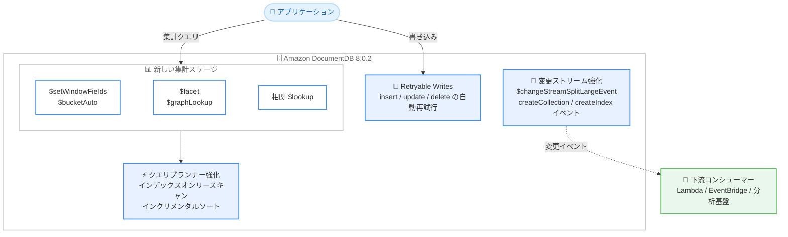

# Amazon DocumentDB - バージョン 8.0.2 で 5 つの MongoDB 集計ステージと変更ストリーム機能をサポート

**リリース日**: 2026 年 9 月 28 日
**サービス**: Amazon DocumentDB (with MongoDB compatibility)
**機能**: バージョン 8.0.2 における Retryable Writes、新規集計ステージ、変更ストリーム強化、クエリパフォーマンス改善

📊 [このアップデートのインフォグラフィックを見る](https://takech9203.github.io/aws-news-summary/20260928-amazon-documentdb-8-0-2.html)

## 概要

Amazon DocumentDB (with MongoDB compatibility) が、マイナーバージョン 8.0.2 において Retryable Writes (再試行可能な書き込み)、5 つの新しい集計ステージ、および変更ストリームの機能強化のサポートを開始しました。このリリースにより MongoDB API 互換性が拡大し、クエリパフォーマンスも向上するため、アプリケーションコードを変更することなく MongoDB ワークロードを Amazon DocumentDB へ移行することがより容易になります。

新たに追加された集計ステージは `$setWindowFields` (ウィンドウ演算子のフルセットを含む)、`$bucketAuto`、`$facet`、`$graphLookup`、および相関 `$lookup` の 5 つです。これらにより、高度な分析、ファセット検索、階層クエリをデータベース側で直接実行できるようになります。また、変更ストリームでは 16 MB を超える大きな変更イベントを分割する `$changeStreamSplitLargeEvent` ステージと、`createCollection` および `createIndex` 操作のイベント発行がサポートされました。

MongoDB からの移行を検討している開発者や、DocumentDB 上で分析的なクエリや CDC (変更データキャプチャ) パイプラインを構築しているユーザーにとって重要なアップデートです。

**アップデート前の課題**

- `$setWindowFields`、`$bucketAuto`、`$facet`、`$graphLookup`、相関 `$lookup` が未サポートだったため、ウィンドウ分析、ファセット検索、階層データの探索などをアプリケーション側で実装するか、移行時にクエリを書き換える必要があった
- 一時的なネットワークエラーやフェイルオーバー時の書き込み失敗に対して、アプリケーション側で再試行ロジックを実装する必要があった
- 変更ストリームのイベントが 16 MB の制限を超える場合に処理できず、また `createCollection` や `createIndex` などの DDL 操作をイベントとして検知できなかった
- `find` や集計クエリでインデックスオンリースキャンが利用できないケースがあり、`count` 系操作のパフォーマンスにも改善の余地があった

**アップデート後の改善**

- 5 つの集計ステージが追加され、高度な分析・ファセット検索・階層クエリを MongoDB 互換の構文のままデータベース側で実行可能になった
- Retryable Writes により、insert・update・delete 操作が一時的なネットワークエラー時に自動で再試行され、フェイルオーバー中のアプリケーションの回復力が向上した
- `$changeStreamSplitLargeEvent` により 16 MB を超える変更イベントをフラグメントに分割して処理でき、`createCollection` と `createIndex` のイベントも変更ストリームで取得可能になった
- クエリプランナーの強化により、`find` と集計クエリのインデックスオンリースキャン、`$expr` 述語のインデックススキャン、インクリメンタルソート、高速な `count` / `countDocuments()` が利用可能になった

## アーキテクチャ図



バージョン 8.0.2 で追加された主要機能の全体像です。アプリケーションからの書き込みは自動再試行され、高度な集計はデータベース側で処理され、変更ストリームのイベントは下流のコンシューマーへ確実に配信されます。

## サービスアップデートの詳細

### 主要機能

1. **Retryable Writes (再試行可能な書き込み)**
   - insert、update、delete 操作が一時的なネットワークエラー発生時に自動的に再試行される
   - フェイルオーバー中のアプリケーションの回復力 (レジリエンス) が向上
   - アプリケーション側で独自の再試行ロジックを実装する必要性が低減

2. **5 つの新しい集計ステージ**
   - `$setWindowFields`: ウィンドウ演算子のフルセットとともにサポートされ、移動平均やランキングなどのウィンドウ分析が可能
   - `$bucketAuto`: ドキュメントを指定した数のバケットに自動的に均等分割
   - `$facet`: 単一の集計パイプライン内で複数のサブパイプラインを並行実行し、ファセット検索を実現
   - `$graphLookup`: コレクション内の再帰的な検索により、組織図やカテゴリツリーなどの階層クエリを実行
   - 相関 `$lookup`: パイプライン内で外部コレクションと相関条件付きの結合が可能

3. **変更ストリームの機能強化**
   - `$changeStreamSplitLargeEvent` ステージにより、16 MB の制限を超える変更イベントをフラグメントに分割して処理可能
   - `createCollection` および `createIndex` 操作に対するイベント発行をサポートし、DDL 変更の検知が可能

4. **クエリパフォーマンスの改善**
   - `find` および集計クエリに対するインデックスオンリースキャンを追加
   - `$expr` 述語に対するインデックススキャンをサポート
   - インクリメンタルソートに対応
   - `count` および `countDocuments()` 操作が高速化

5. **インデックス管理**
   - 部分インデックス (partial index) に対する `reIndex` コマンドをサポート

## 技術仕様

### バージョン 8.0.2 の新機能一覧

| カテゴリ | 機能 | 詳細 |
|------|------|------|
| 書き込み | Retryable Writes | insert / update / delete の一時的エラー時の自動再試行 |
| 集計 | `$setWindowFields` | ウィンドウ演算子フルセット対応 |
| 集計 | `$bucketAuto` | 自動バケット分割 |
| 集計 | `$facet` | 複数サブパイプラインの並行実行 |
| 集計 | `$graphLookup` | 再帰的な階層検索 |
| 集計 | 相関 `$lookup` | 相関条件付きコレクション結合 |
| 変更ストリーム | `$changeStreamSplitLargeEvent` | 16 MB 超のイベントを分割 |
| 変更ストリーム | DDL イベント | `createCollection` / `createIndex` のイベント発行 |
| クエリ | インデックスオンリースキャン | `find` / 集計クエリで対応 |
| クエリ | `$expr` インデックススキャン | `$expr` 述語でインデックス利用可能 |
| クエリ | インクリメンタルソート | ソート処理の効率化 |
| クエリ | count 高速化 | `count` / `countDocuments()` の性能向上 |
| インデックス | `reIndex` | 部分インデックスで利用可能 |

### API変更履歴

今回のアップデートはデータベースエンジンレベルの機能追加であり、AWS のコントロールプレーン API (SDK / CLI) の変更は伴いません。既存のクエリ API (MongoDB 互換 API) の互換性が拡大される形となります。

## 設定方法

### 前提条件

1. Amazon DocumentDB 8.0 系のクラスターを使用していること
2. マイナーバージョン 8.0.2 以上へアップグレードすること (新規クラスター作成またはアップグレード)
3. Retryable Writes を利用する場合、接続文字列で `retryWrites=true` が設定されていること (MongoDB ドライバーの設定を確認)

### 手順

#### ステップ1: クラスターのエンジンバージョンを確認

```bash
aws docdb describe-db-clusters \
  --db-cluster-identifier my-docdb-cluster \
  --query "DBClusters[0].EngineVersion"
```

既存クラスターのエンジンバージョンを確認します。8.0.2 未満の場合はアップグレードが必要です。

#### ステップ2: 新しい集計ステージを利用する

```javascript
// $facet を使用したファセット検索の例
db.products.aggregate([
  {
    $facet: {
      priceBuckets: [
        { $bucketAuto: { groupBy: "$price", buckets: 5 } }
      ],
      byCategory: [
        { $group: { _id: "$category", count: { $sum: 1 } } }
      ]
    }
  }
])
```

`$facet` で価格帯の自動バケット分割とカテゴリ別集計を単一パイプラインで並行実行します。EC サイトの検索結果画面のように、複数の切り口の集計を 1 回のクエリで取得できます。

#### ステップ3: 大きな変更イベントの分割を有効にする

```javascript
// 16 MB を超える変更イベントを分割して受信する例
db.collection.watch([
  { $changeStreamSplitLargeEvent: {} }
])
```

変更ストリームのパイプラインに `$changeStreamSplitLargeEvent` を追加すると、16 MB の制限を超えるイベントがフラグメントに分割されて配信され、イベントの取りこぼしを防止できます。

## メリット

### ビジネス面

- **移行コストの削減**: MongoDB API 互換性の拡大により、既存の MongoDB アプリケーションをコード変更なしで移行できる範囲が広がり、移行プロジェクトの工数とリスクを削減できる
- **開発生産性の向上**: ウィンドウ分析やファセット検索をアプリケーション側で実装する必要がなくなり、開発期間を短縮できる
- **サービス品質の向上**: Retryable Writes によりフェイルオーバー時のエラーがユーザーに波及しにくくなり、可用性の体感品質が向上する

### 技術面

- **高度な分析のデータベース内実行**: `$setWindowFields` や `$graphLookup` により、移動平均・ランキング・階層探索などをデータベース側で完結でき、データ転送量とアプリケーションの複雑さを削減できる
- **CDC パイプラインの堅牢化**: 16 MB 超イベントの分割と DDL イベントのサポートにより、変更ストリームベースのレプリケーションやイベント駆動アーキテクチャの信頼性が向上する
- **クエリ性能の向上**: インデックスオンリースキャンやインクリメンタルソートにより、既存クエリも書き換えなしで性能向上の恩恵を受けられる可能性がある

## デメリット・制約事項

### 制限事項

- 本機能はマイナーバージョン 8.0.2 以降でのみ利用可能であり、それ以前のバージョン (8.0.0 や 5.0、4.0 など) では利用できない
- Retryable Writes の動作には MongoDB ドライバー側の対応と接続文字列の設定が必要
- `$changeStreamSplitLargeEvent` を使用する場合、分割されたフラグメントを結合して処理するロジックがコンシューマー側で必要になる

### 考慮すべき点

- 既存クラスターで利用するにはマイナーバージョンアップグレードが必要なため、メンテナンスウィンドウやアップグレード手順の計画が必要
- 新しい集計ステージ (特に `$graphLookup` や `$facet`) は処理コストが高くなる場合があるため、インスタンスサイズやインデックス設計を含めた性能検証を推奨
- 変更ストリームで `createCollection` / `createIndex` イベントが新たに発行されるため、既存のコンシューマーが未知のイベントタイプを受け取っても問題なく動作するか確認が必要

## ユースケース

### ユースケース1: EC サイトのファセット検索

**シナリオ**: EC サイトの商品検索画面で、検索結果と同時に価格帯・カテゴリ・ブランド別の件数を表示したい。

**実装例**:
```javascript
db.products.aggregate([
  { $match: { keyword: "camera" } },
  {
    $facet: {
      byPrice: [{ $bucketAuto: { groupBy: "$price", buckets: 4 } }],
      byBrand: [{ $group: { _id: "$brand", count: { $sum: 1 } } }],
      topResults: [{ $sort: { rating: -1 } }, { $limit: 20 }]
    }
  }
])
```

**効果**: 従来は複数クエリの発行やアプリケーション側での集計が必要だったファセット表示を、単一の集計パイプラインで実現でき、レイテンシーとコードの複雑さを削減できる。

### ユースケース2: 組織階層やカテゴリツリーの探索

**シナリオ**: 社員コレクションから、特定のマネージャー配下の全メンバーを再帰的に取得したい。

**実装例**:
```javascript
db.employees.aggregate([
  { $match: { name: "Sato" } },
  {
    $graphLookup: {
      from: "employees",
      startWith: "$_id",
      connectFromField: "_id",
      connectToField: "managerId",
      as: "reports",
      maxDepth: 10
    }
  }
])
```

**効果**: アプリケーション側の再帰処理や複数回のクエリ発行が不要になり、組織図・BOM・カテゴリツリーなどの階層データを効率的に扱える。

### ユースケース3: 変更ストリームによる堅牢な CDC パイプライン

**シナリオ**: DocumentDB の変更を AWS Lambda 経由で検索インデックスやデータレイクに同期しており、大きなドキュメントの更新イベントやインデックス作成などの DDL 変更も確実に捕捉したい。

**実装例**:
```javascript
const stream = db.collection.watch(
  [{ $changeStreamSplitLargeEvent: {} }],
  { fullDocument: "updateLookup" }
);
// createCollection / createIndex イベントも受信し、
// fragment フィールドを確認して分割イベントを結合して処理する
```

**効果**: 16 MB 超のイベントによる CDC パイプラインの停止を回避でき、スキーマ変更 (コレクションやインデックスの作成) も検知して下流システムへ反映できる。

## 料金

バージョン 8.0.2 の新機能自体に追加料金はありません。Amazon DocumentDB の標準料金 (インスタンス時間、I/O、ストレージ、バックアップストレージ) が適用されます。変更ストリームを使用する場合、変更ストリームログの読み取りに伴う I/O 料金が発生する点は従来どおりです。

詳細は [Amazon DocumentDB 料金ページ](https://aws.amazon.com/documentdb/pricing/) を参照してください。

## 利用可能リージョン

Amazon DocumentDB が利用可能なすべてのリージョンで、バージョン 8.0.2 以降から利用可能です (東京・大阪リージョンを含む)。

## 関連サービス・機能

- **AWS Database Migration Service (DMS)**: MongoDB から DocumentDB への移行に使用。API 互換性の拡大により移行後のクエリ書き換えが減少
- **AWS Lambda / Amazon EventBridge**: 変更ストリームと組み合わせたイベント駆動アーキテクチャの構築に活用
- **Amazon OpenSearch Service**: 変更ストリームを利用した検索インデックスへのデータ同期先として利用可能

## 参考リンク

- 📊 [インフォグラフィック](https://takech9203.github.io/aws-news-summary/20260928-amazon-documentdb-8-0-2.html)
- [公式発表 (What's New)](https://aws.amazon.com/about-aws/whats-new/2026/09/amazon-documentdb-8-0-2/)
- [ドキュメント: サポートされる MongoDB API、操作、データ型](https://docs.aws.amazon.com/documentdb/latest/developerguide/mongo-apis.html)
- [ドキュメント: Amazon DocumentDB リリースノート](https://docs.aws.amazon.com/documentdb/latest/developerguide/release-notes.html)
- [料金ページ](https://aws.amazon.com/documentdb/pricing/)

## まとめ

Amazon DocumentDB 8.0.2 は、`$setWindowFields` や `$facet` など要望の多かった 5 つの集計ステージと Retryable Writes、変更ストリームの強化により、MongoDB API 互換性を大きく前進させたリリースです。MongoDB からの移行を検討中のチームは互換性ギャップの再評価を、既存の DocumentDB ユーザーは 8.0.2 へのアップグレード計画の策定を推奨します。特に CDC パイプラインを運用している場合は、`$changeStreamSplitLargeEvent` の導入によりイベント欠損リスクを低減できます。
